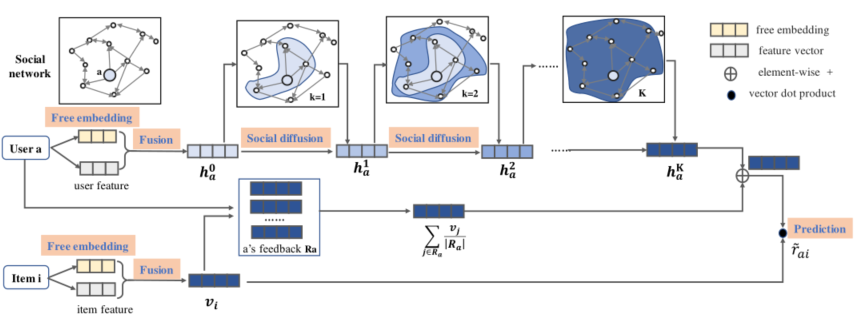

> 论文标题：A Neural Influence Diffusion Model for Social Recommendation
>
> 发表于：2019 SIGIR
>
> 作者：Le Wu, Peijie Sun, Yanjie Fu
>
> 代码：https://github.com/PeiJieSun/diffnet
>
> 论文地址：https://arxiv.org/pdf/1904.10322v1.pdf

## 摘要

- 精确的用户和项目嵌入学习是构建成功推荐系统的关键，协同过滤 (CF) 提供了一种从用户-项目交互历史中学习用户和项目嵌入的方法。由于用户行为数据的稀疏性，性能受到限制
- 当前的社交推荐模型只是通过利用每个用户的本地邻居来开发静态模型，而没有模拟全局社交网络中的递归扩散，导致推荐性能次优。
- 本文提出了一种深度影响传播模型，以刺激用户在社交推荐如何受到递归社交扩散过程的影响
- 对于每个用户，扩散过程从  融合相关特征的初始嵌入 和 捕获潜在行为偏好的用户潜在向量开始。
- 提出的模型的关键思想是，我们设计了一个分层的影响传播结构来模拟用户的潜在嵌入如何随着社交扩散过程的继续而演变
- 提出的模型是通用的，可以在用户（项目）属性或社交网络结构不可用时应用

## 结论

- 提出了一种用于社交推荐的 DiffNet 神经模型。
- 主要贡献在于设计了一个分层的影响扩散部分来模拟用户的潜在偏好如何受到她信任的用户的递归影响。
- 提出的 DiffNet 模型具有时间和存储效率。当用户和项目属性不可用时，它也很灵活

## 未来工作

- 扩展时间社交推荐模型，其中用户兴趣的时间变化隐含地反映在他们的时间反馈模式中。

## 介绍

- 由于用户-项目交互数据的稀疏性，推荐性能并不理想.社交推荐系统利用用户之间的社交网络来缓解数据稀疏问题并提高推荐性能
- TrustSVD++ 扩展了经典的基于潜在因子的模型，将每个用户信任的朋友对项目的反馈作为活跃用户的辅助反馈[7]
  - 通过考虑每个用户的一阶本地邻居，所有这些工作都显示了性能改进。
- 作者认为对于每个用户，社交扩散不是一次从用户的邻居到该用户的兴趣扩散，而是呈现出一种动态的递归效应来影响每个用户的嵌入
  - 每个用户的第一个潜在嵌入受到她信任连接的初始嵌入的影响。随着递归影响随着时间的推移而扩散
  - 每个用户在第 k 次迭代时的潜在嵌入受到她在第 (k -1) 次迭代时的可信邻居的影响
- 提出了一个具有分层影响传播结构的 DiffNet 模型来模拟社交推荐中的递归动态社交扩散。此外，DiffNet  有一个融合层，这样每个用户和每个项目都可以表示为包含协作和特征内容信息的嵌入。

## 模型架构

 

- 嵌入层 Fusion Layer
  - 与许多基于嵌入的推荐模型 [12, 31, 32] 类似，让 P ∈ $\mathbb R^{D×M}$和 Q ∈$\mathbb R^{D×N}$ 表示用户和项目的自由嵌入。
  - 这些免费嵌入捕获用户和项目的协作潜在表示。给定用户 a 和项目 i 的一个热门表示，嵌入层执行索引操作，并从用户自由嵌入矩阵 P  和项目自由嵌入矩阵 Q 输出自由用户潜在向量 pa 和自由项目潜在向量 qi。
- 融合层 Fusion Layer
  - 对于每个用户 a，融合层以 pa 和她相关的特征向量 xa 作为输入，并输出一个用户融合嵌入 h0a，从不同类型的输入数据中捕获用户的初始兴趣。将融合层建模为一层全连接神经网络
- 逐层影响扩散层 Influence Diffusion Layers.
  - 通过将融合层中每个用户 a 的融合嵌入 h0a 的输出馈送到影响扩散部分，影响扩散层对社交网络 S 中用户潜在偏好扩散的动态进行建模
  - 影响扩散部分类似地构建为多层结构。每一层 k 将来自前一层的用户嵌入作为输入，并在当前社交扩散过程完成后输出用户更新的嵌入。然后，更新的用户嵌入被发送到第 k  + 1 层以进行下一个扩散过程
  - DiffNet 仅在影响扩散部分扩散用户的潜在向量，没有任何项目向量扩散建模
- 预测层
  - 用户的最终潜在表示 $u_a$ 由两部分组成：来自社交扩散层输出的嵌入作为 $h^K_a$，以及来自她的历史行为的偏好$\sum_{i∈R_a}\limits \frac{v_i}{|R_a|}$
    -  $\large u_a= h^K_a + \sum_{i∈R_a}\limits \frac{v_i}{|R_a|}$，
    - 第一项从社交网络结构中的递归社交扩散过程中捕获用户的兴趣。第二项类似于 SVD++ 模型，它利用用户的历史反馈来缓解经典 CF 模型 [20] 的数据稀疏性
    - 最终的预测评分仍然是通过相应的用户最终潜在向量和项目潜在向量之间的内积来衡量的

## 实验

- ### 数据集

  - Yelp： 是一个基于位置的在线社交网络，用户通过评论和评分的形式与他人交朋友并表达他们的体验。由于每个用户在 [0, 5] 范围内给出评分将大于 3 的评分转换为该用户喜欢的项目
  - Flickr： 在线图像社交分享平台，用户关注其他用户并将他们对图像的偏好分享给他们的社交追随者。用户通过投票行为表达他们的偏好

- ### 数据预处理

  - 过滤掉了少于 2 个评分记录和 2 个社交链接的用户，并删除了评分少于 2 次的项目。
  - 我们随机选择 10% 的数据进行测试。在剩下的 90%  数据中，为了调整参数，我们从训练数据中选择 10% 作为验证集。

- ### baseline

  - BPR[32] :基于成对的推荐模型
  - FM[30]:潜在因子特征增强模型
  - TrustSVD[7]：先进的社交推荐模型
  - ContextMF[17]: 一个上下文感知社交推荐模
  - GC-MC:图卷积推荐模型
  - PinSage： 专注于生成高质量的项目嵌入，我们通过构建用户-项目二分来进行推荐 [42] 来拓展该模型

- ### 超参数设置

  - Adam优化，初始学习率0.001，批量大小512
  - 尝试在 [0.0001, 0.001, 0.01, 0.1] 范围内的正则化参数 λ，发现 λ = 0.001 达到最佳性能
  - 平均池化设置为聚合函数，模型深度参数 K = 2
  - 对于融合层中的非线性函数激活函数为sigmoid，用ReLU函数设置[sk(x)]K−1 k=0的非线性函数来避免梯度消失问题。
  - 在每一层的训练之后，我们使用批量归一化来避免内部协变量偏移问题[15]。

- ### 评估指标

  - Hit Ratio
  - NDCG
  - 由于未评分的物品过多，为了降低计算成本，对于每个用户，每次随机抽取1000个未评分的物品，并与用户在排序过程中喜欢的正面物品相结合。
    - 重复此过程 10  次并报告平均排名结果