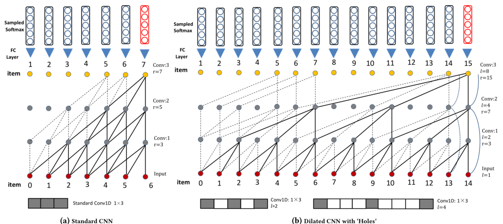
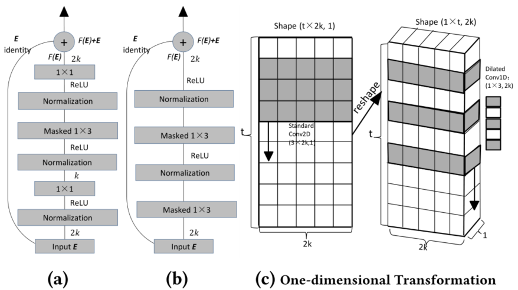
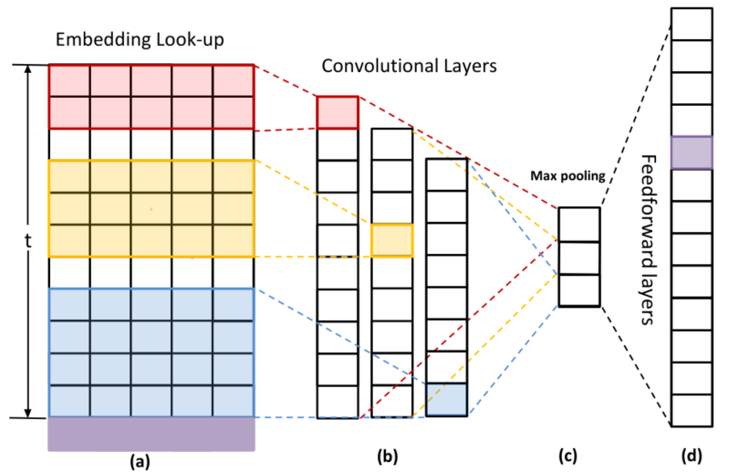

> 论文标题：A Simple Convolutional Generative Network for Next Item Recommendation
>
> 发表于：2019 WSDM
>
> 作者：Fajie Yuan, Ioannis Arapakis
>
> 代码：https://github.com/syiswell/NextItNet-Pytorch
>
> 论文地址：https://arxiv.org/pdf/1808.05163v4.pdf

## 摘要

- 卷积神经网络（CNN）最近被引入基于会话的下一个项目推荐领域。
  - 用户在会话（或序列）中与之交互的过去项目的有序集合被嵌入到二维潜在矩阵中，并被视为图像。
  - 然后将卷积和池化操作应用于映射项嵌入
- 典型的基于会话的 CNN 推荐器，在对项目序列中的长期依赖项进行建模时，生成模型和网络架构都不是最优的
- 引入了一个简单但非常有效的生成模型，该模型能够从短期和长期项目依赖项中学习高级表示。
  - 所提出模型的网络架构由一堆有孔的卷积层组成，可以有效地增加感受野而不依赖池化操作。
  - 在推荐系统中有效使用残差块结构，这可以简化更深网络的优化

## 结论

- 提出了一种简单、高效且高效的卷积生成模型，用于基于会话的 top-N 项目推荐。
  - 所提出的模型将掩码滤波器与 1D  扩张卷积相结合以增加感受野，这对于建模远程依赖关系非常重要。
  - 还应用了残差学习来训练更深层次的网络。

## 未来工作

- 没有在模型或基线中考虑其他上下文。可对其进行评估工作

## 介绍

- 经常用于交互序列的一类模型是循环神经网络 (RNN)。 RNN 通常会生成一个 softmax 输出，其中高概率代表最相关的推荐。
  - 虽然有效，但基于  RNN 的模型依赖于整个过去的隐藏状态，无法充分利用序列中的并行计算 [8]。
  - 因此，它们的速度在训练和评估中都受到限制
- 相比之下，训练 CNN 不依赖于前一个时间步的计算，因此允许对序列中的每个元素进行并行化。
- 最近的模型Caser [29]，放弃了 RNN 结构，提出了卷积序列嵌入模型，
  - 卷积处理的基本思想是将 t × k 嵌入矩阵视为前 t 次交互在 k  维潜在空间中的“图像”，并将序列模式视为“图像”的局部特征。
  - 执行仅保留卷积层最大值的最大池化操作以增加感受野，并处理输入序列的变化长度
- Caser 中使用的典型网络架构有几个明显的缺点
  - 最大池化方案在对长程序列数据进行建模时可能会丢弃重要的位置和循环信号；
  - 只为期望的项目生成 softmax 分布不能有效地使用完整的依赖集。
  - 随着会话和序列的长度增加，这两个缺点变得更加严重。
- 文章提出基于 CNN  的顺序推荐模型，它允许我们对复杂的条件分布进行建模，即使在非常长的项目序列中也是如此。
  - 首先，生成模型旨在显式编码项目相互依赖关系，这允许直接估计输出序列（而不是所需项目）在原始项目序列上的分布。
  - 其次，我们没有使用低效的大滤波器，而是将  1D 扩张卷积层 [31] 堆叠在一起，以在建模远程依赖时增加感受野。
    - 在建议的网络结构中可以安全地删除池化层。
  - 最后，为了简化深度生成架构的优化，我们建议使用残差网络通过残差块包裹卷积层

## 模型架构

- 具有一维标准 CNN (a) 和高效扩张 CNN (b) 的生成架构
  
  - 蓝线是图  中仅存在于残差块 (b) 的恒等映射。标准一维卷积滤波器和扩张滤波器的示例分别显示在 (a) 和 (b) 的底部。
  - 具有扩张因子 l  的扩张卷积称为 l-扩张卷积。
  - 与通过网络深度线性增加感受野的标准 CNN 相比，扩张的 CNN  在不引入更多参数的情况下，通过相同的堆栈具有更大的感受野。可以看出，标准卷积是1-扩张卷积的一个特例。
- 扩张残差块 (a)、(b) 和一维变换 (c)。 
  
  - c) 显示了从 2D 滤波器 (C = 1)（左）到 1D 2-扩张滤波器 (C =  2k)（右）的转换；
  - 垂直的黑色箭头表示滑动卷积的方向。在这项工作中，扩张卷积的默认步幅为 1。
  -  (b) 中的重塑操作在 (a) 和 (b)  中的每个卷积之前执行（即 1 × 1 和掩码 1 × 3），然后在卷积后reshape back。
- Caser的基本结构
  
  - 红色、黄色和蓝色区域分别表示 2×k、3×k 和 4×k 卷积滤波器，其中 k = 5。紫色行代表真正的下一项

## 实验

- ### 研究问题

- ### 数据集

  - Yoochoose-buys：来自2015 年 RecSys 挑战赛
  - MUSIC_M、MUSIC_L：在 Last.fm 数据集中，一个中型 (MUSIC_M) 和一个大型 (MUSIC_L) 合集，baseline

- ### 超参数设置

- ### baseline

  - MostPop
  - GRURec
  - Caser

- ### 评估指标

  - MRR@N 
  - HR@N 
  - NDCG@N 