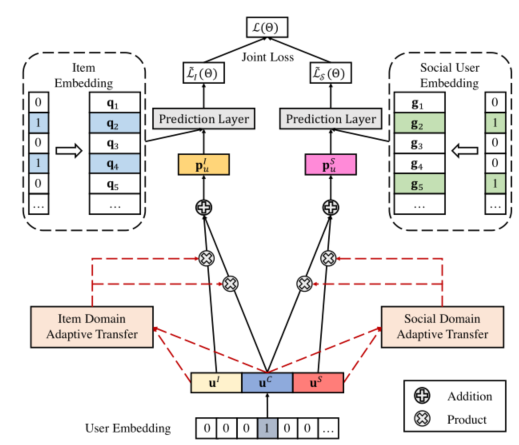

> 论文标题：An Efficient Adaptive Transfer Neural Network for Social-aware Recommendation
>
> 发表于：2019 SIGIR
>
> 作者：Chong Chen, Min Zhang, Chenyang Wang
>
> 代码：https://github.com/chenchongthu/EATNN
>
> 论文地址：http://www.thuir.cn/group/~YQLiu/publications/SIGIR2019Chen.pdf
>
> 数据集：Ciao：http://www.jiliang.xyz/trust.html
> 			  Epinion：http://alchemy.cs.washington.edu/data/epinions/
> 			  Flixster：http://www.cs.ubc.ca/jamalim/datasets/

## 摘要

- 现有方法中有两个重要问题没有得到很好的考虑：
  - 1）现有方法通常采用静态转移方案来共享用户在项目和社交领域之间的共同偏好，
    - 这在现实生活中并不鲁棒，因为共享程度和不同用户的信息丰富度不同。
    - 因此，非个性化的转移方案可能是不够的和不成功的。  
  - 2）以往的神经网络推荐方法大多依赖于训练中的负采样来提高计算效率，这使得它们对采样策略高度敏感，
    - 在实际应用中难以达到最佳效果
- 文章提出了一种高效的自适应转移神经网络（EATNN）。通过引入注意机制，所提出的模型自动为每个用户分配个性化的传输方案
- 设计了一种有效的优化方法，无需负采样即可从整个训练集中学习，并进一步扩展它以支持多任务学习
- EATNN在训练效率方面表现出显著优势，在交互很少的冷启动用户上评估指标提升明显

## 结论

- 我们提出了一种新颖的高效自适应迁移神经网络 (EATNN)，用于社交感知推荐
- 通过引入注意机制，EATNN 能够自适应地分配个性化方案，以在项目域和社交域之间传递共享知识。
- 推导出了一种有效的基于全数据的优化方法，其复杂性显着降低，但目前不适用于非线性模型

## 未来工作

- 在其他相关任务（如内容推荐 [6]、网络嵌入 [21、30] 和多域分类 [24]）中探索 EATNN  和基于全数据的高效策略。
- 此外将尝试扩展基于全数据的优化方法，使其适用于学习深度非线性模型

## 介绍

- 传统的协同过滤（CF）方法[12-14, 28]主要利用用户的历史记录，当记录矩阵非常稀疏时，性能会显着下降。
  - 为了解决数据缺乏的问题，有一种趋势是增加用户与用户的社交联系的用户-项目交互以进行推荐[4, 18, 20, 27, 43]。
- 社交感知方法可以利用大量数据来解决数据稀疏问题，并进一步提高推荐系统的性能
  - 许多社交感知推荐方法基于迁移学习 [15,18,25]，因为它是协调用户-项目交互和用户-用户连接的合适选择
  - 大多数现有方法只是为每个用户在项目域和社交域之间转移固定比例的常识，这在现实生活中并不稳健
    - 1）这两个域的信息丰富度通常因用户而异
    - 2）两个域之间的偏好共享程度对于不同的用户是不同的
  - 为了更好地描述用户的偏好，推荐系统需要针对不同用户的自适应传输方案
- 由于隐式数据通常是用户行为的自然附带产品（例如，浏览历史记录、点击日志）
  - 因此在项目和社交领域都可以观察到的用户交互是相当有限的，并且是不可观察的实例
  - 为了提高计算效率，现有的神经推荐方法[4,10,33,34,40]主要依靠负采样进行优化，但是对采样分布和负样本数量高度敏感[10]。
- 社交感知推荐通常需要优化项目和社交领域的损失函数，这是一个多任务问题
  - 因此，对于社会意识问题，基于抽样的策略更难以收敛到最佳性能。
  - 基于整体数据的策略计算所有训练数据的梯度可以很容易地收敛到更好的最优值 [12,  41]。
    - 缺点是应用基于整体数据的策略的困难在于大规模数据的计算成本昂贵
- 基于以上背景，
  - 提出了一种用于社交感知推荐的高效自适应转移神经网络 (EATNN)。
    - 引入了注意力机制 来自动估计项目域和社交域之间相互影响的差异
      - 学习两个基于注意力的内核来对来自不同领域的输出权重进行建模
  - 提出了一种有效的优化方法，无需负采样即可从整个训练集中学习，并将其扩展为支持多任务学习
    - 重新制定常用的平方损失函数来加速优化方法

## 模型架构

 

- 用户和项目通过嵌入转换为密集向量表示。具体来说，作为迁移学习的桥梁，每个用户 u 都有三个潜在向量。 
  - $u^C$ 代表项目和社交领域之间共享的知识。 $u^i$ 和 $u^S$  分别表示用户 u 对应于项目域和社交域的特定偏好。

- ### 基于注意力的自适应迁移学习(attention-based adaptive transfer learning)  

  -  分别将注意力网络应用于项目域和社交域。每个都是以用户表示（uC、uI、uS）作为输入的两层网络
  -  对于用户来说，如果两个领域的相关性较低，那么共享知识（uC）将受到惩罚，注意力网络将学习利用更多特定领域的信息（uI 或 uS）。
  -  然后，使用 softmax 函数对最终的注意力分数进行归一化
  -  预测部分建立在 MF [10] 的神经网络形式上。对于每个域任务，都使用了一个特定的输出层。

- ### 基于全数据的高效学习(efficient whole-data based optimization )

  -  加权策略
     -  每个正样本的权重设置为 1
     -  负采样实例的权重计算，将较大的权重分配给频率较高的项目和朋友

  -  损失推断
     -  项目域和社交域的损失函数仅在输入上有所不同，
     -  缺失数据的损失可以用所有数据的损失与正数据的损失之间的残差来表示

  -  联合学习
     -  将项目域和社交域的子任务整合到一个统一的多任务学习框架

## 实验

- ### 数据集

  - Ciao
  - Epinion
  - Flixster

- ### baseline

  - 贝叶斯个性化排名（BPR）[28]：该方法使用贝叶斯个性化排名目标函数优化 MF。 
  - Exposure MF (ExpoMF)  [17]：这是一种基于整体数据的项目推荐方法。它将所有缺失的交互视为负面，并按项目受欢迎程度对其进行加权。
  - 神经协同过滤（NCF）[10]：这是最先进的深度学习方法，它使用用户的历史反馈进行项目排名。它将 MF 与多层感知器 (MLP) 模型相结合。
  - 社会贝叶斯个性化排名（SBPR）[43]：这是一个排名模型，它假设用户倾向于为他们朋友喜欢的项目分配更高的分数。
  - 具有社会和项目可见性的转移模型（TranSIV）[18]：这是一种最先进的社会感知推荐方法。它考虑了物品和朋友关系的可见性，并利用迁移学习将物品域和社交域结合起来进行推荐。
  - 社会注意记忆网络（SAMN）[4]：SAMN 是一种最先进的深度学习方法，它利用注意机制对方面和朋友级别的差异进行建模，以进行社会感知推荐。

- ### 超参数设置

  - 每个数据集随机分成训练集（80%）、验证集（10%）和测试集（10%）。
  - 学习率在 [0.005,0.01, 0.02, 0.05]，
  - dropout 在 [0.1, 0.3, 0.5, 0.7, 0.9]，
  - batch size在[128, 256, 512,1024],
  - 注意力网络k和潜在因子数d在[32,64,128]，
  - 最优为 batchsize=512，d=64，k=32，学习率=0.05，dropout在Ciao中=0.3，dropout在Flixster中=0.3，权重重置参数 μ=0.1

- ### 评估指标

  - Recall@K ：考虑真实项目是否在前K项中排名
  - NDCG@K：一个位置感知排名指标