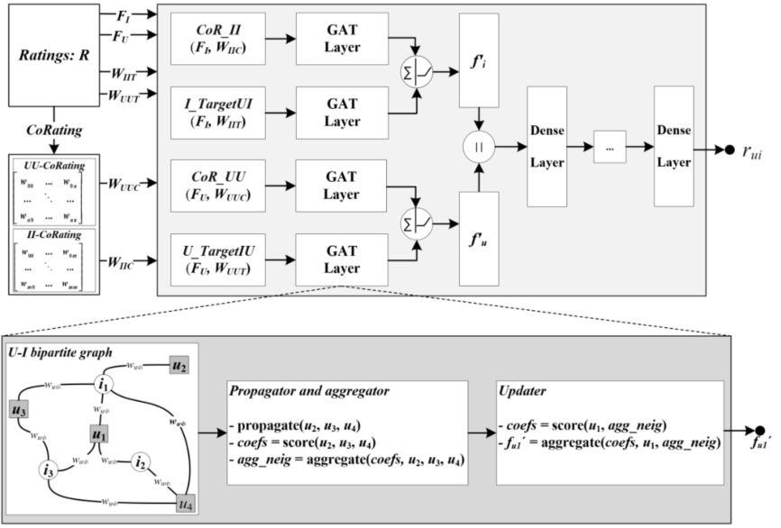
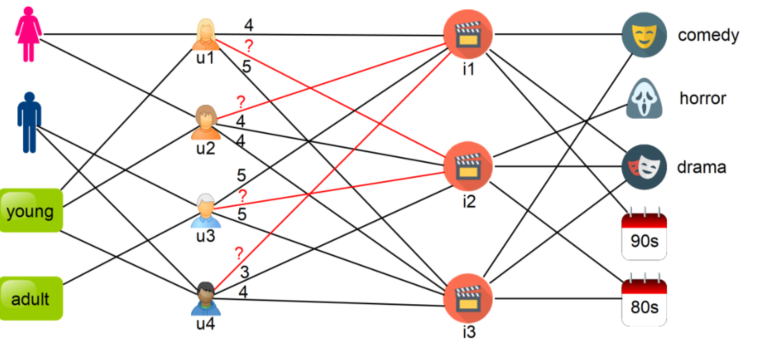

> 论文标题：Attention-Based Recommendation On Graphs
>
> 发表于：2022
>
> 作者：Taher Hekmatfar, Saman Haratizadeh, Parsa Razban
>
> 代码：
>
> 论文地址：https://arxiv.org/pdf/2201.05499.pdf

## 摘要

- 在协同过滤任务中，核心问题是找出一个实体在预测目标用户未来行为方面的信息量。
- 注意机制使 GCN了解一个相关的用户或项目应该在多大程度上影响目标实体的最终表示。
- 提出GARec，它在推荐图上应用注意机制和空间 GCN 来提取用户和项目的嵌入。
  - 提出一种混合图神经网络和矩阵分解方法来学习图中节点的表示
  - 通过一些修改提高标准注意机制的性能 
- 在图神经网络中应用注意力机制存在一些挑战，有时，它只会不必要地增加模型的复杂性（Xu  et al.,  2018）。
  - 由于对邻居节点的高度关注，为节点生成的嵌入可能与节点的初始嵌入有很大的距离。这样的嵌入质量低，网络在使用它们的预测任务中无法获得高性能。
  - 如果  GAT  为不同节点生成相似的注意力系数，则为所有节点生成的嵌入可能彼此非常相似。在这样的设置中，网络总是为所有输入预测相同的输出。
  - 为了克服这些缺点，我们修改了图注意力层，确保最终嵌入包含节点初始特征向量及其邻居的信息。

## 结论

- GARec，作为一种图神经网络，它将具有注意机制的空间图卷积神经网络应用于推荐系统数据的图模型
- 它预测将用户连接到用户-项目二分图中的项目的边的权重。
  - 它通过聚合来自相关邻居的信息来提取嵌入用户和项目节点
- 这项工作的主要思想是为用户或项目找到重要的邻居，并在生成嵌入时更加关注来自这些邻居的信息。
  - 注意机制可以帮助找出每个邻居在目标节点的嵌入过程中应该参与多少。
  - 通过修改注意力机制并将其应用到  GNN 的更新模块中，我们还确保嵌入过程也考虑了目标节点的信息。
- 底层图和建议的推荐方法也可以很容易地用于隐式反馈数据，但它仍然不能处理某些类型的信息，如顺序用户项交互，这通常存在于基于会话的数据中

## 未来工作

- 修改模型，包括图形建模和图形分析模块，以支持顺序信息。
- 在应用注意力机制时，可考虑邻域的不同定义，例如将随机游走中采样的节点视为邻域。

## 介绍

- 基于图的数据建模可以通过扩展相似性的概念以涵盖实体之间的间接关系来帮助克服稀疏性问题
- 定义相似性度量的方法有很多种，包括元路径分析或随机游走模拟和 PageRank 计算等
  - 这些方法的主要挑战是不清楚如何识别图中能够反映实体之间真实相似性的可靠和不可靠路径
- GNN使用结构信息来捕获实体之间的直接和间接关系，并将其与本地节点信息相结合以提取信息嵌入
- 本文提出了新的GNN,将用户和项目节点嵌入到异构的用户项目图中
  - 这里的主要思想是在提取目标节点的嵌入时识别和使用信息量更大的相关节点。
- 所提出的方法具有基于相似性和基于模型的方法的优点。
  - 与基于相似性的方法一样，它在为目标节点提取嵌入的同时结合了邻居信息。
  - 它需要简单的启发式方法，考虑  目标用户 与 先前被评级为目标项目的用户 以及 与目标用户具有共同评级关系的用户 的相关性。
  - 但是，这种方法不需要手动提取特征；相反，它利用深度神经网络模型来提取推荐。因此它在支持离线训练和在线推荐的同时受益于邻居信息。
- 模型修改了标准注意力机制，修复先前 GNN 中应用注意力缺陷。
  - 现有的 GAT（Graph Attention  Network）架构中，注意力机制更多地关注邻居节点而不是目标节点本身，是违反直觉的，并且可能导致低质量的最终表示
  - 所有邻居都可能从 GAT 获得相同的注意力分数，因为它们将图权重视为二元
    - 在一些节点，如社交网络中的影响者，它导致最终表示成为许多节点的平均值
  - 大多数研究将单个 GNN 层与 GAT 应用于一阶邻居，对于用户而言，它们是项目节点.
    - 这种方法导致嵌入与目标用户节点存在巨大差异
- 一些方法忽略了用户提供的加权反馈，并将它们用作训练阶段的目标。
  - 在所有这些方法中，one-hot  编码被用作初始特征向量，它不提供信息

## 模型架构

- GARec
  
- 异构推荐系统图示
  
  - 每个用户都可以通过不同元路径的实例（例如 user-item-user 或 user-content-user）连接到另一个用户。同样，项目可以通过  itemuser-item 和 item-content-item 元路径连接。

## 实验

- ### 研究问题

- ### 数据集

  - MovieLens-100K
  - MovieLens-1M

- ### baseline

  - 矩阵分解
    - NMF(Luo et al., 2014)、
    - PMF (Ma et al., 2008) 
    - SVD++ (Koren, 2008) 方法
  -  GNN
    - GC-MC (Berg,  Kipf, & Welling, 2017), 
    - PinSage (Ying, He, et al., 2018), 
    - IGMC (M. Zhang  & Chen, 2019), 
    - MCCF (X. Wang) 
    - CF-NADE (Zheng et  al., 2016)  
  - 神经网络模型
    - AutoRec (Sedhain et al., 2015)
    - Wide & Deep (Cheng et  al., 2016) 
    - DMF(Yi et al. ., 2019)

- ### 超参数设置

- ### 评估指标

  - RMSE