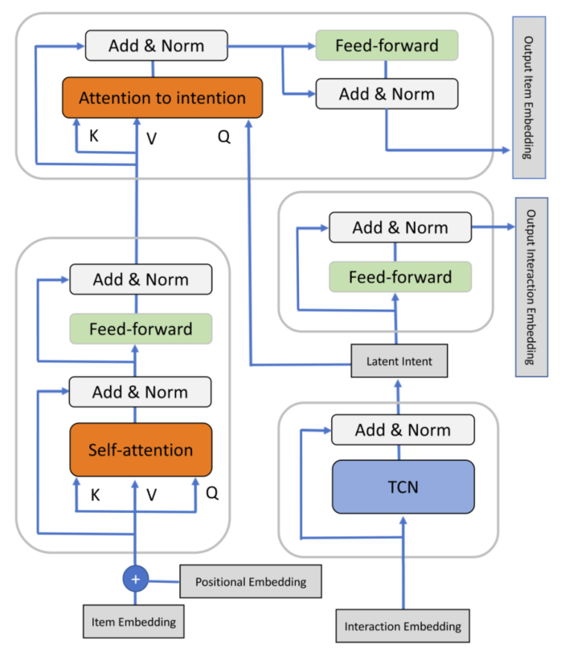

> 论文标题：Attentive Sequential Models of Latent Intent for Next Item Recommendation
>
> 发表于：2020 WWW
>
> 作者：Md Mehrab Tanjim，Congzhe Su, Ethan Benjamin
>
> 代码：
>
> 论文地址：https://dl.acm.org/doi/pdf/10.1145/3366423.3380002

## 摘要

- 除了考虑用户的历史交互之外，捕捉用户意图也很重要。这些意图是潜在的，我们只观察用户的交互，而不是他们的潜在意图
- 提出了一种潜在意图的注意力序列模型（  ASLI）。
  - 我们的模型首先通过自注意力层从用户的交互历史中学习项目相似性，
  - 然后使用时间卷积网络层从用户对特定类别的行为中获取用户意图的潜在表示。

## 结论

- ASLI通过从用户的交互中捕获用户的隐藏意图来实现更好的推荐。
- 除了查找项目之间的相似性外，ASLI 还利用 TCN  层来获取用户意图的潜在表示，用于查询注意力层以查找哪些项目与用户的意图最相关

## 未来工作

## 介绍

- 协同过滤（CF），它利用了用户最有可能与与其历史交互项目相似的项目进行交互的观察[12]。
  - 为了扩展这个想法，各种模型进一步试图捕捉用户反馈的顺序动态
- 现有模型是针对单一交互类型（例如购买或点击）进行训练的，并且不会进一步将预测分解为不同的动作或意图类型
  - 在实际中，用户意图可以根据上下文而改变
- 动机：
  - 要推荐下一次购买，不仅要考虑用户之前购买的产品，还要考虑她过去查看或添加到购物车的产品可能会有所帮助。
  - 与另一种意图（购买）相比，一种意图（探索）会导致不同的互动
  - 因此，我们可能会尝试推荐满足用户当前目的的项目。
  - 但当前推荐系统无法区分意图类型（甚至交互类型）的潜在限制。
- 因此，本文寻求一种能够发现时间相似性，同时也能捕捉用户意图的系统。存在以下挑战
  - 首先，意图和互动虽然相关，但并不相同；
  - 虽然我们可以直接观察用户的交互，但他们的意图是潜在的。因此，必须从用户的交互中推断出潜在意图。
  - 此外，用户的意图可能会逐渐演变（交互之间的长期依赖关系）或突然（短期依赖关系），因此很难从嘈杂的操作列表中检测到这种漂移。
- 提出了一种注意力序列潜在意图模型  (ASLI)使用自注意力和时间卷积网络来寻找项目之间的相似性，捕捉用户的隐藏意图并关注它们。
  - 首先，我们在用户交互过的所有项目上应用一个自注意力层，以从序列中找到项目的相似性；
  - 然后，我们考虑用户在给定类别上执行的交互，并应用时间卷积网络来推断用户的潜在意图。
  - 最后，我们应用另一个注意力层来解决项目和意图之间的长期和短期依赖关系。

## 模型架构

- ASLI示例
  
  - 用户最初具有“发现”意图，这通过与美观和昂贵物品的交互来反映。最终，她改变了对更便宜、更朴素的物品的意图。
- ASLI详细架构
  

## 实验

- ### 研究问题

- ### 数据集

  - Tmall 
  - Tmall-Small 
  - Etsy

- ### baseline

  - MostPop：根据项目的受欢迎程度对项目进行排名。 
  - BPR-MF：贝叶斯个性化排名使用排名损失[17]分解用户项交互矩阵.
  - NextItRec：这是 [24]  中提出的下一个项目推荐的卷积模型。 
  - NextItRec 使用一维扩张卷积网络来获取过去 L 个项目的上下文。 
  - SASRec：这是一个基于自我注意的顺序模型，用于下一个项目推荐[13]。

- ### 超参数设置

- ### 评估指标

  - HitRate@
  - NDCG@K