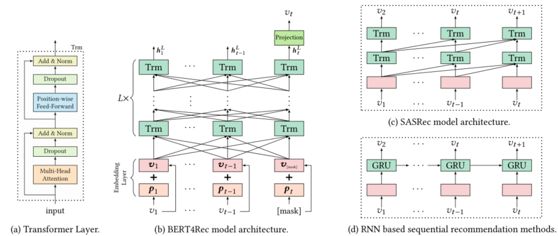

> 论文标题：BERT4Rec: Sequential Recommendation with Bidirectional Encoder Representations from Transformer
>
> 发表于：2019 CIKM
>
> 作者：Fei Sun, Jun Liu, Jian Wu
>
> 代码：TensorFlow：https://github.com/FeiSun/BERT4Rec
>
> ​			pytorch：https://github.com/jaywonchung/BERT4Rec-VAE-Pytorch
>
> 论文地址：https://arxiv.org/pdf/1904.06690v2.pdf

## 摘要

- 之前的工作使用顺序神经网络将用户的历史交互从左到右编码为隐藏表示以进行推荐
- 存在以下限制：
  - a) 单向架构限制了用户行为序列中隐藏表示的能力； 
  - b) 他们经常假设一个严格有序的序列，不总是实用的。
- 为了解决这些限制，提出了一种称为 BERT4Rec  的顺序推荐模型，
  - 它采用深度双向自注意力来对用户行为序列进行建模。
  - 为了避免信息泄漏并有效地训练双向模型，我们采用完形填空目标来进行顺序推荐，通过联合调节左右上下文来预测序列中的随机掩码项目。
  - 通过这种方式，我们学习了一个双向表示模型，通过允许用户历史行为中的每个项目融合来自左右两侧的信息来进行推荐。

## 结论

- 介绍了一种称为 BERT4Rec 的深度双向序列模型，用于序列推荐。对于模型训练，引入了预测掩码项目的完形填空任务

## 未来工作

- 丰富的项目特征（例如，产品的类别和价格，电影的演员表）合并到 BERT4Rec 中，而不仅仅是对项目 ID 进行建模。
- 将用户组件引入模型中，以便在用户有多个会话时进行显式用户建模。

## 介绍

- 预测用户在给定她/他过去的交互的情况下可能与之交互的连续项目。先前工作的基本范式是使用从左到右的顺序模型将用户的历史交互编码为向量（即用户偏好的表示），并基于此隐藏表示进行推荐。
- 从左到右的单向模型不足以学习用户行为序列的最佳表示
  - 此类单向模型限制了历史序列中项目的隐藏表示能力，其中每个项目只能对来自先前项目的信息进行编码
  - 以前的单向模型最初是针对具有自然顺序的顺序数据引入的，例如文本和时间序列数据。
    - 他们通常假设数据上的严格排序序列对于实际应用程序中的用户行为并不总是正确的。
  - 用户历史交互中的项目选择可能不遵循严格的顺序假设 [18, 54]。在这种情况下，在用户行为序列建模中结合来自两个方向的上下文至关重要。
- 受 BERT [6] 在文本理解方面的成功启发，我们建议将深度双向自注意力模型应用于顺序推荐
  - 引入了Cloze任务 [6, 50] 来代替单向模型中的目标（即顺序预测下一个项目
    - 在输入序列中随机屏蔽一些项目（即，用特殊标记 [mask] 替换它们），然后根据周围的上下文预测这些屏蔽项目的  id。通过这种方式，我们通过允许输入序列中每个项目的表示融合左右上下文来避免信息泄漏并学习双向表示模型。
  - Cloze任务的一个缺点是它与最终任务（即顺序推荐）不一致。
    - 为了解决这个问题，在测试过程中，我们在输入序列的末尾附加了特殊的标记“[mask]”来指示我们需要预测的项目，然后根据其最终的隐藏向量进行推荐。

## 模型架构

- BERT4Rec 通过 Cloze 任务学习双向模型，而基于 SASRec 和 RNN 的方法都是从左到右的单向模型，依次预测下一个项目。

## 实验

- ### 数据集

  - Amazon Beauty
  - Steam
  - MovieLens-1m 、MovieLens-20m

- ### baseline

  - POP：这是最简单的基线，根据交互次数判断项目的受欢迎程度对项目进行排名。
  - BPR-MF [39]：它使用成对排序损失通过隐式反馈优化矩阵分解。
  - NCF  [12]：它模拟用户-项目与MLP 的交互，而不是矩阵分解中的内积。
  - FPMC [40]：它通过将 MF 与一阶 MC  相结合来捕捉用户的一般品味以及他们的顺序行为。
  - GRU4Rec [15]：它使用具有基于排名的损失的 GRU 来为基于会话的推荐的用户序列建模。
  - GRU4Rec+ [14]：它是 GRU4Rec 的改进版本，具有一类新的损失函数和采样策略。
  - Caser [49]：它以水平和垂直方式使用 CNN 对高阶  MC 进行建模以进行顺序推荐。
  - SASRec [22]：它使用从左到右的 Transformer  语言模型来捕捉用户的顺序行为，并在顺序推荐方面实现了最先进的性能。

- ### 超参数设置

- ### 评估指标

  - NDCG@K
  - Hit R@K
  - MRR