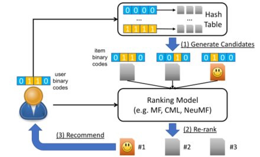
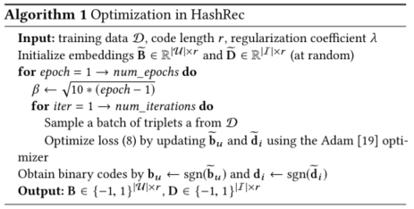

> 论文标题：Candidate Generation with Binary Codes for Large-Scale Top-N Recommendation
>
> 发表于：2019 CIKM
>
> 作者：Wang-Cheng Kang ,Julian McAuley
>
> 代码：https://github.com/kang205/CIGAR
>
> 论文地址：https://arxiv.org/pdf/1909.05475v1.pdf

## 摘要

- 从大型语料库生成 Top-N 推荐在大规模执行时计算成本很高，通常采用基于候选生成和重新排序的方法来缓解效率问题
- 不明确需要多少候选人才能达到良好的效果，或者开发系统方法来有效地生成高质量的候选人
- 文章通过提出基于候选生成和重新排序的框架 (CIGAR) 来研究这些问题
  - 学习保留偏好的二进制嵌入来构建哈希表以检索候选，
  - 然后学习重新排序候选人使用具有以候选人为导向的目标的实值排名模型
- 框架将查询时间减少了几个数量级

## 结论

- 提出了候选生成的新技术，弥补融合两种现有研究方式之间的差距
  - Top-N 推荐最先进技术的方法，但在尝试产生最终排名时通常效率低下的研究方法
  - 基于二进制代码在时间和空间上都很有效，但在排名性能方面达不到最新技术水平的研究方法
- 开发了一种基于二进制代码的新方法HasRec来处理候选生成步骤，允许采用现有的最先进的推荐模块来改进结果。
- 通过使用简单的加权采样方案调整这些模块以在训练时了解生成的候选者，可以进一步提高性能
- 提供一个通用框架，在测试时提高现有推荐系统的可扩展性

## 未来工作

## 介绍

- 从大型语料库中准确识别这些 Top-N 项，无论是在可变性还是稀疏性方面，都使得这个问题在扩展到现实世界的数据集时很困难
- 为了更高的准确性，
  - BPRMF [32] 采用传统的矩阵分解（MF）方法作为其基础偏好模型，CML [15] 采用度量嵌入，TransRec [12] 采用平移向量，NeuMF  [13] 采用多层感知器（MLP ) 对用户-项目交互进行建模
- 至于延迟/效率问题，
  - 一些工作试图通过修剪或基于树的数据结构来加速最大内积 (MIP) 搜索步骤（对于基于 MF 的模型）[21, 31]，
    - 这种方法通常是特定于模型的（例如，它们依赖于内积空间的特定结构），因此在尝试加速其他模型时很难概括
  - 另一项工作旨在直接学习二进制代码以估计用户-项目交互，并构建哈希表以加快检索时间 [24, 27, 44,  46-48]。
    - 虽然使用二进制代码可以将查询时间显着减少到恒定或亚线性复杂度，但此类模型的准确性仍然不如传统（即实值）模型
- 在需要高效率的行业中已采用候选生成和重新排序策略。
  - 这种方法首先以有效的方式生成少量候选，然后应用细粒度的重新排序方法获得最终排名。
- 为了实现高效率，生成阶段通常基于规则或启发式。
- 本文提出了一种新的基于候选生成和重新排序的框架，称为  CIGAR。
  - 在候选生成阶段，与采用启发式或先学习实值嵌入然后采用索引技术加速的现有工作不同，我们建议直接学习二进制代码以进行偏好排序和哈希表查找。
  - 在重新排名阶段，我们学习使用现有的排名模型和面向候选人的抽样策略重新排名候选人
- 提出了一种新的基于散列的方法：HashRec，用于学习带有隐式反馈的二进制代码。 
  - HashRec 通过随机梯度下降进行了优化，可以轻松扩展到大型数据集。
- 提出了一种面向候选人的抽样策略，该策略鼓励模型专注于重新排列候选人，而不是平等对待所有项目

## 模型架构

 

- 二进制代码和排名模型都是从用户反馈中学习的
- 使用 HashRec (算法 1) 学习保偏二进制码 bu 和 di；
- 构造Multi-Index Hash表来索引所有项目；
- 训练一个排序模型（例如 BPR-MF+）以对候选者进行重新排序（即使用面向候选者的抽样策略）
- 采用 SGD 来学习二进制代码以及我们的重新排序模型，以便优化轻松扩展到大型数据集

## 实验

- ### 研究问题

  - RQ1：与执行详尽排名（即对所有项目进行排名）的最先进模型相比，CIGAR 是否实现了相似或更好的 Top-N 准确度？ 
  - RQ2：CIGAR  是否加快了大规模数据集上基于内积、度量或神经模型的检索时间？ 
  - RQ3：HashRec 是否优于其他基于散列的方法？面向候选人的抽样策略（例如  BPR-MF+）有帮助吗？ 
  - RQ4：CIGAR 中的关键超参数有什么影响？

- ### 数据集

  - MovieLens-20M:包含 2000 万用户评分的电影数据集
  - Yelp: 包含有关企业的各种元数据（例如位置、类别、营业时间）以及用户评论
  - Amazon Books：亚马逊关于数的评论
  - GoodReads:包含书籍元数据和用户操作（例如搁置、阅读、评分）的大型数据集
  - Flipkart :来自印度大型在线电子产品和时尚零售商 Flipkart.com 的大量用户会话数据集

- ### baseline

  - 贝叶斯个性化排名 (BPR-MF) [32] ：一种经典模型，旨在优化成对排名损失。我们使用 MF 作为其偏好预测器，推荐物品时，需要最大内积搜索。
  - 协作度量学习 (CML) [15]：CML 表示度量空间中的用户和项目，并通过欧几里德距离测量它们的兼容性
  - 神经矩阵分解 (NeuMF) [13]： NeuMF 通过多层感知器 (MLP) 对用户和项目嵌入之间的非线性交互进行建模
  - POP： 一个简单的以流行度为导向的基线，它只是根据项目的全球流行度对项目进行排名
  - BPR-B 一个简单的基线，直接量化来自 BPR-MF 的嵌入（即将 sgn(x) 应用于嵌入）。
  - Discrete Collaborative Filtering (DCF) [44]： DCF  学习二进制嵌入来估计观察到的评级。为了使其适应隐式反馈设置，我们将所有动作视为值为 1，并随机抽取 100 个未观察到的项目（针对每个用户），值为 0。
  - 离散个性化排名（DPR）[46] DPR 是一种基于散列的方法，旨在通过隐式反馈优化排名。然而，由于它的高训练复杂性，我们只在 MovieLens-1M  上与这种方法进行比较。

- ### 超参数设置

  - 候选数c=200，bit数r=64，缩放因子α=10/r，采样率h=0.5，l2 正则化器 λ 通过交叉验证进行调整

- ### 评估指标

  - Hit Rate (HR)  ：命中率
  - Mean Reciprocal Rank (MRR)：平均倒数排名