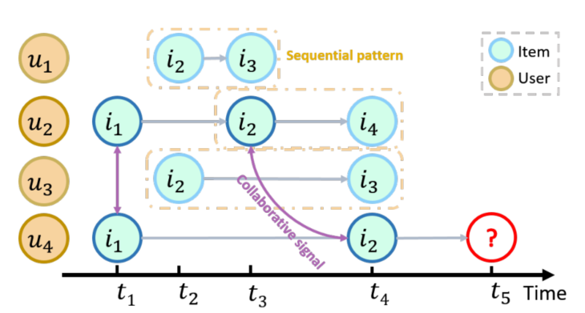
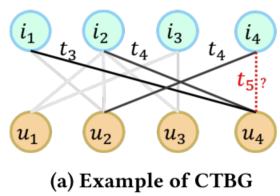
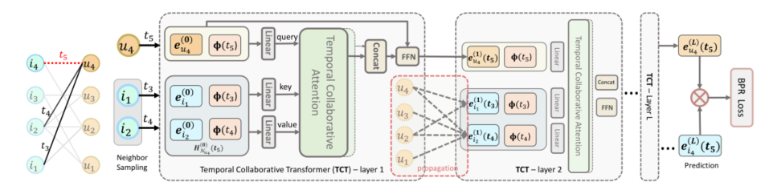

> 论文标题：Continuous-Time Sequential Recommendation with Temporal Graph Collaborative Transformer
>
> 发表于：2021 CIKM
>
> 作者：Ziwei Fan, Zhiwei Liu, Jiawei Zhang
>
> 代码：https://github.com/dygrec/tgsrec
>
> 论文地址：https://arxiv.org/pdf/2108.06625v2.pdf

## 摘要

- 为了对用户偏好的演变进行建模，我们应该学习基于时间排序的项目购买序列的用户/项目嵌入，这被定义为顺序推荐 (SR) 问题
- 现有方法利用顺序模式对项目转换进行建模。它们中的大多数忽略了关键的时间协作信号
  - 这些信号潜伏在不断发展的用户-项目交互中并与顺序模式共存
- 文章建议统一顺序模式和时间协作信号来提高推荐质量，存在以下挑战：
  - 同时编码顺序模式和协作信号 困难
  - 表达协作信号的时间效应 困难
- 文章在定义的连续时间二分图上设计了一个新的框架时序图顺序推荐器（TGSRec）
  - 提出了一个新的时间协作转换器（TCT）层，它通过采用新的协作注意力来推进自注意力机制。
  - TCT  层可以同时捕获来自用户和项目的协作信号，并考虑顺序模式中的时间动态。
  - 在时间图上传播从 TCT 层学到的信息，以统一顺序模式和时间协作信号。

## 结论

- 设计了一个新的 SR 模型 TGSRec，以统一顺序模式和时间协作信号
- TGSRec 是根据提议的 CTBG 定义的。
  - 应用时间核将边缘上的连续时间戳映射到向量。
  - 然后引入了 TCT  层，它可以推断节点的时间嵌入。
    - 它对邻居进行采样并学习注意力权重以聚合节点嵌入和时间向量。
    - 通过这种方式，TCT 层能够编码顺序模式和协作信号，以及揭示时间效应。
    - TCT联合建模协作信号和时间效应。这克服了传统自注意力机制在捕获时间效应和用户-项目协作信号方面的不足

## 未来工作

## 介绍

- 为了对用户-项目交互的动态进行建模，当前的研究工作 [5, 9, 35, 37, 42] 利用历史时间排序的项目购买序列来预测用户未来的项目，称为顺序推荐（SR  ) 问题
- SR 的基本假设之一是用户的兴趣平滑地变化
- 随着 Transformer [38] 的最新发展，目前的努力设计了一系列自注意力 SR 模型来预测未来的项目序列  [12、36、44]。
  - 自注意力模型通过为每个历史项目分配注意力权重并聚合这些项目来推断位置 t的序列嵌入。
  - 注意力权重揭示了先前项目在时间点 t  对当前状态的影响。
- 现有的工作仅利用顺序模式来对序列内的项目转换进行建模，忽略了关键的时间协作信号，
  - 这些信号潜伏在不断发展的用户-项目交互中并与顺序模式共存
  - 时间协作信号的示例：
     
    - 给定用户u1、u2、u3和u4在过去的时间戳t1、t2、t3和t4中喜欢的物品，
    - 目标是在t5向u4推荐一个物品作为在i2之后的下一个物品。
      - 通过仅考虑顺序模式，推荐𝑖3，因为它在𝑢1 和𝑢3 中在𝑖2 之后出现2 次，而𝑖4 在𝑢2 中仅出现1  次。
      - 但是，如果还考虑到协作信号，我们会推荐𝑖4，因为𝑢2 和𝑢4在t1与i1交互，在𝑡3 和𝑡4 分别与i2交互，这表明它们具有很高的相似性。
        - 因此，𝑢2 的顺序模式对𝑢4 的影响更大。这促使我们统一顺序模式和时间协作信号
- 在 SR  中加入时间协作信号是相当具有挑战性的。
  - 第一个挑战是很难同时编码协作信号和顺序模式。
  - 第二个挑战是很难表达协作信号的时间效应。换句话说，目前尚不清楚如何从时间角度衡量这些信号的影响。
- 当前基于 Transformer 的模型 [12, 36]  采用自注意力机制，该机制具有来自项目嵌入的查询、键和值输入，并使用点积来学习它们的相关性分数。限制是self-attention只能捕捉序列中的item-item关系。此外，它们没有捕获项目时间相关性的模块。
- 出了一种新的模型时序图顺序推荐器（TGSRec）。它由两个新颖的组件组成：
  - (1）时间协作转换器（TCT）层。
    - 它可以明确地对序列中的协作信号进行建模，并表达序列中项目的时间相关性。
    - TCT  层在用户-项目交互之间采用协同注意力，其中协同注意力的查询输入来自目标节点（用户/项目），而键和值输入来自连接的邻居
    - TCT 层将时间信息融合到协作注意机制中，明确表达了这些交互的时间效应
  - (2）图信息传播。
    - 根据我们提出的 ContinuousTime Bipartite Graph (CTBG) 设计的。
    -  CTBG 由用户/项目节点和带有时间戳的交互边组成，如图
      - 给定时间戳，用户的相邻项目保留顺序模式。
    - 通过 CTBG 将每个节点周围学习到的时间协作信息传播到周围的邻居
- 文章建议使用节点的时间嵌入来进行推荐，这些嵌入是动态的，并且在指定的时间戳上进行推断

## 模型架构

- 查询节点是𝑢4，其在时间𝑡5 的最终时间嵌入是$𝒉^{(2)}_{𝑢4} (𝑡5)$。
- TCT 层对其邻居节点和边进行采样。使用映射函数 Φ  将边缘上的时间戳编码为向量。
  - 第一个 TCT 层的节点嵌入是长期嵌入。
  - 其他 TCT 层（例如第 2 层）的节点嵌入是从前一个 TCT  层传播的，因此是时间节点嵌入。

## 实验

- ### 研究问题

  - RQ1： TGSRec 会产生更好的推荐吗？ 
  - RQ2：不同的超参数（例如，邻居数等）如何影响 TGSRec 的性能？
  - RQ3：不同的模块（例如，时间协作注意力等）如何影响 TGSRec 的性能？ 
  - RQ4：TGSRec 能否有效地统一顺序模式和时间协作信号？  （揭示时间相关性）

- ### 数据集

  - Amazon Toys 、Amazon Baby 、Amazon Tools 、Amazon Music
  - MovieLens-100K

- ### 数据预处理

  - 在所有数据集上使用 Unix 时间戳
  - 根据交互时间戳以 80%/10%/10% 的比例按时间顺序划分训练/验证/测试

- ### baseline

  - 静态模型：静态模型忽略时间信息并为推荐生成静态用户/项目嵌入
    - BPRMF [34]
    - LightGCN [7] 
  - 时间模型
    - CTDNE [30] 
    - TiSASRec [19]
  - 基于Transformer的SR模型
    - SASRec [12], 
    - BERT4Rec [36], 
    - SSE-PT [44],
    - TiSAS-Rec [19]
  - 其他SR模型
    - FPMC [35]
    - GRU4Rec [9]
    - Caser [37]
    - SR-GNN [45

- ### 超参数设置

- ### 评估指标

  - Recall@10 
  - MRR