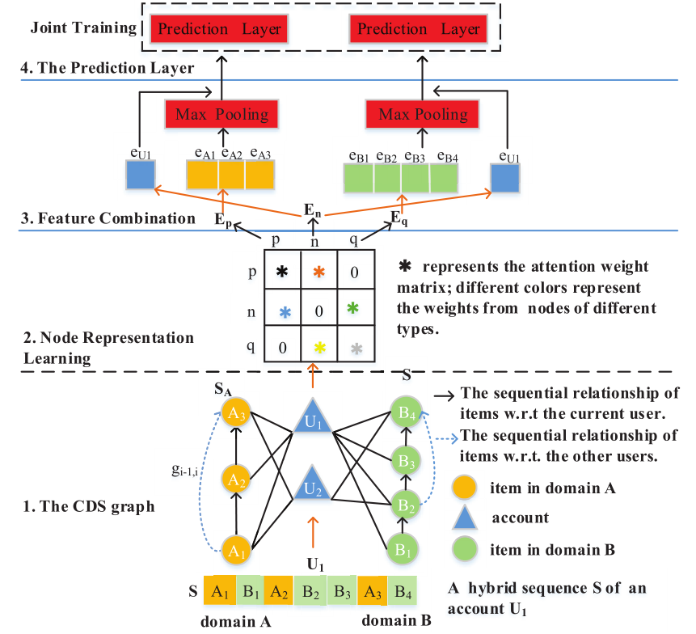

> 论文标题：DA-GCN: A Domain-aware Attentive Graph Convolution Network 
> 								  for Shared-account Cross-domain Sequential Recommendation
>
> 发表于：2021 IJCAI
>
> 作者：Lei Guo , Li Tang , Tong Chen
>
> 代码：
>
> 论文地址：https://arxiv.org/pdf/2105.03300v1.pdf

## 摘要

- 共享账户跨域顺序推荐（SCSR）是基于用户行为记录的序列推荐下一个项目的任务，
  - 其中多个用户共享一个账户，并且他们的行为在多个域中可用
- 解决 SCSR 的现有工作主要依赖于通过基于 RNN 的模型挖掘序列模式，
  - 这些模型的表达能力不足以捕捉多个实体之间的关系
- 提出DA-GCN
  - 首先，将每个域中的用户和项目链接为一个图。
  - 然后，设计了一个域感知图卷积网络来学习用户特定的节点表示。
  - 为了充分考虑用户对项目的特定领域偏好，进一步开发了两种新颖的注意机制来选择性地指导消息传递过程。

## 结论

- 提出了用于 SCSR 的  DA-GCN，以从他们的交互以及显式结构信息中充分学习用户和项目表示。
  - 为了对用户和项目之间的多重关联进行建模，我们首先将它们链接到 CDS  图中。
  - 为了对迁移知识的结构信息进行建模，我们开发了一个域感知 GCN 来学习特定于用户的节点表示，
    - 其中设计了两种注意机制来加权目标的本地邻居。

## 未来工作

## 介绍

- 跨域顺序推荐（CSR），通过利用用户在多个域中的历史交互来推荐下一个项目

- 在单用户场景中，来自两个域的数据可能会协同发现她/他的偏好，

- 但共享帐户的存在反而会放大交互数据中的噪音并阻碍顺序推荐的准确性

- 基于 RNN 的方法针对发现顺序依赖关系，并且在捕获两个域中关联实体（即用户和项目）之间复杂关系的能力有限

  - 限制了学习的用户和项目表示的表达能力，并且还忽略了链接两个域的显式结构信息（例如，项目-用户项目路径）。

- 为 SCSR 提出了一种新颖的基于图的解决方案，即域感知图卷积网络 (DA-GCN)。

  - 首先构建了一个跨域序列（CDS）图来链接不同的域，其中每个域中的用户和项目是节点，它们的关联是边

  - 为了适应共享账户上分散的用户偏好，我们假设每个账户下有 H 个潜在用户，并利用域感知图卷积网络中的消息传递策略来聚合从直接链接的邻居传递的信息。

  - 通过从连接的邻居节点传递信息来学习用户和项目的节点嵌入。

  - 进一步设计了两种专门的注意力机制，以在消息传递期间有区别地选择相关信息。

    - 我们能够通过考虑结构信息对多方面的交互进行建模并传递细粒度的领域知识。

    

## 模型架构

- DA-GCN
  
  - 1.CDS图：
    - S表示U1的混合序列
    - B2->B4的虚线序列表示 其他用户的顺序关系
    - 黑色实线表示当前用户的顺序关系
  - 2.节点表示学习
    - *表示注意力权重矩阵；不同的颜色代表不同类型节点的权重。
  - 3.特征结合
  - 4.预测层
    - 联合训练

## 实验

- ### 研究问题

  - RQ1 与其他最先进的方法相比，我们提出的 DA-GCN 方法表现如何？ 
  - RQ2 利用序列信息是否有帮助？通过结合注意力机制来学习节点表示是否有帮助？ 
  - RQ3 对共享账户特征进行建模是否有帮助？超参数 H（用户数）如何影响 DA-GCN 的性能？ 
  - RQ4 处理大规模数据时，DA-GCN 的训练效率和可扩展性如何？

- ### 数据集

  - HVIDEO ：一个智能电视数据集，包含两个平台的观看日志，即V域（电视剧、电影等视频）和E域（基于教科书的教育视频和运动食品的教学视频）
  - HAMAZON：来自两个亚马逊域的数据，即电影观看和评分记录（M 域）和书籍阅读和评分行为（B 域）。

- ### baseline

  - 传统推荐：
    - POP [He et al., 2017]、
    - Item-KNN [Linden et al., 2003] 
    - BPR-MF [Hidasi et  al., 2016] . 
  - 共享账户推荐：
    - VUI-KNN [Wang et al., 2014]。 
  - 跨域推荐：
    - NCF-MLP++ [He et  al., 2017] 和 
    - Conet [Hu et al., 2018]。 
  - 顺序推荐：
    - GRU4REC [Hidasi et al., 2016],  
    - HGRU4REC [Quadrana et al., 2017]。
  - 共享账号跨域顺序推荐：
    - πnet [Ma et al., 2019],  
    - PSJNet [Ren et al., 2019]

- ### 超参数设置

- ### 评估指标

  - MRR@K
  - Recall@K