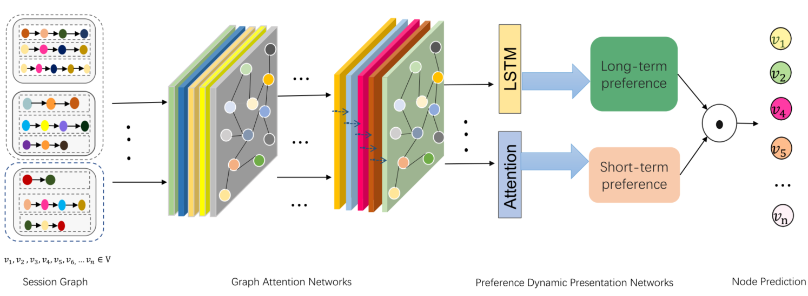

> 论文标题：Dynamic Graph Attention-Aware Networks for Session-Based Recommendation
>
> 发表于：2020 IJCNN
>
> 作者：Ahed Abugabah, Xiaochun Cheng, Xiaochun Cheng
>
> 代码：
>
> 论文地址：https://sci-hub.ee/10.1109/IJCNN48605.2020.9206914

## 摘要

- 基于会话的推荐方法将用户与项目的交互建模为图形，但大多数现有模型都忽略了会话之间的项目关系
- 文章设计了一个动态注意力感知网络（DYAGNN）来建模用户的潜在行为序列，以有效地学习图结构项目之间的深层连接，

## 结论

- 设计了一种新颖的基于会话的推荐的动态注意力感知神经网络方法，
  - 该方法利用图注意力网络捕获项目的重要邻居节点，通过采用LSTM对长期偏好进行建模，并整合注意力机制的短期兴趣，形成统一的兴趣表达。
  - 该模型不仅依靠节点之间的关联关系为每个节点选择最相关的邻居并更新其特征，还使用注意力感知来显式地建模历史会话对当前会话的影响。

## 未来工作

## 介绍

- 现有方法在序列建模任务在基于用户行为序列建模复杂关系方面仍然存在很大挑战。
- 很多研究使用图神经网络来解决项目和推荐项目之间的复杂关系。这些图通常是多关系和异构的
- 现有方法存在问题：
  - 现有方法缺乏本地依赖的能力，因此它们无法在会话中执行上下文序列的表示。
  - 现有的方法通常手动提取离散特征[18]，它们缺乏表示嵌入数据的能力。
- 基于SRGNN,本研究将将注意力感知和 LSTM 机制集成到图神经网络中

## 模型架构

- DYAGNN
  
  - 由一条线表示的每条边仅连接两个顶点。连接两个以上的顶点的每条边用彩色椭圆表示。
  - 该模型分为四个部分，分别是构建会话图、提取节点信息的图注意力网络、偏好动态呈现网络、节点预测网络。
- 用户行为会话构建图
  
  - 在会话序列中，用户的交互会话包括历史会话和当前会话。
  - 图中不同颜色的圆圈代表不同的项目，即 v1、v2、v3、v4、v5 和 v6。

## 实验

- ### 研究问题

- ### 数据集

  - Xing：由求职网站提供，帮助招聘人员选择合适的候选人。 Xing 在平台上拥有 1500 万用户和约 100 万条工作交互记录。
  - Reddit：数据集包含用户名、用户名评论和评论的时间戳。每行表示用户的评论和 Reddit 数据的含义。

- ### baseline

  - FPMC[34]：是一种基于马尔可夫链的序列建模方法，根据前一个动作预测用户的下一个动作。
  - GRU4Rec [35] 是一种基于循环神经网络的序列建模方法，用于为基于会话的推荐建模用户序列。
  - H-RNN [36]  是一种扩展到循环神经网络的序列建模方法，以根据最近的会话预测用户对当前会话的兴趣。
  - Caser [37]  是一种基于卷积核的序列建模方法，类似于图像卷积操作，并使用卷积滤波器来学习序列模式以了解用户的偏好。
  - SR-GNN [15] 采用带有注意力机制的 GNN  将序列建模为会话，以捕捉用户的主要目的。

- ### 超参数设置

- ### 评估指标

  - Recall@20 
  - MRR@20