> 论文标题：Dynamic Graph Neural Networks for Sequential Recommendation
>
> 发表于：2021 IEEE Transactions on Knowledge and Data Engineering
>
> 作者：Mengqi Zhang, Shu Wu, Xueli Yu, Liang Wang
>
> 代码和数据：https://github.com/ZM7/DGSR
>
> 论文地址：https://arxiv.org/pdf/2104.07368.pdf

## 传统顺序推荐的缺点

- 顺序推荐大多只在自己的序列中对用户的兴趣进行建模，而忽略了不同用户序列之间的动态协作信号，不足以探索用户的偏好

## 动态图神经网络DGSR

- 通过动态图结构连接不同的用户序列，利用时间和顺序信息探索用户和项目的交互行为
- 设计了一个动态图推荐网络，从动态图中提取用户的偏好
- 对比：顺序推荐中的下一个项目预测任务被转换为动态图中用户节点和项目节点之间的链接预测

## 顺序建模案例

- 马尔可夫链模型[4]根据以前的交互进行推荐

- 一些基于RNN的模型[5]、[6]、[7]利用长短时记忆（LSTM）[8]或选通循环单元（GRU）[9]网络来捕获用户序列中的顺序依赖关系

- Caser[10]采用卷积滤波器来合并用户交互的顺序

- SASRec[11]和STAMP[12]应用注意机制对项目之间的关系进行建模，以捕获用户意图

- 一些基于GNN的序列模型[15]、[16]、[17]

- ##### 以上这些方法缺乏对不同用户序列的动态协作信号的显式建模：

  - 没有明确地利用不同用户序列之间的协作信息，大多数模型侧重于编码每个用户自己的序列，而忽略了不同用户序列之间的高阶连接性。在训练和测试期间的用户序列编码都在一个序列内
  
  - 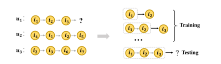
  
  - 反之，在 t3时间，u1与 i1，i2和 i3直接相互作用，还与 u2和 u3以及它们的交互项有高阶连接，u2和 u3的相互作用信息，可以帮助预测 u1的序列，大多数现有的模型都忽略了这个信息.
  
  - 由 u1的序列及其高阶关联用户和项形成的图形，随着 t1，t2和 t3时间的变化而变化, u1兴趣的变化不仅受到一阶交互项目 i1、 i2和 i3的变化影响，还受到高阶连接用户和项目的变化影响
  
  - 项目的语义信息也可能随着第一/第二级相关性的变化而变化。
  
  - 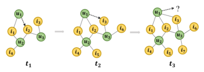
  
  - ##### 产生的问题：
  
    - 如何使用图形动态地表示用户-项交互。
      - 大多数现有的方法将用户-项交互表示为静态二部图，不能记录用户-项交互的顺序
      - 需要考虑灵活有效地将序列信息或交互顺序整合到图中。
    - 如何为每个用户序列显式编码动态协同信号。
      - 对于每个用户序列，其动态关联项和用户形成一个图形结构，比传统的静态图形包含更多的时间/顺序信息
  
  ## 算法框架
  
  - 将所有用户序列转换为一个动态图，并在图的边上标注时间和顺序信息
  - 设计子图抽样策略，动态抽取包含用户序列和相关序列的子图
  - 从子图中抽取用户偏好，设计了动态图推荐网络
  - 构造了动态注意模块来捕捉用户的长期偏好和项目的长期特征，并进一步利用循环神经模块或注意模块分别学习用户和项目的短期偏好和特征
  - 通过叠加多个 dgrn 层，可以更好地利用每个用户和每个项目节点丰富的动态高阶连接信息，最后将下一项预测任务转化为用户节点的链接预测任务
  
  ## 论文主要贡献
  
  - 强调了在序列推荐场景中显式建模用户序列之间的动态协作信号的关键重要性
  - 提出了一种新的基于动态图神经网络的顺序推荐框架 dgsr
  - 对三个真实世界的数据集进行实证研究。大量的实验证明了 dgsr 的有效性
  
  ## 序列化推荐
  
  - GRU4REC[5]是第一个对基于会话的推荐任务使用递归神经网络(rnn)的方法。
  
  - Caser [10]应用卷积滤波器来合并用户交互的不同顺序
  
  - 注意力网络：
  
    - Narm [22]使用 rnn 上的注意力机制来捕捉用户的主要目的。
    - Stamp  [12]使用了一种新颖的注意记忆网络，有效地捕获了用户的一般兴趣和当前兴趣。
    - Sasrec  [11]将自我注意机制应用于顺序推荐问题，以明确地建立项目之间的关系模型。
  
  - 基于 SASRec，TiSASRec[23]被提出模型的绝对位置的项目以及他们之间的时间间隔在一个序列。
  
  - #### 图神经网络的序列化推荐应用：[15] ，[16] ，[17] ，[24] ，[25]
  
    - SR-GNN [15]首先利用门控 gnns 捕获会话场景中复杂的项转换关系
    - A-PGNN [16] 结合个性化 gnn 和注意机制，提出了一种面向会话感知场景的GNN
    - MA-GNN [25]使用了一个记忆增强图形神经网络来捕获长期和短期用户的兴趣
    - 它们只关注于对用户内部序列的偏好建模，忽略了序列之间的项关系，为此，提出了一些模型：
      - HyperRec[26]采用超图对序列内或序列间的项目之间的高阶相关关系建模
      - CSRM[27]通过计算与当前会话之间的相似性来考虑邻居会话
      - DGRec[28]通过社会关系显式地关联不同的用户序列，但并非所有数据都具有社会关系属性
      - 为了有效地学习用户和项目嵌入，THIGE[29]利用时间异构图进行下一项推荐
  
  ## 动态图神经网络
  
  - DANE [34]利用矩阵摄动理论在线捕捉邻接矩阵和属性矩阵的变化
  - DynamicTriad[35]利用三元闭包过程来保存动态网络的结构信息和演化模式
  - DynGEM [36]使用一个动态扩展的深度自动编码器来捕获图节点的高度非线性一阶和二阶逼近
  - 针对连续时间动态网络中动态网络嵌入的学习问题，CATDNE[37]设计了一种时变随机游走抽样方法。
  - HTNE[38]将 hawkes  过程集成到网络嵌入中，以获取历史邻居对当前邻居的影响，从而实现时态网络嵌入
  - Dyrep [39]利用深时点过程模型将图上的结构-时间信息编码成低维表示
  - JODIE [40]利用两种类型的 rnn 来模拟不同节点表示的演化
  - MTNE[41]不仅整合了 hawkess 过程来刺激三合一的进化过程，而且还结合了注意力来区分不同主题的重要性
  - xu et.al [42]提出了基于经典 Bochner定理的时间图注意机制
  - [43]将动态图裁剪成一系列图形快照
  
  ## DGSRS:
  
  - ### 序列化推荐
    - 让 U 和 I 分别表示用户和项的集合
    - 对于每个用户 u ∈ U，其动作序列表示为 S^u = (i1，i2，，ik)  其中 i ∈ I，T^u = (t1，t2，，tk)是对应的S^u 的时间戳序列
    - 序列推荐的目标是在使用序列信息的情况下，在使用 tk 和 tk 之前预测 S^u 的下一个项目
    - 当 k 大于 n 时，连续推荐任务将 S^u 的最大长度限制为 n，并使用最近的 n 个条目(ik-n，ik-n+1，ik)进行预测
    - 每个用户和项可以分别转换为低维嵌入向量 eu，ei ∈ R^d，其中 u ∈ U，i ∈ I，d是嵌入空间的维数
    - 分别用 Eu ∈ R^(|U| × d )和 Ei ∈ R ^(| I | × d) 表示用户嵌入矩阵和项嵌入矩阵
  
  - ### 动态图
  
    - 一般来说，有两种类型的动态图[44] ，即离散时间动态图和连续时间图，本次工作主要涉及连续时间动态图。
    - 动态图定义：G = （V,E,T）
      - V={v1，v2，...，vn }节点集
      - E 表示时刻 t ∈ T 时 vi 与 vj 之间的相互作用，因此 vi 与 vj 之间的边 eij 一般用三元组(vi，vj，t)表示。
      - 在某些情况下，t 还可以表示两个节点之间相互作用的顺序
      - 通过记录每条边的时间或顺序，动态图可以捕捉节点之间关系的演化
      - 动态图嵌入的目的是学习映射函数 f: V → R^d，其中 d 是嵌入维数。
  
    ## 方法论
  
    - ### 该体系结构包括四个组成部分

      - 动态图的构造是将所有用户序列转换为动态图
      - 子图抽样是提取包含用户序列及其相关序列的子图
      - 动态图推荐网络(dgrn)包含消息传播机制和子图中每个用户偏好的节点更新部分
      - 预测层聚合用户从 dgrn 编码中学到的精细嵌入，并预测哪个节点最有可能与下一个用户节点链接
  
      
  
    - 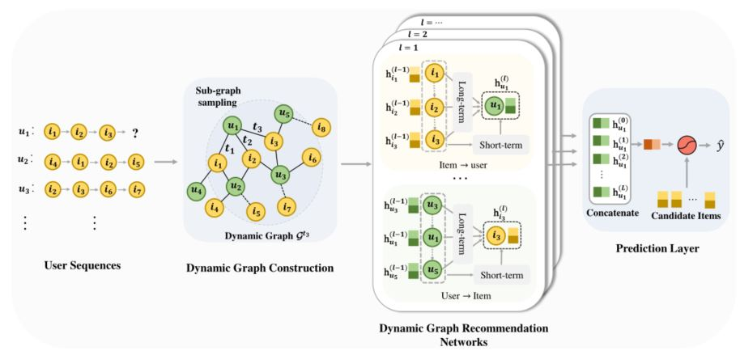
  
    - ### 动态图构造
  
      - 当用户 u 在时间 t 上操作 i 时，u 和 i 之间建立了一个边 e 可以用五元组(1), t 描述交互发生时的时间戳
        $$
        (u,i,t,O_u^i,O_i^u)表示
        $$
        
      - $$o_u^i$$  是 u-i 相互作用的顺序，即i 项在所有与之相互作用的项目中的位置
      
      -  $$o_u^i$$  是指所有与条目 i 相互作用的用户节点中 u 的顺序
      
      - 例如，u1的序列和时间戳序列分别是(i1，i2，i3)和(t1，t2，t3)。U2的序列和时间戳序列分别为(i2，i3，i1)和(t4，t5，t6) ，其中1  < t2 < t3 < t4 < t5 < t6。用户与其交互项之间的边可以写为(u1，i1，t1,1,1) ，(u1，i2，t2,2,1) ，(u1，i3，t3,3,1) ，(u2，i2，t4,1,2)  ，(u2，i1，t5，2,2) ，(u2，i3，t6，3,2)。
      
      - 由于大量的用户序列与相同的项目相互作用，u1和 u2有共同的项 i1和 i2，而 u1和 u3有共同的项 i3。因此，数据集的所有五元组形成一个动态图,
        $$
        G = {(u,i,t,O_u^i,O_i^u)|u∈U，i∈V}
        $$
        
      - 除了用户和商品之间的交互时间外，G 还记录用户和商品之间的订单信息。我们的动态图比静态图和传统的动态图更适合于顺序推荐任务。
      
      - 我们将时间 t 的动态图定义为 Gt ∈ G，它是由时间 t 和时间 t 之前的所有用户交互序列组成的动态图。
      
      - 对于给定的用户序列 Su = (i1，i2，，ik) ，其中对应的时间戳序列是 Tu = (t1，t2，tk) ，预测序列 Su 的下一项相当于预测 Gtk  中链接到节点 u 的项。
      
    - ### 子图抽样
    
      - 随着用户序列的扩展，它的邻居序列的数量也在增加。同样，由所有用户组成的动态图的规模也在逐渐扩大。这将增加计算量，并引入过多的噪声到目标序列。
    
      - 抽样策略算法
    
        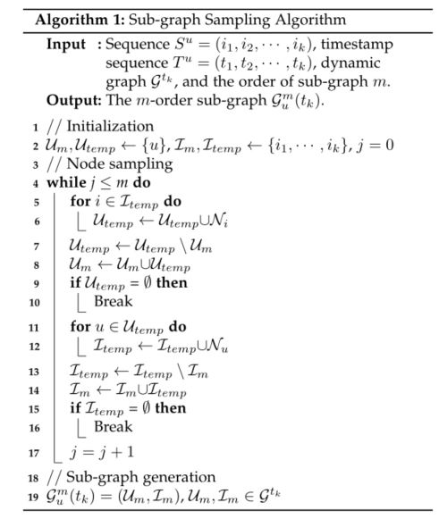
    
        - 首先以用户节点u为锚节点，并从图G tk 中选择它最近的 n 个一阶邻居，与 u 交互的历史项,写成Nu,其中n是用户的最大长度序列(第5、6和8行)
    
        - 接下来,对于每一项 i∈V,我们使用它们作为一个锚节点抽样与它们互动的用户集合,写成Ni(第11、12和14行),
        - 提高抽样效率,我们记录用户和项目节点,使用锚节点,以避免重复抽样(7和13行)
        - 其次是类比,我们可以得到节点u的多跳邻居，它可以形成u的Su的m阶子图gmu (tk) (m是用来控制子图大小的超参数)。
        - 采样后，每个子图gmu (tk)包含序列Su及其关联序列的节点。
        - 这些序列中的用户和项目节点通过在gmu(tk)中叠加用户到项目和项目到用户的关系相互连接。
    
    - ### 动态图推荐网络
    
      - 通过对子图 Gmu (tk)进行操作，从动态上下文信息中对每个用户的偏好进行编码
    
      - DGRN组件由消息传播和节点更新组件组成
    
      - 消息传播机制的目的是分别学习 gmu (tk)中从消息传播者到条目和从条目到用户的消息传播信息
    
      - 挑战在于如何分别从用户和项目的角度对邻居的顺序信息进行编码。
        - 静态图形神经网络，如 gcn [13]和 gat [14] ，在各种图形结构数据中都是强大的
        - Rnn [5]和 transformer net [45]等序列模型被广泛应用于用户的长期和短期兴趣建模，但它们不能直接处理图形结构化数据
        
      - 我们将图形神经网络和顺序网络相结合，设计了一种动态传播机制
    
      - 从项目到用户
        - 用户的邻居节点集就是用户购买的物品，为了更新每一层的用户节点表示，需要从每个用户节点的邻居中提取两种类型的信息，分别是长期偏好和短期偏好
          - 用户的长期偏好[46]反映了他或她的固有特征和一般偏好，这可以从用户的所有历史条目中归纳出来
          - 用户的短期偏好反映了他或她最近的兴趣
        
      - 从用户到项目
        - 目的邻居节点集合显示购买该项目的用户，其中用户按时间顺序排列
        - 物品的邻居也反映了它的两种特征。
          - 一方面，长期特征可以反映项目的共性特征，如，有钱人通常会购买高端化妆品
          - 另一方面，短期特征反映了项目的最新属性，如，许多非运动爱好者在世界杯期间也会购买球衣或球员海报
        - 大多数现有的顺序推荐方法都未能显式捕获用户节点对项目节点的影响
          - 为了解决这个问题，我们还考虑了消息从用户到项目的传播。
        
      - #### 消息传播机制
    
        - ##### 长期信息的编码
    
          - GCN:节点与相邻节点的关系
            - 直接聚合所有邻居节点嵌入
          - RNN:相邻节点的序列依赖性
            - 一个有效的网络模型的序列依赖,我们利用 GRU net 计算用户/项目节点的长期偏好/字符
          - 动态图形注意机制：动态顺序推荐的顺序感知注意机制
            - GNN 模型着重于显式地捕获中心节点和相邻节点之间的关系，而忽略相邻节点之间的序列信息
            - 序列模型是相反的。为了有效地区分不同项目的影响，充分利用用户与项目交互的订单信息，将图形注意机制与序列信息编码相结合
          - 
    
        $$
        对于每个交互的五元组(u,i,t,O_u^i,O_i^u)
        $$
    
        - $$
          将 r^i_u 定义为用户节点邻居中最后一个项目的相对顺序,如r^i_u = |N_u|-O^i_u
          $$
    
          - 对于每个离散值 r，我们指定一个唯一的 P^k_r ∈ R^d 参数向量作为相对序嵌入，对序信息进行编码。然后，h^ (l-1)_ u 与其邻近节点表征 h (l-1)_ i 之间的注意系数受 P^K_ ri 的影响
    
          
          - 定义了一种相对顺序感知注意机制来区分项目对用户的重要性权重，以包含 h^(l-1)_ u 和 h^(l-1)_ i 的第1层节点作为输入，表示为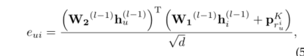
          - 其中 h (0) u 和 h (0) i 分别为用户嵌入和项嵌入。对于嵌入的维度，刻度因子√ d 是为了避免极大的点积并加速收敛。用户与其邻居之间的加权得分通过柔性最大激活函数获得:α__ui = Softmax(e_ui)
          
          - 因此，用户的长期偏好可以通过自适应地聚合所有邻居的信息来获得: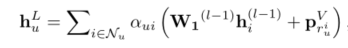
          
            其中 pVriu ∈ rd 是相对次序嵌入，用于捕获用户消息聚合中的次序信息
          
          - 类似地，项目的长期特征可以通过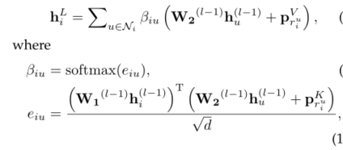
          
        - $$
          而  r^i_u = |N_u|-O^i_u，p^V_(r^u_i)∈ R^d是相对顺序嵌入，用于获取项目信息聚合中的顺序信息
          $$
    
        - ##### 短期信息编码
        
          - [12]利用最后一个交互项嵌入作为用户的短期嵌入，但这忽略了对历史信息的依赖
          - 考虑注意机制来建立显性有效性模型
            - 考虑最后一个项目/用户与每个历史项目/用户之间的注意力机制: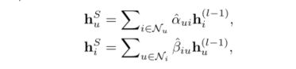
            - 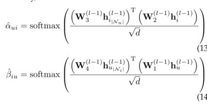其中参数 w3和w4∈ R^d是控制最后相互作用的权重
        
      - #### 节点更新
    
        - 综合长期嵌入、短期嵌入和前一层嵌入来更新节点的 gmu (tk)表示
        - 用户节点更新
          - 对于从第l-1层到第l层的表示更新规则可以表示为：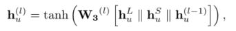，W3是一个用户更新矩阵，用于控制三个h的信息。
        - 项目节点更新
          - 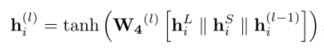，W4是项目更新矩阵，用于控制信息预留的三个h
    
    - ### 推荐和优化
    
      - 在模型中，预测 Su = (i1，i2，ik)的下一次交互等价于预测子图 gmu (tk)的用户节点 u 的链接
      - 通过在 gmu (tk)上作用 l 层 dgrn，得到了 u 节点的多重嵌入{ h (0) u，h (1) u，h (l) u } ，包括用户嵌入 h (l)  u 在每个层中。嵌入在不同层的用户强调不同的用户偏好[3]。因此，我们连接用户多次嵌入，以获得节点 u 的最终嵌入：
      - 
    
      - 对于给定的候选函数 itemi ∈ i，链路函数定义为，向量Su= (su1，su2，，su | i |)表示每个候选项目的得分向量，Wp ∈ R^[(l x1) d × d] 是可训练的变换矩阵
      - 对交叉损失进行优化：
      - 目标函数：，其中yu表示为用于Su下一次交互的真值项目的独热编码矢量，θ表示所有模型参数，||.||表示为L2的规范，λ表示控制正则化强度。
    
    - ### 模型对比
    
      - TiSASRec [23], SR-GNN [15], and HGN [47]，这些信息可以看作是 dgsr 的特殊情况，仅依赖于它的内部序列，而没有显式地利用其他序列信息。
      - 在单层 dgrn 网络中，可以用项目→用户的消息传播机制中的复杂网络、自注意网络、 ggnn 网络或门控网络替换当前设置，禁用项目→用户的消息传播和节点更新，那么 h (1) u 就是 u 的最终偏好表示
      - 一些模型是设计来利用交叉序列信息或捕获不同序列之间的项关系
        - CSRM [27]通过直接计算邻域序列与目标序列之间的相似度来考虑邻域序列，但未能利用用户细粒度的交互信息，包括每个项目与与之交互的所有用户之间的交互顺序
          - 与此相比，DGRN基于设计良好的消息传递机制来度量不同序列之间的相似性，这可以提高用户和条目之间交互的利用率
        - HyperRec  [26]采用超图关联每个时期项目之间的高阶相关关系。然而，超图是一种粗糙的用户-项交互建模方法，忽略了许多精化信息，如每个交叉序列中显式的顺序信息
          - dgsr 构造的动态图可以更灵活地表示更丰富的交互信息
        - 在社会推荐中，dgrec  [28]通过社会属性信息显式地关联不同的用户序列，但在序列推荐场景中，并非所有数据都具有社会关系属性。我们的模型还可以显式地关联不同的用户序列，而不依赖于其他辅助信息。
  
  ## 实验
  
  - ### 实验目标：
  
    - 与最先进的顺序推荐方法相比，dgsr 的性能如何？
    - dgsr 中的动态图表推荐网络组件的有效性如何？
    - 不同的超参数设置(dgrn 层数、子图抽样大小、最大序列长度和嵌入大小)对 dgsr 有什么影响？
  
  - ### 数据集
  
    - Amazon-CDs,Amazon-Games, and Amazon-Beauty.
    - 这些数据集广泛应用于评价序列推荐方法，并且在领域、大小和稀疏度方面各不相同
    - 对于所有数据集，我们将评论或评级的存在视为隐式反馈，并且放弃用户和少于5个相关动作的项目
    - 对于每个用户序列，我们使用最近的项目进行测试，第二个最近的项目进行验证，剩下的项目用于训练集
    - 为了充分捕获动态协同信号，我们将每个序列 S^u 分割成一系列序列和标签。
      - 例如，对于输入S^u = (i1，i2，i3，i4) 和 T^u =  (t1，t2，t3，t4) ，我们生成序列和标签为 [ i1] → i2， [ i1，i2] → i3 和            [ i1，i2，i3] →  i4。
      - 然后，相应的子图和要链接的节点是(gmu (t1)、 i2)、(gmu (t2)、 i3)和(gmu (t3)、 i4)。
      - 这些过程可以在训练和测试前进行。
  
  - ### 实验设置
  
    - #### 进行比较的方法：
      
      - BPR-MF:一个基于矩阵分解的模型，可以从用户隐式反馈中学习成对的个性化排名
      - FPMC：这个模型结合了矩阵分解和一阶马尔可夫链来捕捉用户的长期偏好和项目到项目的转换
      - GRU4Rec+：改进的基于 rnn 的模型，采用了不同的损失函数和采样策略的顶推
      - Caser：一个基于 cnn 的模型捕获高阶马尔可夫链通过应用卷积运算嵌入的 L个最近的项目
      - SASRec：一个基于自注意力的模型来识别相关的项目以预测下一个项目
      - SR-GNN：一个基于 gnn 的模型，用于捕获基于会话的推荐的项目之间的复杂转换关系
      - HGN:一种包含特征选通、实例选通和实例选通模块的序列模型，用于选择重要特征并显式地捕获项目关系
      - TiSASRec：基于区间感知的自我注意模型，该模型在一个序列中建模绝对位置以及它们之间的时间间隔
      - HyperRec：一个基于超图的模型，它采用超图来捕获项目之间的多阶连接，用于下一个项目的推荐
      
    - #### 评价指标：Hit@K    和    NDCG@K
      
      - Hit@k 表示真实实体项目在前 k 项目中的比例
      - NDCG@K 表示位置感知度量，高 NDCG 表示目标项目倾向于前K个项目中有更多的位置
      - 对于每个测试样本，我们随机抽取100个负面项目，并用基本真实项目对这些项目进行排序。我们根据这101个项目来评估，默认情况下设K = 10.
      
    - #### 参数设置
    
      - 在DGL Library上实现模型DGSR；
      - 所有方法的嵌入大小都固定为50；最大序列长度 n 设置为50；优化器是Adam优化器[51]；
      - 学习率为0.01；Batch大小为50；λ 是1e-4；我们将子图抽样的顺序m设置为 4；
      - DAN的层数设置  对于Beauty，CDs，为3；对于Games 为2；
      - 我们用不同的随机种子进行四次评价，并报告每种方法的均值
      - 除了维度之外，我们使用默认的超参数
    
  - ### 性能比较
  
    - 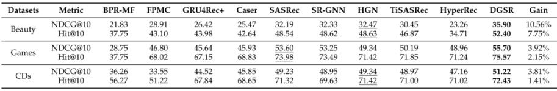
      - DGSR 在三个数据集上具有最好的性能和评价指标。
    - 在Beauty、Games和 CDs 方面，DGSR 在最强基线上分别提高了10.56% 、3.92% 、3.81%  。
    - 值得注意的是，Beauty是最稀疏和最短的数据集，所以许多用户和项目只有很少的交互。在我们的模型中，动态图的高阶连通性缓解了这个问题。所以，在Beauty方面有了显著的进步。通过叠加  dgrn 层，dgsr 可以显式地利用交叉序列信息，为预测提供更多的辅助信息。
    - 而 TiSASRec, HGN, SR-GNN, 和SASRec只将每个序列独立地编码为用户的动态兴趣表示。
    - HyperRec利用了许多相关的用户交互信息，但表现比我们的 DGSR差，特别是在Beauty和Games方面。
      - HyperRec忽略了相关用户序列的交互顺序信息。
      - Beauty和Games具有比 CDs更强的序列特性，使得 DGSR在Beauty和Games上的性能有了显著的提高。
    - SASRec, HGN, SR-GNN, 和 TiSASRec 性能优于神经方法 GRU4Rec+ 和Caser
      - 因为他们可以明确地捕捉项目-项目的关系，利用注意力或层次浇铸机制。
      - 在大多数情况下，Caser通常比 GRU4Rec+ 获得更好的性能，这种改进可能归功于 cnn 模块，它可以捕捉比 GRU net 更复杂的行为模式
      - 与基于会话的推荐场景中的优秀性能相比，SR-GNN 的性能在顺序推荐中表现平平。一个可能的原因是，我们的数据缺乏重复性，使用户序列难以形成图形结构
    - BPR-MF 在三个数据集上的性能较差。由于 BPR-MF只能捕获用户的一般兴趣，因此对用户的行为序列进行建模具有挑战性
    - GRU4Rec+ 在Beauty 和 Games 中表现略逊于 FPMC，而在 CDs 中表现更好。原因可能是 FPMC 专注于项的动态转换，因此它们在稀疏数据集上表现得更好。
  
  - ### 动态图推荐网络的研究
  
    - 比较了DGSR 在Games、Beauty和 CDs 数据集上的不同变体，设置了不同的长短期信息编码模块
    - 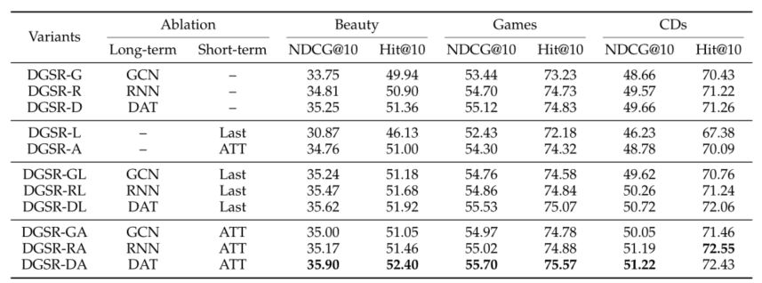
    - DGSR-D在Games和CDs中优于DGSR-R 和 DGSR-G
      - 注意机制和相对顺序嵌入的结合,它能够充分提取每个节点的相邻节点的长期信息
    -  DGSR-R在Beauty方面取得竞争性成绩
      - Beauty序列长度较小，GRU可以对它们的依赖关系建模，如动态注意模块
    - 基于 GCN 的变体在三个数据集上的性能较差
      - GCN 模块将所有邻居节点视为同等重要的节点，这在消息传播中引入了更多的干扰
    - DGSR-A 也比 DGSR-L 好。
      - 仅利用最后一个交互嵌入不足以捕获短期信息
    - 所有带有两个模块的变体(长期和短期)都始终优于带有单个模块的变体(长期或短期),它说明了结合长期和短期信息的必要性。虽然DGSR-R 在Beauty方面比 DGSR-D 好，但是 DGSR-DA 比 DGSR-RA 和 DGSR-RL 好
      - DGSR-DA 考虑了中心节点和邻居节点之间的关系，这有利于信息在动态图中的传播。
      - 相比之下，DGSR-RL 和DGSR-RA 只关注相邻节点之间的相互作用，忽略了中心节点的作用
  
  - ### 超参数的灵敏度
  
    - 研究的超参数
  
      - DGRN的层数L
      -  子图顺序
      - 用户最大长度
  
    - #### DGRN层数的影响
  
      - 测试方法：在Games 和 Beauty 上 设置DGRN的层数
        - DGSR-0表示仅使用用户嵌入和最后一项嵌入作为推荐
        - DGSR-1表示带有一层的DGRN，表示只使用序列内部信息进行预测
        - DGSR-L (L > 1)表明 dgsr 可以利用用户序列信息进行预测
      - 显式地利用高阶用户序列信息可以有效地提高推荐性能
      - 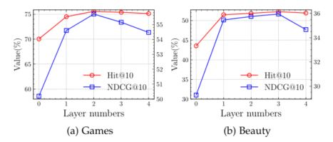
        - DGSR-2和 DGSR-3分别在Games 和 Beauty 方面表现最佳
          - 可能的原因是Beauty比Games更稀疏，可能需要更多的层来引入更多的上下文信息
        - 当进一步叠加传播层时， DGSR-3和 DGSR-4的性能开始恶化。
          - 原因可能是使用更多的传播层可能导致过度平滑
        - Dgsr-1在所有情况下都一直超过 dgsr-0，甚至超过大多数基线
          - 归功于动态图形推荐网络中消息传播机制的强大功能，这种机制能够有效地将用户序列中的顺序信息准确地编码为额外用户的动态偏好
      
    - #### 子图抽样大小的影响
    
      - 测试方法：用不同的子图抽样大小来进行方法测试
      - 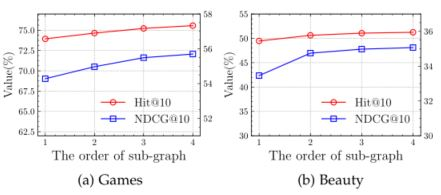
      - m决定了抽样的大小，取值{1,2,3,4}
      - 当 m 从1增加到3，模型的性能可以有效地改善
        - 原因是一个较大的子图可以为每个用户序列提供更多的动态上下文信息，以帮助预测
        - 随着 m 的增加，由于 dgrn 层数的限制，模型的性能趋于稳定
    
    - #### 最大序列长度的影响
    
      - 测试方法：在10到60的Games 和 Beauty 数据集上训练和测试我们的方法，同时保持其他最优超参数不变。为了进一步研究明确利用动态协同信息的好处，我们还进行了不同 n 的 dgsr-1测试
      - 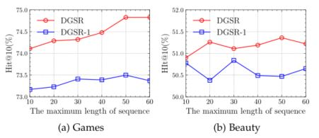
      - 将 dgsr 的 n 从10增加到50，可以持续地提高游戏数据的性能。当 n 设置为20和50时，dgsr 的表现更好
        - 盲目增加 n 并不一定会提高 dgsr 和 dgsr-1的性能。它很可能带来噪音，并导致性能衰减
      - 与 dgsr-1相比，dgsr 在 n 的每个特定值上都优于 dgsr-1，即使 n 设置为10，dgsr 仍优于 dgsr-1的最佳性能
        - 这意味着明确利用用户序列的高阶上下文信息可以缓解用户历史信息不足的问题，从而提高推荐性能
    
    - #### 嵌入大小的影响
    
      - 进一步分析了不同维度的嵌入对企业绩效的影响
      - 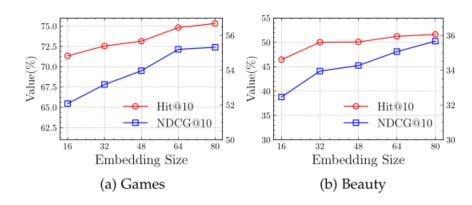
      - 随着维数的增加，模型的性能逐渐提高。随着维数的进一步增加，性能趋于稳定。这验证了我们模型在不同维度上的稳定性

## 总结

- 探讨了序列化推荐中不同用户序列间动态协同信息的建模问题
- 受动态图形神经网络的启发，我们提出了一种新的方法 dgsr
- 在 dgsr 中，所有用户序列都被转换成一个动态图，其中包含用户项交互的时间顺序和时间戳
- Dgsr 的关键是设计良好的动态图推荐网络，实现了不同用户序列之间动态协同信息的显式编码
- 最后将下一项预测任务转化为动态图的节点链路预测，从而对模型进行端到端的训练

