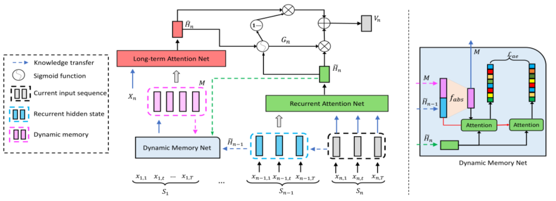

> 论文标题：Dynamic Memory based Attention Network for Sequential Recommendation
>
> 发表于：2021 AAAI
>
> 作者：Qiaoyu Tan , Jianwei Zhang , Ninghao Liu
>
> 代码：https://github.com/csjhl/DMAN
>
> 论文地址：https://arxiv.org/pdf/2102.09269v1.pdf

## 摘要

- 先前研究存在的问题：
  - 先前的工作主要集中在根据相对较新的行为提出建议，
  - 对整体顺序数据可能没有得到有效利用，但早期的交互可能会影响用户当前的选择。
  - 在为每个用户执行推理时扫描整个行为序列不合适，因为现实世界的系统需要很短的响应时间
- 文章提出了一种新颖的长序列推荐模型，称为基于动态记忆的注意力网络  (DMAN)。
  - 它将整体的长行为序列分割成一系列子序列，然后训练模型并维护一组记忆块以保持用户的长期兴趣。
  - 为了提高记忆保真度，DMAN  通过最小化辅助重建损失将每个用户的长期兴趣动态抽象到自己的记忆块中。
  - 基于动态记忆，可以明确地提取和组合用户的短期和长期兴趣，进行高效的联合推荐

## 结论

- 提出了一种新颖的基于动态记忆的注意力网络 DMAN，用于具有长行为序列的顺序推荐
- 将用户的整体行为序列截断为一系列子序列，并以动态方式训练我们的模型
- DMAN 可以基于循环连接机制和一组外部存储块显式提取用户的短期和长期兴趣
- 为了提高记忆保真度，推导出一个动态记忆网络，通过最小化局部重建损失来主动将用户的长期兴趣抽象到记忆中。

## 未来工作

## 介绍

- 许多研究采用协同过滤方法 通过假设相似合的用户倾向于对项目表现出相似的偏好来解决，忽略了用户行为的时间动态

- 为了捕捉用户建模的顺序动态，已经提出了各种顺序推荐方法来根据用户过去的行为进行推荐

  - 基本范式是使用基于行为序列的各种序列模块将用户的历史交互编码为一个向量，该序列是通过按时间顺序对她/他过去的行为进行排序获得的。

- 但随着不断积累用户记录，行为序列变得异常漫长。直接将它们应用于对长行为序列进行建模会导致显着的性能退化。

  - 因此，在本文中，我们的目标是探索具有超长用户行为序列的顺序推荐。

- 从长行为序列中学习存在三个主要挑战。 

  - 鉴于现实世界系统中的响应时间是有限的，在每个预测时间扫描整个行为序列变得昂贵
  - 对整个行为序列进行建模以获得更准确的推荐至关重要	

  - 很难明确控制长期或短期利益对用户建模的贡献

- 因此提出DMAN

  - 提供标准的自注意力网络来有效地捕获用户建模的长期依赖关系
  - 将整个用户行为序列截断为几个连续的子序列，并逐个序列地优化模型序列
    - 派生了一个循环注意网络，以利用相邻序列之间的相关性进行短期兴趣建模。
    - 同时，引入了另一个注意力网络来测量连续序列之外的依赖关系，用于基于动态记忆的长期兴趣建模，它保留了相邻序列之前的用户行为。
  - 通过神经门控网络自适应地整合这两个方面的兴趣，以进行联合推荐
  - 为了提高记忆保真度，我们进一步开发了一个动态记忆网络，以使用辅助重建损失逐个序列有效地更新记忆块

## 模型架构

- DMAN
  
  - 以一系列序列作为输入，并按序列训练模型。
  - 在处理第 n 个序列 Sn 时，通过使用先前的隐藏状态$H_{n-1}$  作为上下文，应用循环注意网络来提取短期用户兴趣。
    - 同时，利用长期注意力网络基于记忆块M提取长期兴趣。
  - 接下来，通过神经门控网络将短期和长期兴趣结合起来进行联合用户建模。
  - 最后，动态记忆网络通过融合$H_{n-1}$中的信息更新记忆块，模型继续处理下一个序列。
    - 通过最大化观察到的序列的似然性来优化整个模型，而动态记忆网络是基于局部重建损失  Lae 进行训练的。

## 实验

- ### 研究问题

- ### 数据集

  - MovieLens :收集用户对电影的评分。
  - JD.com:是从京东收集的电子商务产品的用户浏览日志集合。
  - Taobao  和 XLong (Ren et al. 2019) 是来自淘宝商业平台的用户行为数据集。 
    - XLong 中的行为序列明显长于其他三个数据集，难以建模。

- ### baseline

  - 传统的顺序方法
    - GRU4Rec
    - Caser
    - SASRec
  - 长序列方法
    - SDM
    - SHAN 
  - 短期和长期兴趣
    - HPMN

- ### 超参数设置

- ### 评估指标

  - Hit Rate@K
  - NDCG@K