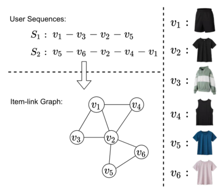
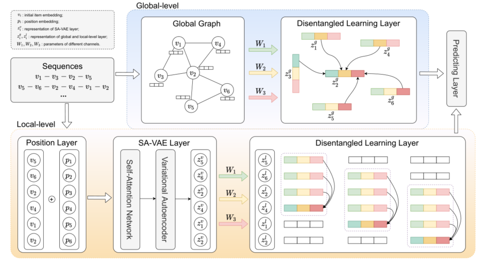

> 论文标题：Edge-Enhanced Global Disentangled Graph Neural Network for Sequential Recommendation
>
> 发表于： 2022  ICDE
>
> 作者：Yunyi Li, Pengpeng Zhao, Guanfeng Liu
>
> 代码：
>
> 论文地址：https://arxiv.org/pdf/2111.10539v2.pdf

## 摘要

- 现有的顺序推荐系统，例如循环网络和自我注意机制。未能发现和区分项目之间的各种关系，这可能是激发用户行为的潜在因素
- 本文中提出了一种边缘增强的全局解耦图神经网络 (EGD-GNN)  模型来捕获项目之间的关系信息，用于全局项目表示和局部用户意图学习。
  - 在全局层面，我们在所有序列上构建一个全局链接图来建模项目关系。然后设计了一个通道感知的解耦学习层，将边缘信息分解为不同的通道，这些通道可以聚合以表示来自其邻居的目标项目。
  - 在局部层面，我们应用变分自动编码器框架来学习当前序列的用户意图

## 结论

- 提出了一种基于图神经网络的边缘增强模型来学习全局和局部级别的序列表示。
  - 我们设计了一个分离的学习层，即通道感知机制，以区分激发用户意图的各种因素。
    - 该机制将信息传递模型划分为多个通道，并通过不同的通道聚合项目信息
      - 在全局层面，我们基于训练数据构建全局item-link图，并通过邻域更新item特征信息。
      - 在局部层面，我们应用变分自动编码器框架将用户行为推断做为分布，利用其在学习解耦表示方面的统计能力。
  - 然后采用滑动窗口策略以及通道感知机制来通过序列捕获用户意图的转换

## 未来工作

- 用户信息对于学习解耦表示也很重要，将在进一步的研究中考虑添加用户节点

## 介绍

- 先前的工作通过历史顺序交互来模拟用户意图，忽略项目背后的动态潜在关系。
  - 链接成对项目的边包含丰富的语义信息，包括用户为什么以及如何选择一个又一个项目的因素。
  - 这些潜在因素与现实世界的概念有关，并且某个因素通常在单一情况下起主导作用。
  - 示例
    - 链接图显示项目 2 与所有其他五个项目相邻。但这些优势直观地受到不同因素的推动。
      - 第 2 项与第 1 项和第 4 项的颜色相同，
      - 第2项与第 5 项和第 6  项袖子很短。
      - 第 3 项连接到第 2 项，因为它可以用作 T 恤夹克。
    - 这些不同的因素体现了用户行为的意图转换，也揭示了成对物品的共同特征
  - 识别和区分潜在的项目链接因素能够增强模型的表达能力，而解耦表示学习[12]是实现这一目标的常用方法
- 解耦表示学习的一般目的是将不同的信息因素与数据的变化分开，其中每个单元都与现实世界中的单个概念相关。
- 学习解耦表示可以增强模型的可解释性和可控性。学习解耦表示的最突出的网络是 β-V AE 和 InfoGAN。
  - 这些研究没有考虑项目链接关系模式，也未能区分序列背后的不同用户意图。造成顺序模型将对噪声数据敏感并且难以解释。
- 在本文中，我们提出了一种边缘增强的全局解耦图神经网络 (EGD-GNN) 模型来捕获项目链接信息
  - 在全局层面，我们在所有序列上构建了一个全局项目链接图，序列中的每个项目对都表示为图中的一条边
    - 应用通道感知机制将边缘分解为多个通道，其中每个通道对应一个影响因素。
    - 这些通道专门从邻居中提取特征之一，并将不同的因素联合到目标项目中。
  - 在本地层面，我们在当前序列上对解耦的用户意图表示进行建模。
    - 首先将潜在变化推断为高斯分布，以便从变分自动编码器的统计角度强制解开。
    - 然后使用通道感知机制，并通过边缘通道从序列中的前项目中聚合项目信息。聚合的项目表示用于表达当前的用户意图

## 模型架构

- 
  - 序列表示与从 全局解耦表示学习层 学习的全局表示 zg  和 从 SA-VAE 层和局部解耦学习层学习的局部表示 zl 相结合。

## 实验

- ### 研究问题

  - RQ1：我们提出的模型是否优于各种数据集上的最新作品？
  - RQ2：每个组件的影响是什么，即我们模型中的全局层和局部层？
  - RQ3：我们的模型如何实现潜在空间中的解耦表示学习？
  - RQ4：超参数设置对不同数据集有什么影响？

- ### 数据集

  - MovieLens-1M 
  - Amazon Beauty、Amazon Video Games

- ### 数据预处理

  - 将数据分为三部分：用于测试的最后一个交互项、用于验证的倒数第二个交互项以及用于训练的其余项。
  - 将长度为n的训练序列视为n-1个子序列，每个子序列的最后一个元素被视为训练的真实项。
  - 在验证和测试任务中，选择序列的最后一项作为真实项，随机抽样 100 个负项。

- ### baseline

  - POP：一种根据物品的受欢迎程度对物品进行排名的经典方法。
  - BPR：贝叶斯个性化排名[39]，一种基于矩阵分解的经典模型。
    - 它设计了一种成对优化方法来从隐式反馈中学习成对项目排名。
  - FPMC[7]：一种将矩阵分解和一阶马尔可夫链结合在一起的方法。
    - 它引入了基于马尔可夫链的个性化传递矩阵来捕获时间信息，并引入矩阵分解来解决传递矩阵的稀疏问题。
  - TransRec：基于翻译的推荐  [23]。它将项目嵌入到转换空间中，并将每个用户建模为转换向量，以获得“三阶”关系，
    - 即用户、先前访问的项目和下一个项目之间的交互。
  - Caser：卷积序列嵌入推荐  [24]。主要思想是用时间和潜在空间中序列的最新项形成一个“图像”，并应用卷积神经网络（CNN）来学习高阶序列模式作为图像的局部特征。
  - SASRec：基于自我注意的顺序推荐[10]。通过将自注意力机制应用到序列问题中，该模型不仅可以像 RNN 一样捕获长期信息，还可以处理像马尔科夫链一样的少量行为的短期模式。
  - DSS: Disentangled Self-Supervision  [19]，第一个专注于顺序推荐上的分离表示学习的模型。
    - 它设计了一个解缠结序列编码器来解开子序列上潜在空间中的用户意图，并提出了一种用于训练的 seq2seq  自监督策略。
  - VSAN：变分自注意力网络 [40]。它将self-Attention机制与变分推理相结合，用于序列推荐，对序列的长距离和短距离依赖关系进行建模。

- ### 超参数设置

- ### 评估指标

  - NDCG@K
  - Recall@K