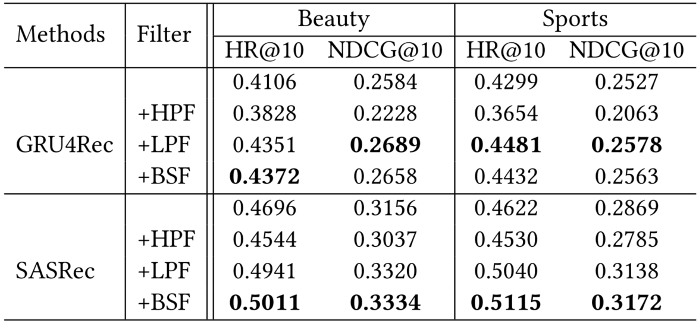
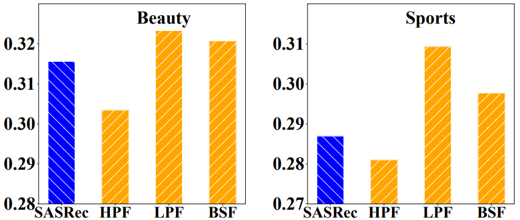
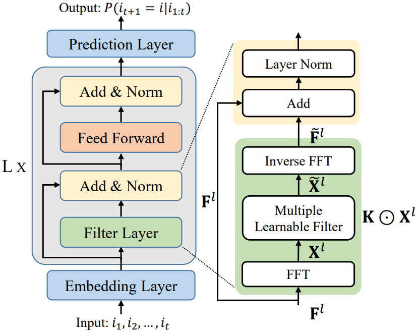
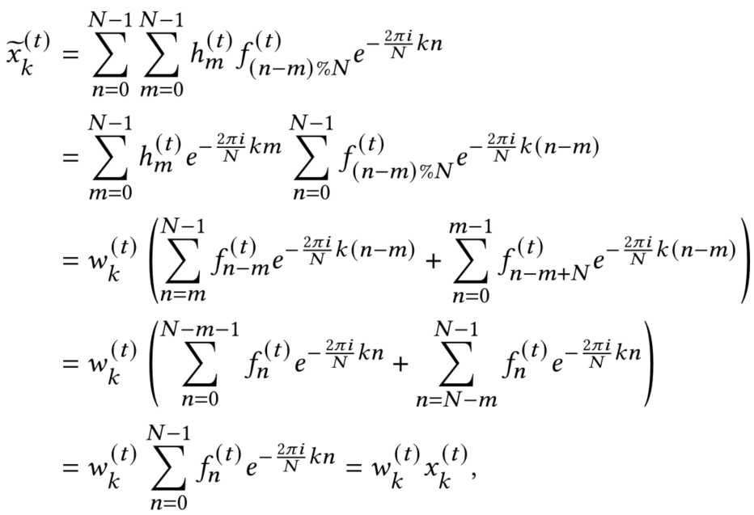
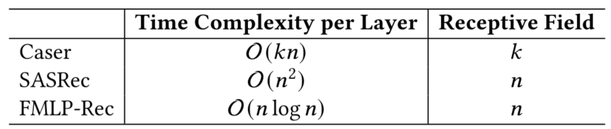
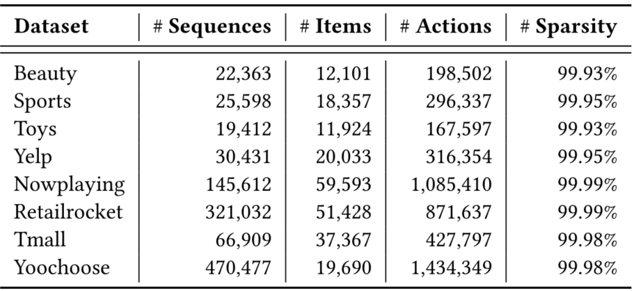
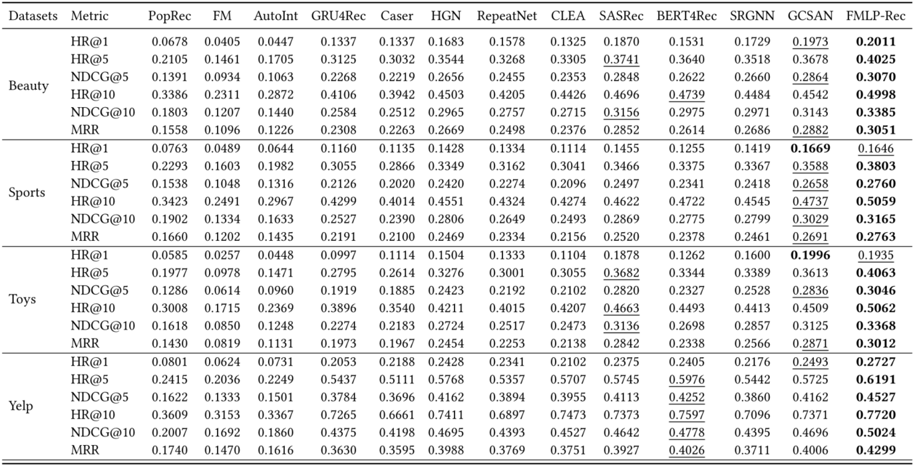
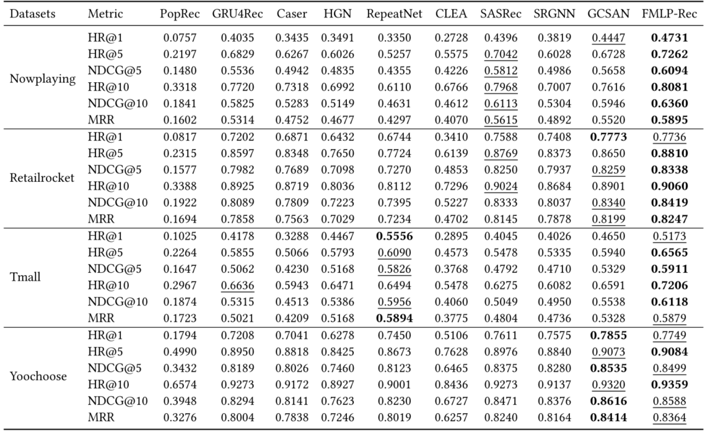
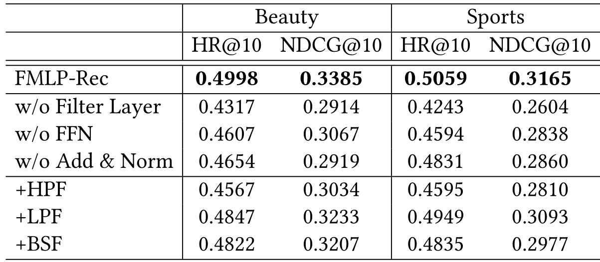
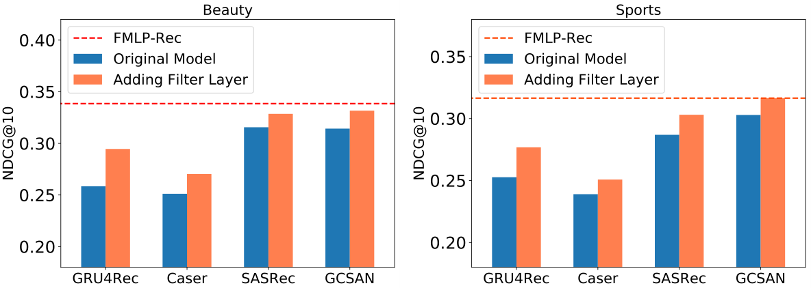

> 论文标题：Filter-enhanced MLP is All You Need forSequential Recommendation
>
> 发表于：2022 WWW
>
> 作者：Kun Zhou1, Hui Yu, Wayne Xin Zhao，Ji-Rong Wen
>
> 代码和数据：https://github.com/RUCAIBox/FMLP-Rec
>
> 论文地址：https://arxiv.org/pdf/2202.13556

## 摘要

- 在在线平台中，记录的用户行为数据不可避免地包含噪声，深度推荐模型很容易在这些记录的数据上过拟合。
- 为了解决这个问题，我们从信号处理中借鉴了滤波算法的思想，以衰减频域中的噪声。
- 将简单的过滤算法（例如，带阻滤波器）与全  MLP 架构相结合
- FMLP-Rec，一种具有可学习过滤器的全 MLP  模型，用于顺序推荐任务。
- 全 MLP  架构使我们的模型具有较低的时间复杂度，并且可学习的滤波器可以自适应地衰减频域中的噪声信息。
- 在八个真实世界数据集上进行的大量实验证明了我们提出的方法优于竞争性  RNN、CNN、GNN 和基于 Transformer  的方法。

## 结论

- 记录的用户行为数据通常包含噪声交互，数字信号处理领域的过滤算法有助于减轻深度序列推荐模型中噪声的影响
- 提出了 FMLP-Rec，这是一种用于顺序推荐任务的具有可学习过滤器的全 MLP 模型
- 全 MLP 架构使我们的模型具有较低的时间复杂度，并且可学习的滤波器可以通过 SGD（随机梯度下降） 进行优化，以自适应地衰减频域中的噪声信息
- 可学习滤波器相当于时域中的循环卷积，具有更大的感受野，可以更好地捕捉周期性特征

## 1.导言

- 用户的行为是动态的，并且会随着时间而变化。因此，捕捉用户行为的顺序特征以做出适当的推荐至关重要
- 记忆网络 [9, 20] 和自注意机制 [26, 27]来增强建模能力，以有效捕捉动态用户偏好
- 基于 Transformer 的方法 [22, 50, 70] 通过堆叠多头自注意力层在这项任务中显示出显着的性能
  - 堆叠的自注意力层涉及大量参数，这可能导致基于 Transformer 的方法的过度参数化架构 
- 这些方法主要根据记录的用户行为数据拟合模型参数，这些数据本质上是嘈杂的  甚至包含恶意伪造 
  - 当记录的序列数据包含噪声时，基于自我注意的推荐器的情况变得更加严重，因为它会关注所有用于序列建模的项目
- **提出了一种用于顺序推荐的新型过滤增强 MLP 方法，从 Transformers 中移除 self-attention 组件，FMLP-Rec 完全基于 MLP 结构来堆叠块，在每个堆叠块中加入了一个滤波器组件，我们执行快速傅立叶变换 (FFT) [45] 以将输入表示转换为频域，并且逆 FFT 过程恢复去噪表示**
- 为了实现过滤器组件，我们结合了可学习的过滤器来对频域中的输入项目序列进行编码，这可以在没有人类先验的情况下从原始数据中进行优化
- FMLP有效地衰减噪声信息并从所有频率中提取有意义的特征（例如，长期/短期项目交互）。
- 可学习滤波器相当于时域的循环卷积，在整个序列上具有更大的感受野，能够更好地捕捉用户行为的周期性特征
- 它需要更少的时间成本而不考虑成对的项目相关性

## 2.预先知识

- ### 问题陈述

  - 假设有一组用户和项目，分别用 U 和 I 表示，其中 u ∈ U 表示用户，i ∈ I 表示项目，用户和项目的数量表示为 |U|和|I|
  - 对于带有隐式反馈的顺序推荐
    - 用户 u 有一个上下文 c，一个按时间顺序排列的包含项目的交互序列：c = { $i_1,...,i_n$ }，
      - n 表示交互次数，$i_t$ 表示与用户 u 交互的第 t 个项目
    - 使用 $\large i_{j:k}$ 表示子序列， $\large i_{j:k}$ = { $i_j,...,i_k$ }, 1 ≤ j ＜ k ≤ n
  - 形式上，给定用户的上下文项目序列 c = { $i_1,...,i_n$ }，，顺序推荐的任务是预测用户可能在第 (𝑛 + 1)  次交互的下一个项目步骤，记为𝑝( $\large 𝑖_{𝑛+1} |𝑖_{1:𝑛}$ )。

- ### 傅里叶变换

  - #### 离散傅里叶变换（DFT）

    - 文中考虑一维 DFT。给定具有 𝑛 ∈ [0, 𝑁 − 1] 的数字序列 { $𝑥_𝑛$ }，1D DFT 通过以下方式将序列转换为频域：
      - $\large X_k = \sum_{n=0}^{N-1} x_n e^{-\frac {2πi}{N}}nk$  ，0 ≤ k ≤ N-1
        - 𝑖是虚数单位。对于每个𝑘，DFT 生成一个新的表示 $𝑋_𝑘$ ，作为所有原始输入标记 $𝑥_𝑛$ 与所谓的“旋转因子”的总和
        - $𝑋_𝑘$ 代表序列{ $𝑥_𝑛$ }在频率 $\large 𝜔_𝑘 =\frac {2πi}{N}$处的频谱
      - DFT 是一对一的转换。给定 DFT $𝑋_𝑘$ ，我们可以通过逆 DFT (IDFT) 恢复原始序列 {$𝑥_𝑛$}：
      - $\large x_n = \sum_{n=0}^{N-1} X_k e^{\frac {2πi}{N}}nk$

  - #### 快速傅里叶变换（FFT）

    - 标准的 FFT 算法是 Cooley–Tukey 算法，它递归地重新表示长度为 N 的序列的 DFT，并将时间复杂度降低到 O(N logN )
    - 逆 DFT  也可以使用快速傅里叶逆变换 (IFFT) 有效地计算
    - FFT 可以将输入信号转换到周期特征更容易捕捉的频域
    - 常用的方法是低通滤波器（LPF），它在经过 FFT 处理后衰减高频噪声信号。
    - 在本文中，我们考虑使用 FFT 和过滤算法来减少用户交互项目序列中噪声特征的影响

## 3.用于推荐的过滤算法的经验分析

- ### 设置

  - #### dataset：Amazon  Beauty and Sports

  - #### 顺序推荐算法：GRU4Rec  and SASRec

    - 遵循了深度序列模型的标准框架，由嵌入层、序列编码器层和预测层组成，在序列编码器层分别采用了RNN和Transformer 
    - 两个模型可能对用户行为序列中的噪声不具有鲁棒性
    - 因此，我们直接在两个模型的嵌入层和序列编码器层之间添加了一个非参数过滤层，且不改变其他组件。
    - 实验结果

  - #### 过滤算法

    - 在过滤层，给定项目序列的嵌入矩阵，我们对特征的每个维度进行以下操作：FFT→过滤算法→IFFT
    - 滤波后，我们将去噪的嵌入矩阵作为序列编码器层的输入
    - 过滤算法选择以下三种：
      - 高通滤波器 (HPF)：通过较高频率的信号并衰减较低频率的信号。在 FFT 之后，将低频信号一半的值设置为零
      - 低通滤波器 (LPF) ：通过较低频率的信号并衰减较高频率的信号。在 FFT 之后，将高频信号一半的值设置为零
      - 带阻滤波器 (BSF) ：衰减中频信号，并通过其他信号。在 FFT 之后，我们将中频信号一半的值设置为零

- ### 结果和发现

  - #### 对代表模型的影响

    - 添加低通滤波器 (LPF) 和带阻滤波器 (BSF) 会导致持续改进，尤其是在 SASRec 上。

    - 对于 GRU4Rec，LPF 的性能优于其他过滤算法，而对于  SASRec，BSF 的性能最好

    - 高通滤波器 (HPF) 在大多数情况下会导致性能下降

    - ##### 结论

      - 项目嵌入矩阵可能包含影响顺序推荐模型性能的噪声
      - 嵌入层上的适当过滤算法有助于缓解上述问题
      - 嵌入矩阵中的低频信息对于顺序推荐似乎更重要，自然界和人类行为中的低频信号通常是有意义的周期性特征

  - #### 对所有 MLP 模型的影响

    - **变体实验**：基于 SASRec 的架构，本文移除了基于 Transformer 的序列编码器层中的多头自注意力块，但在嵌入层之后添加了一个过滤器层。过滤器算法选择 HPF、LPF 和 BSF 算法，其他组件不变。变体模型仅依赖于 MLP 对项目序列进行建模
    - **实验结果**：
      - 在去除多头自注意力块之后，大多数模型变体仍然表现良好
      - 带有 LPF 的变体模型甚至大大优于 SASRec 模型
    - **结论**：适当的过滤算法可以激发简单的全 MLP 模型超越复杂的基于 Transformer 的模型的潜力，通过去除噪声信息和自注意力块，模型更加轻量级，从而降低了过拟合的风险

## 4.实验方法

全 MLP 架构（称为 FMLP-Rec），通过将 MLP 块与可学习的过滤器堆叠在一起来进行顺序推荐，该架构可以自动为各种顺序推荐场景学习适当的过滤器

- ### FMLP-Rec：具有可学习过滤器的全  MLP 顺序推荐器

  - 与 Transformer 架构类似， FMLP-Rec 也堆叠了多个神经块,但用一种新的过滤器结构替换了 Transformer 中的多头自注意力

  - 除了滤波器对噪声衰减的影响外，这种结构在数学上等同于循环卷积（在第 4.2 节中证明），它还可以捕获序列级偏好特征

  - 

    - #### 嵌入层 ( Embedding Layer )

      - 使用项目嵌入矩阵 $M_𝐼 ∈ R^{ |I |×𝑑}$，以将项目的高维 one-hot 表示投影到低维密集表示
      - 给定一个𝑛长度的项目序列，我们从 $M_𝐼$ 应用查找操作来形成输入嵌入矩阵$E ∈ R^{𝑛×𝑑}$
      - 结合了一个可学习的位置编码矩阵 $P ∈ R ^{𝑛×𝑑}$ 来增强项目序列的输入表示
      - 通过对两个嵌入矩阵求和来获得序列表示 $E_𝐼 ∈ R^{𝑛×𝑑}$
      - 由于项目和位置嵌入矩阵是随机初始化的，可能会影响过滤机制，导致训练过程不稳定
        - 执行 dropout 和层归一化操作来缓解这些问题
        - 因此，生成序列表示的方式为： $\large E_I = Dropout(LayerNorm(E+P))$
      - 过堆叠多个可学习的过滤器块来开发项目编码器

    - #### 可学习的过滤器增强块 ( Learnable Filter-enhanced Blocks: L x )：由两个子层组成,过滤器层 和 逐点前馈网络

      - ##### 过滤器层（filter layer）

        - 对频域中特征的每个维度进行过滤操作，然后进行跳跃连接和层归一化
        - 给定第 𝑙 层的输入项目表示矩阵 $F^𝑙∈R^{𝑛×𝑑}$（当𝑙 = 0 时，我们设置 $F^0 = E_𝐼$），我们首先沿项目维度执行 FFT 以将 $F^𝑙$ 转换为频域
          - $X^l = \mathcal{F} (F^l)∈C^{n×d}$
          - f(·) 表示一维 FFT，$X^l$ 是一个复杂张量，代表 $F^l$ 的谱，然后可以通过乘以一个可学习的滤波器 $W ∈ C^{n×d}$ 来调制频谱  ： $\widetilde X^l = W \odot X^l$
            - $\odot$ 是逐元素乘法
        - 滤波器 K 被称为可学习滤波器，因为它可以通过 SGD 优化以自适应地表示频域中的任意滤波器
        - 最后，我们采用逆 FFT 将调制频谱 $\widetilde X^l$ 变换回时域并更新序列表示
          - $\large \widetilde F^l \leftarrow f^{-1}(\widetilde X^l) ∈ R^{n×d}$
            - $\mathcal F^{-1}(·)$ 表示逆一维 FFT，它将复数张量转换为实数张量
        - 通过 FFT 和逆 FFT 的运算，可以有效地减少来自记录数据的噪声，因此我们可以获得更纯的 item embeddings
        - 继 SASRec 之后，我们还结合了跳跃连接 、层归一化和 dropout 操作，以缓解梯度消失和不稳定训练问题
          - $\large \widetilde F^l = LayerNorm( F^l + Dropout(\widetilde F^l))$

      - ##### 前馈层 ( Feed-forward layers )

        - 结合了 MLP 和 ReLU 激活函数来进一步捕捉非线性特征
          - $\large FFN( \widetilde F^l) = (ReLU(\widetilde F^l W_1 + b_1))W_2 + b_2$
            - $W_1, b_1, W_2, b_2$ 是可训练的参数。
        - 执行跳过连接和层归一化操作生成 l 层的输出
          - $\large \widetilde F^l = LayerNorm( F^l + Dropout(\widetilde F^l))$

    - #### 预测层 ( Prediction Layer )

      - 在 FMLP-Rec 的最后一层，我们根据用户历史的上下文在步骤 (t + 1) 中计算用户对项目 i 的偏好分数
        - $\large P(i_{t+1} = i|i_{1:t}) = e^T_iF^l_t$
          - $e_i$ 是项目嵌入矩阵 $M_I$ 中项目 i 的表示
          - $F^l_t$ 是L层科学系过滤器块在步骤 t 的输出，L 是可学习过滤器块的数量
      - 用pairwise rank loss来优化模型参数：
        - $\large L = - \sum_{u∈U} \sum^n_{t=1} log \sigma(P(i_{t+1}|i_{1:t})-P(i^-_{t+1}|i_{1:t})) $
          - 我们将每个真实项目 $i_{t+1}$ 与一个随机采样的否定项 $i^-_{t-1}$ 配对

- ### 过滤层的理论分析

  - 除了噪声衰减之外，我们现在展示了所提出的滤波器块还可以从记录的数据中捕获顺序特征
  - 在 FMLP-Rec 的滤波器层中，输入信息首先通过 FFT 转换为频域中的频谱表示，然后进一步乘以可学习滤波器 W
    - W 的可看作是一组可学习的频率滤波器 {$w^{(1)} , · · · , w^{(𝑑)} $} 用于项目嵌入矩阵中的不同隐藏维度， 𝑑  表示隐藏大小
  - 据卷积定理[38, 45]，频域中的乘法相当于时域中的循环卷积。它是具有相同周期的两个周期函数之间的周期卷积的一种特殊情况
  - 对于第 𝑡 维特征 {$\large f^{(𝑡)}_ 𝑛$}$\large ^{𝑁 −1}_{𝑛=0}$来自项目表示矩阵 F 𝑙 和一个过滤器{$\large f^{(𝑡)}_ 𝑛$}$\large ^{𝑁 −1}_{𝑛=0}  = \mathcal F ^{-1} (𝑤^{ ( 𝑡)} )$，
  - 它们的循环卷积定义为 {$\large y^{(𝑡)}_ 𝑛$}$\large ^{𝑁 −1}_{𝑛=0}$ ，其中  $\large y^{(𝑡)}_ 𝑛 = \sum^{N-1}_{m=0}h^{(t)}_m·f^{(t)}_{(n-m)mod N}$
    - mod 表示整数模运算，n 是序列长度,
  -  考虑序列 {$\large y^{(𝑡)}_ 𝑛$}$\large ^{𝑁 −1}_{𝑛=0}$ 的DFT是  {$\large \widetilde x^{(𝑡)}_ 𝑛$}$\large ^{𝑁 −1}_{𝑛=0}$,有以下推导：
    - $\large x^{(𝑡)}_k$ 恰好是频域中 X 的第 𝑡 维特征的第 𝑘 个数
    - $\large 𝑤^{(𝑡)}_𝑘$ 是来自第 𝑡 滤波器的第 𝑘 权重 $\large w^{(t)}$
    - $\large f^{(t)} * h^{(t)} = \mathcal F^{-1}(w^{(t)} \odot x^{(t)})$
      - “∗”和“⊙”分别表示循环卷积和逐元素乘法
      - 来自项目表示 $X^𝑙$ 的第 𝑡 维特征与等式中 W 的第 𝑡 过滤器 $w^{(𝑡)}$ 相乘  等效于使用卷积核 {$\large h^{(𝑡)}_ 𝑛$}$\large ^{𝑁 −1}_{𝑛=0}$  对 $F^𝑙$ 的第 𝑡 特征进行循环卷积操作
        - 等式： $\widetilde X^l = W \odot X^l$
  - 滤波器块也能够捕获序列特征，因为它本质上具有与循环卷积相同的效果
  - 与传统线性卷积相比，循环卷积在整个序列上具有更大的感受野，并且能够更好地捕捉周期性模式
    - 这种优点对于推荐任务特别有吸引力，因为用户的行为往往表现出一定的周期性趋势

- ### 讨论

  - #### 与基于 Transformer 的顺序推荐器的比较

    - 堆叠多头自注意力块来学习顺序表示，依赖于沉重的自注意力结构来学习项目与项目的相关性
    - FMLP-Rec 直接移除了所有的自注意力结构，整个方法完全基于基于 MLP 的结构，通过集成额外的过滤器层
      - 可学习的滤波器层等效于使用与特征图大小相同的卷积核进行的循环卷积操作
      - 可以拥有与自注意力机制相同的感受野，但大大减少了涉及的参数数量
      - 循环卷积能够捕捉周期性特征

  - #### 时间复杂度和感受野分析

    - 选择基于 CNN 的 Caser [53] 和基于 Transformer 的 SASRec [22] 作为比较
      - 只考虑序列长度 n 的更一般的比较，以下是模型复杂度和感受野的比较结果
        - Caser在时域进行卷积运算，所以它的时间复杂度和感受野分别为O(k·n)和k
        - Caser 依赖于卷积核来捕获序列模式特征，因此通常需要更大的核大小来扩展感受野以获得更好的性能
        - 基于 Transformer 的模型中，自注意力层需要计算每对项目的相似度。它的时间复杂度和感受野分别为 O ($n^2$) 和 n
        - FMLP-Rec 包括时间成本为 O (n log n)  的 FFT 和 IFFT 操作，以及时间成本为 O (n)  的逐点前馈网络，这意味着总时间复杂度为 O (n log n)。
        - 由于FMLP过滤层相当于整个序列的循环卷积，它的感受野与 Transformer 相同

## 实验

- ### 实验设置

  - #### 数据集

    - Beauty, Sports, and Toys：亚马逊评论数据集。选择了三个子类别：美容、运动和户外  以及  玩具和游戏
    - Yelp ：一个业务推荐的数据集。由于非常大，我们只使用 2019 年 1 月 1 日之后的交易记录
    - Nowplaying ：包含从 Twitter 收集的音乐收听事件，其中用户发布了当前正在收听的曲目
    - RetailRocket： 是从一个个性化的电子商务网站收集的
    - Tmall：来自IJCAI-15竞赛，包含用户在天猫网上购物平台的购物日志
    - Yoochoose： 包含来自零售商的会话集合，其中每个会话都封装了点击事件
    - Beauty、Sports、Toys 和 Yelp 中的 item 序列是用户交易记录，而 Nowplaying、RetailRocket、Tmall 和  Yoochoose 中的 item 序列是点击会话
    - 对于所有数据集，按用户或会话对交互记录进行分组，并按时间戳升序对它们进行排序。我们过滤不受欢迎的项目和交互记录少于 5  条的非活跃用户

  - #### 评估指标

    - top-𝑘命中率（Hit Ratio：HR@𝑘）：分母是所有的测试集合，分子式每个用户top-K推荐列表中属于测试集合的个数的总和
    - top-𝑘归一化折扣累积增益（Normalized Discounted Cumulative Gain：NDCG@𝑘）：考虑排序顺序的因素，使得排名靠前的item增益更高，对排名靠后的item进行折损
    - 平均倒数秩（Mean Reciprocal Rank：MRR）：平均排名的倒数
    - 实验报告
      - HR@1 等于 NDCG@1，报告了 HR@{1, 5, 10}、NGCG@{5, 10} 和 MRR 的结果
      - 将 ground-truth 项目与 99 个用户未交互的随机抽样负项目配对

  - #### Baseline模型

    - PopRec 根据交互次数衡量的流行度对项目进行排名
    - FM [41] 使用分解模型表征变量之间的成对相互作用
    - AutoInt [46] 利用多头自注意神经网络来学习特征交互
    - GRU4Rec [17] 将 GRU 应用于建模项目序列
    - Caser [53] 是一种基于 CNN 的方法，应用水平和垂直卷积进行顺序推荐
    - HGN [33] 采用分层门控网络来捕捉长期和短期的用户兴趣
    - RepeatNet[40]在RNN架构上增加了一种复制机制，可以从用户的历史中选择项目
    - CLEA [37] 是最近提出的，通过对比学习模型进行项目级去噪
    - SASRec[22]是一种基于Transformer的单向顺序推荐模型
    - BERT4Rec [50] 使用完形填空目标损失进行双向 Transformer 的顺序推荐
    - SRGNN [59] 将会话序列建模为图结构数据并使用注意力网络
    - GCSAN [60] 利用图神经网络和自我注意机制进行基于会话的推荐

- ### 实验结果

- #### 包含用户交易记录的数据集上的结果

  - 非顺序推荐方法： PopRec 、FM 和 AutoInt，性能比顺序推荐方法差，因此顺序模式在此任务中很重要
  - 顺序推荐方法：基于 Transformer 的架构的SASRec 和 BERT4Rec  表现大多好于 基于RNN的 GRU4Rec 和 RepeatNet ，基于CNN的Caser 和 基于门的模型 HGN。
    - 基于 Transformer 的模型具有更多的参数，对应于更强的捕获序列特征的能力

  - CLEA 在部分数据集上实现了与 SASRec 和 BERT4Rec 相当的性能
    - CLEA 采用了项目级去噪策略，这表明减轻噪声的影响有助于提高推荐性能

  - 基于 GNN 的模型（即 SRGNN 和 GCSAN）也实现了与基于 Transformer 的模型相当的性能
    - 这表明 GNN  也有望捕获有用的特征以进行准确度推荐

  - FMLP-Rec 在大多数数据集上的表现始终优于它们
    - 采用带有可学习过滤器的全 MLP 架构来编码项目序列
    - 可学习的过滤器可以减轻噪声信息的影响，相当于循环卷积，可以捕捉到具有较大感受野的物品序列中的周期性特征
    - 全 MLP 架构大大减小了模型规模，从而降低了时间复杂度
    - 全 MLP 架构对于顺序推荐是有效的

- #### 基于会话的数据集上的结果

## 进一步分析

- ### 消融实验

  - 在数据集 Beauty and Sports上，对 过滤层、前馈网络和 Add & Norm 操作 进行消融
  - 为了验证可学习滤波器是否比经典滤波算法更有用，我们还通过用高通、低通和带阻滤波器替换可学习滤波器来进行变异研究
    - FMLP-Rec 使用经典过滤算法优于所有其他变体，因为其可学习滤波器可以通过 SGD 自适应地学习过滤噪声信息，这有望更好地适应数据分布

- ### 将可学习过滤器应用于其他模型

  - FMLP-Rec 的主要贡献是可学习的过滤器
  - 在嵌入层和序列编码器层之间添加可学习的过滤器，并选择基于 RNN 的 GRU4Rec [17]、基于 CNN 的 Caser [53]、基于  Transformer 的 SASRec [22] 和基于 GNN GCSAN [60] 作为基础模型。
  - 实验结果
    - 可学习过滤器通常可用于减少噪声信息对其他模型的影响
    - FMLP-Rec只采用了 MLP 层，参数较少，更适合顺序推荐任务中的可学习过滤器

## 相关工作

- ### 顺序推荐

  - 基于马尔可夫链假设，并专注于建模项目-项目转换关系，以在给定用户最后一次交互的情况下预测下一个项目。
  - 一系列工作遵循这条路线并将其扩展到高阶  MC [18, 22, 53]。
  - 随着神经网络的发展，Hidasi 等人。 [17] 引入 GRU  来捕获序列模式，并且大量工作利用其他神经网络架构进行序列推荐，例如 CNN [53]、GNN [52, 60] 和 Transformer [22,  50]。
  - 基于这些神经网络架构，各种研究通过添加记忆网络 [20]、分层结构 [25]、数据增强 [58、66] 和预训练技术 [5, 6,  70]等。
  - 这些模型很容易受到来自用户历史行为的噪声信息的影响。为了解决这个问题，我们采用可学习的滤波器来减少噪声信号的影响，并设计了一种轻量级的全  MLP 架构来缓解过拟合

- ### All-MLP Models

  - 多层感知器（MLP）[61]  是一种经典的前馈神经网络，由全连接神经元和非线性激活函数组成。
  - 它被广泛用作辅助模块，与 CNN [4]、RNN [36] 和 selfattention  network [57] 相结合以构建深度模型。
  - 最近，一些研究质疑 CNN [54] 和自注意力网络 [28, 29] 的必要性，并提出使用 MLP  来替代上述架构。
  - 这些全 MLP 模型主要旨在设计有效的基于 MLP 的混合架构来捕获输入信息的交互，例如混合器层 [54]、轴向移位块 [29] 和空间移位块  [30]，并且在各种任务，例如图像分类[54]和语义分割[29]。
  - 最近，GFNet [39] 采用带有全局滤波器层的 2D  傅里叶变换来学习频域中的长期空间依赖关系，这与基于 Transformer 的模型相比具有竞争力的性能。
  - 但是全 MLP  模型很难捕捉顺序特征，因此设计了一个全 MLP  模型，其中包括滤波器层以在频域中对序列进行编码。

