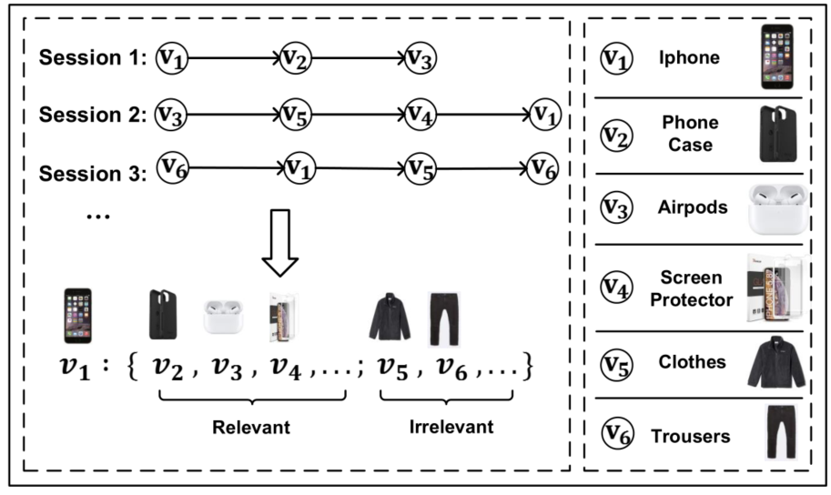
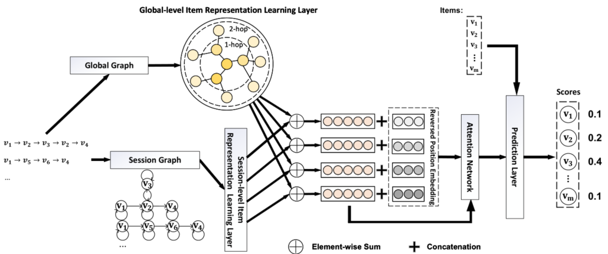

> 论文标题：Global Context Enhanced Graph Neural Networks for Session-based Recommendation
>
> 发表于：2020 SIGIR
>
> 作者：Ziyang Wang, Wei Wei, G. Cong, Xiaoli Li,
>
> 代码：https://github.com/CCIIPLab/GCE-GNN
>
> 论文地址：https://arxiv.org/pdf/2106.05081.pdf

## 摘要

- 现有会话推荐模型的用户偏好解决都仅基于当前会话而不利用其他会话，这些会话可能包含与当前会话相关和不相关的项目转换
- 本文提出了一种新方法，全局上下文增强图神经网络 (GCE-GNN)
  - GCE-GNN 分别从会话图和全局图学习两个级别的项目嵌入：
    - (i）会话图，即通过对当前会话中的成对项目转换进行建模来学习会话级项目嵌入；
    - (ii)  全局图，通过对所有会话的成对项转换建模来学习全局级项嵌入
  - 提出了一种新颖的全局级项目表示学习层，它采用会话感知注意机制递归地合并全局图上每个节点的邻居嵌入。
  - 设计了一个会话级项目表示学习层，它在会话图上使用 GNN  来学习当前会话中的会话级项目嵌入
  - 使用软注意力机制聚合两个级别的学习项目表示
    - 位置感知注意力，将反向位置信息合并到项目嵌入中

## 结论

- 提出了一种基于图神经网络的基于会话的推荐的新颖架构:GCE-GNN
  - 首先将会话序列转换为会话图并构建一个全局图。
  - 随后结合局部上下文信息和全局上下文信息以增强项目的特征表示
  - 最后，它结合了反向位置向量和会话信息，以使所提出的模型能够更好地学习每个项目的贡献

## 未来工作

## 介绍

- 基于会话的推荐(SBR)根据给定的匿名行为序列按时间顺序预测下一个感兴趣的项目

- 早期研究分为两类，即基于相似性的[11]和基于链的[12]

  - 前者严重依赖当前会话中项目的共现信息，而忽略了顺序行为模式。
  - 后者推断所有项目的所有可能的用户选择序列，这可能会遇到项目数量很大的实际应用程序的棘手计算问题

- 最近的基于深度学习的方法利用成对的项目转换信息来模拟给定会话的用户偏好，但仍面临以下问题：

  - 首先，一些研究通过使用 RNN或记忆网络 按时间顺序依次提取会话的成对项目转换信息来推断匿名用户的偏好
    - 会话可能包含多个用户选择甚至噪声，因此它们可能不足以生成所有正确的依赖关系，
      - 这会受到无法对嵌入中项目转换模式的复杂固有顺序进行建模的影响
  - 其次，其他的基于图神经网络 [7, 24, 25]，具有自注意力机制
    - 通过基于会话在每个项目和最后一个项目之间的成对项目转换计算相对重要性来学习整个会话的表示
    - 性能在很大程度上依赖于最后一个项目与当前会话的用户偏好的相关性
  - 此外，现有研究几乎都仅基于当前会话对用户偏好进行建模，而忽略了其他会话中有用的项目转换模式。

  

## 模型架构

- 全局级项目转换建模
  
- 会话图和全局图的构建
  
- GEC-GNN
  
  - 首先，基于所有训练会话序列构建全局图。
  - 然后对于每个会话，将使用全局特征编码器和局部特征编码器来提取具有全局上下文和局部上下文的节点特征。
  - 然后模型结合位置信息来学习每个项目对下一个预测项目的贡献。
  - 最后，对候选项目进行评分。

## 实验

- ### 研究问题

  - RQ1：GCE-GNN  在现实世界的数据集中是否优于最先进的 SBR 基线？ 
  - RQ2：全局图和全局级编码器是否提高了 GCE-GNN 的性能？ GCE-GNN  在不同的感受野深度下表现如何？
  - RQ3：反向位置嵌入有用吗？
  - RQ4：GCE-GNN 在不同聚合操作下的表现如何？
  - RQ5：不同的超参数设置（例如节点丢失）如何影响 GCE-GNN  的准确性？

- ### 数据集

  - Diginetica :来自 CIKM Cup 2016，由典型的交易数据组成
  - Tmall :来自 IJCAI-15 比赛，其中包含匿名用户在天猫在线购物平台上的购物日志
  - Nowplaying：来自[26]，它描述了用户的音乐收听行为

- ### 数据预处理

  - 在所有三个数据集中过滤了长度为 1 的会话和出现少于 5 次的项目。
  - 将上周的会话（最新数据）设置为测试数据，剩余的历史数据用于训练
  - 对于会话 푆 = [s1, s2, ..., sn]，我们通过序列拆分预处理生成序列和相应的标签，即 ([s1] , s2), ([s1, s2] , s3),  ..., ([s1, s2, ..., sn−1] , sn) 用于所有三个数据集的训练和测试

- ### baseline

  - POP：推荐训练集的top-푁频繁项。 
  - Item-KNN[11]：根据当前会话的项目与其他会话的项目之间的相似性推荐项目。  
  - FPMC[10]：它结合了矩阵分解和一阶马尔可夫链，用于捕捉序列效应和用户偏好。通过遵循之前的工作，在计算推荐分数时也忽略了用户潜在表示。 
  - GRU4Rec  [2]：它是基于 RNN 的模型，使用门控循环单元 (GRU) 对用户序列进行建模。
  - NARM [6]：它通过将注意力整合到 SBR 的 RNN 中，对 GRU4Rec[2] 进行了改进。 
  - STAMP9  [8]：它完全依靠当前会话中最后一个项目的自注意力来捕获用户的短期兴趣，从而使用注意力层来替换之前工作中的所有 RNN 编码器。 
  - SR-GNN [24]：它采用门控 GNN 层来获得项目嵌入，然后像 STAMP[8] 那样对最后一个项目进行自我注意，以计算基于会话的推荐的会话级嵌入。 
  - CSRM  [19]：它利用记忆网络来调查最新的m个会话，以更好地预测当前会话的意图。 
  - FGNN  [9]：最近提出了通过设计加权注意力图层来学习项目嵌入，并且下一个项目推荐的会话由图级特征提取器学习

- ### 超参数设置

- ### 评估指标

  - Precision@K
  - MRR@K