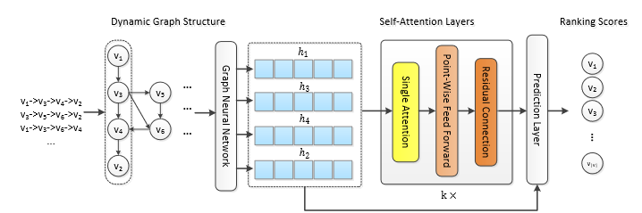

> 论文标题：Graph Contextualized Self-Attention Network for Session-based Recommendation
>
> 发表于：2019 IJCAI
>
> 作者：Chengfeng Xu, Pengpeng Zhao, Yanchi Liu
>
> 代码：https://github.com/johnny12150/GC-SAN
>
> 论文地址：https://www.ijcai.org/proceedings/2019/0547.pdf

## 摘要

- 自注意力网络 (SAN) 在各种序列建模任务中取得了显着的成功，而无需使用循环网络或卷积网络
- SAN 缺乏存在于相邻项目上的本地依赖关系，并限制了其学习序列中项目的上下文表示的能力
- 提出了一种图上下文自注意力模型（GC-SAN），它利用图神经网络和自注意力机制来进行基于会话的推荐
- 在 GC-SAN 中，我们为会话序列动态构建图结构，并通过图神经网络 (GNN)  捕获丰富的局部依赖关系。
- 然后每个会话通过应用自我注意机制来学习远程依赖。最后，每个会话都表示为全局偏好和该会话当前兴趣的线性组合

## 结论

- 提出了一种基于图神经网络的图上下文自注意力网络（GC-SAN）
- 首先从匿名会话记录构建有向图，
- 然后应用图神经网络为所有项目生成新的潜在向量，其中包含序列的局部上下文信息。
- 接下来，我们使用自注意力网络来捕获远处位置之间的全局依赖关系。
- 最后，我们结合了局部短期动态（即最后点击的项目）和全局自参与依赖关系，以线性方式表示会话序列

## 未来工作

## 介绍

## 模型架构

## 

- 我们首先构建所有会话序列的有向图。用图神经网络来获取会话图中涉及的所有节点向量。
- 之后，我们使用多层自注意力网络来捕获会话中项目之间的长期依赖关系。
- 在预测层，我们将每个会话表示为全局偏好和该会话当前兴趣的线性关系。
- 最后，我们计算每个推荐候选项目的排名分数。

## 实验

- ### 数据集

  - Diginetica：来自 CIKM Cup 2016，本研究仅使用交易数据。
  - Retailrocket： 数据集由一家个性化电子商务公司发布，其中包含六个月的用户浏览活动。

- ### 数据预处理

  - 为了过滤噪声数据，我们过滤掉出现少于 5 次的项目，然后删除两个数据集上少于 2  个项目的所有会话。
  - 我们将上周的会话数据设置为测试数据，其余用于训练

- ### baseline

  - Pop：它根据训练数据中的流行度推荐排名靠前的项目。
  - BPR-MF ：非序列推荐方法，它使用成对排序损失优化矩阵分解。
  - IKNN：传统的item-to-item 模型，它根据余弦相似度推荐与会话中的候选item 相似的item
  - FPMC ：混合模型，结合了矩阵分解和一阶马尔可夫链，用于下一篮子推荐。在我们的推荐问题中，每个篮子都是一个会话。
  - GRU4Rec ：RNN 的深度学习模型，用于会话推荐。它利用会话并行的小批量训练过程来模拟用户动作序列。
  - STAMP：一种新颖的短期记忆优先级模型，用于从之前的点击中捕获用户的长期偏好以及会话中最后点击的当前兴趣。
  - SR-GNN：具有图神经网络的基于会话的推荐模型，利用GNN生成项目的潜在载体，然后通过传统的注意网络代表每个会话。

- ### 超参数设置

- ### 评估指标

  - Hit Rate (HR@N), 
  - Mean Reciprocal Rank (MRR@N) 
  - Normalized Discounted Cumulative Gain (NDCG@N).