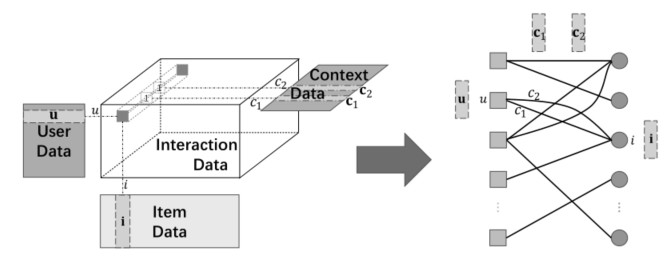
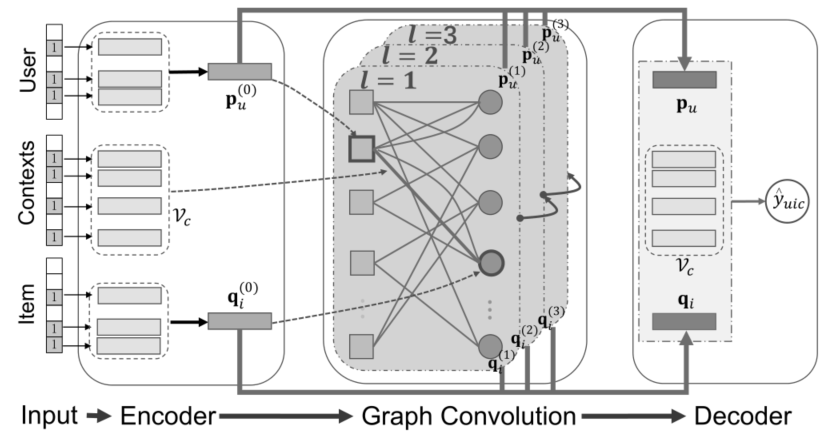

> 论文标题：Graph Convolution Machine for Context-aware Recommender System
>
> 发表于：202Frontiers of Computer Science
>
> 作者：Jiancan Wu,Xiangnan He, Xiang Wang
>
> 代码：https://github.com/wujcan/GCM
>
> 论文地址：https://arxiv.org/pdf/2001.11402v3.pdf

## 摘要

- 可以通过在用户-项目交互图上执行图卷积来学习更好的用户和项目表示
  - 目前主要限于协同过滤（CF）场景，其中交互上下文不可用
- 这项工作中，将图卷积的优势扩展到上下文感知推荐系统（CARS，它代表可以处理各种辅助信息的通用类型的模型）。
  - 提出了图卷积机  (GCM)，一个端到端框架，由三个组件组成：编码器、图卷积 (GC) 层和解码器。
    - 编码器将用户、项目和上下文投影到嵌入向量中，这些向量被传递到 GC  层，
    - 这些层通过用户-项目图上的上下文感知图卷积来细化用户和项目嵌入。
    - 解码器通过考虑用户、项目和上下文嵌入之间的交互来消化细化的嵌入以输出预测分数。

## 结论

- 工作强调了在 CARS 中利用多重交互的重要性
  - 首先将用户、项目和上下文的特征转换为属性图，其中上下文作为用户和项目节点之间的边
  - 开发了 GCM，通过图神经网络捕获多个用户行为之间的交互，然后通过因子分解机对个体行为特征之间的交互进行建模
    - 用图表中的上下文信息组织用户行为是构建有效的上下文感知推荐器的有希望。它有助于为用户和项目建立强大的表示。
    - GCM 只是简单地将所有上下文特征统一为一条边，忽略了某些上下文的动态特征（例如时间），
      - 几乎无法捕捉用户的动态偏好 

## 未来工作

- 构建基于上下文信息的动态图，而不是一个静态图，并设计一个动态图神经网络。
- 丰富的辅助信息有助于解释用户行为背后的不同意图，计划在用户意图的粒度级别上对用户-项目关系进行建模，以生成分离的表示 [47]。

## 介绍

- CF 提供了一个通用的推荐解决方案，但它在利用交互上下文的辅助信息方面存在不足
- 当前环境可能会对用户选择产生重大影响，最近会话中的点击行为为用户下次购买提供了强烈的信号
  - 开发上下文感知推荐系统 (CARS)可以有效地将上下文（以及可能的其他辅助信息，如用户配置文件和项目属性）集成到用户偏好预测中 。
- 现有的CARS模型一个共同的缺点：它们遵循标准的监督学习方案，忽略了数据实例之间的关系。
  - 这可能会限制模型在捕获 CF  效应方面的有效性，因为它需要同时考虑多个交互来识别 CF 模式。
- 由于在 CARS 中，用户-项目交互仍然通过反映用户偏好发挥重要作用，
  - 因此对交互之间的关系进行适当建模可以提高模型质量
- 最近基于神经网络的方法，如 xDeepFM [16] 和 Convolutional FM  [17]，在线服务效率低下，
  - 因为每个候选项目需要使用对复杂特征交互进行建模的深度模型架构单独评分，这可能非常耗时-消耗。
- 提出新的 CARS 模型。
  - 首先，我们将 CARS 中的数据转换为属性化的用户项目图，其中用户和项目的边信息表示为节点特征，上下文表示为边缘特征
    
    - 用于构建 CARS 的数据。
    - 交互张量和用户/项目/上下文特征矩阵的混合数据在不损失保真度的情况下转换为属性化的用户-项目二分图。
  - 其次，我们提出了一个端到端模型，它由三个组件组成：编码器、图卷积 (GC) 层和解码器
    - 编码器将用户、项目和上下文投射到嵌入向量中
    - GC 层利用交互作用通过执行图卷积来细化嵌入
    - 最后，解码器通过 FM 对嵌入之间的交互进行建模以输出预测分数。
    - 训练模型后，可以在服务之前预先计算 GC 层的细化嵌入

## 模型架构

- GCM
  

## 实验

- ### 研究问题

  - RQ1：与最先进的模型相比，GCM 在 top-k推荐相关方面的表现如何？ 
  - RQ2：不同的设置（例如，层的深度、上下文特征的建模、解码器的设计）如何影响  GCM？
  - RQ3：表示学习如何从用户、项目和上下文之间的多重交互中受益，以解决项目冷启动问题？

- ### 数据集

  - Yelp
  - Amazon-book

- ### baseline

  - MF  [42]：这仅利用用户-项目交互来学习用户和项目嵌入，同时放弃上下文特征。
  - LightGCN [43]：这种模型是最先进的基于 GNN 的 CF  推荐器，它将用户项交互图中的高阶连接性结合到嵌入中，同时忽略上下文特征。 
  - FM  [11]：通过将所有信息转换为特征向量，然后对二阶特征交互进行建模以预测用户偏好，从而考虑到与交互相关的所有信息。 
  - NFM [14]：该模型利用 MLP  来捕获用户、项目和上下文特征之间的非线性和高阶交互。
  - xDeepFM [16]：这是一个最近的神经FM 模型，它结合了显式和隐式高阶特征交互。
  - GIN  [32]：这是一个基于图的模型，通过在商品相似度图上应用隐式意图传播和注意机制来挖掘用户意图。

- ### 超参数设置

- ### 评估指标

  - HR@K
  - NDCG@K