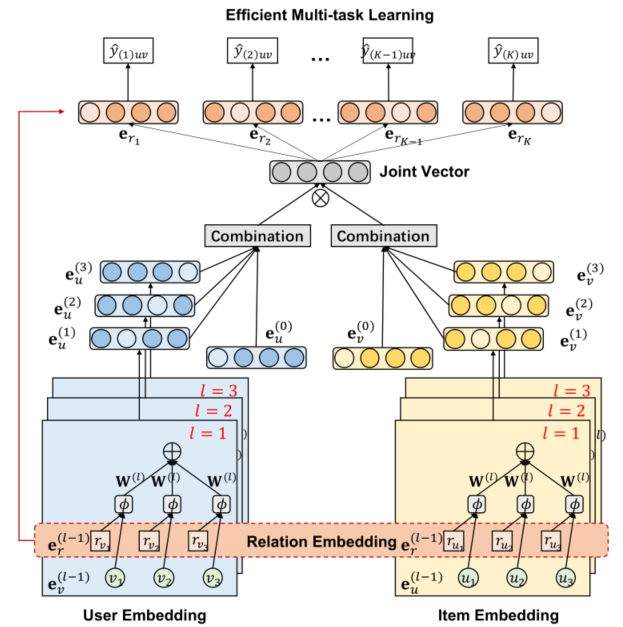
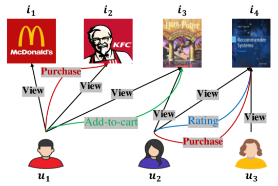

> 论文标题：Graph Heterogeneous Multi-Relational Recommendation
>
> 发表于：2021 AAAI
>
> 作者：Chong Chen , Weizhi Ma , Min Zhang
>
> 代码：https://github.com/chenchongthu/GHCF
>
> 论文地址：https://www.aaai.org/AAAI21Papers/AAAI-615.ChenC.pdf

## 摘要

- 传统的推荐系统研究通常只利用一种类型的用户行为
  - 但是异构的多关系数据提供了结构良好的信息，可以用于高质量的推荐
- 早期工作利用这些异构数据未能捕捉到用户-项目交互的高跳结构，这些结构无法充分利用它们
- 本文工作提出 异构图协同过滤（GHCF），
  - 为了探索高跳异构用户-项目交互，改进图卷积网络 (GCN)  联合嵌入节点（用户和项目）的表示和关系以进行多关系预测
  - 为了充分利用整个异构数据，我们在多任务学习框架下执行先进的高效非采样优化

## 结论

- 提出了一种新颖的端到端模型 GHCF，它通过在用户-项目集成图中对高阶异构连接进行建模来实现目标。
  - 改进GCN  ，嵌入传播层利用组合算子联合嵌入节点（用户和项目）的表示和关系以进行多关系预测。
  - 采用高效的非采样学习模块来实现更有效和稳定的模型优化

## 未来工作

- 在其他相关任务中探索 GHCF 模型，例如网络嵌入和多标签分类。

## 介绍

- 异构行为提供了有价值的用户偏好信号，有助于构建细粒度的推荐系统
- 现有的多关系推荐方法，有一个共同的缺点：
  - 这些方法遵循典型的协同过滤（CF）学习方案，缺乏对用户-项目异构交互的高跳图结构的显式编码。
- 文章提出了一种名为图异构协同过滤（GHCF）的新模型，将辅助用户行为整合到推荐中，考虑了异构反馈数据之间的高跳连接性
  - GHCF 中的 GCN 传播层被进一步增强，以联合嵌入节点（用户和项目）的表示和用于多关系预测的关系
  - 模型训练中使用先进的高效非采样优化（Chen et al. 2019b,  2020c）进行多任务学习。
    - 与采样相比，非采样策略计算整个数据（包括所有未观察到的数据）的梯度，并且可以以更稳定的方式轻松收敛到更好的最优值

## 模型架构

- GHCF
  
  - 嵌入传播层，将节点和关系嵌入到异构的用户-项目交互数据中；
  - 多任务预测模块，预测用户在每种关系类型下与某项交互的可能性；
  - 高效的非采样学习模块，实现更有效、更稳定的模型优化。
- 异构行为示意图
  
  - 高跳连接包含承载协作信号的丰富语义特征。
  - 例如，u1 和 i4 之间的 3 跳异构连接包含
    - u1 view→   i3  ← view  u2  purcahse→ i4,  
    - u1 cart→  i3  ←view  u2  rating→ i4，
    -  因此 u1 可能购买 i4，因为他的类似用户 u2 之前已经查看、购买和评价过 i4

## 实验

- ### 研究问题

- ### 数据集

  - Beibei
  - Taobao

- ### baseline

  - 单行为推荐
    - BPR (Rendle et al. 2009)，一种广泛使用的项目推荐成对学习方法。
    - NCF (He et al.  2017)，一种最先进的深度学习方法，将 MF 与多层感知器 (MLP) 模型相结合以进行项目排名。
    - ENMF (Chen et al.  2020c)，一种用于 Top-N 推荐的最先进的非抽样推荐方法。 
    - LightGCN (He et al. 2020)，一种最先进的图神经网络模型，它简化了  GNN 的设计，使其更适合推荐。
  - 利用异构数据
    - CMF (Zhao et al. 2015)，它同时分解了多种行为类型的数据矩阵。 
    - MC-BPR (Loni et al. 2016)，它将 BPR  中的负采样规则应用于异构数据。
    - NMTR (Gao et al. 2019)，一种结合了 NCF 建模的最新进展和多任务学习的功效的最先进的方法。
    - EHCF (Chen et al.  2020d)，一种最先进的方法，它以转移方式关联每个行为的预测，并采用非采样学习进行多关系推荐。

- ### 超参数设置

- ### 评估指标

  - Hit R@K
  - NDCG@K