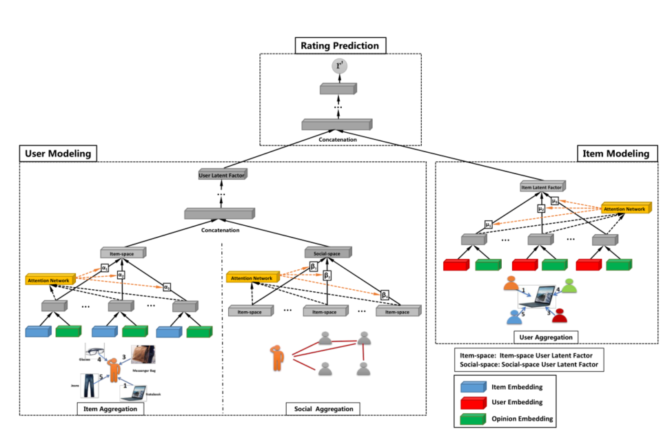

> 论文标题：Graph Neural Networks for Social Recommendation
>
> 发表于：2019 WWW
>
> 作者：Wenqi Fan， Yao Ma，Qing Li
>
> 代码： https://github.com/wenqifan03/GraphRec-WWW
>
> 论文地址：https://arxiv.org/pdf/1906.09217.pdf

## 摘要

- 构建基于 GNN 的社交推荐系统存在挑战。
  - 用户-项目图对交互及其相关意见进行编码；
  - 社会关系具有异质性；
  - 用户涉及两个图（例如，用户用户社交图和用户项目图）。
- 文章提出了一种用于社交推荐的新型图神经网络框架 (GraphRec)。
- 提供了一种有原则的方法来联合捕获用户项目图中的交互和意见，
- 并提出了框架  GraphRec，该框架连贯地对两个图和异构强度进行建模

## 结论

- 提出了一个图网络模型 (GraphRec)  来为评分预测的社交推荐建模。
- 提供了一种有原则的方法来联合捕获用户项目图中的交互和意见。
- 实验表明，意见信息在提高模型性能方面起着至关重要的作用。
- GraphRec 可以通过考虑社会关系的异质优势来区分联系优势

## 未来工作

- 目前我们只将社交图谱整合到推荐中，而许多现实世界的行业都关联了丰富的用户和项目的其他辅助信息
  - 探索具有属性的推荐图神经网络将是一个有趣的未来方向
- 模型中评级和社交信息都是静态的。现实中评级和社交信息自然是动态的。因此考虑为动态社交推荐构建动态图神经网络

## 介绍

## 模型架构

- 包含用户建模、项目建模和评分预测

## 实验

- ### 数据集

  - Ciao ：社交网络网站 Ciao (http://www.ciao.co.uk) 社交网络服务都允许用户对商品进行评分、浏览/撰写评论，并将朋友添加到他们的“信任圈”。
  - Epinions： 社交网络网站Epinions (www.epinions.com)。

- ### baseline

  - PMF [24]：概率矩阵分解仅利用用户项目评分矩阵，并通过高斯分布对用户和项目的潜在因素进行建模。 
  - SoRec  [17]：社交推荐对用户-项目评分矩阵和用户-用户社交关系矩阵进行协同分解。
  - SoReg [18]：社会正则化将社交网络信息建模为正则化项以约束矩阵分解框架。 
  - SocialMF  [13]：它将信任信息和信任信息传播考虑到推荐系统的矩阵分解模型中。
  -  TrustMF  [37]：该方法采用矩阵分解技术，通过根据信任的方向属性分解信任网络，将用户映射到两个低维空间：信任者空间和受托者空间。
  - NeuMF  [11]：该方法是具有神经网络架构的最先进的矩阵分解模型。最初的实现是针对推荐排名任务，我们将其损失调整为用于评分预测的平方损失。
  - DeepSoR  [8]：该模型采用深度神经网络从社会关系中学习每个用户的表示，并集成到概率矩阵分解中以进行评分预测。 •
  - GCMC+SN  [1]：该模型是具有图神经网络架构的最先进的推荐系统。
    - 为了将社交网络信息整合到 GCMC 中，我们利用 node2vec [9]  生成用户嵌入作为用户侧信息，而不是直接使用原始特征社交连接 (T ∈  Rn×n)。
    - 原因是原始特征输入向量是高度稀疏和高维的。使用网络嵌入技术可以帮助将原始输入特征向量压缩为低维密集向量，从而使模型易于训练。

- ### 超参数设置

- ### 评估指标

  - 平均绝对误差（MAE）
  - 均方根误差（RMSE）