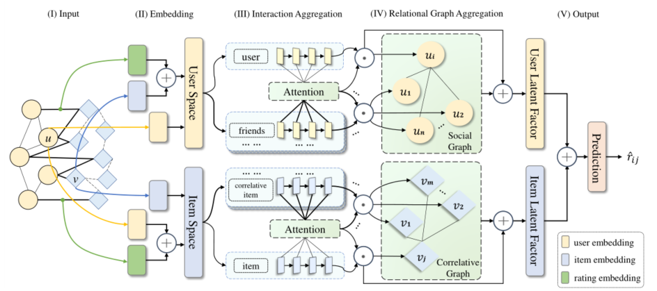

> 论文标题：Graph Neural Networks with Dynamic and Static Representations for Social Recommendation
>
> 发表于：DASFAA
>
> 作者：Junfa Lin, Siyuan Chen, Jiahai Wang
>
> 代码：https://github.com/ljf012/GNN-DSR
>
> 论文地址：https://arxiv.org/pdf/2201.10751v2.pdf

## 摘要

- 存在问题：
  - 以往的研究通常侧重于对用户进行建模，对物品的关注并不多
  - 很少考虑物品的吸引力随时间可能发生的变化，例如用户的动态兴趣，也很少考虑物品之间的相关性
- 提出了具有动态和静态表示的社交推荐图神经网络（GNN-DSR），考虑了用户和项目的动态和静态表示，并结合了它们的关系影响
  - 分别对用户兴趣和项目吸引力的短期动态和长期静态交互表示进行建模
  - 注意力机制用于聚合用户对目标用户的社会影响以及相关项目对给定项目的影响
  - 结合用户和项目的最终潜在因素进行预测

## 结论

- 基于 GNN 的社交推荐，称为 GNN-DSR。有效地考虑了用户和项目的动态和静态表示
- 分别通过 RNN 和注意力机制对交互聚合中的短期动态表示和长期静态表示进行建模
- 来自用户社交图或项目相关图的关系影响通过图注意力机制聚合在关系图聚合中用户或项目的表示上。

## 未来工作

- 结合其他辅助信息来解决冷启动问题

## 介绍

- 以前的工作通常侧重于对用户行为建模，而很少关注物品。
  - 对于物品的建模，他们很少模拟物品随时间可能变化的吸引力以及物品之间的相关性，如用户的兴趣和他们的社会影响力。
- 用户的兴趣和项目的吸引力可能会随着时间而变化，并受到他们之间的关系的影响
  - 朋友对用户的动态影响可以促进目标用户当前兴趣表示的学习
  - 用户也可能有自己长期的静态兴趣
  - 物品的吸引力也会随着时间而改变
- 交互表示可以参考用户的兴趣和项目的吸引力。关系影响是指用户的社会影响和物品的相关影响。
- GNN-DSR 两个主要组件组成：交互聚合和关系图聚合。
  - 对于交互聚合中的用户和项目，
    - 循环神经网络 (RNN)  用于对短期动态表示进行建模，
    - 并且对历史用户-项目交互使用图注意力机制来对长期静态表示进行建模。
  - 在关系图聚合中，来自用户-用户图和被称为关系图的项目-项目图的影响通过图注意力机制在用户或项目的表示上进行聚合。
  - 然后，GNN-DSR  通过多层感知器 (MLP) 将交互表示和关系影响结合起来进行评分预测。

## 模型架构

- GNN-DSR
  
  - 输入层，它处理原始数据并将它们馈送到 GNN-DSR。 
  - Embedding Layer，将预处理后的数据分别转换到用户向量空间和项目向量空间。  
  - 交互聚合，分别对用户和项目的动态和静态表示进行建模。
  - 关系图聚合，分别聚合相邻用户或项目的影响。 
  - 输出层，它使用 MLP 进行评分预测。

- 用户兴趣和项目吸引力随时间可能发生变化的示例
  
  - 用户侧，用户B是用户A和用户C的共同朋友，但他们的兴趣可能并不相同。
  - 在时间  t-1，三个用户的唯一共同兴趣是食物；
  - 到时间t，用户B可能会受到用户A的影响而对数字产品产生兴趣，而用户C可能会受到用户B的影响而对运动产生新的兴趣。

## 实验

- ### 研究问题

- ### 数据集

  - Ciao：一个在线消费购物网站，用时间戳记录用户对商品的评分。用户还可以与其他用户建立社交关系。
  - Epinions：著名的消费者评论网站，用户可以在其中对商品进行评分并将社交朋友添加到他们的信任列表中。
  - Delicious：一个社交书签网站，用户可以在其中存储、管理和共享网络书签。 含书签标签和用户之间的关系

- ### baseline

  - (A) 社会推荐，考虑到社会影响； (B) 基于会话的推荐器 ;(C) 基于 GNN 的推荐方法;
    - SoReg [14] (A)：在传统的矩阵分解（MF）框架中使用社交网络信息。
    - SocialMF [10] (A)：将信任信息及其传播合并到 MF 模型中。
    - DeepSoR [3] (A)：使用深度神经网络从社会关系中提取每个用户的复杂和内在非线性特征，以进行评分预测。
    - NARM [12]  (B)：应用注意力机制从当前会话中捕获用户的顺序行为和用户的主要目的。
    - SSRM [7] (B)：提出了一种基于 MF  的注意力模型，以更好地理解基于会话的推荐的用户行为的不确定性。
    - STAMP [13] (B)：应用注意力机制更好地捕捉用户对匿名推荐的短期兴趣。 
    - GraphRec [4] (AC)：采用基于 GNN 的框架对社交推荐中的图数据进行连贯建模，可以学习用户和项目表示以及社交关系的异构强度。
    - DGRec  [18] (BC)：同时考虑用户基于会话的兴趣和动态的社会影响。具体来说，该方法使用图形注意神经网络对上下文相关的社会影响进行建模。
    - GraphRec+  [5] (AC)：GraphRec 的扩展，带有项目-项目图的附加信息，可以在社交推荐中学习更好的用户和项目表示。

- ### 超参数设置

- ### 评估指标

  - 对于评分预测
    - MAE
    - RMSE
  - 排名预测
    - MRR@K
    - NDCG@K