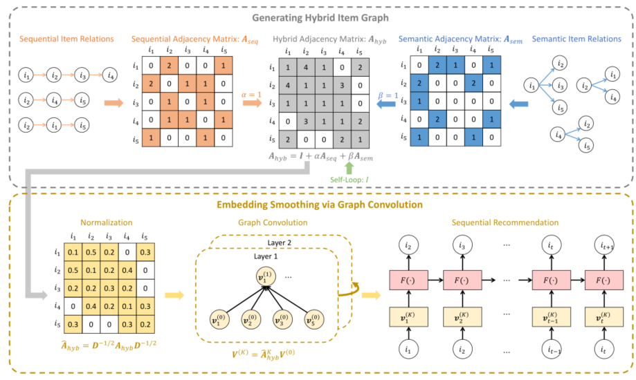

> 论文标题：Graph-based Embedding Smoothing for Sequential Recommendation
>
> 发表于：IEEE TKDE 2021 
>
> 作者：Tianyu Zhu, Leilei Sun, Guoqing Chen
>
> 代码：https://github.com/zhuty16/GES
>
> 论文地址：https://ieeexplore.ieee.org/abstract/document/9405450

## 摘要

- 顺序行为对未来交互的影响在不同的场景中可能会有很大差异
- 项目属性的语义项目关系尚未在顺序推荐模型中得到很好的利用，这对于衡量推荐中的项目相似性可能至关重要
- 本文提供了一个通用的序列推荐模型嵌入平滑框架。
  - 首先，通过融合源自用户-项目交互的顺序项目关系与基于项目属性的语义项目关系来构建混合项目图。
  - 其次，我们在混合项目图上执行图卷积以生成平滑的项目嵌入。
  - 最后，我们为顺序推荐模型配备了平滑的项目表示，以提高它们的性能。

## 结论

- 在不同推荐场景中，用户交互中的顺序可能会有所不同，这可能会严重影响顺序推荐模型的性能。
- 顺序模型仅考虑用户行为的顺序项目关系，同时忽略对测量推荐中项目相似性至关重要的语义项目关系
- 为了解决问题，我们提出了一个有效的框架
  - 主要思想是使用项目图 平滑 序列模型中的项目嵌入，其中包括两个基本步骤：
  - 生成混合项目关系图，将源自用户-项目交互的顺序项目关系与基于项目属性的语义项目关系融合
  - 在混合项目图上执行图卷积以生成平滑的项目嵌入作为顺序推荐模型的输入

## 未来工作

- 探索项目之间的异构语义关系（例如，具有相同类型/导演/演员的电影），以便设计具有这些关系的嵌入平滑策略。

## 介绍

- 在不同的推荐场景下，用户交互的顺序性可能会有很大差异，这可能会严重影响顺序推荐模型的适用性。
  - 在线购物时，购买了笔记本电脑的用户稍后会购买配件（例如鼠标或键盘），但在选择晚餐餐厅时，人们的选择可能并不遵循一定的顺序
- 顺序模型仅考虑用户行为方面的顺序项目关系，而忽略了对测量推荐中的项目相似性至关重要的语义项目关系。
  - 语义项目关系是指项目之间在属性或特征方面的联系（例如，书籍的类型或  POI 的位置）。
  - 这些关系不一定被序列模型捕获。如，两部相同类型但发行时间不同的电影在用户交互序列中可能很少出现彼此相邻的情况。
- 在顺序推荐模型中考虑语义项目关系很重要，因为它们可以补充和规范从用户交互中获得的项目相似性，从而提高推荐准确性
- 提出了一个有效的框架来解决这些问题。主要思想是用项目关系图平滑项目嵌入，以保持序列模型中的全局项目相似性结构
  - 首先，构建一个用于嵌入平滑的混合项目图。
    - 我们从 useritem 交互构建一个顺序项目图，并通过项目侧信息（例如，项目属性）构建一个语义项目图。
    - 结合这两个图来生成一个包含多个项目关系的混合项目图。
  - 然后，在混合项目图上执行图卷积以生成平滑的项目嵌入。我们指出了直接使用图卷积网络 (GCN) [6] 的缺点，并通过消除 GCN 中的冗余非线性来实现简化的图卷积
  - 最后，平滑的项目嵌入作为序列模型的输入来生成推荐
- 通过这种方式，序列模型在预测下一个项目时同时涉及用户交互项目及其相关项目，放松了这些模型中的序列假设并增强了它们的泛化能力。

## 模型架构

## 实验

- ### 数据集

  - Amazon Books
  - Yelp.
  - Google Local

- ### baseline

  - 一般推荐方法,仅使用用户-项目交互数据进行项目推荐
    - Most Popular：一种非个性化的方法，只是根据物品的受欢迎程度（即所有用户的交互次数）对物品进行排名。
    - BPR [25]：一个基于 MF  的模型，具有成对排名损失，可以从隐式反馈中学习。
    - Mult-DAE [26]：一种基于项目的最先进的推荐模型，建立在具有多项条件似然的去噪自动编码器之上。
    - LightGCN [10]：基于图卷积的推荐模型，通过在用户-项目二分图上的线性传播来学习用户/项目嵌入。
  - 捕获用户动态偏好的顺序推荐模型
    - FPMC  [27]：它结合了矩阵分解和分解的一阶马尔可夫链用于顺序推荐。
    - TransRec [23]：将每个用户建模为项目之间的翻译向量，以捕获用于顺序推荐的转换模式。
    - GRU4Rec [2]：采用 GRU  对会话序列进行建模，以进行基于会话的推荐。
    - NARM [28]：使用带有注意力机制的 GRU 来捕获用户的顺序行为和主要目的，以进行基于会话的推荐。 
    - Caser[3]：采用水平和垂直卷积来学习推荐的顺序模式。
    - SASRec [4]：基于 Transformer [1]  中的自注意力模块的顺序推荐模型。
  - 包含关系感知推荐模型，使用语义项目关系来提高推荐性能
    - CKE [29]：一种基于嵌入的模型，在基于 MF 的框架中结合了结构、文本和视觉信息。这里只使用了结构信息。
    - MCF  [30]：一种关系感知推荐模型，它同时分解用户-项目评分矩阵和项目-项目关系矩阵以进行评分预测。
    - LightGCN+。它在由用户-项目交互和项目-项目语义关系组成的异构图上执行 LightGCN [10]，以生成用于推荐的用户和项目嵌入。
  - 同时编码推荐的顺序和语义项目关系
    - MoHR [24]：它采用平移算子在多任务学习框架下对异构项目-项目关系的混合进行建模。

- ### 超参数设置

- ### 评估指标

  - Hit Ratio
  - NDCG
  - MRR