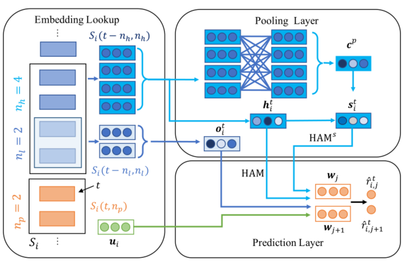

> 论文标题：HAM: Hybrid Associations Models for Sequential Recommendation
>
> 发表于：2021 IEEE Transactions on Knowledge and Data Engineering
>
> 作者：Bo Peng, Zhiyun Ren, Srinivasan Parthasarathy
>
> 代码：https://github.com/BoPeng112/HAM
>
> 论文地址：https://arxiv.org/pdf/2002.11890v3.pdf

## 摘要

- 开发了混合关联模型 (HAM)，以使用三个因素生成顺序推荐：
  - 用户的长期偏好，
  - 用户最近购买的顺序、高阶和低阶关联模式/评级
  - 这些项目之间的协同作用
- HAM 使用简单池化来表示关联中的一组项目，并使用元素乘积来表示任意顺序的项目协同作用

## 结论

- HAM 模型使用三个因素来生成推荐：1）用户的长期偏好，2）用户最近购买/评分中的顺序、高阶和低阶关联模式， 3）这些项目之间的协同作用
- 注意力机制可能会在稀疏推荐数据集上学习不太有意义的权重

## 未来工作

- 如何标准化实验设置和评估指标

## 介绍

- 顺序推荐的一个关键挑战是识别、学习或表示用户购买/评分序列中最相关的模式和动态，以告知他们未来与其他项目的交互，以及捕捉这些模式和未来交互之间的关系
- 那些具有注意力机制的方法存在的问题，
  - 稀疏的推荐数据是否足以支持良好学习的注意力权重或任何具有许多参数的假设循环模式，
  - 这些学习的权重和模式是否可以发挥有效作用识别导致准确建议的重要信息。
- 文章想要探讨问题：
  - 简单的池化，以及更明确和直观的模式  是否比  注意力机制，和高度参数化的递归     在稀疏的顺序推荐数据上更胜一筹
- 提出了一组新的混合关联模型 HAM。 HAM 模型明确使用以下三个直观因素通过简单的线性评分函数生成顺序推荐：
  - 1) 用户的一般/长期偏好，2)  用户最近购买/评分中的顺序关联模式，以及 3 ) 最近购买/评级的项目之间的协同作用
- 项目之间的协同作用，在 [8] 中也称为联合级效应，可以为那些 每个项目无法单独提供自身信息的推荐系统 提供有用的额外信息。
- HAM中
  - 通过利用用户的所有历史购买/评分来了解用户的一般偏好，并在用户嵌入中表示偏好。因此，用户嵌入将编码在不同项目之间相对一致的用户偏好。
  - 使用的项目关联模式包括高阶关联（即，许多项目一起引发下一个/几个项目）和低阶关联（即，只有几个项目一起引发下一个/几个项目）。
    - 使用池化机制（即平均池化和最大池化）来对高/低阶项目关联进行建模
  - 使用来自嵌入的 Hadamard  乘积明确地对项目对之间的协同作用进行建模，并将其扩展到以递归方式对任意数量的项目之间的协同作用进行建模。
  - 使用潜在交叉[9]技术来有效地结合项目协同作用和项目关联。

## 模型架构

- HAM
  

## 实验

- ### 研究问题

- ### 数据集

  - Amazon-Books (Books) and Amazon-CDs (CDs) 
  - Goodreads-Children (Children) and Goodreads-Comics(Comics) 
  - MovieLens-1M (ML-1M) and MovieLens-20M (ML-20M) 

- ### baseline

  - Caser [8]：该方法对用户最近的购买/评分使用多个卷积过滤器来提取用户的顺序特征和项目的组特征。这两个特征和用户的长期偏好被用来计算项目推荐分数。
  - SASRec [13]：该方法使用自注意机制来捕捉用户购买/评分序列中信息量最大的商品，以推荐下一个商品。
  - HGN  [5]：该方法使用门控机制从用户的历史购买/评分中识别重要项目及其潜在特征，以推荐下一个项目。

- ### 超参数设置

- ### 评估指标

  - Recall@K