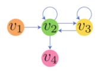
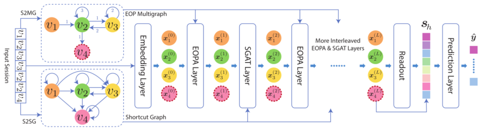
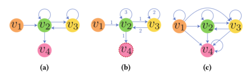

> 论文标题：Handling Information Loss of Graph Neural Networks for Session-based Recommendation
>
> 发表于：2020 SIGKDD
>
> 作者：Tianwen Chen，Raymond Chi-Wing Wong
>
> 代码：https://github.com/twchen/lessr
>
> 论文地址：https://cse.hkust.edu.hk/~raywong/paper/kdd20-informationLoss-GNN.pdf

## 摘要

- 基于 GNN  的基于会话的推荐方法中存在两个信息丢失问题，即有损会话编码问题和无效的远程依赖捕获问题。
  - 有损会话编码问题。由于从会话到图的有损编码以及消息传递期间的排列不变聚合，一些有关项目转换的顺序信息被忽略了。
  - 无效的远程依赖捕获问题。由于层数有限，无法捕获会话中的一些长期依赖关系。
- 本文提出了
  - 为了解决第一个问题，我们提出了一种无损编码方案和一个基于 GRU  的边缘顺序保留聚合层(EOP)，专门设计用于处理无损编码图。
  - 为了解决第二个问题，我们提出了一个快捷图注意力层(SGAT)，它通过沿着快捷连接传播信息来有效地捕获远程依赖关系。
  - 通过结合这两种层，我们能够构建一个没有信息丢失问题的模型

## 结论

- 现有基于会话的推荐的 GNN 模型中的两个信息丢失问题，即有损会话编码和无效的远程依赖捕获问题。
- 为了解决这两个问题，提出了 EOPA 和 SGAT  层，它们依赖于将会话转换为图的两种转换方法，包括 S2MG 和 S2SG。
- 通过结合这两种层，我们构建了一个名为 LESSR 的模型，该模型没有两个信息丢失问题，

## 未来工作

## 介绍

- 基于会话的推荐是下一个项目推荐的一个特例。
- 与使用固定数量的先前动作来预测下一个动作的通用下一项推荐系统不同，基于会话的推荐系统将用户动作分组到不相交的会话中，并且仅使用活动会话中的先前动作来进行推荐。
- 一般的下一项推荐系统可能会遇到组合不相关会话和提取不完整会话的问题。
- 目前基于会话的推荐，存在两个信息丢失问题
  - 第一个丢失问题为有损会话编码问题。
    - 由于它们将会话转换为图形的有损编码方案。要使用 GNN  处理会话，需要先将会话转换为图。
    - 在方法中，每个会话被转换为一个有向图，其节点是会话中唯一的项目，边是项目之间的转换。边缘可以加权或不加权
    - 如：不同的会话 [v1, v2, v2, v3, v3, v2, v4] ,[v1, v2, v3, v3, v2, v2, v4]也被转换为相同的图，因此我们无法根据该图重建原始会话
    - 尽管在特定数据集中，两个会话可能产生相同的下一个项目，
    - 但也可能存在一个数据集，其中两个会话产生不同的下一个项目。
      - 在这情况下，这些 GNN  模型不可能为两个会话都做出正确的建议
  - 第二个丢失问题称为无效的远程依赖捕获问题
    - 在 GNN 模型的每一层中，节点携带的信息沿边传播一个 step，因此每一层只能捕获 1-hop 关系。
    - 通过堆叠多个层，GNN 模型可以捕获多达 L-hop  关系，其中 L 等于层数。
    - 由于过度拟合和过度平滑问题 [12, 26]，堆叠更多层不一定会提高性能，因此这些 GNN 模型的最佳层数通常不大于 3 [16,  23-25]。
      - 因此，模型最多只能捕获 3 跳关系。
    - 在实际应用中，会话长度很容易大于 3。由于网络结构的限制，这些 GNN-基于模型无法捕获此类信息

## 模型架构

- LESSR
  - 给定一个会话，计算一个边缘顺序保留 (EOP) 多重图和一个快捷图。
  - 初始节点表示 $x ^{(0)} _i$ 是项目嵌入。图和节点表示作为输入传递给多个交错的 EOPA 和  SGAT 层。每层输出新的节点表示。
  - 读出层计算图级表示，将其与最近的兴趣相结合，形成会话嵌入Sℎ。
  - 最后，预测层计算下一项的概率分布 $\hat y$。
- 图示
  
  - S2WG、S2MG和S2SG转换的会话[v1, v2, v3, v3, v2, v2, v4]的加权图（a）、EOP多重图（b）和 由快捷图（c），

## 实验

- ### 研究问题

- ### 数据集

  - Diginetica
  - Gowalla
  - Last.fm

- ### baseline

  - Item-KNN [4] 是一种邻域方法，推荐与当前会话中的先前项目相似的项目，两个项目之间的相似度由它们的余弦相似度定义。 
  - FPMC [18] 是一种基于马尔可夫链的下一篮子推荐方法。为了适应基于会话的推荐，我们将下一个项目视为下一个篮子。 
  - NARM [11] 使用 RNN 来捕捉用户的主要目的和顺序行为。
  - NextItNet [27] 是一种基于 CNN 的下一项推荐方法。它使用扩张卷积来增加感受野，而不使用有损的池化操作。
  - SR-GNN [23] 将会话转换为有向无权图，并通过使用 GGNN [13] 沿边的两个方向传播信息来提取项目特征。 
  - FGNN [16] 将会话转换为有向加权图，并使用适应的 GAT [22] 来学习项目表示。
  - GC-SAN [25] 首先使用 GGNN 来提取本地上下文信息，然后使用自注意网络 (SAN) 来捕获全局依赖关系。

- ### 超参数设置

- ### 评估指标

  - HR@K
  - MRR@K