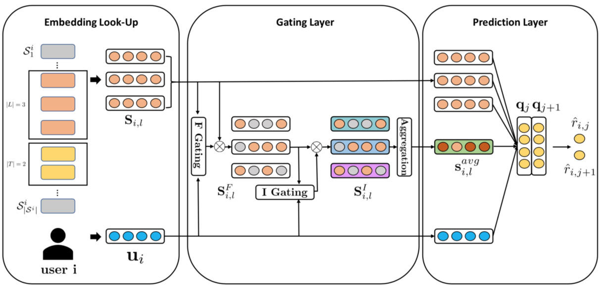
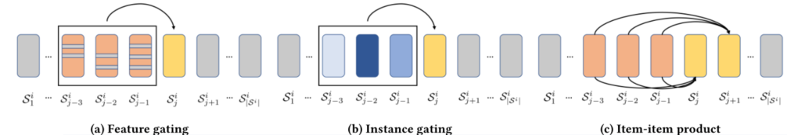

> 论文标题：Hierarchical Gating Networks for Sequential Recommendation
>
> 发表于：2019 SIGKDD
>
> 作者：Chen Ma,Peng Kang,Xue Liu
>
> 代码：https://github.com/allenjack/HGN
>
> 论文地址：https://arxiv.org/pdf/1906.09217.pdf

## 摘要

- 顺序推荐系统面临着几个具有挑战性的问题
  - 1）从稀疏的隐式反馈中建模长期用户兴趣的难度；
  - (2) 给定用户刚刚访问的几个项目，捕捉短期用户兴趣的难度。

- 提出了一个分层门控网络（HGN），与贝叶斯个性化排名（BPR）相结合，以捕捉长期和短期用户的兴趣。
  -  HGN  由一个特征门控模块、一个实例门控模块和一个项目-项目产品模块组成。
    - 特征门控和实例门控模块分别从特征和实例级别选择哪些项目特征可以传递到下游层。
    - 我们的  项目-项目产品模块明确地捕获了用户过去访问的项目与用户将来访问的项目之间的项目关系

## 结论

- 提出了一个带有项目-项目产品模块的分层门控网络，用于顺序推荐。
- 该模型采用特征门控模块和实例门控模块来控制哪些项目特征可以传递到下游层，在下游层可以选择信息丰富的潜在特征和项目。
- 应用一个项目-项目产品模块来捕捉密切相关的项目之间的关系

## 未来工作

## 介绍

- 顺序推荐，它将用户行为历史视为一个按操作时间戳排序的动作序列
  - 由于难以推断用户的短期兴趣和意图，因此这项任务具有挑战性
- 用户的长期和短期利益共同决定了用户对物品的行为，
  - 通过大量积累的数据，可以有效地对用户的长期兴趣进行建模。
  - 但在短期内，如何利用顺序动态来预测用户在不久的将来的行为困难。
- 之前的研究通过CNN或RNN结构学习用户动作序列，
  - 没有考虑不同项目特征的具体部分，也不会根据用户的偏好来区分项目的重要性
  - 这些信息项与其他项同等对待可能会导致对用户意图的不完全理解
  - 未注意项目之间的关系
- 显式捕获项目-项目关系将在很大程度上有助于预测用户将交互的后续项目。
- 提出了一个分层门控网络（HGN）：由一个特征门控模块、一个实例门控模块和一个项目-项目产品模块组成
  - 特征门控模块允许基于用户偏好自适应选择项目的有吸引力的潜在特征，其中所选用户特定的特征将被传递给实例门控模块。
  - 实例门控模块中，反映短期用户兴趣的重要项目将被区分并选择用于未来的项目预测
  - 特征门控和实例门控模块形成了一个分层门控网络控制哪些特征或项目可以传递给下游层
  - item-item 关系为预测用户的顺序行为提供了重要的辅助信息，因为密切相关的项目可能会被用户一个接一个地交互。因此，我们应用一个 item-item  产品模块来显式地捕获用户已经交互的项目与用户将来会交互的那些项目之间的关系。

## 模型架构

- HGN
  
  - F Gating 表示特征门控模块，I Gating 表示实例门控模块，Aggregation 表示聚合层，⊗ 表示逐元素乘法。
- 特征门控、实例门控、项目-项目产品模块说明性示例
  
  - 图 a 中，项目上的灰线表示这些潜在特征被屏蔽掉了。
  - 在图 b 中，深蓝色表示该项目更重要。
  - 在图 c  中，两个项目之间的连线表示内积，它捕获了用户已访问的项目与用户将来将访问的项目之间的关系。

## 实验

- ### 研究问题

- ### 数据集

  - MovieLens-20M [6], 
  - Amazon-Books and Amazon-CDs [9], 
  - Goodreads-Children and Goodreads-Comics [38]

- ### baseline

  - 隐式反馈的经典方法
    - BPRMF，基于贝叶斯个性化排名的矩阵分解[29]，一种从用户隐式反馈中学习成对个性化排名的经典方法。
    - 文章用  BPR-MF 进行模型学习。
  - 基于会话的推荐方法： 
    - GRU4Rec，用于推荐的门控循环单元[13]，它使用循环神经网络对基于会话的推荐的用户-项目交互序列进行建模。每个用户序列都被视为一个会话。
    - GRU4Rec+，GRU4Rec [12] 的改进版本，采用不同的损失函数和采样策略，在 Top-N 推荐上表现出显着的性能提升。
    - NextItNet，下一个项目推荐网络[42]，应用扩张卷积神经网络来增加感受野，而不依赖于池化操作。
  - 顺序推荐方法： 
    - Caser，卷积序列嵌入模型  [34]，通过对 |L| 的嵌入应用卷积运算来捕获高阶马尔可夫链最近的项目。
    - SASRec，基于自我注意的顺序模型[18]，它使用注意机制来识别相关项目以预测下一个项目。

- ### 超参数设置

- ### 评估指标

  - Recall@k
  - NDCG@k.