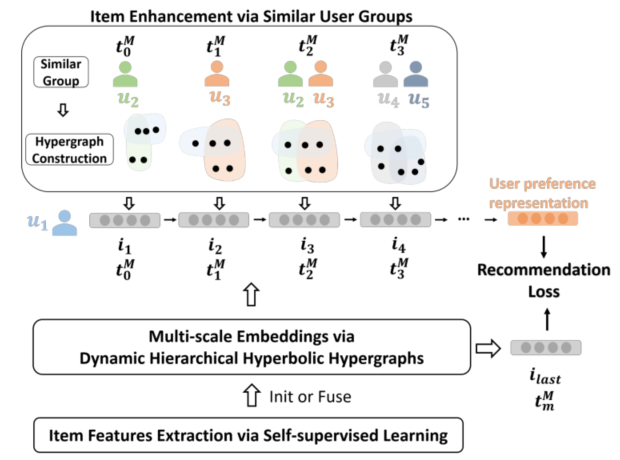
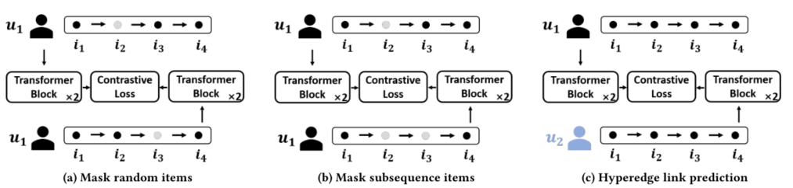
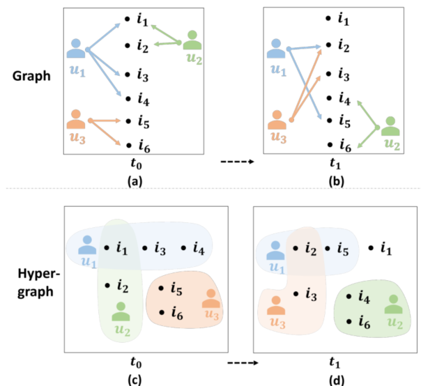

> 论文标题：Hyperbolic Hypergraphs for Sequential Recommendation
>
> 发表于：2021 CIKM
>
> 作者：Yicong Li, Hongxu Chen, Xiangguo Sun,
>
> 代码：https://github.com/abigale001/h2seqrec
>
> 论文地址：https://arxiv.org/pdf/2108.08134v1.pdf

## 摘要

- 超图已成为为推荐系统建模复杂、非成对和高阶交互的流行选择
- 与传统的基于图的方法相比，构建的超图通常要稀疏得多，这导致在平衡超图的优势和建模难度时进退两难
- 现有的顺序超图推荐忽略了用户关系之间的时间建模，忽略了推荐数据中丰富的社交信号
- 文章提出了一种新的架构，称为用于顺序推荐的双曲超图表示学习方法（H2SeqRec），具有预训练阶段
  - 设计了三个自监督任务来获得预训练项目嵌入，以馈入或融合到以下推荐架构中（有两种使用预训练嵌入的方法）。
  - 在推荐阶段，我们通过层次结构学习多尺度项目嵌入，以捕获多个时间跨度信息。
  - 为了减轻稀疏超图的负面影响，利用基于双曲空间的超图卷积神经网络来学习动态项目嵌入。
  - 设计了一个项目增强模块来捕获每个时间戳的动态社交信息，以提高有效性

## 结论

- 文章专注于大多数现有的基于超图的顺序推荐的稀疏问题和缺乏对用户之间隐藏超边的利用问题，并提出了具有预训练阶段的顺序推荐的双曲超图表示学习方法（H2SeqRec）。
- 在稀疏数据集上，数据增强提高了推荐效果，而在密集数据集上，它是无用的，甚至更糟，这证明密集数据集不需要数据增强来获得更好的性能

## 未来工作

- 探索多种顺序方法来对图上的顺序推荐数据进行建模。

## 介绍

- 大多数工作[2, 12, 15, 18, 23, 29, 32, 35, 45]将动态时间相关的用户项目交互视为时间二分图，并学习其潜在的行动表示。
  - 通常会忽略用户和项目之间的高阶信号由于传统图建模的局限性
- 最近的工作 [4, 24, 25, 29, 30, 36, 43] 采用超图来弥补和开发基于超图的顺序推荐系统建模方法
  - 与传统图不同，超图中的一条边（也称为超边）被允许连接两个以上的节点，承诺为推荐捕获多尺度信号
- 现有的基于超图的工作存在问题：
  - 稀疏问题在基于超图的推荐系统中变得越来越严重
    - 在构建超图时，具有挑战性的稀疏性问题和长尾数据分布变得更加严峻。
  - 缺乏对用户之间隐藏超边的利用，（例如，共同兴趣组、共同购买组、拥有类似的购买模式等
    - 根据用户关系通过动态超图构造来捕捉动态项目的多样化，以增强模型
- 提出了一种新的架构，称为序列推荐的双曲超图表示学习（H2SeqRec）。
  - 首先，在三个复杂的任务上通过自我监督学习对模型进行预训练。引入了超边预测任务，
    - 该任务将用户的历史记录明确建模为每个时间戳的超边，并探索潜在的链接超边（具有相似购买历史的用户）之间的关系
  - 研究了双曲线嵌入空间[46]，并设法将稀疏数据点直接映射到双曲线流形。
    - 其基本原理是双曲空间比欧几里得空间具有更强的能力来容纳具有长尾分布和稀疏结构的网络
  - 为每个用户构建一个诱导超图，以在组级别对他的行为模式进行建模
    - 在顺序推荐设置中利用隐藏但有用的用户侧信息，一个用户的行为模式不仅反映在他的历史记录中，还可以从其他具有相似行为模式的用户身上挖掘出来
  - 存在的困难：很难确定每个超边的项目序列长度被分割到的时间粒度。
    - 研究发现购买历史不仅是按时间顺序排列的，而且具有周期性的规律性，如季节性演变
  - 因此，传统的数据时间顺序建模不同，我们认为周期性规律性和将用户兴趣建模为改进推荐的层次结构。
    - 超图构建的三个视图，即年度、季度和月度视图，并设法分层学习潜在项目表示。
    - 在构建季度和年度超图时，超图不再像原始的单次粒度超图那样稀疏。
    - 用于超图构建的分层时间跨度方法也缓解了上述稀疏问题。

## 模型架构

- H2SeqRec
  
  - 通过动态分层双曲超图进行多尺度嵌入，
  - 通过相似用户组进行项目增强，
  - 以及学习用户对顺序推荐的偏好。
  - 预训练模块可以作为 H2SeqRec  (H2SeqRec-init) 的初始嵌入；它也可以融合到 H2SeqRec (H2SeqRec-fuse) 中。
- 三个自我监督任务的预训练阶段
- 通过动态分层双曲超图进行多尺度嵌入。
  
- 顺序图和超图的构造比较
  
  - (c) 和 (d) 中的单色区域表示超边。由于非成对的数据结构，超图能够捕获高阶动态关系（同时购买商品、相似的用户组等）
  - 从图 (a) 到 1.(b)  的学习信息是单调的。
  - 在图 (c) 和 (d) 中，从时间戳 t0 到  t1，它们是序列超图构造的演变。
  - 在时间戳t0中，用户u1与u2具有共购关系，并且u1和u2的超边是连通的。在这种情况下，项目 i1、i2、i3 和 i4  可能比i5 和 i6 更相似。时间戳t1也是如此。

## 实验

- ### 研究问题

- ### 数据集

  - AMT：Amazon Automotive，Amazon Musical Instruments，Amazon  Toys and Games,。它是亚马逊公共数据集 [17] 的子集，包含 29  个类别的消费者购买记录和评论。在实验中，选择汽车、乐器和玩具和游戏三个类别来形成数据集，并删除购买少于 5 件商品的用户。
  - Goodreads。是从goodreads网站收集的，它是一个在线图书社区网站。我们选择 2013 年和 2015 年之间的用户书（项目）交互作为数据集

- ### baseline

  - GRU4Rec. [5, 6] 它是一种著名的基于顺序的推荐模型，它利用 GRU 对用户的交互进行顺序建模以实现 top-N 推荐。 
  - SASRec。 [12] 这是一种基于自我注意的下一个项目推荐的顺序方法，它可以通过 PointWise 前馈网络捕捉每个用户的长期顺序关系，并通过注意机制捕捉与项目的短期交互。
  - BERT4Rec。 [23] 该方法采用深度双向自注意力，通过完形填空任务对两个方向的用户行为进行顺序建模。
  - SRGNN。 [35] 该方法利用图神经网络对会话序列进行建模并获得每个会话的复杂项目转换。 
  - HGN。 [15] 它提出了一个带有贝叶斯个性化排名的分层门控网络，以捕捉用户的长期和短期兴趣。
  - HyperRec。 [29] 它使用顺序超图对动态项目嵌入进行顺序建模，并与静态项目嵌入融合作为项目表示。对于每个用户，项目表示被输入到 Transformer 网络中以获得下一个项目推荐。

- ### 超参数设置

- ### 评估指标

  - Hit R @ K
  - NDCG @ K