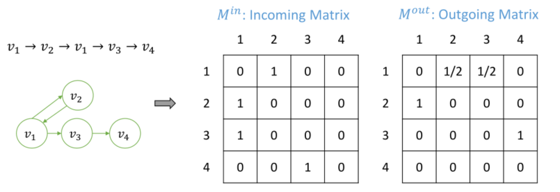

> 论文标题：Improving Sequential Recommendation with Attribute-augmented Graph Neural Networks
>
> 发表于：2021 PAKDD
>
> 作者：Xinzhou Dong, Beihong Jin, Wei Zhuo
>
> 代码：
>
> 论文地址：https://arxiv.org/pdf/2103.05923v1.pdf

## 摘要

- 许多推荐系统仅通过挖掘用户与项目的交互来为不同的用户提供项目推荐，而完全忽略了用户与之交互的项目的丰富属性信息
- 提出了一种名为 Murzim 的属性增强图神经网络模型。 
  - 将由用户-项目交互序列和相应的项目属性序列构建的图作为输入。
  - 通过将 GNN  与节点聚合和注意力网络相结合，Murzim 可以捕获用户偏好模式，为用户-项目交互序列生成嵌入，然后通过下一个项目预测生成推荐
  - 提出了一种计算属性分数的方法，以便快速确定哪些属性对建模用户偏好有价值
  - Murzim 在门控 GNN 的基础上，采用注意力机制整合节点级和序列级的信息，将项目属性对用户-项目交互序列中隐含的语义的影响融合到推荐结果中

## 结论

- 提出了一种用于顺序推荐的 GNN 模型 Murzim。 
  - Murzim 通过有向图描述用户-项目交互序列和属性序列，然后通过节点聚合和注意力网络收集信息，
  - 既继承了  GNN 的优点，又通过属性挖掘用户偏好，从而提高推荐性能

## 未来工作

## 介绍

- 在很多推荐场景中，除了用户与物品的交互序列外，物品的属性信息相对完整。物品的属性也逐渐被用于帮助建模[18,7]。
- 迄今为止，对于物品的多属性、多值属性的建模与挖掘，还缺乏深入的研究
- 为了挖掘项目属性在学习用户偏好模式中的潜力，在本文中，我们将项目的离散属性值视为图上的一个节点。
  - 这样，对于一个用户-物品交互序列，存在被交互的物品的属性序列。
- 接下来，除了从用户-项目交互序列构建项目图，还用图描述这些属性序列。
- 然后，我们构建了一个  GNN 模型来生成下一个项目的推荐。

## 模型架构

- Murzim
  
  - 首先根据项目序列和属性映射构造属性序列，并将所有 1 + K 序列（即一个项目序列和 K 个属性序列）表示为有向图。
  - 然后，使用基于 GRU 的门控 GNN  来更新图中节点的嵌入。在获得节点的嵌入后，我们将它们聚合以获得序列的嵌入。
  - 最后，我们通过注意力网络收集所有序列嵌入来预测下一个项目
- 属性图示例
  
  - 区分序列的正反，分别构建传入矩阵M in 和传出矩阵M out

## 实验

- ### 研究问题

- ### 数据集

  - Yoochoose： 数据集来自 RecSys Challenge 2015
  - Diginetica： 数据集来自 CIKM Cup 2016
  - MX Player ：来自 MX Player 的日志

- ### baseline

  - POP/S-POP：他们推荐整个训练集或当前序列中top-N受欢迎的物品。
    - 在 S-POP 中，如果推荐项目数不足，我们使用整个训练集中的 top-N  热门项目来完成。
  - Item-KNN[15]：推荐与序列中的item最相似的top-N个item。 item i 和 item j  之间的相似度是根据序列中的共现次数计算的。
  - GRU4Rec[6]：它用 RNN 对序列进行建模以预测下一个项目。 
  - NARM[10]：在RNN中增加了注意力机制来捕捉用户在当前序列中的序列行为和主要交互目的。 
  - STAMP[13]：它使用一种新的注意力机制来捕捉用户的普遍兴趣和短期注意力。
  - SR-GNN[20]：它使用 GNN  对序列进行建模，同时使用注意力机制来融合用户对序列的长期和短期兴趣

- ### 超参数设置

- ### 评估指标

  - Recall@20
  - MRR@20