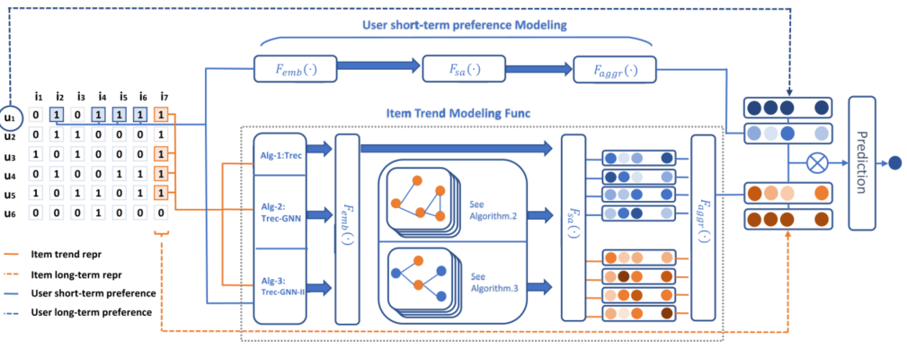

> 论文标题：Item trend learning for sequential recommendation system using gated graph neural network
>
> 发表于：2021  Neural Computing and Applications.
>
> 作者：Ye Tao, Can Wang, Lina Yao
>
> 代码：
>
> 论文地址：https://sci.bban.top/pdf/10.1007/s00521-021-05723-2.pdf

## 摘要

- 顺序推荐系统通过利用其近期历史中的信息，更加强调用户的短期偏好，
  - 大多数推荐模型都忽略了不断变化的项目流行度
- 本文介绍了一种新颖的顺序推荐方法，称为 TRec（Trendy Recommender）。 
  - TRec  从隐含的用户交互历史中学习物品趋势信息，并将物品趋势信息融入到后续的物品推荐任务中。
    - 学习项目的趋势表示和项目的长期表示；然后，模型将它们组合在一起，并与用户的短期和长期偏好一起馈入预测层。
  - 之后，使用自注意力层被用作项目趋势表示建模中的节点嵌入学习助推器

## 结论

- 这项工作中提出了一种新颖的顺序推荐模型，该模型从用户-项目交互历史中提取信息来构建项目趋势信息表示。
  - 设计了三种不同的方法，旨在构建项目趋势表示。
- 本研究的将项目趋势信息表示合并到下一个项目预测任务中。
  - 利用门控图神经网络的强大功能从候选项目的交互历史中采样的节点收集信息。

## 未来工作

- 学习到的用户和项目表示是基于当前现有的数据库；因此，对于冷启动问题，它仍然是一项具有挑战性的任务
- 可以自监督学习及其融入项目趋势信息表示学习的潜力

## 介绍

- 基于协同过滤（CF）[1]方法和基于内容（CB）方法[2]是两组主流的传统推荐方法。
- 最近对顺序推荐系统的研究将用户短期偏好融入了传统的用户潜在向量[6]；
  - 用户短期偏好可以从最近的用户-项目交互历史中得出。
  - 利用混合的用户长期和短期偏好，预测模型因此能够对最近的用户交互行为给出更高的权重分数
  - 这些研究大多数都忽略了一个的事实：物品被用户接受和喜爱的程度处于不断变化的状态（项目流行度）
- 研究提出了对物品趋势信息进行建模的方法
  - 使用门控图神经网络进行项目趋势表示建模的不同方法
  - 顺序推荐系统中的用户交互历史被认为具有揭示他/她的短期兴趣的顺序关系，这使其成为 GGNN 的合适场景

## 模型架构

- TRec
  
  - 用户-项目交互矩阵的蓝色和橙色方块分别表示用户交互序列和前 k 个最近用户。
  - 在这种情况下，选择前 4  个最近的用户进行项目趋势信息建模。
  - 从它们的索引建模的蓝色和橙色虚线分别表示用户长期偏好和项目长期表示。
  - 用户长期表示和物品长期表示在聚合步骤之后与用户短期表示和物品趋势信息一起聚集在一起，以进行进一步的预测

## 实验

- ### 研究问题

- ### 数据集

  - Luxury
  - MovieLens100K
  - Software
  - Digital

- ### baseline

  - BPR-MF[29] ：一个潜在因素模型，其中评分是通过两个低等级用户和项目潜在向量的点积来计算的。 
  - FPMC ：因式分解机[31] 是下一个篮子推荐的代表性基线，它将 MF 与一阶 MC 相结合。
  - GRU4Rec [8]：   RNN 应用于顺序推荐并且不考虑用户身份的模型。 GRU4Rec 的输入是一组项目，嵌入的项目矩阵被馈送到堆叠的 GRU  层中，用于下一个项目的预测。
  - AttRec [6]： 利用 NLP 的自我注意机制从用户历史交互中推断项目-项目关系。它还考虑了用户的短暂兴趣。
  - Caser [9] ：是一个基于卷积的顺序推荐模型。它通过对最近的用户交互序列应用卷积操作来捕获高阶马尔可夫链。
  -  HGN（用于顺序推荐的分层门控网络）[32]：采用分层门控架构来选择哪些项目特征可以从特征和实例级别传递到下游层。 

- ### 超参数设置

- ### 评估指标

  - NDCG@K
  - Recall@K