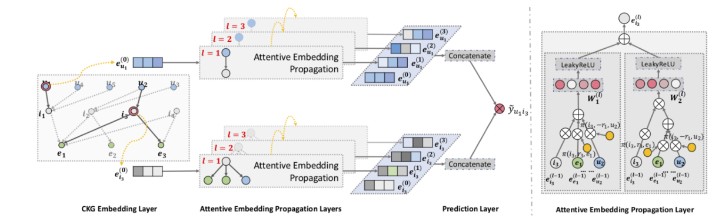

论文标题：KGAT: Knowledge Graph Attention Network for Recommendation

> 发表于：2019 SIGKDD
>
> 作者：Xiang Wang , Xiangnan He, Yixin Cao
>
> 代码：TensorFlow：https://github.com/xiangwang1223/knowledge_graph_attention_network
> 			pytorch：https://github.com/LunaBlack/KGAT-pytorch
>
> 论文地址：https://arxiv.org/pdf/1905.07854.pdf

## 摘要

- 为了提供更准确、多样化和可解释的推荐，必须超出对用户-项目交互建模并考虑辅助信息。
  - 传统方法将其视为监督学习问题，假设每个交互都是一个独立的实例，并编码了边信息。
  - 由于忽略了实例或项目之间的关系（例如，一部电影的导演也是另一部电影的演员），这些方法不足以从用户的集体行为中提取协作信号
- 文章中研究了知识图谱 (KG) 的效用，它通过将项目与其属性联系起来来打破独立交互假设
  - 在 KG 和用户项目图的这种混合结构中，高阶关系—将两个项目与一个或多个链接属性连接起来—是成功推荐的重要因素。
- 现有的基于 KG 的推荐方法，要么通过提取路径来利用高阶关系，要么通过正则化对其进行隐式建模
- 文章提出了一种名为知识图注意网络（KGAT）的新方法，它以端到端的方式显式地对 KG 中的高阶连接进行建模
  - 它递归地从节点的邻居（可以是用户、项目或属性）传播嵌入以改进节点的嵌入，并采用注意力机制来区分邻居的重要性

## 结论

- 文章探索了 CKG 中语义关系的高阶连通性，以进行知识感知推荐。
- 设计了一个新的框架 KGAT，以端到端的方式明确地模拟 CKG  中的高阶连接性。
  - 它的核心是细心的嵌入传播层，它自适应地从节点的邻居传播嵌入以更新节点的表示

## 未来工作

- 除了知识图谱之外，现实世界的场景中许多其他结构信息，例如社交网络和项目上下文。
  - 例如，通过将社交网络与 CKG 相结合，我们可以研究社会影响如何影响推荐
- 如何将信息传播和决策过程的集成，这为可解释推荐的研究开辟了可能性。

## 介绍

## 模型架构

- 左子图展示了 KGAT 的模型框架，右子图展示了 KGAT 的注意力嵌入传播层

## 实验

- ### 研究问题

  - RQ1：与最先进的知识感知推荐方法相比，KGAT 的表现如何？ 
  - RQ2：不同的组件（即知识图嵌入、注意力机制和聚合器选择）如何影响 KGAT？ 
  - RQ3：KGAT 能否就用户对物品的偏好提供合理的解释？

- ### 数据集

  - Amazon-book
  - Last-FM
  - Yelp2018

- ### baseline

  - FM [23]：这是一个基准分解模型，其中考虑了输入之间的二阶特征交互。在这里，我们将用户、项目及其知识（即与其连接的实体）的 ID 视为输入特征。
  -  NFM [11]：该方法是一种最先进的分解模型，将 FM 包含在神经网络之下。特别是，我们在 [11] 中建议在输入特征上使用了一个隐藏层。
  -  CKE [38]：这是一种具有代表性的基于正则化的方法，它利用从 TransR [19] 派生的语义嵌入来增强矩阵分解 [22]。
  - CFKG [1]：该模型将 TransE [2] 应用于包括用户、项目、实体和关系的统一图，将推荐任务转换为 (u, Interact, i) 三元组的合理性预测。
  - MCRec [14]：这是一个基于路径的模型，它提取合格的元路径作为用户和项目之间的连接。
  - RippleNet [29]：这种模型结合了正则化和基于路径的方法，通过在以每个用户为根的路径中添加项目来丰富用户表示。
  - GC-MC [26]：这种模型旨在在图结构数据上使用 GCN [17] 编码器，特别是对于用户-项目二分图。在这里，我们将其应用于用户项目知识图谱。特别是，我们使用 [26] 中建议的一个图卷积层，其中隐藏维度设置为等于嵌入大小。

- ### 超参数设置

- ### 评估指标

  - Recall@K 
  - NDCG@K
  - K = 20