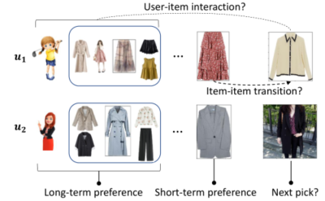
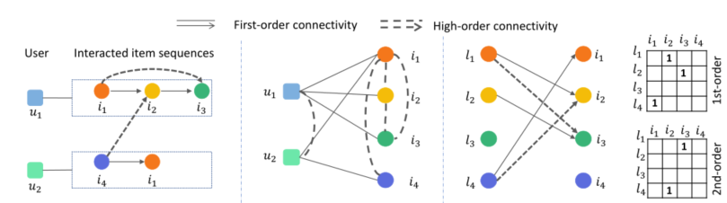

> 论文标题：Leveraging Two Types of Global Graph for Sequential Fashion Recommendation
>
> 发表于：2021 ICMR
>
> 作者：Yujuan Ding,Yunshan Ma
>
> 代码：https://github.com/JoanDING/DGSR
>
> 论文地址：https://arxiv.org/pdf/2105.07585v3.pdf

## 摘要

- 构建有效的顺序时尚推荐模型的关键在于捕捉两种类型的模式：用户的个人时尚偏好和相邻项目之间的过渡关系
  - 这两种模式通常分别与用户-项目交互和项目-项目转换建模有关
- 用户和物品的庞大集合以及稀疏的历史交互，很难训练出有效且高效的顺序时尚推荐模型
- 文章建议利用两种类型的全局图，即用户-项目交互图和项目-项目转换图，通过在图上合并高阶连接来获得增强的用户和项目表示
- 采用 LightGCN [10] 的图内核在两个图中进行信息传播，并提出了一种新的  项目-项目 转换图设计

## 结论

- 为了应对数据稀疏性的具体挑战并使模型易于学习，我们提出了 DGSR 模型。
- DGSR 利用两种类型的图，即用户-项目交互图和项目-项目转换图，更好地对 CF  信号和项目转换模式进行建模，并增强用户和项目嵌入。

## 未来工作

- 在隐式反馈之外加入额外的信息来丰富图的构建
  - 通过考虑更多的内容信息，例如属性或视觉特征，使得用户与项目或项目与项目之间的连接性可以更加丰富，从而进一步有助于缓解交互稀疏问题
- 在模型中引入更多的时尚领域知识，进一步增强用户和物品表示学习

## 介绍

- 构建有效的时尚顺序推荐系统的关键在于捕捉用户的个性化时尚偏好模式和项目的过渡模式
- 为了预测用户的下一个交互项目，
  - 我们不仅要预测用户-项目（缩写为 u-i）交互概率（与长期用户偏好相关），
  - 还要预测他的项目-项目（缩写为 i-i）（以前的选择和下一个选择）之间的转换概率。
- 个人偏好是长期的、静态的，可以从用户的整体历史行为中去探寻
- 用户的短期兴趣也会影响他们在特定时间点的选择
- u-i交互和i-i过渡模式在用户的在线购物体验中都很普遍，如何在一个统一的模型中对两者进行适当的建模是一个关键的研究问题
- 存在以下挑战：
  - 大量的项目和稀疏的历史交互导致时尚领域的数据严重稀疏
  - 多数现有的将 i-i 交互建模为图的方法效率低下，原因是图的构造不当或图核复杂
  - 现有方法中广泛应用的图内核，非常复杂，导致计算成本更高.
- 如何解决数据稀疏的问题，设计出有效且高效的 i-i 转换图是设计模型时最关键的考虑因素
- 提出了 Dual-Graph Sequential Recommender (DGSR) 方法
  - 为了解决数据稀疏问题，利用基于全局 u-i 交互和 i-i 转换的两种类型的图。
    - 通过在两个全局图上执行信息传播，用户和项目表示都将通过全局 u-i 协同过滤  (CF) 信号和 i-i 转换上下文来增强。
    - 高阶传播扩展了当前图中的连接，进一步缓解了数据稀疏问题
  - 提出了一种新设计，将 i-i 转换公式化为二分图。
    - 该图为每个项目分配了两个节点：一个用于该项目作为锚点的情况，另一个用于该项目作为目标的情况
    - 放弃了会话级图，纯粹利用全局图来考虑效率。
    - 采用 LightGCN [10] 作为图内核，以进一步降低计算成本。

## 模型架构

- 时尚推荐示意图
  
  - 旨在通过探索长期（u-i 交互）和短期（i-i 过渡）时尚偏好来预测用户的下一次交互
- 顺序推荐中的用户-项目交互图和项目-项目转换图
  

## 实验

- ### 研究问题

  - RQ1：提出的 DGSR 方法是否优于最先进的顺序和非顺序时尚推荐方法？
  - RQ2：模型中的每个技术组件是否有效，超参数和特定设置如何影响模型的性能？ 
  - RQ3：所提出的方法对不同稀疏度的数据表现如何，合并的图对推荐结果有何影响？

- ### 数据集

  - iFashion-SR :基于电子商务平台淘宝1生成的大规模时尚数据集
  - Amazon-Fashion:一个大规模的评论数据集,Clothing-Shoes-Jewelry 子集数据（2014 版）

- ### baseline

  - MF-based
    - MF:分解 u-i 交互矩阵并使用 BPR 损失进行优化。
    - FMC:专注于通过分解 i-i 转换矩阵来建模顺序动态。
    - FPMC：分别对 MF 和 FMC 的个性化 u-i 交互和“全局”i-i 转换进行建模。
  - Non-sequential with GNN
    - NGCF：利用二分图对 u-i 交互进行建模，这是典型的基于 GCN 的推荐模型。
    - LightGCN：NGCF 的轻量级版本，使用轻量图卷积核
  - Session-based with DNN
    - GRU4Rec：一种基于 RNN 的基于会话的推荐方法，它使用 GRU 对交互序列进行建模
    - Caser：一种基于会话的推荐方法，它将固定长度的历史交互项目的嵌入视为“图像”，并使用 CNN 对交互序列进行建模
    - SR-GNN：基于 GNN 的方法，它利用会话级 i-i 转换图来增强会话表示。

- ### 超参数设置

- ### 评估指标

  - Recall 
  - MRR 
  - NDCG