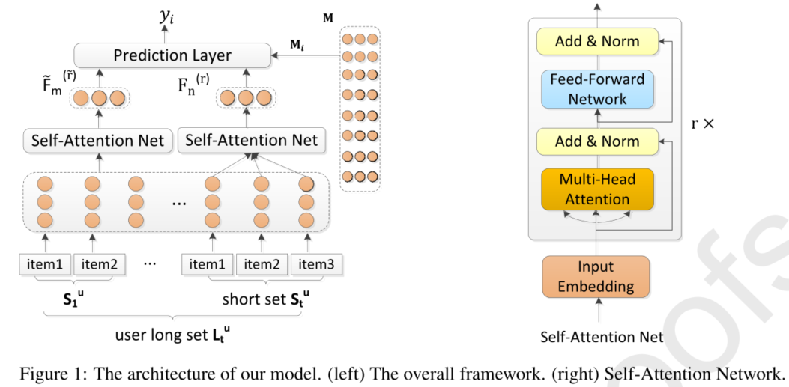

> 论文标题：Long- and Short-Term Self-Attention Network for Sequential Recommendation
>
> 发表于：2020   Neurocomputing
>
> 作者：Chengfeng Xua, Jian Fenga, Pengpeng Zhao
>
> 代码：
>
> 论文地址：https://sci.bban.top/pdf/10.1016/j.neucom.2020.10.066.pdf

## 摘要

- 现有基于 Self-Attention Network（SAN） 的模型不足以表征和区分用户的长期偏好和短期需求，
  - 因为它们没有强调序列的当前兴趣和时间顺序信息的重要性
- 研究提出了一种新颖的多层长短期自我注意网络（LSSA）用于顺序推荐。
  - 首先，根据时间跨度将一个用户的整个序列拆分为多个子序列。
  - 然后，第一个自注意力层根据最后一个子序列学习用户的短期动态，第二个自注意力层通过前面的子序列和最后一个子序列捕获用户的长期偏好。
  - 最后，我们将长期和短期表示整合在一起，形成用户最终的混合表示

## 结论

- 提出了一种新颖的两层长期和短期自我注意网络，用于下一个项目推荐。
  - 根据时间跨度将整个用户序列拆分为多个子序列。
  - 然后，使用两个多层自注意力网络对划分的长短序列进行建模，以捕捉用户动态多样的长期偏好和短期行为。
  - 最后，我们采用联合学习来训练模型，并自适应地考虑交互项目以生成准确的推荐

## 未来工作

- 将考虑使用更多的辅助信息（例如，项目内容和项目属性）来训练我们的模型以获得更准确的推荐

## 介绍

- 基于马尔可夫链 (MC) 的模型 [1, 2]，假设用户的下一个行为取决于前一个（或前几个），是顺序推荐的早期方法。
  - 在如此强的假设下，基于 MC  的方法可能难以捕捉复杂场景的复杂动态
- 循环神经网络（RNN）和卷积神经网络（CNN）等神经模型得到了深入研究，并对顺序推荐产生了影响
  - RNN 通过循环架构 [3, 4] 对长期依赖关系进行建模，而 CNN 可以通过输入序列 [5, 6] 的卷积操作隐式捕获局部特征
  - 缺点是都倾向于将用户的历史记录压缩到一个固定的隐藏状态向量中，无论序列中两个项目之间的距离如何，这都无法明确地捕获项目与项目之间的交互
- 现有的基于自我注意的方法在不考虑序列位置的情况下对依赖关系进行建模，导致时间顺序信息的丢失。
  - 因此，它们不足以表征和区分用户的动态和不断变化的长期偏好和短期需求，
- 文章提出了一种新颖的用于顺序推荐的多层长期和短期自我注意网络（LSSA），该网络同时考虑了用户的长期和当前兴趣。
  - 自注意力机制不仅可以保留上下文顺序信息，还可以在用户的整个历史序列中显式调用 item-item 交互，而不管他们的距离如何
  -  LSSA 中，我们使用术语“长集”来表示用户当前交互行为之前的所有历史行为，使用术语“短集”来表示用户当前的交互行为
  - 可以进一步区分每个动作在预测用户未来行为中可能扮演的不同角色
  - 首先将所有独特的项目嵌入到低维潜在空间中，根据时间跨度将一个用户的整个序列拆分为多个子序列。
  - 第一个自注意力层根据最后一个子序列学习用户的短期动态，
  - 第二个自注意力层通过前面的子序列和最后一个子序列捕获用户的长期偏好。
  - 最后，我们将长期和短期表示整合在一起，形成用户最终的混合表示此外，

## 模型架构

- LSSA
  

## 实验

- ### 研究问题

  - Q1：与其他最先进的模型相比，LSSA 的性能如何？ 
  - Q2：长期和短期偏好如何影响模型性能？
  - Q3：超参数的影响是什么，例如序列最大长度和嵌入大小？

- ### 数据集

  - Gowalla 
  - MovieLens-10M 
  - Foursquare

- ### baseline

  - 传统的非顺序方法
    - PopRec ：它根据训练数据中的流行度推荐前 N 个 rank-的项目，其中流行度由项目的重复次数决定。 
    - BPR-MF [15]  ：它结合了在隐式反馈数据上使用贝叶斯个性化排名损失的矩阵分解模型
  - 基于 MC 的方法
    - FPMC4 [1] 结合了矩阵分解和一阶马尔可夫链，用于下一篮子推荐，分别捕获用户的长期偏好 和序列信息，每个篮子都被视为我们数据中的一个会话。 
    - TransRec5 [34]  是一种具有翻译嵌入的最先进的一阶顺序推荐模型，它将项目嵌入到转换空间中，并将模型个用户作为翻译向量。
  - 基于深度学习的方法。
    - GRU4Rec6 [3] 是一种基于 RNN 的深度学习模型，用于基于会话的推荐。它利用会话并行小批量训练技术对用户动作序列进行建模。  
    - LANCR [35] 关注最近的，以获得用户的真正兴趣，然后分别通过 LSTM 和基于注意力的模型进行建模，用于用户的下一次点击推荐。 
    - RUM  [36] 首次提出利用记忆增强神经网络来改进顺序推荐，其中包含项目级和特征级两个变体
    - Att-BNN [37] 提出了一个具有   注意力的 Bi-GRU 神经网络，用于对用户的长期历史偏好和短期消费动机进行建模以进行顺序推荐
  - 基于注意力的方法
    - SHAN [23] ：采用两层分层注意网络来同时考虑用户的动态长期和短期偏好以进行顺序推荐
    - SASRec：它在每个时间步自适应地为先前的项目分配权重，而不使用递归或卷积

- ### 超参数设置

- ### 评估指标

  - Hit R@K、
  - NDCG@K 
  - MAP 