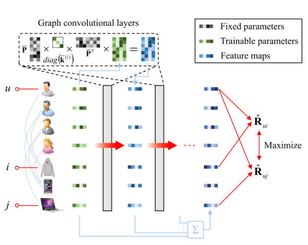
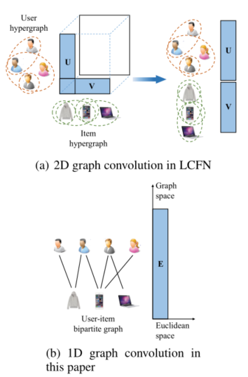

> 论文标题：Low-pass Graph Convolutional Network for Recommendation
>
> 发表于：2022 AAAI
>
> 作者：Wenhui Yu, Zixin Zhang, Zheng Qin
>
> 代码：https://github.com/Wenhui-Yu/LCFN
>
> 论文地址：https://www.aaai.org/AAAI22Papers/AAAI-3643.WenhuiY.pdf

## 摘要

- 谱图卷积对于大型图非常耗时，因此现有的图卷积网络 (GCN) 通过多项式重建内核，该多项式（几乎）是固定的
- 为了通过学习内核从图形数据中提取特征，提出了低通协同滤波器网络（LCFN）作为具有可训练内核的新范式
  - LCFN 有两个缺点：
  - 1)LCFN 中的超图是通过挖掘用户-项目二分图的 2 跳连接构建的，因此没有使用 1 跳连接，导致信息丢失严重。 
  - 2)LCFN  遵循 GCNs 的一般网络结构，因此结构是次优的。
- 为了解决这些问题，我们利用二分图直接定义图空间，并根据实验探索最佳网络结构。

## 结论

- 本文解决了低通图卷积网络中的两个问题：
- (1）仅使用 2-hop 连接，导致拓扑信息丢失。
  - 文章利用观察到的二分图直接定义图空间。二分图视为同构图设计一维低通图卷积直接利用一跳连接
- (2)  使用的模型结构相当不理想。设计了实验来探索所提出模型的最佳结构。

## 未来工作

- 验证文章的模型在其他图数据学习任务中的有效性。我们还希望在推荐任务中利用更多的图数据，例如知识图和社交网络

## 介绍

- 图卷积对于大图来说非常耗时，GCN通过将内核固定为一阶多项式来简化它，失去了提取特征的能力，只能通过图传播嵌入
- 为了缩小这一差距，提出了一种通过低通协同滤波器 (LCF) 简化（谱）图卷积的方法。
- 图卷积在频域中定义，信号的全频分量参与计算，经LCF滤波后，只保留极少比例的分量（低频分量）需要计算，效率大大提高
- LCF 和图卷积用于设计端到端 GCN，称为 LCF 网络 (LCFN)，其内核是可训练的
- LCF 的另一个好处是消除噪声。由于随机曝光和量化，观察到的交互反映了用户的偏好，但包含噪声
  -  Yu 和 Qin (2020) 指出用户偏好是低频，噪声是高频，因此可以通过 LCF 来区分
- 存在的问题1：
  - LCFN 使用 2D 图卷积，用 user-user 和 item-item  超图定义了二维的图空间。
    - 这些超图是由用户-项目二分图的2跳连接构成的，因此没有1跳连接，导致信息丢失
  - 由于特征图是大而密集的矩阵，它们在 LCFN 中被分解存储，使得交互矩阵的 2D 卷积退化为嵌入的两次 1D 卷积
  - 考虑到这个问题，我们利用观察到的二分图直接定义图空间。
    - 我们将二分图视为同构图并设计一维图卷积
- 存在的问题2：
  - LCFN 将注意力集中在引入新的图卷积上，同时简单地遵循 GCN  的一般网络结构和模型设置。
    - 使用了许多不必要的结构和次优的模型设置，增加了模型训练的难度，降低了模型的性能
  - 为了解决这些问题，我们设计了实验来探索所提出模型的最佳结构和设置

## 模型架构

- LGCN
  
- 1D和2D图卷积的区别
  

## 实验

- ### 研究问题

- ### 数据集

  -  Amazon 
  - Movielens

- ### baseline

  - MF 
  - GCMC 
  - NGCF
  - LightGCN 
  - LCFN 

- ### 超参数设置

- ### 评估指标

  - F1-score@K
  - NDCG@K