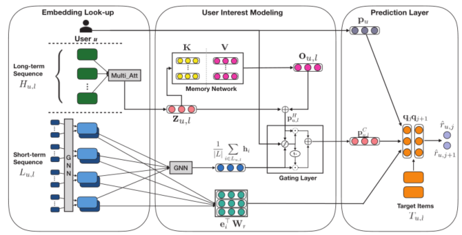

> 论文标题：Memory Augmented Graph Neural Networks for Sequential Recommendation
>
> 发表于：2020 AAAI
>
> 作者：Chen Ma, Liheng Ma, Yingxue Zhang
>
> 代码：
>
> 论文地址：https://arxiv.org/pdf/1912.11730.pdf

## 摘要

- 用户-项目交互的时间顺序可以揭示许多推荐系统中随时间演变和顺序的用户行为。
- 用户和项目的大量增加使得顺序推荐系统仍然面临着不小的挑战：
  - (1）短期用户兴趣建模的难度； 
  - (2）难以捕捉用户长期兴趣； 
  - (3)项目共现模式的有效建模。
- 提出了一种记忆增强图神经网络 (MA-GNN) 来捕捉长期和短期的用户兴趣.
  - 应用图神经网络对短期内的项目上下文信息进行建模，并利用共享内存网络来捕获项目之间的长期依赖关系。
    - 一般兴趣模块：采用矩阵分解项来模拟一般用户兴趣，而不考虑项目顺序动态
    - 短期兴趣模块：使用 GNN 聚合项目的邻居，以在短期内形成用户意图
    - 长期兴趣模块：使用共享键值记忆网络根据用户的长期项目序列生成兴趣表示
  - 为了有效地融合短期和长期利益，我们在 GNN 框架中加入了一个门控机制，以自适应地组合这两种隐藏表示。
    - 类似于长期短期记忆 (LSTM) 。控制了长期或短期利益表示对组合表示的贡献程度。
  - 除了对用户兴趣进行建模之外，还采用双线性函数来捕获相关项目的共现模式

## 结论

- 提出了一种用于顺序推荐的记忆增强图神经网络（MA-GNN）。 
- MAGNN 应用 GNN  对项目的短期上下文信息进行建模，并利用记忆网络来捕获长期项目依赖关系。
- 除了用户兴趣建模之外，我们还使用双线性函数来建模项目之间的特征相关性

## 未来工作

## 介绍

- 用户按时间顺序访问在线产品或项目。用户未来将与之交互的项目可能很大程度上取决于他/她过去访问过的项目
- 在顺序推荐任务中，除了所有一般推荐模型捕获的一般用户兴趣外，我们认为还有三个额外的重要因素：
  - 用户短期兴趣：在短期内给定几个最近访问的项目的用户偏好
  - 用户长期兴趣：较早访问的项目与用户将来将访问的项目之间的长期依赖关系
  - 项目共现模式：常见相关项目的联合出现，例如手机和屏幕保护膜

## 模型架构

MA-GNN 的模型架构。 ⊕ 表示逐元素加法， $\odot$表示逐元素乘法。

## 实验

- ### 数据集

  - MovieLens20M：从 MovieLens 网站收集的用户电影数据集；该数据集有 2000 万次用户电影交互
  - Amazon-Books 、Amazon-CDs ： Amazon 评论数据集，即 CDs 和 Books
  - GoodreadsChildren 和 Goodreads-Comics ）：goodreads 网站收集，重点关注儿童和漫画的类型

- ### 数据预处理

  - 将评分不少于 4 分（满分为 5  分）的评分保留为正反馈，并将所有其他评分视为所有数据集上的缺失条目。
  - 为了过滤噪声数据，我们只保留至少有十个评分的用户和至少有十个评分的项目

- ### baseline

  - (1) BPRMF，Bayesian Personalized Ranking based Matrix Factorization，一种学习成对项目排名的经典方法；
  - (2) GRU4Rec，Gated Recurrent Unit for Recommendation，它使用递归神经网络对项目序列进行建模，进行基于会话的推荐；
  - (3) GRU4Rec+，GRU4Rec  的改进版本，采用了先进的损失函数和采样策略； 
  - (4) GC-SAN，Graph  Contextualized Self-Attention Network，使用图神经网络和自注意力机制进行基于会话的推荐；  
  - (5）Caser，Convolutional Sequence Embedding Recommendation，通过卷积操作捕获高阶马尔可夫链； 
  - (6）SASRec，Self-Attention based Sequential  Recommendation，它使用注意力机制识别相关项目进行预测；
  - (7) MARank,  Multi-order Attentive Ranking model ，它统一了个体和联合级别的项目交互，从多个视图中推断用户偏好； 

- ### 超参数设置

- ### 评估指标

  - Recall@K 
  - NDCG@K.