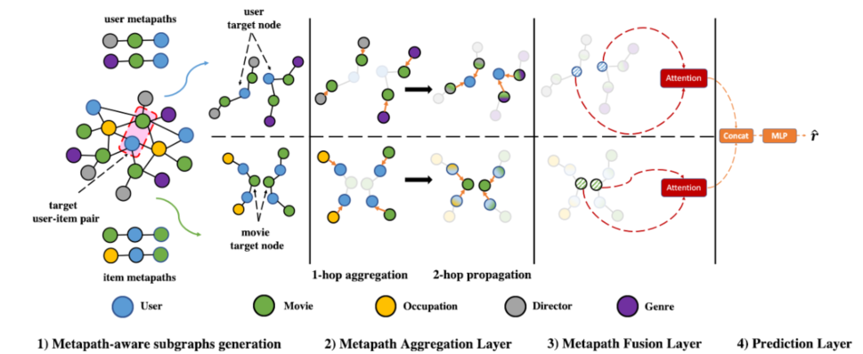

> 论文标题：Metapath and Entity-Aware Graph Neural Network for Recommendation
>
> 发表于：
>
> 作者：Muhammad Umer Anwaar, Zhiwei Han, Shyam Arumugaswamy
>
> 代码：https://github.com/ecml-peagnn/PEAGNN
>
> 论文地址：https://arxiv.org/pdf/2010.11793v3.pdf

## 摘要

- GNN中，消息传递迭代地聚合来自其直接邻居的节点信息，同时忽略多跳节点连接的顺序性质。
  - 此类顺序节点连接（例如元路径）为下游任务捕获关键见解。
  - 推荐系统 (RS) 中，忽视这些见解会导致协作信号的蒸馏不足
- 本文中使用协作子图 (CSG)  和元路径来形成元路径感知子图，它们显式地捕获图结构中的顺序语义。
- 提出了元路径和实体感知图神经网络（PEAGNN），
  - 它训练多层 GNN 在这些子图上执行元路径感知信息聚合。
  - 然后使用注意力机制融合来自不同元路径的聚合信息。
  - 最后，PEAGNN 为我们提供了节点和子图的表示，可用于训练 MLP  以预测目标用户-项目对的分数。
- 为了利用 CSG 的局部结构，我们提出了实体感知，它作为节点嵌入的对比正则化器。
- 此外，PEAGNN 可以与 GAT、GCN 和  GraphSage 等突出层相结合

## 结论

- 研究了在元路径中加入顺序语义进行推荐的必要性。
- 我们没有在图中混合多跳消息，设计了一个统一的 GNN 框架 PEAGNN，它显式地对生成的元路径感知子图执行独立的信息聚合。
  - 元路径融合层被训练来学习元路径的重要性，并以端到端的方式自适应地融合聚合的元路径语义
- 引入了一种称为实体感知的对比连接正则化器，它利用了图的一阶局部结构。
  - 对于一阶局部结构开发，实体感知用于用户节点和项目节点表示。

## 未来工作

## 介绍

## 模型架构

- 元路径聚合层，它明确地聚合元路径感知子图的信息。
- 元路径融合层，它使用注意力机制融合来自多个元路径感知子图的聚合节点表示。
- 预测层，读取 CSG  的图级表示并估计潜在用户-项目交互的可能性

- 图示说明：
  - MovieLens 数据集上提出的 PEAGNN 模型的图示。
  - 子图 (1) 显示了从具有给定用户和项目元路径的 CSG 生成的元路径感知子图。
  - 子图  (2)、(3) 和 (4) 说明了 PEAGNN 模型的元路径感知信息聚合和融合工作流程。为简单起见，只采用了 2 跳元路径。

## 实验

- ### 研究问题

  - RQ1：与其他基线方法相比，PEAGNN 的表现如何？ 
  - RQ2：实体意识如何影响 PEAGNN 的性能？
  - RQ3：不同的元路径在推荐任务中的影响是什么？

- ### 数据集

  - MovieLens-small、MovieLens-25M
  - Yelp

- ### baseline

  - NFM [14]： 利用神经网络来增强具有非线性的高阶特征交互。我们在输入特征上应用一个隐藏层神经网络。 
  - CFKG  [1]： 应用 TransE [4] 来学习异构节点嵌入并将推荐转换为链接预测问题。
  - HeRec [7] ：通过一组嵌入融合函数的联合学习扩展了矩阵分解模型。 
  - Metapath2Vec [7]：利用skip-gram 模型来更新由元路径引导的随机游走生成的节点嵌入。然后使用 MLP  来预测与学习嵌入的匹配分数。
  - NGCF [37]：将用户-项目二分图结构集成到协同过滤的嵌入过程中。
  - KGCN  [35]：利用带有感受野的多跳邻近信息来学习用户偏好。
  - KGAT [36] ：通过在知识图谱上使用学习的实体注意力执行注意力嵌入传播来整合高阶信息。
  - Multi-GCCF [33] ：在嵌入学习过程中明确地结合了多个图。 
    - Multi-GCCF不仅对高阶信息进行建模，还整合了item-item和user-user  paris的邻近信息。
  - LightGCN [15] ：通过仅维护用于协同过滤的邻域聚合来简化 GCN 的设计。

- ### 超参数设置

- ### 评估指标

  - Hit Ratio (HR) 
  - Normalized Discounted Cumulative Gain (NDCG)