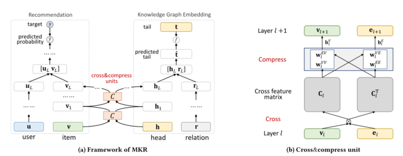

> 论文标题：Multi-Task Feature Learning for Knowledge Graph Enhanced Recommendation
>
> 发表于： 2019 WWW
>
> 作者：Hongwei Wang, Fuzheng Zhang, Miao Zhao
>
> 代码：TensorFlow：https://github.com/hwwang55/MKR
>
> ​			pytorch：https://github.com/hsientzucheng/MKR.PyTorch
>
> 论文地址：https://arxiv.org/pdf/1901.08907v1.pdf

## 摘要

- 协同过滤在推荐中存在稀疏性和冷启动问题，因此通常使用辅助信息来解决这些问题并提高推荐系统的性能
- 本文中将知识图谱视为辅助信息的来源。提出了 MKR，一种用于知识图增强推荐的多任务特征学习方法，一个深度端到端的框架
- MKR由两部分组成：推荐模块和 KGE 模块,这两个任务由交叉压缩单元关联，它们自动共享潜在特征并学习推荐系统中的项目与知识图谱中的实体之间的高阶交互。
- 交叉压缩单元具有足够的多项式逼近能力

## 结论

- MKR 是一个深度端到端的框架，由两部分组成：推荐模块和 KGE 模块
- 两个模块都采用多个非线性层从输入中提取潜在特征，并适应用户-项目和头部关系对的复杂交互。
- 两个任务不是独立的，而是由项目和实体连接的，在 MKR  中设计了一个交叉压缩单元来关联这两个任务
  - 交叉压缩单元可以自动学习项目和实体特征的高阶交互，并在两个任务之间传递知识

## 未来工作

- 在 MKR 框架中研究其他类型的神经网络（如 CNN）。
- 重新设计 cross&compress 单元将其他 KGE 方法作为 KGE 模块在  MKR 中的实现

## 介绍

- 知识图 (KG) 是 RS 的一种辅助信息，通常包含有关项目的丰富事实和联系
  - 几个学术和商业 KG，例如 NELL、DBpedia、Google Knowledge Graph 和 Microsoft Satori
- 由于KG高维性和异质性，KG 通常通过知识图嵌入 (KGE) 方法 [27] 进行预处理，该方法将实体和关系嵌入到低维向量空间中，同时保留其固有结构。
- MKR 是一个通用的端到端深度推荐框架，旨在利用 KGE 任务来辅助推荐任务。这两个任务不是相互独立的，而是高度相关的，因为 RS 中的一个项目可能与  KG 中的一个或多个实体相关联。
  - 因此，一个项目及其对应的实体很可能在 RS 和 KG 中具有相似的邻近结构，并在低级和非任务特定的潜在特征空间中共享相似的特征  [15]。
  - 设计了一个交叉压缩单元：cross&compress  单元显式地对项目和实体特征之间的高阶交互进行建模，并自动控制这两个任务的交叉知识转移。通过交叉压缩单元，项目和实体的表示可以相互补充，帮助这两个任务避免拟合噪声并提高泛化能力
  - 整个框架可以通过交替优化不同频率的两个任务来训练
- 本文研究的问题也可以建模为跨域推荐[26]或迁移学习[21]
- 本文的主要贡献正是将问题建模为多任务学习：发现任务间相似性不仅对推荐系统有帮助，而且对知识图谱也有帮助

## 模型架构

 

- (a) MKR 的框架。左右部分分别说明了推荐模块和KGE模块，它们由cross&compress单元桥接。
-  (b) 交叉压缩单元的图示。  cross&compress 单元通过交叉操作从项目和实体向量生成交叉特征矩阵，并通过压缩操作将它们的向量输出到下一层。

## 实验

- ### 数据集

  - MovieLens-1M：是电影推荐中广泛使用的基准数据集，由 MovieLens 网站上的大约 100 万个明确评分（范围从 1 到 5）组成。
  - Book-Crossing：数据集包含Book-Crossing 社区中书籍的1,149,780 个明确评级（范围从0 到10）。
  - Last.FM12 数据集：包含来自Last.fm 在线音乐系统的2000 名用户的音乐家收听信息。
  - Bing-News 数据集包含从 Bing News13 的服务器日志中收集的 1,025,192 条隐式反馈

- ### baseline

  - PER [39] ：将 KG 视为异构信息网络，并提取基于元路径的特征来表示用户和项目之间的连接性
  - CKE [40] ：将 CF 与结构、文本和视觉知识结合在一个统一的推荐框架中。
  - DKN [32] ：将实体嵌入和词嵌入视为多个通道，并在 CNN 中将它们组合在一起进行 CTR 预测。
  - RippleNet [31] ：是一种类似记忆网络的方法，可以在知识图谱上传播用户的偏好以进行推荐
  - LibFM [23] ：是一种广泛使用的基于特征的分解模型
  - Wide&Deep [3]： 是一种结合了（宽）线性通道和（深）非线性通道的深度推荐模型。

- ### 超参数设置

- ### 评估指标

  - 点击率（CTR）预测
    - AUC
    - ACC
  - top-K推荐
    - Precision@K
    - Recall@K