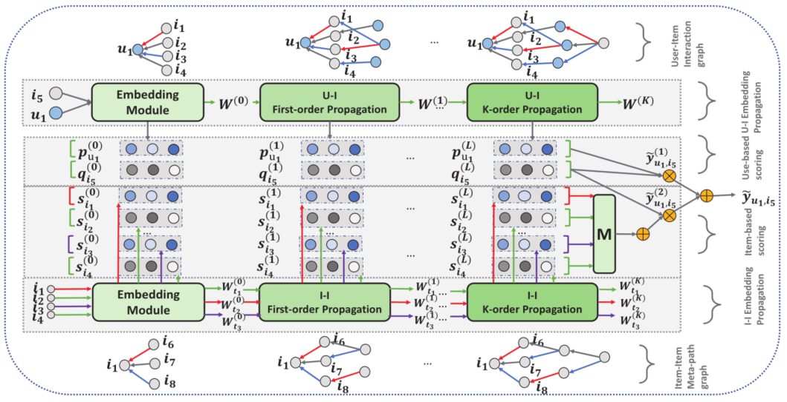
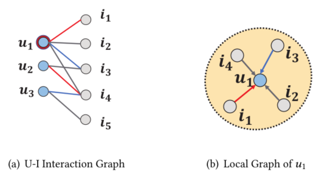
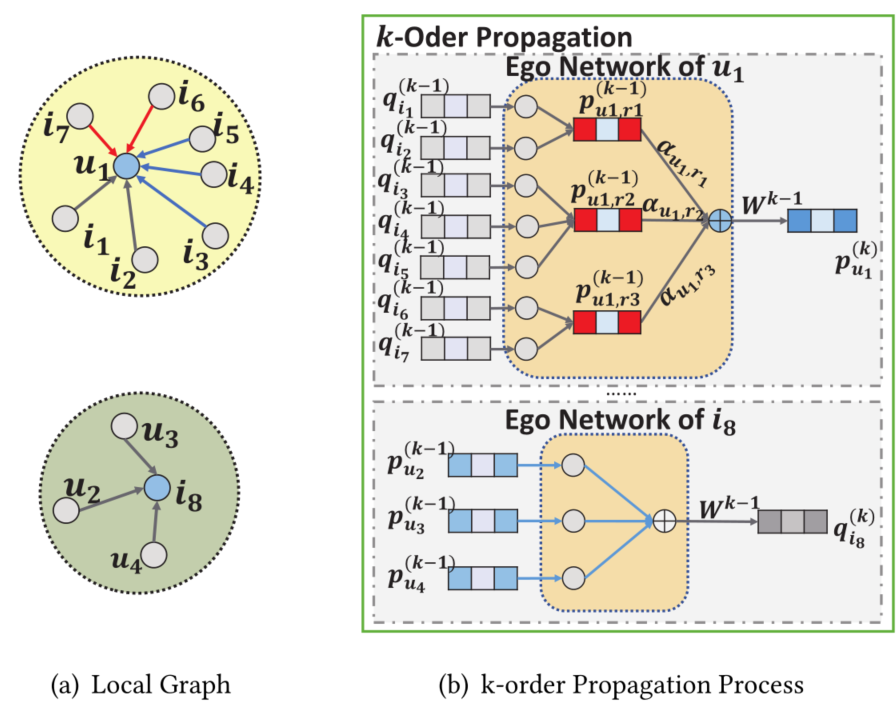
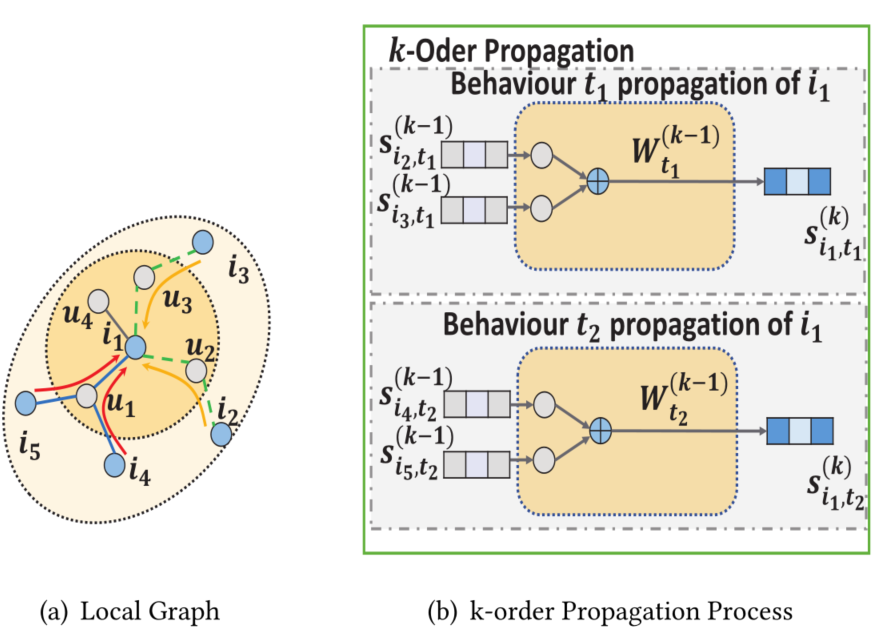

> 论文标题：Multi-behavior Recommendation with Graph Convolutional Networks
>
> 发表于：2020 SIGIR
>
> 作者：Bowen Jin, Chen Gao, Xiangnan He
>
> 代码：
>
> 论文地址：http://staff.ustc.edu.cn/~hexn/papers/sigir20-MBGCN.pdf

## 摘要

- 只使用一种用户-项目交互的传统推荐模型面临严重的数据稀疏或冷启动问题
  - 利用多种类型的用户-项目交互（例如点击和收藏）的多行为推荐可以作为一种有效的解决方案
- 多行为推荐的早期努力未能捕捉到行为对目标行为的不同影响强度。
  - 还忽略了多行为数据中隐含的行为语义。
- 本文提出构建一个异构图来表示多反馈数据，对每种行为的偏好强度没有任何限制
- 本文提出 MBGCN（Multi-Behavior Graph Convolutional Network  ）
  - 通过 user-item 传播层学习行为强度，通过 item-item 传播层捕获行为语义

## 结论

- 为了充分建模不同行为和各种行为语义所反映的不同偏好强度，工作将多个用户-项目交互矩阵重新构建为统一图
- 提出 MBGCN 模型，该模型利用了图卷积网络从复杂图结构中学习节点表示的能力。

## 未来工作

- 通过 A/B 测试对在线系统进行实验，以评估研究提出的解决方案的推荐性能。
- 在会话级别探索细粒度的多重交互，也称为多重微行为。

## 介绍

- 传统的 CF 模型 [17, 20, 21, 23, 27] 是针对单一类型的行为设计的，
  - 推荐系统应该有能力利用其他类型的行为，辅助行为，来帮助预测用户未来对目标行为的交互，这就是多行为推荐。
- 现有的研究 [3, 7, 10, 22, 26, 31, 33] 从两个方面着手这项任务。
  - 第一类在采样过程中利用多行为数据，并建立多采样对来加强模型学习过程
  - 第二类尝试设计模型以捕获多行为信息
- 存在问题：
  - 没有充分利用多种行为的强度：基于用户到项目的强度建模
    - 忽略对行为强度的建模会使一些有用的信号丢失
    - 将所有辅助行为粗略地视为较弱的行为是不合理的。
    - 多反馈推荐模型需要从数据中揭示和进一步利用不同行为类型的各种强度
  - 不考虑多种行为的语义：基于项目到项目的多种行为的语义。
    - 每种行为下的交互项之间应该有一些共同的特征或特殊关系
- 为了解决上述挑战：
  - 构建一个基于多种行为数据的统一异构图。
    - 将用户/项目表示为节点，将不同类型的行为表示为图的多种类型的边，
    - 基于用户到项目的强度和基于项目到项目的语义建模问题转向对异构边和项目用户建模-项目元路径
  - 提出了一种名为多行为图卷积网络 (MBGCN) 的解决方案，以利用图神经网络在从复杂边学习和图上的高阶连通性方面的强大能力来解决上述两个挑战
- 具体过程：
  - 构建了一个由两种节点（用户和项目）和多种边组成的异构图，其中连接用户节点和项目节点的边是指一种特定类型的用户-项目反馈
  - 首先，这种图结构的交互数据不会对偏好强度设置任何先前的约束或假设。
    - 为了捕捉不同行为的各种强度，为每个行为提出了行为感知项目到用户传播层，以将相邻项目节点的嵌入传播到用户节点。
      - 这使得模型能够区分不同辅助行为的不同强度。
  - 其次，我们设计了在项目节点的嵌入和共同交互的相邻（二阶）项目上运行的项目到项目传播层，
    - 这有助于捕获各种行为的项目相似性的不同 CF 语义，并增强对项目嵌入的学习

## 模型架构

- MBGCN
  
  - 节点 u1 是目标用户，i5 是目标项目
- 用户-项目多行为图
  
  - 节点u1是推荐的目标用户
- 行为感知的用户-项目传播
  
- 行为感知项目-项目传播
  

## 实验

- ### 研究问题

  - RQ1：引入多行为数据会提高推荐性能吗？与旨在从多行为数据中学习的最先进模型相比，我们的方法表现如何？ 
  - RQ2：item-to-user  传播权重和item-to-item 传播方法的不同设置如何影响我们模型的有效性？
  - RQ3：MBGCN 如何缓解冷启动问题？ 
  - RQ4：模型超参数（λ、消息丢失和节点丢失）如何影响我们模型的最终性能？

- ### 数据集

  - Tmall: 这是一个从中国最大的电子商务平台天猫收集的开放数据集。该数据集中记录了 41738 个用户和 11953  个具有四种行为类型的商品：购买、购物、收集和点击。 
  - Beibei: 这是从中国最大的婴幼儿用品电子商务平台贝贝获得的数据集。该数据集中收集了 21716 个用户和  7977 个具有购买、购物和点击三种行为的商品。

- ### baseline

  - 单行为模型
    - MF-BPR[27]： BPR 是一种广泛使用的方法，它优化成对损失，假设观察到的交互应该比未观察到的交互具有更高的分数。 
    - NeuMF[15]  这是最先进的神经CF 方法，它同时使用GMF 和MLP 来捕获用户-项目交互信号。
    - GraphSAGE-OB[13] ：GraphSAGE  ，它通过嵌入传播和聚合来丰富节点嵌入及其邻居信息。
      - 这里仅使用目标行为来构建用户-项目二分图，我们将此模型称为  GraphSAGE-OB。
    - NGCF-OB[37] ：NGCF ，它具有一些特殊设计，可以将图神经网络拟合到推荐系统中。
      - 与  GraphSAGE-OB 类似，这里仅使用目标行为来构建用户-项目二分图。
  - 多行为模型
    - NMTR[10]  这是用于多行为推荐的最先进的深度模型。作者假设行为之间存在严格的重要性顺序，在多任务学习框架下对每种类型的行为采用 NCF  [15]。
    - MC-BPR[22] ：它假设不同的行为反映了用户和项目之间不同的顺序偏好，这可以作为先验知识来构建更多样化的训练对。
    - GraphSAGE-MB[13] ：使用各种行为来构建用户-项目二部图，不同的行为被视为相同，使得图中只有一种边
    - NGCF-MB[37] ：GraphSAGE-MB 相同的方法为 NGCF-MB 构建图。
      - 由于 NGCF  使用了各种行为，因此模型学习到的嵌入可能具有更强的表示能力
    - RGCN[30] ：针对不同类型的边缘设计了不同的传播层来捕获边缘信息

- ### 超参数设置

- ### 评估指标

  - Recall@K 
  - NDCG@K