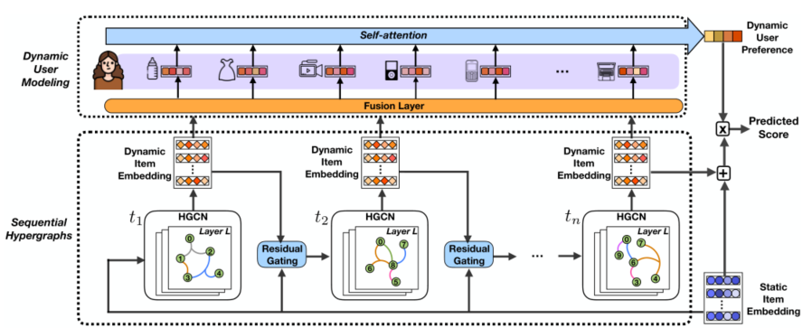

> 论文标题：Next-item Recommendation with Sequential Hypergraphs
>
> 发表于：2020 SIGIR
>
> 作者：Jianling Wang，Kaize Ding，Liangjie Hong
>
> 代码：https://github.com/wangjlgz/HyperRec
>
> 论文地址：https://par.nsf.gov/servlets/purl/10180425

## 摘要

- 虽然项目的语义会随着时间和用户的变化而变化，但短期内由用户交互定义的项目相关性可以被提炼以捕捉这种变化，并有助于揭示动态的用户偏好。
- 文章开发一种由顺序超图构成的下一项推荐框架
  - (i) 采用超图来表示短期项目相关性，并应用多个卷积层来捕获超图中的多阶连接；
  - (ii) 使用残差门控层对不同时间段之间的连接进行建模； 
  - (iii) 配备融合层，将动态项目嵌入和短期用户意图结合到每个交互的表示中，然后将其输入到自注意力层以进行动态用户建模。

## 结论

- 探索了现实世界场景中项目的动态含义，并提出了一种由序列超图构成的下一个项目推荐框架，结合动态项目嵌入的短期项目相关性
- 通过堆叠超图卷积网络、残差门控和融合层，使其能够提供更准确的用户偏好建模

## 未来工作

- 跨平台或跨域传输动态模式以提高预测性能

## 介绍

- 在下一项推荐中取得了良好的成功，旨在根据过去的顺序交互预测用户的下一个动作。如何在此类模型中处理项目
  - 在下一个项目推荐的某个时间段内，文章认为项目的含义可以通过用户交互定义的相关性在短期内揭示出来
  - 为了捕捉项目语义的这些变化，文章建议在超图 [1, 11] 中对此类短期项目相关性进行建模，其中每个超边可以连接单个边上的多个节点。
    - 虽然超图中的每个节点都表示一个项目，但超边可以将用户在短时间内与之交互的一组项目连接起来
- 从项目相关性超图中提取富有表现力的项目语义困难
  - 由超边编码的项目相关性不再是二元的（成对的），而是三元的、四元的或更高阶的
  - 项目语义可以通过多个跃点传播
    - 例如，在图 （2019 年 9 月）中，虽然不是由同一用户购买，但 iPhone 8 也与 Apple Lightning数据线带有 2  跳连接相关
    - 因此，需要设计一种有效地利用超图来学习表达性项目语义的设计
  - 如何捕捉项目的动态含义
    - 项目的语义会随着时间和用户的变化而变化
    - 在一个时间点，一个项目也可以为不同的用户带来不同的含义
    - 因此，如何捕捉上述两个观点—随时间变化和跨用户变化很重要
- 文章从两个角度研究项目的动态 ，来改进下一个项目推荐的重要性
  - 1.随着时间的变化和用户之间的变化 
  - 2.利用项目之间的短期相关性。
- 开发一种具有顺序超图的新型下一个项目推荐框架，以生成包含项目之间短期相关性的动态项目嵌入。
  - 为了理清不同时间段的短期相关性，HyperRec 根据时间戳截断用户交互以构建一系列超图
    - 借助超图卷积网络 (HGCN)，HyperRec 能够聚合具有直接或高阶连接的相关项，以在每个时间段生成动态嵌入
  - 该框架的两个独特方面是用于控制来自过去的残差信息的残差门控层，以及用于编码每个交互的融合层，包括动态项目嵌入和用于序列模式建模的短期用户意图
    - 残差门控层，将前一个时间段的动态项目嵌入与静态项目嵌入相结合，以生成 HGCN 的输入
    - 来自 HGCN 的嵌入将被输入融合层，以生成包含动态项目嵌入和短期用户的每个特定用户-项目交互的最终表示

## 模型架构

- HyperRec
  
  - 基于不同时间段的项目相关性构建一系列超图，HGCN  能够捕获多跳连接中的相关性。
  - 从前一个时间段产生的动态项目嵌入可以通过残差门控层影响未来的项目嵌入。
  - 动态项目嵌入和短期用户意图都融合在一起，以表示动态用户建模的每个交互
-  
  - 一个项目在某个时间段的意义可以通过短期内用户交互定义的相关性来揭示，
  - 并且项目的含义会随着时间的推移和用户之间的变化而变化。这种动态有助于揭示用户的偏好模式
  - 示例说明：
    - iPhone 8 是在 2017 年发布时与其他几款最新设备（如 Nintendo Switch）一起购买的，表明它是当时的热门新技术产品。
    - 一旦像 iPhone  11 这样的新版本在 2019 年发布，iPhone 8 就成为一种预算选择，因为它可以与其他价格合理的设备一起购买（例如，Nintendo Switch  的精简版或早期一代 AirPods）。
    - 同样，我们可以推断用户A购买的花束是用于婚礼的，因为她还购买了通常与婚礼相关的物品。

## 实验

- ### 研究问题

- ### 数据集

  - Amazon ：
  - Etsy ：数据集包含 2006 年 11 月至 2018 年 12 月期间销售手工艺品的最大电子商务网站之一的购买记录。
  - Goodreads：来自一个图书阅读社区，用户可以在其中对图书进行标记、评分和撰写评论

- ### 数据预处理

  - Amazon ：混合了来自不同类别的购买数据而不是按类别进行实验。我们使用评论时间戳来估计购买的时间戳。移除少于 50  次购买的商品。我们保留在切割时间戳之前购买至少 5 件商品并在切割时间戳之后购买至少 2 件商品的用户
  - Etsy ：剔除交易量少于 50 笔的产品，然后过滤掉 2018 年之前少于 5 笔交易或 2018 年少于 2 笔交易的用户
  - Goodreads：保留了在 2017 年之前与超过 5 本书互动的用户，以及在 2017 年至少与 2 本书互动的用户

- ### baseline

  - PopRec：人气推荐。这种简单的方法根据物品的受欢迎程度对物品进行排名，并推荐最热门的物品。
  - TransRec：基于翻译的推荐[14]。 TransRec  使用用户特定的翻译操作对交互序列中不同项目之间的转换进行建模。 
  - GRU4Rec+：具有 Top-k 增益的递归神经网络 [16]。作为 GRU4Rec  [17] 的改进版本，该模型采用 GRU 对顺序用户行为进行建模，并使用一类新的损失函数来提高 Top-K 增益。
  - TCN：用于下一项推荐的简单卷积生成网络[44]。该基线改进了典型的基于 CNN 的 next-item 推荐模型，带有掩码过滤器和堆叠的 1D  扩张卷积层，用于建模远程依赖关系。
  - HPMN：具有个性化记忆的终身序列建模[25]。 HPMN  由分层周期性记忆网络提供支持，可同时捕获用户的多尺度顺序模式，从而可以将近期用户行为与长期模式相结合。
  - HGN：用于顺序推荐的分层门控网络[22]。该方法包含一个特征门控和一个实例门控，用于在进行下一个项目推荐时分层选择项目的特征和实例以供用户建模。 
  - SASRec：自注意力顺序推荐[18]。它采用自注意力层来捕获用户交互序列中的动态模式。它可以被视为 HyperRec  中动态用户建模组件的简化版本，以使用静态项目嵌入来表示每个交互。
  - BERT4Rec：具有来自 Transformer [31]  的双向编码器表示的顺序推荐。该基线利用双向自注意力模块从左右两侧捕获用户历史行为序列中的上下文信息。

- ### 超参数设置

- ### 评估指标

  - HIT@K
  - NDCG@K
  - MRR