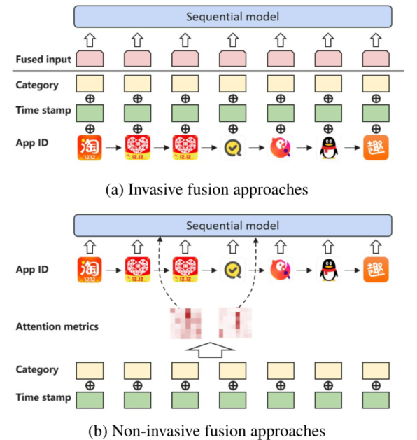
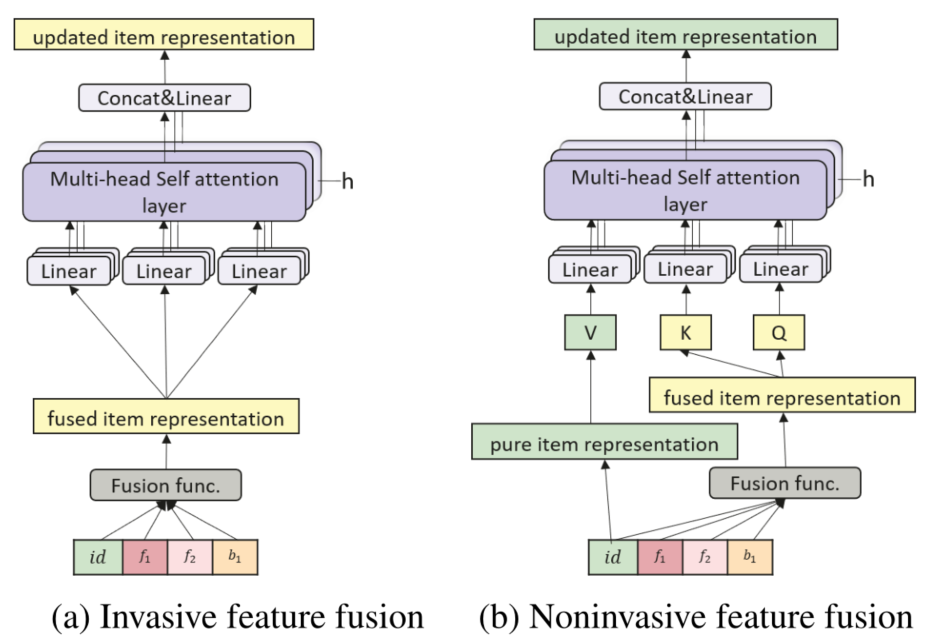
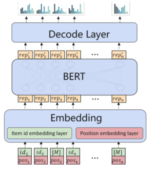
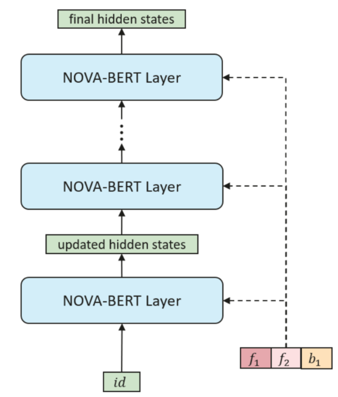

> 论文标题：Non-invasive self-attention for side information fusion in sequential recommendation
>
> 发表于：2021 AAAI
>
> 作者：Chang Liu, Xiaoguang Li, Guohao Cai
>
> 代码：
>
> 论文地址：https://arxiv.org/pdf/2103.03578v1.pdf

## 摘要

- 在 BERT 框架下利用各种类型的信息仍是一个挑战
- 使用其他辅助信息（例如项目类别或标签）可以进行更全面的描述和更好的推荐
- 本文发现直接将辅助信息类型融合到项目嵌入中的简单方法，通常带来的影响很小甚至是负面的
- 在本文中，我们提出了 NOn in Vasive self-Attention 机制（NOV A），以在 BERT 框架下有效地利用辅助信息。
  -  NOV A  利用辅助信息来生成更好的注意力分布，而不是直接改变项目嵌入，因为这可能会导致信息过多。

## 结论

- 提出了 NOV A-BERT 推荐系统和非侵入性自我注意机制 (NOV A)。
  - NOV A  机制不是将边信息直接融合到项目表示中，而是利用边信息作为方向指导，并使项目表示未掺杂在其向量空间中。

## 未来工作

- 在每一层融合边信息可能不是最好的方法，还需要更强的融合功能
- 继续研究和改进方法以实现更高的在线性能，并将其部署到工业产品中

## 介绍

- BERT 框架在许多任务上都实现了 SOTA 性能，但还没有系统地研究如何利用不同类型的边信息。
  - 除了项目 ID  之外，利用诸如评级和项目描述等辅助信息来进行更全面的描述，从而提高预测准确性是很有吸引力的
  - BERT 框架最初设计为只接受一种类型的输入（即单词 ID），限制了辅助信息的使用。
- 现有方法通常侵入性地利用辅助信息，但效果不佳。从理论上讲，辅助信息应该通过提供更多数据而受益。
  - 设计能够有效利用额外信息的模型是一项挑战。
- 本文研究如何在成功的 BERT 框架下有效地利用各种辅助信息
  - 提出了一种新颖的非侵入性自我注意机制（NOVA），它可以通过辅助信息持续提高预测精度
    - 一种能够对复合序列数据进行自我注意的新颖设计

## 模型架构

- NOVA方法
  
  - 侵入式方法不可逆地融合各种信息，然后将它们输入序列模型。
  - 对于非侵入性方法，辅助信息只参与注意力矩阵的计算，而项目信息保存在一个独立的向量空间中
- 特征融合的侵入式和非侵入式自我注意方式的比较
  
  - 都用一个融合函数来融合项目相关和行为相关的辅助信息，但是NOVA只在Query & Key中融合它们
- BERT4Rec
  
  - 项目 ID 和位置分别编码为向量，然后作为集成项目表示加在一起。
  - 在训练期间，项目 ID 被随机屏蔽（显示为 [M]）以供模型恢复。
- NOVA-BERT
  
  - 每个 NOV A 层都有两个输入，项目表示和边信息。

## 实验

- ### 研究问题

  - 效力。 NOVA-BERT 方法是否优于传统的侵入性特征融合方法？ 
  - 彻底性。 NOVA-BERT  的组件对改进有何贡献（例如，不同类型的边信息、融合功能）？ 
  - 可解释性。边信息如何影响注意力分布从而提高预测准确性？ 
  - 效率。 NOVA-BERT  在未来实际部署的效率方面表现如何？

- ### 数据集

  - ML-1m 
  - ML-20m 
  - APP

- ### baseline

  - BERT4REC
  - BERT + Invasive methods

- ### 超参数设置

- ### 评估指标

  - HR@K
  - NDCG@K