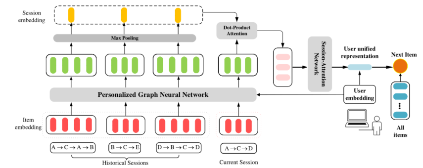

> 论文标题：Personalized Graph Neural Networks with Attention Mechanism for Session-Aware Recommendation
>
> 发表于：SCI二区(IEEE TKDE)
>
> 作者：Mengqi Zhang, Shu Wu, Meng Gao
>
> 代码：https://github.com/CRIPAC-DIG/A-PGNN
>
> 论文地址：https://arxiv.org/pdf/1910.08887v4.pdf

## 摘要

- 会话感知推荐问题旨在根据用户当前会话和历史会话预测用户的下一次点击。
- 存在的问题：
  - 现有的会话感知推荐方法在捕获复杂的项目转换关系方面存在缺陷
  - 现有方法大多数未能明确区分不同历史会话对当前会话的影响
- 本文提出了一种新颖的方法，具有注意机制的个性化图神经网络 (A-PGNN)。 
- A-PGNN主要由两部分组成：
  - 一个是Personalized  Graph Neural Network（PGNN），用于提取每个用户行为图中的个性化结构信息，与传统的Graph Neural  Network（GNN）模型相比，它考虑了角色节点嵌入更新时的用户。
  - 另一个是Dot-Product  Attention机制，它利用Transformer网络来显式地模拟历史会话对当前会话的影响。

## 结论

- A-PGNN 通过 PGNN 捕获每个用户行为图中项目之间的复杂转换关系。
- 使用 Dot-Attention  机制来显式地建模历史会话对当前会话的影响，从而可以轻松捕捉用户的长期表现

## 未来工作

- 通过结合动态图神经网络来提高 PGNN 的灵活性和可扩展性。
- 探索更有效的注意力机制来整合用户的长期和短期兴趣

## 介绍

- 预测匿名会话的下一次交互称为基于会话的推荐，通常，可以利用用户的身份和过去的行为来进行下一步点击预测，这称为会话感知推荐
- 多数现有的基于序列的会话感知方法很难在会话内和跨会话捕获复杂的模式。其次，一些会话感知方法无法明确区分不同历史用户会话对当前会话的影响，他们都忽略了历史会话对当前会话的细粒度影响，使得模型不足以利用历史信息
- 本文考虑改进SR-GNN 模型 [6] 中会话图的构建：
  - 根据用户当前和历史会话构建个性化图，用户行为图。
  - 为了进一步加强每个用户不同会话之间的关联，设计了一个个性化图神经网络  (PGNN)，
    - 该网络在更新节点嵌入时考虑用户的角色。
  - 使用 Transformer [13] 的注意力机制来模拟历史会话对当前会话的每个项目的显式影响。
- 提出了一种新方法 Personalized Graph Neural Networks with Attention Mechanism  (A-PGNN)。
  - 它包含两个主要组件：PGNN 和 Dot-Product Attention 机制。
  - 首先将每个用户的所有会话转换为一个图，然后将其依次输入  PGNN 和 Dot-Product 网络

## 模型架构

#### 

- 基于用户的所有会话，我们首先构建用户行为图。
- 然后，我们将用户行为图与项目和用户嵌入一起输入 PGNN  以获得项目表示。
- 接下来，我们利用最大池化层来获取历史会话嵌入。
- 在此之后，可以通过点积注意力组件获得包含用户历史偏好的当前会话的表示。
- 最后，利用  Session-Attention 网络生成用户的动态表示，并将其与用户的静态嵌入相结合，得到统一的用户表示进行最终预测。

## 实验

- ### 数据集

  - Xing：RecSys Challenge 2016 发布的 Xing 数据
  - Reddit：社交新闻和讨论网站

- ### baseline

  - POP： 推荐训练集中排名靠前的 K频繁项。
  - Item-KNN [17] ：根据会话内项目的共现计算项目到项目的余弦相似度。
  - FPMC [19]：  是一种基于个性化马尔可夫链的序列预测方法。
  - SKNN [44]： 从训练集中选择最相似的会话来检索候选项目以进行推荐
  - VSKNN [45]： 是基于顺序扩展的 SKNN。
  - GRU4Rec [2] ： 在基于会话的推荐场景中应用改进的 RNN。
  - SR-GNN [6]： 利用门控图神经网络来捕获项目的复杂转换关系，用于基于会话的推荐。
  -  H-RNN [10]  [11] ：使用由基于会话和用户级 RNN 组成的分层 RNN  来模拟用户兴趣的跨会话演化。由于[10]和[11]在模型架构上相似，我们只选择两个模型中最好的结果作为比较，统称为H-RNN。 
  - HierTCN [12]：  利用包含RNN 和时间卷积网络的层次结构来捕获长期兴趣和短期交互。

- ### 超参数设置

- ### 评估指标

  - Recall@K
  - MRR@K