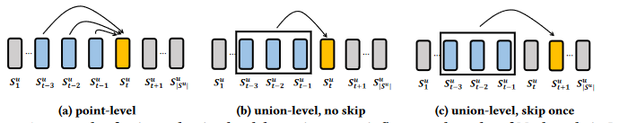
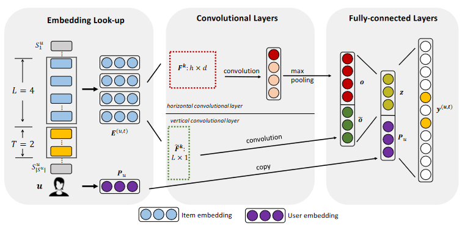

> 论文标题：Personalized Top-N Sequential Recommendation via Convolutional Sequence Embedding
>
> 发表于：2018 WSDM
>
> 作者：Jiaxi Tang, Ke Wang
>
> 代码和数据：https://github.com/graytowne/caser_pytorch
>
> 论文地址：https://arxiv.org/pdf/1809.07426.pdf

## 摘要

- Top-N 顺序推荐将每个用户建模为过去交互的一系列项目，旨在预测用户可能在“不久的将来”交互的排名前 N 的项目
- 提出了卷积序列嵌入推荐模型（Caser）
- 想法是将一系列最近的项目嵌入到时间和潜在空间中的“图像”中，并使用卷积滤波器将顺序模式作为图像的局部特征来学习

## 介绍

- Top-N推荐[9] [19]，根据用户的一般偏好的推荐项目，而无需关注物品的新近度，一般偏好是用户的长期和静态行为，

- 另一种类型的用户行为是顺序模式，其中下一个项目或动作更可能取决于用户最近从事的项目或操作。顺序模式代表用户的短期和动态行为，并来自项目之间的一定关系在近距离的时间内。

- ### 之前工作的限制

  - 基于马尔可夫链的模型 [2, 6, 21, 30],
    - 无法对联合级顺序模式建模
    - 不允许跳过行为

- Caser 的新颖之处在于将前面的 L 个项目表示为 L × d 矩阵 E，其中 d 是潜在维度的数量，并且矩阵的行保留了项目的顺序

  - 将此嵌入矩阵视为潜在空间中 L 个项目的“图像”，并使用各种卷积滤波器搜索顺序模式作为该“图像”的局部特征
    - 这个“图像”没有在输入中给出，必须与所有过滤器同时学习

- ### 工作贡献

  - (1)Caser  使用水平和垂直卷积滤波器在点级、联合级和跳跃行为上捕获序列模式。
  -  (2) Caser  对用户的一般偏好和顺序模式进行建模，并在一个统一的框架中概括了几种现有的状态方法。
  -  (3) 在现实生活数据集上，Caser 优于最先进的 top-N  顺序推荐方法。

## 结论

- Caser 通过将最近的动作建模为时间和潜在维度之间的“图像”，并使用卷积过滤器学习顺序模式，是一种新颖的 top-N 顺序推荐解决方案。
- 这种方法提供了一个统一灵活的网络结构，用于捕获顺序推荐的许多重要特征，即点级和联合级顺序模式、跳过行为和长期用户偏好。

## 模型架构

- Embedding Look-up
- Convolutional Layers
- Fully-connected Layers

## 实验

- ### 数据集: 应用了顺序关联规则挖掘，并计算了它们的顺序强度 ：Sequential Intensity (SI) = $\frac {\#rules}{
  \#users}$

  - MovieLens
  - Gowalla
  - Foursquare
  - Tmall

- ### baseline

  - POP：所有物品在所有用户的序列中按其受欢迎程度进行排名，而受欢迎程度由交互次数决定。
  - BPR：结合矩阵分解模型，贝叶斯个性化排名[20]是对隐式反馈数据进行非序列项目推荐的最先进方法。
  - FMC 和 FPMC。如[21]中介绍的，
    - FMC：将一阶马尔可夫转移矩阵分解为两个低维子矩阵，FPMC是FMC和LFM的融合。
    - FPMC ：在每一步都允许一篮子若干物品。对于我们的顺序推荐问题，每个篮子都有一个项目。 
  - Fossil： [6] 对高阶马尔可夫链进行建模，并使用相似度模型而不是 LFM 来建模一般用户偏好。 
  - GRU4Rec：这是[8]提出的基于会话的建议。该模型使用 RNN 来捕获顺序依赖关系并进行预测。
  
- ### 评估指标

  -  Precision@N 
  -  Recall@N 
  -  Mean Average Precision (MAP)