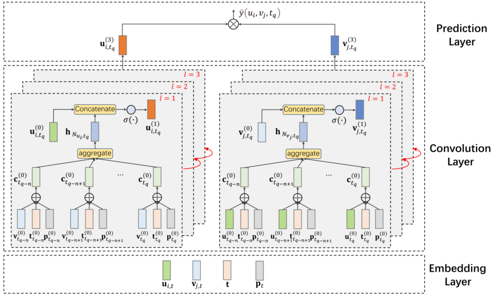

> 论文标题：Position-enhanced and Time-aware Graph Convolutional Network for Sequential Recommendations
>
> 发表于：2021 ACM Transactions on Information Systems 
>
> 作者：Liwei Huang, Yutao Ma, Yanbo Liu
>
> 代码：https://github.com/drhuangliwei/PTGCN
>
> 论文地址：https://arxiv.org/pdf/2107.05235v2.pdf

## 摘要

- 顺序推荐（也称为下一个项目推荐）旨在根据用户的历史行为预测会话中要推荐的后续项目
- 大多数现有的基于深度学习的方法利用循环神经网络架构或自注意力来模拟用户历史行为之间的顺序模式和时间影响，并了解用户在特定时间的偏好
- 有两个主要缺点：
  - 专注于从以用户为中心的角度对用户的动态状态进行建模，并且总是忽略项目随时间的动态
  - 只处理一阶用户-项目交互，没有考虑用户和项目之间的高阶连接
- 文章通过 二分图结构 对用户-项目交互进行建模，并提出一种基于位置增强和时间感知图卷积网络（PTGCN）的顺序推荐方法。
- 需要解决的挑战：
  - (1）同时建模顺序模式和交互的时间影响；
    - 在图卷积操作中定义了一个自注意力聚合器，以统一的方式对用户行为的顺序模式和交互的时间动态进行建模。
  - (2) 捕捉用户与物品之间的高阶协同信息，及时更新用户（或物品）嵌入
    - 使用图卷积操作生成用户和项目的动态嵌入，然后堆叠多层图卷积以对高阶协作信息进行建模。
- 提出了一种基于 GCN 的具有自注意力的模型。它可以对用户-项目二分图中的高阶连通性进行显式编码，以统一的方式通过多层图卷积学习用户和项目的动态表示
- 设计了一个自注意力聚合器，通过集成用户（或项目）最近与之交互的项目（或用户）的隐藏特征来自适应地获得每个用户（或项目）的动态表示。聚合器可以同时建模顺序模式和时间影响

## 结论

- 提出的模型PTGCN可以同时对用户和项目的时间动态进行建模
- 可以捕获用户和项目之间的高级交互信息（即高阶连接），从而为用户和项目生成更具表现力的表示。

## 未来工作

- 将自我监督学习，如 SimCLR [68] 和 MoCo [69] 集成到 PTGCN 中，并利用更多辅助信息源，如知识图谱和社交网络  [70]，以及时间和位置信息
- 探索更高效的解决方案，使 PTGCN 能够在面向海量用户的基于会话的在线场景中工作
- 进一步改进 PTGCN 以便它可以在严格的冷启动推荐情况下工作

## 介绍

- 以往的序列推荐算法（或模型）大多关注按交互时间排序的动作序列的单向链结构
- 大多数 [5]、[6]、[7]、[8]、[9]、[12] 仅考虑用户行为的时间动态，而忽略了项目属性的时间动态
- 大多数现有方法在定义模型训练的损失函数时只考虑直接的用户-项目交互（即一阶连通性），而忽略了嵌入在用户-用户和项目-项目交互中的重要协作信息
- 前些基于 GCN 的推荐模型无法捕获短期和长期的顺序信息，很难在顺序推荐场景中很好地工作
- 因此，最近的研究试图用不同的序列到图的解决方案对用户偏好建模
  - 一种直接解决方案是将 GNN 架构和注意力机制应用于由项目序列  [16]、[17]、[18] 构建的图
  - 另一种解决方案是在顺序上下文中用注意力集中的 GCN 编码高阶连接 [19]，这可以更好地表示用户之间的行为相似性
  - 缺点：都不能通过以统一的方式同时对用户和项目的时间动态进行建模，从而在用户-项目交互图中明确编码用户和项目之间的高阶连接性
- 需要解决的挑战：
  - (1）同时建模顺序模式和交互的时间影响；
    - 在图卷积操作中定义了一个自注意力聚合器，以统一的方式对用户行为的顺序模式和交互的时间动态进行建模。
  - (2) 捕捉用户与物品之间的高阶协同信息，及时更新用户（或物品）嵌入
    - 使用图卷积操作生成用户和项目的动态嵌入，然后堆叠多层图卷积以对高阶协作信息进行建模。
- 文章提出了位置增强和时间感知图卷积网络 (PTGCN) 模型。
  - 构建了一个包含用户和项目之间交互的二分图，并设计了一个具有时间和订单信息的特定图卷积，通过整合用户与项目（或用户）的隐藏特征来表达用户（或项目）嵌入。或项目）最近互动过
    - 在图卷积操作中提出了一个自注意力聚合器，它可以同时对用户和项目的顺序模式进行建模，以学习用户和项目在每一时刻的动态嵌入
    - 在用户-项目二部图上执行多层图卷积，以学习每个节点的协作信号以及两个连续连接顺序之间的关系（例如，一阶和二阶用户-项目交互） ）

## 问题定义

- ### 交互

  - U表示用户集，V表示项目集，$i_{u,v,t}$表示用户u和项目v在时间点t发生的动作，四元组表示：$i_{u,v,t} = (u,v,p,t)，$p表示交互集中的位置索引(按时间排序)

- ### 用户项目交互图

  - 用户项目交互图G，节点集U,V不相交。图G中的每条边，代表V的一个顶点连接到U的一个顶点。

- ### 用户邻居

  - 用户的领域是用户U进行交互的有序子集，包括时间点tq之前最近的n个交互，表示为：$N_{u,t_q} = ${$i_{u,v,t_m}|v\in V,q-n≤m≤q$}

- ### 项目邻居

  - 项目的领域是项目v进行交互的有序子集，包括时间点tq之前最近的n个交互，表示为：$N_{v,t_q} = ${$i_{u,v,t_m}|u\in U,q-n≤m≤q$}

- 如果当前时间之前的历史交互次数没有达到n，我们将使用填充操作

- ### 节点流

  - 一个节点的节点流是一个以该节点为根的树状结构。它由根节点和M（M≥1）层组成，每个层都有一组通过邻域采样的相同类型的节点。更具体地说，在用户项交互图中，在不同跃点中到达的目标节点的邻居被放置在节点流的不同层中
  - 用节点流的概念来表征二分图中节点之间的高阶连通性。通过广度优先搜索算法或其他改进算法在实践中可以很容易地实现高阶连通性

- ### 顺序推荐

  - 给定一个由历史交互 {$i_{u,v,t}$ } 构建的用户-项目交互图，对于目标用户 u 在时间点 $t_N$ ，顺序推荐的目标是预测用户 u 最有可能与之交互的项目 $t_{N+1}$。

## 模型架构

- PTGCN
  
  
  - ### 嵌入层，生成四种类型的嵌入，即用户嵌入、项目嵌入、时间嵌入和位置嵌入
  
    - #### 总
  
      - 用户索引、项目索引、交互时间和每次交互在用户邻域（或项目邻域）中的绝对位置编码到共享的潜在空间中
      - 使用用户邻域来更新用户嵌入，项目邻域来更新项目嵌入
      - 对它们执行加法操作以获得每个交互的隐藏表示
  
    - #### 用户embedding和项目embedding
  
      - 每次交互$i_{u_i,v_j,t}$，对用户和项目索引进行直接查找操作得到用户嵌入$u_{i,t}$和项目的嵌入$v_{j,t}$
  
    - #### 时间embedding
  
      - 将时间信息嵌入到低维向量中的两种方法
        - 场嵌入方法通过定义连续泛函∅(∙) 将时间间隔从时域映射到 d 维向量空间，为每个数值场学习单个场嵌入
        - 离散化方法 [51] 使用各种启发式离散化策略将数值特征转换为分类特征，然后使用分类策略分配嵌入。
          - 在[51]中，经过的时间被分割成长度呈指数增长的间隔
          - 在 [0, 1), [1, 2), [2, 4), 范围内映射时间。 . . , [2k, 2k + 1) 转化为 0, 1, 2,  . . , k + 1的分类特征。
          - 不同的交互组可能有不同的时间切片粒度。
          - 然后，我们对分类时间特征进行直接查找以获得时间点t 的时间嵌入**t**。
        - 本次研究使用离散化方法，对每个交互$i_{u_i,v_j,t}$在$N_{u_i,t}或N_{v_j,t}$,可以获得t时间点的时间嵌入**t**
        - 然后对每次的交互$i_{u_i,v_j,t}$，利用用户u在时间t邻域$N_{u_i,t}$得到新向量$u_{i,t}$，以及项目v在时间t邻域$N_{v_j,t}$得到新向量$v_{i,t}$
        - 利用$N_{u_i,t}或N_{v_j,t}$中两次连续交互之间的时间间隔和时间点t来模拟历史交互对$u_i,v_i$当前状态的影响
  
    - #### 位置embedding
  
      - 根据每次交互的时间信息在用户邻域或项目邻域中对用户-项目交互的位置信息（更具体地说，相对位置）进行编码
        - 使用Transformer中的位置编码提出的位置编码方法，
          - 不引入额外的参数，并且可以推断出比预定义的固定长度更长的序列长度
          - 位置编码与输入嵌入具有相同的维度
        - 在用户-物品交互图中选取时间点t之前最新的n个邻居构成用户邻域和物品邻域
      - 对于每一次交互 $i_{u_i,v_j,t}$,，我们可以得到对应的位置嵌入 $p_{i,t}$
  
  - ### 卷积层，通过使用设计的位置增强和时间感知图卷积对高阶连通性进行建模来细化用户和项目的嵌入
  
    - #### 位置增强和时间感知图卷积
  
      - 给定节点 u ($N_u$) 的邻居集在第 l 次迭代中包含其直接邻居，GCN 通过连接其当前表示 $h^{(l-1)}_u$及其相邻特征的聚合$h^{(l-1)}_{N_u}$来更新节点的嵌入 $h^{(l)}_u$。这样的标准图卷积可以形式化为
        - $h^{(1)}_u = \sigma(W^{(l)}CONCAT(h^{(l-1)}_u,h^{(l)}_{N_u}))$
      - 大多数现有 GCN 模型的一个基本限制是它们未能捕获每个节点在邻域中的位置信息
      - 本文通过结合来自交互的顺序和时间信息，提出了一种位置增强和时间感知的图卷积。
      - 给定$u_i$在时间$t_q$的邻域($N_{u_i,t_q}$ = {$\large i_{u_i,v_j,t_q}|v\in V,q-n≤m≤q$})，包含tq之前与$u_i$交互的最新n个交互，
        通过聚合$N_{u_i,t_q}$中的n个交互来更新用户嵌入
      - 对于所有的用户-项目交互，位置增强和时间感知图卷积定义为
        - 用户动态表示
          - $\large h^{(l)}_{N_{u_i,t_q}} = AGGREGATE((v^{t-1}_{j,t},t,p_{j,t})|i_{u_i,v_j,t}\in N_{u_i,t_q})$
            $\large u^{(1)}_{i,t_q} =W_{U_2}·\sigma(W_{U_1}CONCAT(u^{(l-1)}_{i,t_q},h^{(l)}_{N_{u_i,t_q}}))$
        - 项目动态表示
          - $\large h^{(l)}_{N_{v_j,t_q}} = AGGREGATE((u^{t-1}_{i,t},t,p_{j,t})|i_{u_i,v_j,t}\in N_{u_i,t_q})$
            $\large v^{(1)}_{i,t_q} =\sigma(W_{V_2}·CONCAT(W_{V_1}·v^{(l-1)}_{i,t_q},h^{(l)}_{N_{u_i,t_q}}))$
  
    - #### 聚合器
  
      - 大多数 GCN 模型都忽略了节点邻域中的节点顺序
      - 设计了一个使用自注意力机制的聚合器。
        - 自注意力聚合器的关键思想是通过相应的时间嵌入和位置嵌入来丰富每个用户特征和项目特征
        - 有 K 个相同的非线性层，每个层都包含一个 自注意力层、一个前馈层和一个 vanilla attention 层。
      - 自注意力层：聚合项目、时间、位置嵌入，
      - 逐点前馈层：用两个线性变换和两个变换之间的整流线性单元 (ReLU) 激活，将非线性引入卷积层
      - Vanilla attention层：取出最后一个前馈层的输出进行归一化权重计算
      
    - #### 堆叠卷积
  
      - 通过一阶连通性建模增强的表示，我们可以堆叠更多的位置增强和时间感知图卷积来捕获二分图中的高阶连通性。通过堆叠图卷积，用户（或项目）可以从其 l-hop 邻居接收协作信息
      - 算法：生成用户嵌入
        - 输入：二分图G，用户批量大小{u}，时间t，每个用户的最近交互集合$N_{u,t}$,节点类型{user:0,item:1},层L，
          			特定类型转换矩阵W，不同的聚合函数，邻居函数N(间隔，类型)：根据节点类型返回用户邻域或物品邻域
        - 输出：每个用户u在时间t的向量表示$Z_{u,t}$
        - 在第l次迭代中，我们首先根据节点类型（用户或物品）计算目标节点的邻域，然后应用图卷积生成目标节点的第l层表示。
            - 如果目标节点是用户节点，则邻域函数返回其在二分图中的项目邻域
            - 最后一个卷积层的输出就是最终的输出embedding:$Z_{u_i,t} = u^{(L)}_{i,t}$,
            - 同理获得项目动态表示：:$Z_{v_j,t} = v^{(L)}_{j,t}$,
  
  - ### 预测层，聚合细化的用户嵌入和项目嵌入，然后为每个用户-项目对输出一个分数
  
    - 在执行堆叠的多层卷积之后，我们在每个历史交互时刻获得用户的表示
    - 利用所有历史交互时刻的表示和用户的历史行为序列来预测未来的行为偏好
    - 因此对于目标用户$u_i$和给定时间点$t_N$，进行前向多层图卷积操作，得到用户的表示$Z_{u_i,t}$和目标物品的表示$Z_{v_j,t}$。
    - 最后用内积运算来预测用户对目标物品的偏好$\hat y(u_i,v_j,t_N) = (Z_{u_i,t})^T·Z_{v_j,t}$
    -  PTGCN 模型是归纳的，所以我们使用历史时刻的用户和项目嵌入来更新新交互时刻的用户和项目嵌入，然后在不重新训练模型的情况下预测未来可能的交互。然而，我们在这项工作中使用内积作为交互函数来实现用户序列学习。
  
  - ### 模型优化
  
    - 考虑到用户交互总是隐含的，采用[9]中使用的负采样技术来优化项目的排名
      - 对于特定的正输出 $\hat y(u_i,v_j,t_N)$，我们在时间点 t 采样一个负项 $v'_t$。
      - 因此，我们可以为每个交互 $\large i_{u_i,v_j,t}$, 构建一个训练实例$\large s_{u_i,v_j,t} =<NF_{u_i,t},NF_{v_j,t}, NF_{v'_j,t}, >$，包括用户节点流$NF_{u_i,t}$, 、项目节点流$NF_{v_j,t} $和 项目节点流 $NF_{v'_j,t}$在 t 处的负（或称为未观察到的）项目 v'。
      - 使用二元交叉熵作为损失函数以无监督方式训练 PTGCN。
      - 考虑到我们的目标是预测目标用户在特定时刻感兴趣的项目，我们基于用户和项目的动态嵌入来定义交互的损失函数项。
      - 对于所有历史用户交互，训练过程的目的是优化 PTGCN 的参数，使每次交互的$u_i和v_j$在 t 时刻的输出嵌入尽可能借鉴，使$u_i和v'_j$之间的差异尽可能大
      - 损失函数：$\large -\sum_{s_{u_i,v_j,t}\in D}[log(\sigma(\hat y(u_i,v_j,t))) + log(1-\sigma(\hat y(u_i,v_j,t)))] + λ||W||$
  
- 用户-项目交互图中的高阶连通性
  

  - 三个用户(u1,u2,u3),四个项目（𝑣1，𝑣2，𝑣3，𝑣4）
  - 图 (b) 显示了两个植根于项目𝑣2 的树状结构，它们分别表示𝑣2 在𝑡5 和𝑡4 处的高阶连通性
  - 𝑣2 和𝑣4 在𝑡5 有两条路径（即𝑣2 → 𝑢1 → 𝑣4 和𝑣2 → 𝑢3 → 𝑣4），这表明𝑣2 和𝑣4 在𝑡5  处具有高度相似性。
  - 考虑到𝑢2 在𝑡2 与𝑣4 交互，更有可能在𝑡5 向𝑢2 推荐𝑣2。如果我们只考虑一阶连通性，我们就无法根据 𝑣2 和 𝑣4 在 𝑡5  的相似性做出适当的推荐。

## 实验

- ### 研究问题

  - RQ1：PTGCN  能否在顺序推荐任务中超越最先进的基线？ 
  - RQ2：对项目的时间动态进行建模是否有利于顺序推荐？ 
  - RQ3：高阶连通性是否有助于更好的推荐性能？

- ### 数据集

  - MovieLens-1M
  - Amazon CDs_and_Vinyl 、AmazonMovies_and_TV

- ### baseline

  - 非顺序方法：
    - BPR[57]。它通过成对排序损失对候选项目的顺序进行建模，而不考虑顺序模式
  - 顺序方法：
    - GRU4Rec+[6]。 GRU4Rec [58] 的改进版本， 采用了不同的排序损失函数和采样策略的基于 RNN 的基于会话的推荐方法
    - Caser[8]。一种基于卷积序列嵌入的顺序推荐方法。将一系列最近的项目嵌入到“图像”中，并使用卷积滤波器将顺序影响建模为“图像”的局部特征。
    - SASRec [5]。该方法是基于Transformer提出的。只使用的自注意机制来捕获顺序模式，并使用一种注意机制来基于相对较少的动作进行预测。
    - BERT4Rec  [36]。该方法是基于 BERT [59] 的顺序推荐方法。BERT4Rec  利用双向自注意力对用户的行为序列进行建模。 
    - TiSASRec [9]。此方法是 SASRec  的改进版本。与SASRec相比，TiSASRec同时使用交互的绝对位置和不同交互之间的时间间隔来提高顺序推荐性能。
    - DGCF[60]。该方法是一种基于二分图的动态推荐系统，它捕获项目和用户的协作和顺序关系，并使用三种更新机制同时更新用户和项目嵌入。它将用户和物品的高阶连接性与简单的多层感知器（MLP）融合在一起，并且不考虑时间和订单信息。
    - DHCN[43]。该方法是一种基于 GCN 架构的基于会话的推荐方法。它引入了自监督学习来训练超图卷积网络，以提高下一个项目的推荐性能。

- ### 超参数设置

- ### 评估指标

  - Recall@K
  - NDCG@K