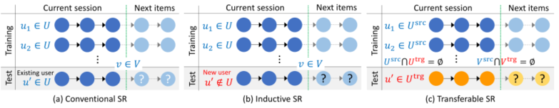
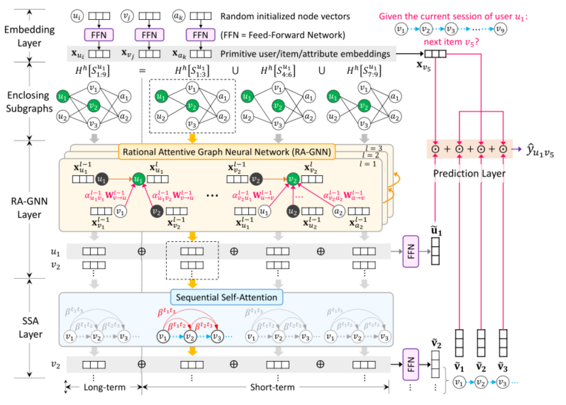
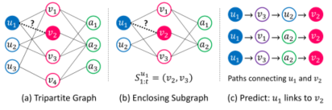
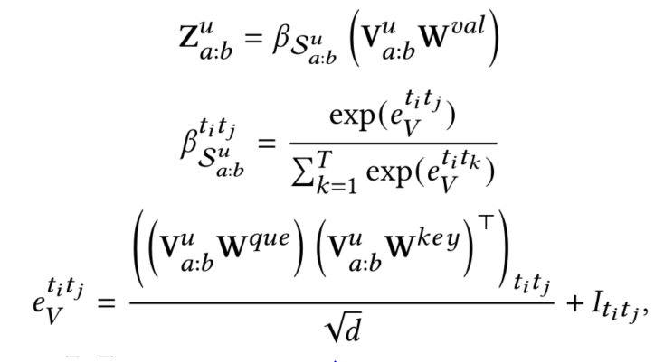
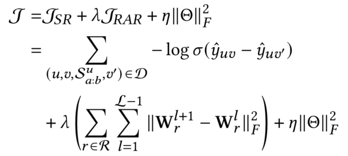

> 论文标题：RetaGNN:Relational  Temporal  Attentive Graph Neural Networks for Holistic Sequential Recommendation
>
> 发表：2021 WWW
>
> 作者：Cheng Hsu，Cheng-Te Li
>
> 源码地址：https://github.com/retagnn/RetaGNN
>
> 论文地址：https://arxiv.org/pdf/2101.12457v1.pdf

## 摘要

顺序推荐（SR）是根据用户当前访问的项目准确地推荐项目列表。

- 当新来的用户不断进入现实世界时，一项关键任务是拥有归纳SR，它无需重新训练即可产生用户和物品的嵌入。
- 考虑到用户与项目之间的交互可能极为稀疏，另一个关键任务是拥有可转移的SR，它可以将来自具有丰富数据的一个域的知识转移到另一个域。

- 在这项工作中，我们的目的是提供同时适用于传统，归纳和可转移设置的整体SR。

为整体SR提出了一个新颖的基于深度学习的模型，即**关系时序注意力图神经网络**（RetaGNN）。

RetaGNN的主要思想是三个方面。

1. 为了具有归纳和可转移的能力，我们在从用户-项目对中提取的局部子图上训练关系注意力GNN，
   - 其中可学习的权重矩阵基于用户，项和属性之间的各种关系上，而不是节点或边上。
2. 用户偏好的长期和短期时间模式是通过提出的**顺序自注意机制**进行编码的。
3. 设计了一种**关系感知正则化术语**，以更好地训练RetaGNN。

在MovieLens、Instagram 和 Book-Crossing 数据集上进行的实验表明，RetaGNN在传统的，归纳和可转移的设置下可以胜过最新技术。派生的的注意力权重还带来了模型的可解释性

## 总结与未来工作

- 总结
  - RetaGNN 的归纳和可转移能力来自于学习以目标用户-项目对为中心的封闭子图中的关系注意力权重矩阵。
  - RetaGNN 的性能改进在于通过 RA-GNN 层更好地建模用户和项目之间的顺序高阶交互，以及通过顺序自注意力层更好地建模用户偏好的时间模式
- 可拓展工作
  - 可以基于基础知识图关联项目。希望通过联合 学习整体 SR 和知识图嵌入来更好地表示用户和项目
  - RetaGNN 能够执行归纳学习，SR 任务可以扩展到会话推荐，从聊天机器人对话中收集的用户反馈可以立即投入 RetaGNN 以更新用户和项目嵌入

## 1.介绍

- SR 考虑用户-项目交互的时间顺序，并建立用户最近连续交互的项目和下一个项目选择之间的相关性模型。给定一个用户最近访问的项目序列，SR的目标是了解用户的顺序偏好以便准确地推荐未来的项目，Rs 旨在捕捉用户对项目的全局偏好。SR 的目标是学习序列模式的用户-项目交互的基础上最近的项目序列。
- 换句话说：SR需要建立用户长期和短期兴趣和意图的模型来预测下一个项目。
- 主流的 RS 方法之一是矩阵分解。矩阵分解以传感方式生成用户和项目的嵌入，即在训练过程中利用丰富的用户-项目交互当有。新用户或从未与现有用户交互过的不可见项时，就无法学习它们的嵌入。
- 归纳矩阵补全 技术(IMC)[33,42]通过利用用户和项目的内容信息来处理这样的问题。
  - 用户属性或项目标记被用作新用户/项目和现有用户/项目之间的桥梁
- PinSage 进一步诉诸于与项目相关的视觉和文本内容来进行归纳
- 因子化可交换的自动编码器（Factorized exchangeable autoencoder ，FEAE），但其不能扩展到大的用户项矩阵
- 最新的IGMC[39] 提出了一种基于图形神经网络(gnn)的 IMC 模型
  - 该模型依赖于项目内容，只需要本地用户-项目子图，从而实现了归纳和可扩展的 RS
- 虽然现有的一些RS方法已经能够进行归纳学习，但最先进的顺序推荐模型，如HGN[14]、HAM[17]和MA-GNN[15]，仍然具有传导性，归纳性SR的任务还没有得到正式的探索。本文旨在建立一种有效的归纳SR模型。此外，我们认为现有的SR模型还可以进一步改进，因为目前还没有考虑到两个因素。第一种是在给定序列的长期和短期内对高阶用户项目交互进行建模。用户的多跳协作邻居在交互图中的顺序演化可以揭示用户偏好是如何随时间变化的。第二个是序列项的派生表示中的时态模式。下一项的采用可能会受到具有不同权重贡献的近期项的影响。

- 在具有固定的用户、项目及其交互集合的特定领域中，给定用户最近交互的项目序列，主要目标有三方面：
  - 
    - 第一个是传统的SR:准确推荐下一个项目。
    - 第二种是归纳SR:向新加入的用户推荐现有用户集中不包含的下一项。
    - 第三种是可转移SR:为一个给定用户的项目序列推荐下一个项目，在这个项目序列中，用户和项目都属于另一个域。也就是说，我们的目标是有一个整体的SR模型，可以在常规的、归纳的和可转移的环境下预测下一个项目。
  - 同时处理三个SR设置是一个难点
    - 因为模型的可学习参数不应该附加到一个特定的节点(对于归纳)或一个特定的数据集(对于可转移)。也就是说，该模型需要捕获可见/不可见节点和各种数据集之间共享的公共知识。
- 为了实现上述的SR目标，RetaGNN有四个主要想法
  - 首先，RetaGNN建立在单个用户项对的局部图模式上，其中的图涉及用户、项和属性之间的关系。我们从给定的已有的连续用户-项目交互中提取由给定用户-项目对包围的局部子图，并学习将这样的子图映射到它们的交互得分。
  - 其次，为了同时具有归纳和转移的能力，我们提出了一个关系注意GNN  (RA-GNN)层来建模顺序上下文中的高阶用户-项目交互。
    - RA-GNN在RetaGNN中通过在各种关系上而不是在图中的节点上训练可学习的权值矩阵来执行消息传递和邻域聚合机制。
    - 基于这两种思想，只要我们能够得到给定用户-物品对的局部子图，无论用户是否可见，都可以应用关系权重在归纳和可转移的设置下生成用户和物品嵌入
  - 第三，我们提出了一个顺序自注意(SSA)层来编码由RA-GNN生成的序列项嵌入的时间模式
  - 最后，在损失函数中引入关系感知的正则项，使RetaGNN中与关系相关的可学习参数得到更好的训练。

## 问题描述

在推荐系统的上下文中，我们有一组 𝑀 个用户 U  = {$𝑢_1，𝑢_2，…，𝑢_𝑀$}和一组𝑁个项目 V  = {$𝑣_1，𝑣_2，…,𝑣_𝑁$}。

- 基于用户的隐式反馈，用户-物品交互矩阵表示为$𝑌∈R^{𝑀×𝑁}$，其中$𝑦_{𝑢𝑣}$=  1表示用户𝑢与物品𝑣交互;否则，$𝑦_{𝑢𝑣}$=  0。

用户 𝑢 可以在不同的时间步骤中顺序地与许多项交互。一个连续的相互作用的项目序列称为一个会话。

- 给定一个用户𝑢，我们表示它的一个会话𝑆𝑢=($𝑠^𝑢_1，𝑠^𝑢_2，…，𝑠^𝑢_𝐿$)，其中𝐿=  |𝑆𝑢| 为会话长度𝑆𝑢，$s_i^u$∈V为用户已交互的项目索引。我们还将用户𝑢与之交互的项目集表示为$𝑉_𝑢$。
- 设A为项目属性的集合，A  ={$𝑎_1，𝑎_2，…，𝑎_𝑘$}，其中𝑘是项目属性值的总数。可以将项𝑣的属性值集表示为A𝑣。

有了这些符号，可以从三个方面定义整体顺序推荐问题。

- (1)传统顺序推荐(CSR):
  - 假设每个用户𝑢∈U的早期会话 $S^u_{1:t}$ (𝑡<𝐿)，我们的目标是向每个用户推荐项目集 V 中的项目列表。换句话说，目标是预测用户 𝑢 是否会在时间 𝑡 之后与项目 𝑣 ∈ V 交互（即，推荐项目列表中的项目是否会出现在 ground truth   $S^u_{t:L}$ 中）。
- (2)归纳顺序推荐(ISR):
  - 给定每个用户 𝑢 ∈ U• 的早期会话 $S^u_{1:t}$  (𝑡 < 𝐿)，我们的目标是向每个用户推荐项目集 V 中的项目列表 𝑢 ′ ∈ U ◦  ，其中 U• 是可见用户集，U◦ 是未见过用户集（用户没有出现在训练阶段），并且 U• ∩ U◦ = ∅。也就是说，目标是返回一个项目列表（来自  V），一个看不见的用户 𝑢 ′ ∈ U◦将在不久的将来与之交互
- (3)转移顺序推荐(TSR):
  - 给定源域中每个用户 𝑢 ∈ $U^{src}$ 的早期会话 $S^u_{1:t}$  (𝑡 < 𝐿)，我们的目标是生成具有可转移参数 Θ  的顺序推荐模型，可以推荐项目列表来自每个用户的项目集 $V^{src}$ 𝑣 ∈ $U^{src}$。然后通过将可转移参数 Θ 应用于具有用户集 $U^{trg}$ 和项目集 $V^{trg}$  的目标域，其中 $U^{src}$ ∩ $U^{trg}$ = ∅ 和 $V^{src}$ ∩ $V^{trg}$ = ∅，我们可以准确地向每个用户推荐项目列表（来自 $V^{trg}$）𝑢 ' ∈ $U^{trg}$  。

## RetaGNN模型流程图

针对整体顺序推荐的RetaGNN模型概述。输入会话$S^u_{1:9} = (v1, v2，…，  v9)$由用户u1创建，下一个预测项是v5。我们利用用户u1和条目v2作为目标对(v1, v2)来提取封装子图并执行RA-GNN。⊕表示连系，⊙表示点积。

RetaGNN 由五个阶段组成。

- **首先**，我们利用单层前馈网络 (FFN) 来生成用户、项目和属性的原始嵌入。

  - 我们首先考虑随机初始化所有用户、项目和属性值的表示向量。原因是归纳和迁移学习。
  - 节点上随机初始化的“固定大小”向量允许我们在同一组学习模型权重下更新新出现的未见过节点（用于归纳）和跨数据节点（用于可转移）的嵌入。
    - 原因是我们在构建的图中学习模型权重的方向边关系，它独立于节点和数据集。
    - 因此，RetaGNN  可以将新节点和跨数据节点的随机初始化向量投影到相同的嵌入空间中，以实现归纳和可转移的效果。
  - 通过将随机初始向量馈送到嵌入层，即单隐藏层前馈网络  (FFN)，我们可以为每个用户、项目和属性值生成一个低维实值密集向量。我们将这种密集向量称为原始嵌入。
  - 让嵌入为 X ∈ $R ^{𝑞×𝑑} $，其中 𝑑  是嵌入维度，𝑞 是训练数据中用户、项目和属性值的数量之和。给定一个特定用户 𝑢 的会话  $S^u_{1:t}$ ，其对应的嵌入矩阵可以表示为：$ X _{S^u_{1:t}}$ = [$x_1 · · · x_𝑗 · · x_𝑡$]，其中 $ X _{S^u_{1:t}}$ ∈$ R ^{𝑡 ×𝑑}$ 和 $x_𝑗$ ∈ $R _𝑑 $是 $S^u_{1:t}$  中第 𝑗 项的原始嵌入，可以从原始嵌入矩阵 X 中检索到。请注意，这里我们不使用固定长度的独热编码初始化向量。原因是 one-hot  编码对于新用户和跨域用户/项目是不可扩展的，因此禁止新用户和其他域用户生成他们的原始嵌入。

- **其次**，我们为每个目标对 提取长期和短期 ℎ-跳 的封闭子图，这些目标对 是通过将用户和它在不同时间范围内的每个交互项目配对而编译的。

  - 构建了一个全局三方图 H 来表示用户、项目和项目属性之间的关系
  - 设三方图为 H = (N, E)，其中节点集 N 是用户集 U、项目集 V、属性值集 A 的并集，即 N = U ∪ V ∪ A。边集 E = $E^{UV} ∪  E^{VA}$，其中 $E^{UV} 和  E^{VA}$ 分别是连接用户与项目的边集，以及连接项目与其属性值的边集。
  - 也就是说，同类型节点之间没有边，用户和物品属性值之间也没有边
  - 图 3(a) 给出了三方图的一个玩具示例。请注意，三方图 H 是基于不同的培训课程构建的，即以下小节中描述的长期和短期培训课程
    - 
      - a:三方图 		b：封闭子图 		c：预测用户 u1 和项目 v2 之间交互的路径。
  - 三方图的目的：
    - 首先，通过用户-项目交互的路径可以反映协同过滤的效果。
      - 例如在图 3(c) 中，为了确定是否向用户 𝑢1 推荐商品 𝑣2，路径（𝑢1，𝑣3，𝑢2，𝑣2）可以反映用户𝑢1 和𝑢2 基于商品𝑣3  具有相似的品味，我们可以推荐商品𝑣2 到𝑢1 因为𝑢2 也喜欢𝑣2
    - 其次，通过 项目-属性 交互的路径可以描述项目之间的相关性，这在一定程度上可以带来基于内容过滤的效果
      - 例如在图 3(c) 中，两条路径 (𝑢1, 𝑣1, 𝑎2, 𝑣2) 和 (𝑢1, 𝑣3, 𝑎2, 𝑣2)  暗示我们可以将𝑣2推荐给𝑢1，因为  项目𝑣2 与 项目𝑣1和v3共享相同的属性𝑎2 ，因此v2会被𝑢1所喜欢
    - 再次，通过三方图，我们的模型可以进行归纳和迁移学习，即处理新用户，可以将他们放入图中，以便我们可以获得相关路径来连接他们与现有用户/项目并据此做出预测
      - 三方图中有三种类型的节点。为了将更多语义编码到描述用户和项目之间关系的路径中，我们认为从一种节点类型到另一种节点类型的边可以具有不同的含义。从用户 𝑢𝑖 到项目 𝑣𝑗 的边，从 𝑣𝑗 到 𝑢𝑖 ，从 𝑣𝑗 到属性 𝑎𝑘 ，从 𝑎𝑘 到 𝑣𝑗 ，表示：𝑢𝑖喜欢𝑣𝑗，𝑣𝑗是属于𝑢𝑖，𝑣𝑗具有属性𝑎𝑘，𝑎𝑘被𝑣𝑗所拥有。因此，我们将它们视为四种不同的关系。令  R 表示关系集，|R| = 4. 我们定义了一个映射函数 𝑅(𝑛𝑖 , 𝑛𝑗)，它可以将两个节点 𝑛𝑖 , 𝑛𝑗 ∈ N 映射到它们对应的关系  𝑟 ∈ R 中。

- **第三**，创建关系注意图神经网络 (RA-GNN)  层来学习用户和项目的表示，该层对每个封闭子图中的顺序高阶用户项目交互进行编码。在这个阶段可以获得归纳和可迁移的可学习参数。

  - 我们首先通过在会话  $S^u_{a:b}$  中将用户 𝑢 与它的每个交互项目 𝑣  配对来准备一组积极的 用户-项目 对。给定一个用户𝑢和一个项目𝑣，即目标对（𝑢，𝑣），以及由所有会话  $S^u_{a:b}$ (𝑎 < 𝑏) ∀ 𝑢  ∈ U 构建的三方图   $H_{a:b}$ ，我们扩展了 IGMC 的子图建模 从三方图 $H _{a:b}$中提取封闭子图 $H^h_{a:b}$ [𝑢, 𝑣]，其中  1 ≤ 𝑎 < 𝑏 ≤ 𝑡。
  - 为了描述用户、项目和属性之间的高阶关系，我们使用跳数ℎ来确定提取的封闭子图的大小。我们将研究 ℎ  如何影响实验中的性能。较高的ℎ值允许我们描述更高阶的用户-项目-属性关系，但它也带来了更高的计算复杂度。
  - 算法 1 提出了广度优先搜索 (BFS)  策略，该策略以三方图 $H_{𝑎:𝑏} $中的目标用户 𝑢 和项目 𝑣 为中心，以提取 ℎ-跳封闭子图。每个提取的子图 $H^h_{a:b}$[𝑢, 𝑣]  用于训练 GNN 模型，并生成用户和项目的表示，以预测用户 𝑢 的下一个序列。

- **第四**，我们设计了一个顺序自我注意  (SSA) 层来对用户偏好的时间模式进行建模，并在此处更新项目嵌入。

  - 输入是封闭子图，输出是每个节点的嵌入。

  -  RA-GNN 由两部分组成。一是关系注意力机制，二是节点之间的消息传递。

  - 学习关于不同用户的关系的注意力权重需要对用户偏好和项目相关性进行联合建模。

    - 例如，对于一个特定的用户，她的偏好可以由与她有相同品味的其他用户共同反映，也可以由与她现有的交互项目具有相同属性值、不同权重的项目共同反映。

  - 此外，两个项目可以在共同交互用户或共同属性方面相互关联，具有不同的权重。

  - 在消息传递中，我们的目标是使用与其他项目、用户和属性值连接的高阶路径来描述每个用户和项目，如图  (c) 所示。简而言之，所提出的 RA-GNN 将学习在关系上具有不同关注权重的丰富路径模式，以表示每个提取的子图中的每个用户和项目

  - 令每个节点的初始向量 𝑣𝑖 ∈ G 为$ x ^0_ 𝑖$ ∈$ R ^𝑑 $从原始嵌入矩阵 X 获得，其中 G =$H^h_{a:b}$[ [𝑢, 𝑣]  是封闭子图，𝑑 是 RA-GNN 的嵌入向量维数。$Γ_𝑟 $(𝑣𝑖) 是 通过关系（即有向边类型）𝑟 ∈ R 在图 G  中的节点 𝑣𝑖的事件邻居集。要在第 (𝑙 + 1) 层更新节点 𝑣𝑖 嵌入，表示为通过$ x ^{𝑙+1 }_𝑖$ ，从 $x^ 𝑙_𝑖$  ，设计了一个两步法。

    - 第一步是关系注意机制，它通过关系注意权重$a^l_{ij} W^l_r$聚合所有𝑣𝑖的邻居𝑣𝑗的

    - 

    - 嵌入。第二步是将它与 $x^ 𝑙_𝑖$   结合起来。
      $$
      x^{l+1}_i = W^l_o x^l_i + \sum_{r∈R} \sum_{v_i∈Γ_𝑟(v_i)} a^l_{ij} W^l_r x^L_j
      $$

      - 其中 $W^l_o$ ∈ $R^ {1×𝑑}$ 和 $W^𝑙_𝑟$ ∈ $R^ {1×𝑑}$ 是学习参数的矩阵， $x ^𝑙_𝑖 $是节点 𝑣𝑖 在层 𝑙 的嵌入向量。关系 𝑟 ∈  R 是节点 𝑣𝑖 和 𝑣𝑗 之间的四种关系之一。
      - 节点 𝑣𝑖 和 𝑣𝑗 之间的注意力权重 $𝛼^𝑙_{𝑖𝑗} $可以通过以下方式获得：首先通过 $W^l_o$ 和 $W^𝑙_𝑟$ 转换它们对应的嵌入，将它们连接起来，通过权重向量 a 进行另一个转换，传递非线性激活函数，最后通过softmax 函数。注意力权重由下式生成:
        - $a^l_ij = softmax(ρ(a^T[W^l_o x^l_i⊕W^l_r x^L_j]))$
          - 其中，ρ表示LeakyReLU函数，a∈$R^{1×d}$，⊕ 是连接运算符。
          - $W^l_o 和W^l_r$的设计旨在将更新节点与其邻居区分开来
          - $W^l_r$的变换还具有区分具有不同关系r的邻居的效果，从而可以突出显示各种子图模式，以描绘各种用户偏好和项目相关性
          - 注意力权重 $a^l_ij$ 是层相关的,不同层 l 的权重矩阵 $W^l_o 和W^l_r$导 致了 vi 和 vj之间不同的注意力权重  $a^l_ij$ 
          - 这种注意力机制的设计可以学习远离更新节点的不同跃点（即图神经网络的不同层）的贡献。我们认为具有依赖于层的关系注意力权重很重要，因为每个封闭子图都是具有四个关系的三方图
      - 配备分层注意力权重  $a^l_ij$  和不同层的区分权重矩阵 $W^l_o 和W^l_r$  ，我们可以学习各种丰富的子图模式，涉及用户、项目和属性之间的不同关系。
      - 关系注意力图神经网络最终可以生成有效的用户和项目表示，这些表示通过它们的高阶关系对用户偏好和项目相关性进行编码，以进行顺序推荐

    - **顺序自注意机制**

      - 输入是从 RA-GNN 导出的 项目嵌入 的序列，表示为：$V^u_{a:b} = [v_a, v_{a+1}, ..., v_b]$，其中 $v_t$ ∈ $R^d $，a ≤ t ≤ b，d为嵌入维度。
      - 输出是顺序交互项嵌入的矩阵，表示为 $Z^u_{a:b} = [z_a, z_{a+1}, ..., z_b]$，其中 $v_t ∈ R^d$。
      - 表现形式为
        - $Z^u_{a:b} = SSA( V^u_{a:b} )$
      - 主要思想：模拟当前会话中不同时间步长的项目如何顺序影响它们未来的项目
        - 利用缩放的点积注意力 [21] 生成具有顺序自注意力的项目嵌入，其中查询、键和值是现有的项目嵌入$V^u_{a:b}$。
        - 我们首先学习三个线性投影矩阵 : $W^{que} ∈  R^{d×d}、W^{key} ∈ R^{d×d}和 W^{val} ∈ R^{d×d}$，将查询、键和值转换到各自的空间。对于每个第 t 项目的嵌入 $v_t ∈ V^u_{a:b} (a ≤ t ≤  b)$，我们让它被 所有在时间步 t 之前和包括在内的项目参与。我们不允许 vt 参与未来时间步 t + 1、t + 2、...、b 的项目，因为与 第 t 个项目的交互不可能由其未来项目确定。
      - 对于会话 $S^u_{a:b}$ 的顺序项嵌入矩阵 $V^u_{a:b}$，我们学习注意力权重矩阵 $β_{ S^u_{a:b}} ∈ R^{T ×T} $，其中 T = a −b +1 是次数会话 $S^u_{a:b} $中的步骤，基于对投影查询和关键矩阵的时间顺序感知乘法计算。将顺序自注意力应用于投影值矩阵以生成项目 v ∈$ S^u_{a:b} $的输出嵌入矩阵$ Z^u_{a:b}  ∈ R^{T ×d}$。具体来说，我们将顺序自注意力定义如下：
        - 
          - 其中  I ∈ $R^{T ×T}$ 是一个掩码矩阵，
            - 其元素 $I_{t_i t_j}$ 为 -∞ 或 0： 如果 a ≤ $t_i$ ≤ $t_j$ ≤ b，则  $I_{t_i t_j}$ = 0；否则， $I_{t_i t_j}$   = −∞。
          - 这样的掩码矩阵用于捕获会话中项目的顺序。顺序自注意力机制产生零注意力权重，即 $β^{t_i t_j}_{S^u_{a:b} } $ 项目尝试关注其过去的 第 $t_j$ 个 项目，即 $t_i$ > $t_j$ 。也就是说，序列自注意力矩阵 $β_{S^u_{a:b} } $ 是一个三角形矩阵，其条目表示第$ t_i $项对其下一个 $t_j$ 项的贡献（$t_i$ ≤  $t_j$ ）。较高的注意力权重 $β^{t_i t_j}_{S^u_{a:b} } $ 表明第$t_i$ 项对第 $t_j$ 的影响更强。

- **最后**，通过利用被预测项目的原始嵌入以及顺序项目嵌入，预测层产生评分结果。

  - u[𝐿] = 𝑅𝐴𝐺(Hℎ 𝑎:𝑏 [𝑢, 𝑣]) [𝑢], 
  - v[𝐿] = 𝑆𝑆𝐴(𝑅𝐴𝐺(Hℎ 𝑎:𝑏 [𝑢, 𝑣]) [𝑣]), 
  - u𝑗 [𝑆] = 𝑅𝐴𝐺(Hℎ 𝑠𝑗 [𝑢, 𝑣]) [𝑢], ∀𝑗 ∈ {1, 2, ..., 𝜋}, 
  - v𝑗 [𝑆] = 𝑆𝑆𝐴(𝑅𝐴𝐺(Hℎ 𝑠𝑗 [𝑢, 𝑣]) [𝑣]), ∀𝑗 ∈ {1, 2, ..., 𝜋}
    - 其中  [𝐿] 和 [𝑆] 分别表示长期和短期表示，[𝑢] 和 [𝑣] 分别用于检索用户和项目部分，函数𝑅𝐴𝐺和𝑆𝑆𝐴表示关系注意力 GNN  和序列自注意力。在这里，我们允许为长期和短期 RA-GNN 设置不同数量的层，分别表示为 $𝐿_{𝑙𝑜} 和  𝐿_{𝑠ℎ}$。

  - 最后，我们利用连接算子⊕来组合所有派生的嵌入，并执行一个隐藏层前馈网络 (𝐹 𝐹𝑁)  以生成最终的用户和项目嵌入 $\widetilde u$ 和 $\widetilde v$，由下式给出：
    - u˜ = 𝐹 𝐹𝑁 ( [u[𝐿] ⊕ u1 [𝑆] ⊕ u2 [𝑆] ⊕ ... ⊕ u𝜋 [𝑆]]) , 
    - v˜ = 𝐹 𝐹𝑁 ( [v[𝐿] ⊕ v1 [𝑆] ⊕ v2 [𝑆] ⊕ ... ⊕ v𝜋 [𝑆]]) ,
      - 嵌入 u~ 和 v~ 的维度是 𝑑

## 预测和模型训练

- 预测
  - 采用传统的矩阵分解[6]来捕捉全局用户对项目的兴趣，从 RA-GNN 获得的用户嵌入和原始项目嵌入之间执行点积，即 $\widetilde u$ 和 x𝑣 ，用于矩阵分解
  - 在预测中结合了现有序列项目和目标项目之间的相关性。这里使用联合长期和短期序列项嵌入 $ \widetilde v$,
  - 给定会话$S^u_{a:b}$由用户 𝑢 创建，目标项目 𝑣 的相应预测分数  $\widehat y_{uv}$ 可以通过以下方式生成:
    - $\widehat y_{uv} = \widetilde u·x_v + \sum_{v_i∈S^u_{a:b} v} \widetilde v_i·x_v$ 
- 损失函数
  - 顺序推荐（SR）中用户项目预测的损失
    - 通过贝叶斯个性化排名（BPR）目标 优化 SR 部分，即积极和非交互项目之间的成对排名
  - 关系感知正则化（RAR）
    - 通过鼓励那些通过相同关系连接的用户、项目和属性的嵌入来优化 RAR 部分
  - 损失函数如下
    - 
    - 其中 $S^𝑢_{𝑎:𝑏} $表示用户 𝑢 的会话，𝑣 ′ 是非交互项（即负样本），D 是整个训练集，$\zeta$ 是 RA-GNN 层数，是 Θ  包含所有可学习的参数在神经网络中，𝜆 是 RAR 项的加权超参数，𝜂 是一般参数正则化的权重，$∥ · ∥^2_ 𝐹$ 表示矩阵的 Frobenius 范数（矩阵的各项元素的绝对值平方的总和开根）。

## 实验

- ### 主要回答三个问题

  - 与最先进的技术和基线相比，提议的 RetaGNN 在传统、归纳和可转移的顺序推荐中表现如何？
  - RetaGNN 中的每个组件是否真正生效？ RetaGNN 中的哪个组件对性能的贡献最大？
  - 各种超参数如何影响 RetaGNN 的性能？

- ### 对比方法

  - SASRec：一种基于自我注意的序列模型，它利用注意机制来识别相关项目及其在整个项目序列中的相关性。
  - HGN：一个层次门控网络，通过长和短方面的特征门控来学习项目子序列嵌入，并对项目-项目关系进行建模。
  - HAM:具有简单池化的混合关联模型，可根据用户的长期偏好、用户和项目之间的高阶和低阶顺序关联模式生成顺序推荐。
  - MA-GNN：一个记忆增强的图神经网络来模拟项目的短期上下文信息，以及一个共享记忆网络来编码项目之间的长期依赖关系以进行顺序推荐
  - HGAN:一种异构图注意网络模型，通过以分层方式聚合来自基于元路径的邻居的特征来生成节点嵌入。我们利用 HGAN 在构建的三方图中生成用户和项目的嵌入。
  - GCMC:一个图形自动编码器框架，它通过在双向交互图上传递的可微消息生成用户和项目嵌入，以及一个双线性解码器来预测用户-项目交互。 GCMC 可用于感应式和可转移式  RS。
  - IGMC:一种归纳图神经网络模型，它将从用户-项目对的 1 跳邻域提取的子图映射到其相应的评分。 IGMC 可用于归纳和可转移 RS。

- ### 评估指标：实验中 k   = 10

  - Precision@k (P@𝑘)
    - P@𝑘 用于估计 一个方法是否可以为用户 在报告第一个𝑘数目 推荐项目时找到真实的项目
  - Recall@k (R@𝑘) 
    - R@𝑘 表示用户的交互项目中有多少百分比可以出现在最推荐的 𝑘 项目中
  - NDCG@k (N@𝑘)
    - N@𝑘 是顶部 𝑘 位置的归一化折扣累积增益，它考虑了正确推荐项目的位置

- ### 评估设置

  - 训练集、验证集和测试集的比例为 6:2:2，每个实验重复10次，并报告平均结果
  - 关系感知正则化项的权重因子设置为 𝜆 = 0.6
  - 提取 ℎ-hop 封闭子图的跳数设置为 ℎ = 2
  - 每个嵌入的维度 𝑑 = 32
  - 长期和短期 RA-GNN 层的默认数量为 $𝐿_{𝑙𝑜}$ = 2 和 $𝐿_{𝑠ℎ}$ = 3
  - 每个短期子会话的长度设置为 𝜏 = 4
  - Adam 优化器的初始学习率为 0.001，批量大小为 32

- ### 实验结果

  - CSR：RetaGNN 在 Book-Crossing 和 Instagram 上的表现优于在 MovieLens 上的基线
    - 原因在于数据稀疏性，即用户-项目交互的密度，更高的密度会导致 RetaGNN 的性能改进更少。密集的用户项目交互使基线更容易学习用户偏好
    - 结论：对于 CSR 模型来说，将高阶用户-项目交互和用户偏好的顺序模式纳入用户和项目的表示学习是至关重要的。
  - ISR: 随着训练用户百分比的下降（例如，70%下降到 30%），RetaGNN 的优势仍然显着,优于GCMC 和 IGMC
  - TSR：由于 Book-Crossing 数据不包含项目属性，六种“源→目标”数据组合：ML→BC、ML→IG、BC→ML、BC→IG、IG→ML、IG→BC
    - TSR 实验仅考虑用户-项目二分图来学习图神经网络，实验结果证明在图神经网络框架下跨域传输关系注意力权重矩阵的有用性，以及 RetaGNN 中的关系感知正则化

- ### 模型分析

  - **消融研究**（**通常是指删除模型或算法的某些“功能”，并查看其如何影响性能。**）
    - 消融部分
      - (a) 移除 RA-GNN 层
      - (b) 没有属性的模型（即，仅使用用户-项目二分图）
      - (c) 移除损失函数中的 RAR 项
      - (d) 移除 RA-GNN  中的关系注意力 𝛼𝑙𝑖𝑗（即，消息仅通过可学习的 W𝑙𝑜 和 W𝑙𝑟 传递）
      - (e) 移除顺序自注意力层
      - (f) 移除最终嵌入生成中的短期  RA-GNN 部分
      - (g) 在最终嵌入生成中删除长期 RA-GNN 部分
    - 结果
      - RA-GNN 层对 RetaGNN 的性能贡献最大
      - 没有关系注意力的 RetaGNN  也会导致性能显着下降，意味着我们在学习关系权重矩阵时确实需要一种注意力机制来区分三方图中各种关系的重要性
      - 关系感知正则化（RAR）对 RetaGNN 有不可忽视的贡献
      - 失去顺序自注意力、短期和长期部分中的每一个都会导致较小的性能损
  - **会话长度的影响**  g：用户个数          t： 时间步长
    - 在固定 𝑔 的情况下，适度增加 𝑡（例如，增加到 11）可以提高性能，但是看到太多的历史信息（例如，增加到 13）会损害性能。
      - 更长的训练课程（更大的𝑡）会将与确定下一个项目无关的项目带入模型学习。建议使用验证集来确定合适的t
    - 在固定的 𝑡 的情况下，较高的 𝑔  很自然会带来更好的性能，因为看到更多的目标项目为模型提供了更多了解用户偏好的证据

  - **注意力可视化**
    - 注意力权重往往偏向于 Instagram 中最近的步骤，MovieLens 中注意力权重的分布更加统一。
    - 由于 Instagram  上的签到行为更有可能爆发并受到近期活动和促销活动的高度影响。在 MovieLens  中，用户倾向于按照自己的偏好来观看/评价电影，其中偏好可能会保持稳定并随着时间的推移缓慢变化
    - 提出的顺序自我注意可以反映隐藏在不同域中的各种人类行为。

- ### 超参数学习

  - 短期子会话的跳数 h 和长度 𝜏 
    - 固定 𝜏 时，较大的 ℎ 将不相关的用户和项目带离目标对更远地进入封闭子图中。嘈杂的封闭子图会损害性能
    - 固定 ℎ 和，较高的 𝜏 可能包含更多噪声并导致过度平滑问题
    - 建议 (ℎ, 𝜏) = (2, 4)
  - 长期和短期 RA-GNN 层的数量 $𝐿_{𝑙𝑜}, 𝐿_{𝑠ℎ}$ 
    - 最佳性能：($𝐿_{𝑙𝑜}, 𝐿_{𝑠ℎ}$ )= (2, 3)
    - 更多数量的 RA-GNN  层可以学习用户和项目之间的高阶交互，但会带来更高的导致过度平滑的风险。
    - 长期封闭子图可以包含更多的用户、项目和属性，以及与它们相连的边，增加 $𝐿_{𝑙𝑜}$可以更敏感地包含噪声。
    - 短期封闭子图表示用户和项目之间的细粒度交互，因此对增加𝐿𝑠ℎ不太敏感
  - RAR权重因子 λ
    - 性能最佳：𝜆 = 0.6 
    - 较大的 𝜆 值可能会降低 RA-GNN 捕获高阶用户-项目交互的灵活性

