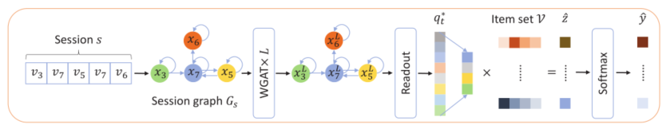

> 论文标题：Rethinking the Item Order in Session-based Recommendation with Graph Neural Networks
>
> 发表于：2019 CIKM
>
> 作者：Ruihong Qiu, Jingjing Li, Zi Huang, 
>
> 代码：https://github.com/RuihongQiu/FGNN
>
> 论文地址：https://arxiv.org/pdf/1911.11942v2.pdf

## 摘要

- 在基于会话的现实推荐中,预测用户在短期匿名交互会话而不是长期历史中的偏好是一个具有挑战性的问题
- 最近对基于会话的推荐系统的研究主要集中在利用注意力机制来研究序列模式，这对于会话按时间排序的自然序列来说是直截了当的
  - 然而，在项目选择的转换中，用户的偏好比单独的连续时间模式要复杂得多
- 在本文中们通过构建会话图来研究项目转换模式，并提出一种模型FGNN，在基于会话的推荐系统中协同考虑会话图中的序列顺序和潜在顺序。
  - 将会话中的下一个项目推荐制定为图分类问题。
  - 具体来说，我们提出了一个加权注意力图层WGAT和一个ReadOut函数来学习项目和会话的嵌入，以用于下一个项目推荐。
    - WGAT 模型，通过学习为不同的邻居分配不同的权重来作为项目特征编码器。它有助于有效地传达项目之间的信息。
    - 应用 Readout函数来为项目推荐生成适当的图级表示。 Readout 函数可以学习图中项目转换模式的最佳顺序

## 结论

- 因为用户历史无法预测用户的偏好，
  - 工作使用 WGAT 层来学习会话中项目的项目嵌入，
  - 然后由 Readout  函数处理以获得会话嵌入，以表示用户对该会话的偏好

## 未来工作

- 利用会话间信息来更准确地表示用户的偏好

## 介绍

- 基于会话的 RS 可以通过考虑用户与项目交互的最近会话（例如，在 24 小时内点击项目）来处理用户偏好的转变。
- 现代在线系统常不记录用户的长期历史。为了利用用户的偏好，可以将会话视为当前匿名用户最近的偏好的表示[35]。
  - 因此，如何通过从会话中的交互中提取代表性信息来表示用户的偏好是基于会话的 推荐系统的本质
- 由于会话是按时间划分的交互片段，因此它可以自然地表示为时间序列。
- 序列特征被最近的方法认为是最重要的信息。但是，它有一些具有挑战性的限制：
  - 用户的偏好并不完全取决于序列的年表，RNN处理序列数据时，如GRU4REC [9] 和 NARM [16] 主要对项目的时间顺序进行建模，并使用类似 RNN  的神经网络对这些项目进行编码。在对项目进行编码之后，会话的表示是项目特征的组合
    - 用户偏好在会话中的变化表明项目不应该被简单地视为时间序列。项目转换模式更复杂
  - 最近的方法 [16, 19, 38] 将用户的偏好分为长期（全局）和短期（局部）偏好，但过于简单，无法捕捉复杂的项目转换模式
    - 这些方法选择会话的最后一个项目代表短期（本地）偏好，其余项目代表长期（全局）偏好。
    - 此设置直接忽略了项目选择的模式，从而为模型引入了偏差
- 确定会话中项目的内在顺序很重要。这种固有的顺序既不是 RNN 的直接时间顺序，也不是 self-attention 的完全随机性
- 本文中，提出了一种名为全图神经网络（FGNN）的模型来学习项目转换模式的固有顺序并计算会话级表示以生成推荐。
  - 为了利用图神经网络，我们为每个会话构建一个会话图，并将推荐制定为一个图分类问题。
  - 为了捕捉对项目级特征表示至关重要的项目转换模式的固有顺序，提出了一个多加权图注意力层（WGAT）网络来计算会话内项目之间的信息流。
    - WGAT 模型，通过学习为不同的邻居分配不同的权重来作为项目特征编码器。它有助于有效地传达项目之间的信息。
  - 在获得项目表示后，部署自动学习确定适当顺序的Readout函数来聚合这些特征。

## 模型架构

 

- 模型的输入被组织为会话序列 s，然后将其转换为具有节点特征 x 的会话图 G。 
-  L 层WGAT 用作 G 的节点特征的编码器。
  - 经过 WGAT  处理后，会话图现在包含不同的语义但与输入会话图具有相同的结构的节点表示 $x^L$。
- Readout  函数用于根据学习到的节点特征生成会话嵌入。与项目集V中的其他项目相比，最终生成推荐分数$\hat y_i$。

## 实验

- ### 数据集

  - Yoochoose： 被用作 RecSys Challenge 2015 的挑战数据集。它是通过记录 6 个月内来自电子商务网站的点击流获得的。
  -  Diginetica： 被用作CIKM cup 2016 的挑战数据集。它包含适用于基于会话的推荐的交易数据。

- ### baseline

  - POP： 总是推荐整个训练集中最受欢迎的项目。
  - S-POP：始终为当前会话推荐最受欢迎的项目
  - Item-KNN [24]： 通过会话中两个项目向量的余弦距离计算项目的相似性。还引入了正则化以避免未访问项目的罕见高度相似性。
  - BPR-MF [22] ：提出了一个计算成对排序损失的 BPR 目标函数。在 [16] 之后，矩阵分解通过使用会话中项目的平均潜在向量被修改为基于会话的推荐。
  - FPMC [23]：  是下一个篮子推荐的混合模型，它实现了最先进的结果。对于基于会话的匿名推荐，根据[16]，由于不可用，我们直接省略了用户特征。
  - GRU4REC [9] ： 堆叠多个 GRU 层以将会话序列编码为最终状态。它还应用排名损失来训练模型。
  - NARM [16] 扩展到使用注意力层来组合 RNN  的编码状态，这使模型能够明确强调输入中更重要的部分。
  - STAMP [19] 使用注意力层来替换之前工作中的所有 RNN  编码器，甚至通过完全依赖序列中最后一项的自注意力来使模型更加强大。
  - SR-GNN [38] 应用门控图卷积层 [18] 来获得项目嵌入，然后像 STAMP  一样对最后一个项目进行自我注意，以计算序列级嵌入。

- ### 超参数设置

- ### 评估指标

  - R@20 
  - MRR@20