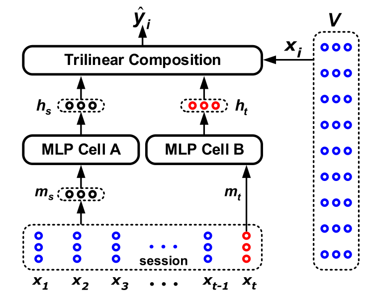

> 论文标题：STAMP: Short-Term Attention/Memory Priority Model for Session-based Recommendation
>
> 发表于：2018 KDD
>
> 作者：Qiao Liu, Yifu Zeng, Refuoe Mokhosi,
>
> 代码：https://github.com/uestcnlp/STAMP
>
> 论文地址：https://sci.bban.top/pdf/10.1145/3219819.3219950.pdf

## 摘要

- 由于用户行为的不确定性和信息的有限性，基于匿名会话来预测用户的行为是基于网络的行为建模研究中的一个具有挑战性的问题
- 现有的方法都没有明确考虑用户当前行为对其下一步行动的影响
- 文章认为长期记忆模型可能不足以对通常包含由意外点击引起的用户兴趣漂移的长时间会话进行建模。
  - 提出了一种新颖的短期注意力/记忆优先模型作为补救措施，该模型能够从会话上下文的长期记忆中捕获用户的一般兴趣，同时从短期记忆中考虑用户当前的兴趣最后点击次数

## 结论

- 提出了一种用于基于会话的推荐的短期注意力/记忆优先级模型
  - 用户的下一步移动主要受会话前缀的最后点击的影响，模型可以通过时间兴趣表示有效地利用这些信息。 
  - 提出的注意力机制可以有效地捕捉会话的长期和短期利益

## 未来工作

## 介绍

-  RNN 模型已被证明可用于从一系列动作中捕获用户的一般兴趣  [20]，但由于用户行为固有的不确定性和浏览器提供的有限信息，从会话中学习预测仍然是一个具有挑战性的问题
- 所有基于 RNN 的 SRS 模型只考虑将会话建模为一系列项目，而没有明确考虑用户的兴趣随时间漂移[6]
  - 如：如果某个特定的数码相机链接刚刚被用户单击并记录在会话中，则用户的下一个预期动作很可能是对当前动作的响应
    - 如果当前的动作是在做出购买决定之前浏览产品描述，那么用户下一步很可能会访问另一个数码相机品牌目录。  
    - 如果当前动作是在购物车中添加摄像头，那么用户的浏览兴趣很可能会转移到存储卡等其他外围设备上。在这种情况下，向该用户推荐另一台数码相机并不是一个好主意，尽管本次会话的初衷是购买数码相机（正如前面的行动所反映的）。
- 传统的 RNN 架构并非旨在同时区分和利用长期兴趣和短期兴趣这种隐含的反馈
- 引入了一个短期注意力/记忆优先级模型，该模型学习：
  - (a) 具有跨会话项目的统一嵌入空间
  -  (b)  用于基于会话的推荐系统中的下一步点击预测的新型神经注意力模型。 •
-  提出了一种新的注意力机制来实现STAMP  模型，
  - 其中注意力权重是从会话上下文中计算出来的，并随着用户当前的兴趣而增强。
  - 输出注意力向量被读取为用户时间兴趣的组合表示，对用户兴趣随时间漂移更敏感。
  - 它能够同时捕获用户的一般长期兴趣（响应初始目的）和他们的短期注意力（当前兴趣）

## 模型架构

- STAMP
  

## 实验

- ### 研究问题

- ### 数据集

  - Yoochoose：来自 RecSys'15 Challenge，它由从电子商务网站收集的六个月的点击流组成，训练集仅包含会话事件
  - Diginetica：来自 CIKM Cup 2016 的数据集

- ### baseline

  - POP：一个简单的  SRS 模型，总是根据训练集中的出现频率推荐项目。 
  - Item-KNN[14]：一个 item-to-item  模型，它根据候选项目与会话中现有项目之间的余弦相似度推荐与现有项目相似的项目。包含一个约束以避免在 [4, 20]  中很少访问的项目之间出现巧合的高度相似性。
  - FPMC[13]：用于下一篮子推荐的最先进的混合模型。为了使其适用会话推荐，在计算推荐分数时不考虑用户潜在表示。
  - GRU4Rec[5]：基于  RNN 的基于会话推荐的深度学习模型，由 GRU 单元组成，它利用会话并行的小批量训练过程，并在训练期间采用基于排名的损失函数。 
  -  GRU4Rec+[17]：基于 GRU4Rec 的改进模型，它采用数据增强过程和考虑输入数据分布变化的方法提高 GRU4Rec 的性能。 
  - NARM[10]：RNN 模型，它采用注意力机制从隐藏状态中捕获主要目的，并将其与作为最终表示的顺序行为相结合以生成推荐

- ### 超参数设置

- ### 评估指标

  - Predict@K
  - MRR@K