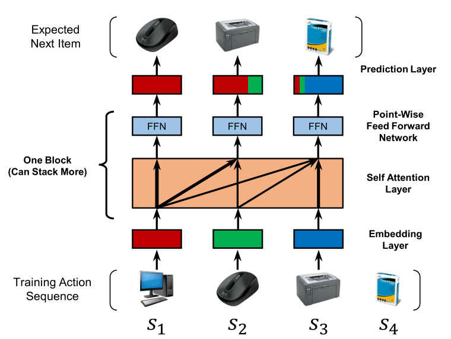
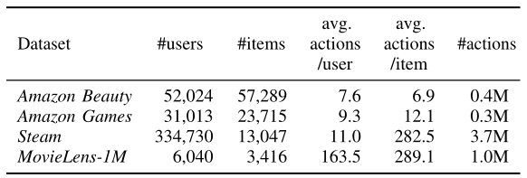

> 论文标题：Self-Attentive Sequential Recommendation
>
> 发表于：2018  ICDM
>
> 作者：Wang-Cheng Kang, Julian McAuley
>
> 论文代码：https://github.com/pmixer/SASRec.pytorch
>
> 论文地址：https://arxiv.org/pdf/1808.09781v1.pdf

## 摘要

- 顺序动态是许多现代推荐系统的一个关键特征，它试图根据用户最近执行的操作来捕捉用户活动的“上下文”。
- 为了捕捉这种模式，出现了两种方法：马尔可夫链 (MC)  和递归神经网络 (RNN)。
  - 马尔可夫链假设用户的下一个动作可以根据他们的最后一个（或最后几个）动作来预测，基于 MC 的方法在模型简约性至关重要的极稀疏数据集中表现最佳
  -  RNN 原则上允许揭示更长期的语义，RNN 在模型复杂度较高的密集数据集中表现更好
- 工作的目标是平衡这两个目标，提出一个基于自我注意的序列模型 (SASRec)，该模型允许我们捕获长期语义（如  RNN），但使用注意机制，使其预测基于在相对较少的动作上（如 MC）
  - 在每个时间步，SASRec 都试图从用户的操作历史中识别哪些项目是“相关的”，并使用它们来预测下一个项目，其在每个时间步骤将权重分配给先前的项目

## 介绍

- 从顺序动态中捕获有用的模式具有挑战性，主要是因为输入空间的维度随着用作上下文的过去动作的数量呈指数增长。因此，顺序推荐的研究主要关注如何简洁地捕捉这些高阶动态。
- 马尔可夫链  (MCs) 是一个典型的例子，它假设下一个动作仅以前一个动作（或前几个动作）为条件，并已成功用于表征推荐的短程项目转换 [1]。另一项工作使用循环神经网络  (RNN) 通过隐藏状态总结所有先前的动作，用于预测下一个动作 [2]。
  - 这两种方法虽然在特定情况下很强大，但在某种程度上仅限于某些类型的数据
- Transformer出现，与使用卷积或复制模块的现有顺序模型不同，Transformer纯粹基于称为“自我关注”的提出的注意机制，这是高效且能够在句子中揭示单词之间的句法和语义模式。
  - self-attention块适用于并行加速，导致模型比基于 CNN/RNN 的替代方案快一个数量级

## 结论

- 在这项工作中，我们提出了一种新颖的基于自我注意的顺序模型 SASRec，用于下一个项目推荐。 
- SASRec  对整个用户序列进行建模（没有任何循环或卷积操作），并自适应地考虑消费项目进行预测。
- 稀疏和密集数据集的大量实验结果表明，我们的模型优于最先进的基线，并且比基于  CNN/RNN  的方法快一个数量级。

## 未来工作

- 计划通过结合丰富的上下文信息（例如停留时间、动作类型、位置、设备等）来扩展模型，并研究处理超长序列（例如点击）的方法

## 模型架构

-  

- ### embedding Layer：

  -  将训练序列 ($S^u_1 , S^u_2 , ..., S^u_{|Su|-1}$) 转换为固定长度序列 s = (s1, s2, ..., sn)，其中 n  表示我们模型的最大可处理长度。如果序列长度大于 n，我们考虑最近的 n 个动作。如果序列长度小于 n，我们重复向左侧添加一个“填充”项 0 ，直到长度为 n。

- ### Self-Attention Block:

  - #### Self-Attention layer：

    -  采用缩放点积注意力，将嵌入$\hat E$作为输入，通过线性投影将其转换为三个矩阵，并将它们输入到注意力层,同时像Transform一样对其做掩码操作
       -  缩放点积注意力：$Attention(Q, K, V) = softmax ( \frac{QK^T} {\sqrt d} ) V$,
       -  $S = SA( \hat E) = Attention(\hat EW^Q,\hat EW^K ,\hat EW^V )$

  - #### Point-Wise Feed-Forward Network：

    -  为了赋予模型非线性并考虑不同潜在维度之间的相互作用，我们将两层的逐点前馈网络都应用于所有 Si （共享参数)
       -  $F_i = FFN(S_i) = ReLU(S_iW^{(1)} + b^{(1)})W^{(2)} + b^{(2)}$

- ### Stacking Self-Attention Blocks：堆叠多个自注意力块（即，自注意力层和前馈网络）

  - $S^{(b)} = SA(F^{(b−1)}),F^{(b)}_i = FFN(S^{(b)}_i )$

  - $S^{(1)} = S,F^{(1)}= F$

  - #### 存在的问题：

    -  1）增加的模型能力导致过度拟合; 
    -  2）训练过程变得不稳定（由于消失梯度等）;
    -  3）具有更多参数的模型通常需要更多的培训时间

  - #### 解决方法：g(x) = x + Dropout(g(LayerNorm(x))),

    -  Residual Connections：残差连接
    -  Layer Normalization：层标准化
    -  Dropout:丢弃法：在训练期间和嵌入E时，都采用dropout

## 实验

- ### 研究意义

  - RQ1：SASRec 是否优于最先进的模型，包括基于 CNN/RNN 的方法？
  -  RQ2：SASRec架构中各个组件的影响是什么？
  -  RQ3：SASRec  的训练效率和可扩展性（关于 n）是多少？ 
  - RQ4：注意力权重是否能够学习与位置或项目属性相关的有意义的模式？

- ### 数据集

  - Amazon Beauty
  - Amazon Games
  - Steam：DataSet包含2,567,538名用户，15,474场比赛和7,793,069个英文评论跨越2010年10月至2018年1月。该数据集还包括丰富的信息，在未来的工作中可能有用，如用户的播放时间，定价信息，媒体分数，类别，开发人员（ETC）
  - MovieLens-1M

- ### 数据预处理

  - 将存在的审查或评级视为隐含的反馈（即，用户与项目交互），并使用时间戳来确定操作的序列顺序
  - 丢弃具有少于5个相关操作的用户和项目
  - 将历史序列Su分成三部分：（1）最近的动作$S^u_{|s^u|}$用于测试，（2）第二个最近的动作$S^u_{|s^u|-1}$用于验证，以及（3）所有剩余的动作用于训练

- ### Baseline

  - #### 只考虑用户反馈而不考虑动作顺序的一般推荐方法

    - PopRec：这是一个简单的基线，根据项目的受欢迎程度（即相关操作的数量）对项目进行排名。
    - Bayesian Personalized Ranking(BPR,贝叶斯个性化排名）[5]：BPR 是一种从隐式反馈中学习个性化排名的经典方法。有偏矩阵分解被用作基础推荐器。

  - #### 包含基于一阶马尔可夫链的顺序推荐方法，它考虑最后访问的项目

    - Factorized Markov Chains (FMC，分解马尔可夫链)：一阶马尔可夫链方法。 FMC 使用两个项目嵌入分解项目转换矩阵，并仅根据最后访问的项目生成推荐
    - Factorized Personalized Markov Chains (FPMC，分解个性化马尔科夫链) [1]：FPMC  使用矩阵分解和分解的一阶马尔可夫链的组合作为其推荐器，它捕获用户的长期偏好以及项目到项目的转换。
    - Translation-based Recommendation （TransRec，基于翻译的推荐）[19]：一种最先进的一阶顺序推荐方法，它将每个用户建模为翻译向量，以捕获从当前项目到下一个项目的转换。

  - #### 基于深度学习的顺序推荐系统，它考虑了几个（或所有）以前访问过的项目

    - GRU4Rec [2]：一种使用 RNN 为基于会话的推荐的用户动作序列建模的方法。将每个用户的反馈序列视为一个会话。
    - GRU4Rec+ [26]：GRU4Rec 的改进版本，采用不同的损失函数和采样策略，在 TopN 推荐上表现出显着的性能提升。
    -  Convolutional Sequence Embeddings (Caser，卷积序列嵌入）[22]：最近提出的一种基于 CNN 的方法，通过对 L  个最近项目的嵌入矩阵应用卷积运算来捕获高阶马尔可夫链，并实现了最先进的顺序推荐性能

- ### 评估指标

  - Hit Rate@10
  - NDCG@10