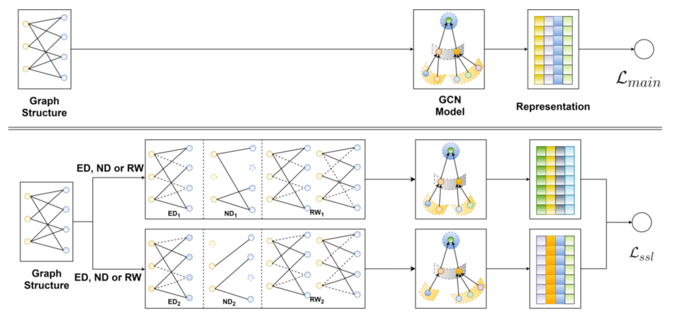
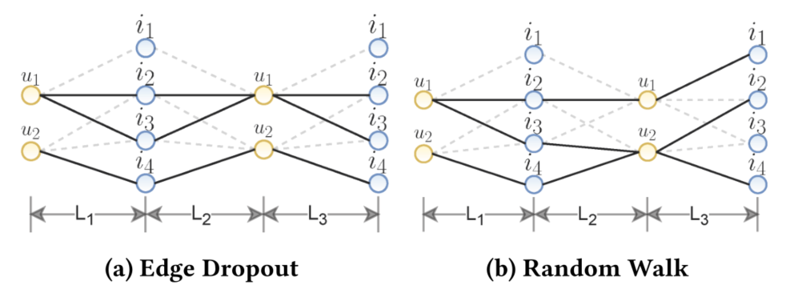

> 论文标题：Self-supervised Graph Learning for Recommendation
>
> 发表于：2021 SIGIR
>
> 作者：Jiancan Wu, Xiang Wang, Fuli Feng
>
> 代码： https://github.com/wujcan/SGL
>
> 论文地址：https://arxiv.org/pdf/2010.10783v4.pdf

## 摘要

- 用于推荐的用户-项目图的表示学习已经从使用单一 ID 或交互历史发展到利用高阶邻居。这导致了用于推荐的图卷积网络 (GCN)
- 存在两个局限性：
  - (1）高度节点对表示学习产生更大的影响，恶化了低度（长尾）项目的推荐； 
  - (2)  表示容易受到噪声交互的影响，因为邻域聚合方案进一步扩大了观察到的边缘的影响。
- 工作探索了用户项目图上的自监督学习，以提高 GCN  推荐的准确性和鲁棒性。
  - 这个想法是用一个辅助的自我监督任务来补充经典的推荐监督任务，它通过自我辨别来加强节点表示学习。
    - 生成一个节点的多个视图，与其他节点相比，最大化同一节点的不同视图之间的一致性。
    - 设计了三个操作符来生成视图——节点丢弃、边缘丢弃和随机游走——它们以不同的方式改变图结构。
    - 我们将这种新的学习范式称为自监督图学习  (SGL)，基于 LightGCN 上实现它。
      - 通过理论分析，我们发现SGL具有自动挖掘硬负样本的能力。

## 结论

- 认识到了一般监督学习范式下基于图的推荐的局限性，并探索了 SSL 解决这些局限性的潜力，
  - 通过用户-项目图上的自监督学习来补充监督推荐任务
- 从图结构的角度，我们从不同方面设计了三种类型的数据增强来构建辅助对比任务
  - node dropout、edge dropout和random walk
- SGL 在以下方面补充了现有的基于 GCN 的推荐模型：
  - 1）节点自识别提供了辅助监督信号，这是对仅来自观察交互的经典监督的补充； 
  - 2）增强算子，尤其是边缘丢失，通过有意减少高度节点的影响来帮助减轻度数偏差； 
  - 3）节点 的多个视图。不同的局部结构和邻域增强了模型对交互噪声的鲁棒性。
  - 对对比学习范式进行了理论分析，发现它具有挖掘硬负样本的作用
- SGL 与模型无关，可以应用于任何包含用户和/或项目嵌入的基于图的模型

## 未来工作

- 超越图结构的随机选择，探索新的视角，例如反事实学习以识别有影响的数据点，以创建更强大的数据增强
- 专注于推荐的预训练和微调，即预训练一个模型，该模型捕获跨多个域或数据集的通用和可转移用户模式，并在即将到来的域或数据集上对其进行微调.
- 发挥 Self-supervised Learning (SSL) 解决长尾问题的潜力。我们希望 SGL 的发展有助于提高推荐模型的泛化性和可迁移性

## 介绍

- GCN提供了一种端到端的方法，将多跳邻居集成到节点表示学习中
- 当前基于 GCN 的推荐模型仍存在一些局限性：
  - 稀疏监督信号
    - 大多数模型在监督学习范式下处理推荐任务  [19,21,34]，其中监督信号来自观察到的用户-项目交互。
    - 然而，与整个交互空间相比，观察到的交互非常稀疏 [3, 18]，因此不足以学习质量表示。
  - 倾斜的数据分布。
    - 观察到的交互通常表现出幂律分布  [9, 30]，其中长尾由缺乏监督信号的低度项目组成。
    - 相比之下，高度项目在邻域聚合和监督损失中出现的频率更高，因此对表示学习的影响更大。
    - 因此，GCN  很容易偏向于高度项目 [5, 36]，牺牲了低度（长尾）项目的性能。
  - 交互中的噪音。
    - 用户提供的大多数反馈是隐含的（例如点击、查看），而不是明确的（例如评分、喜欢/不喜欢）。
    - 因此，观察到的交互通常包含噪音，例如，用户被误导点击一个项目并在消费后发现它无趣  [44]。
    - GCN 中的邻域聚合方案扩大了交互对表示学习的影响，使学习更容易受到交互噪声的影响
- 文章探索推荐中的自我监督学习（SSL），以解决上述限制
  - 设置一个辅助任务，从输入数据本身中提取额外的信号，特别是通过利用未标记的数据空间
  - SSL 允许我们通过更改输入数据来利用未标记的数据空间，从而在下游任务中取得显着改进
  - 将辅助任务构建为区分节点本身的表示。具体来说，它由两个关键部分组成：
    - 1）数据增强，为每个节点生成多个视图，
    - 2）对比学习，与其他节点相比，最大化同一节点的不同视图之间的一致性。
  - 开发了三个算子：node dropout、edge dropout和random walk
- SGL 在以下方面补充了现有的基于 GCN 的推荐模型：
- 1）节点自识别提供了辅助监督信号，这是对仅来自观察交互的经典监督的补充； 
- 2）增强算子，尤其是边缘丢失，通过有意减少高度节点的影响来帮助减轻度数偏差； 
- 3）节点的多个视图。不同的局部结构和邻域增强了模型对交互噪声的鲁棒性。
- 对对比学习范式进行了理论分析，发现它具有挖掘硬负样本的作用。

## 模型架构

- SGL
  
  - 上层展示了主要监督学习任务的工作流程，而底层展示了带有图结构增强的 SSL 任务的工作流程。
- 具有边缘丢弃（左）和随机游走（右）的三层 GCN 模型中高阶连接
  
  - 对于 Random Walk，图形结构在各层之间不断变化，而不是 Edge Dropout。
  - Random Walk 在节点 u1 和 i1 之间存在一条 Edge Dropout  中不存在的三阶路径。

## 实验

- ### 研究问题

  - RQ1：SGL 执行Top-K 推荐与最先进的 CF 模型相比如何？
  - RQ2：在协同过滤中执行自监督学习有什么好处？ 
  - RQ3：不同的设置如何影响提议的SGL 的有效性

- ### 数据集

  - Yelp2018 
  - Amazon-Book 
  - Alibaba-iFashion

- ### baseline

  - NGCF  [46]。这是一种基于图的 CF 方法，很大程度上遵循标准 GCN [12]。它还在消息传递期间将二阶特征交互编码到消息中。
  - LightGCN [19]。该方法设计了一种用于训练效率和生成能力的光图卷积。
  - Mult-VAE [28]。这是一种基于变分自动编码器（V AE）的基于项目的 CF 方法。它通过额外的重建目标进行了优化，可以看作是 SSL  的一个特例。
  - DNN+SSL [49]。这是一种最先进的基于 SSL 的推荐方法。以  DNNs  作为项目的编码器，它在项目的预先存在的特征上采用了两个增强算子，特征掩蔽（FM）和特征丢弃（FD）。在我们没有可用的项目特征的情况下，我们将增强应用于项目的  ID 嵌入。我们按照原始论文中的建议调整 DNN 架构（即层数和每层神经元的数量）。

- ### 超参数设置

- ### 评估指标

  - Recall @K
  - NDCG @K