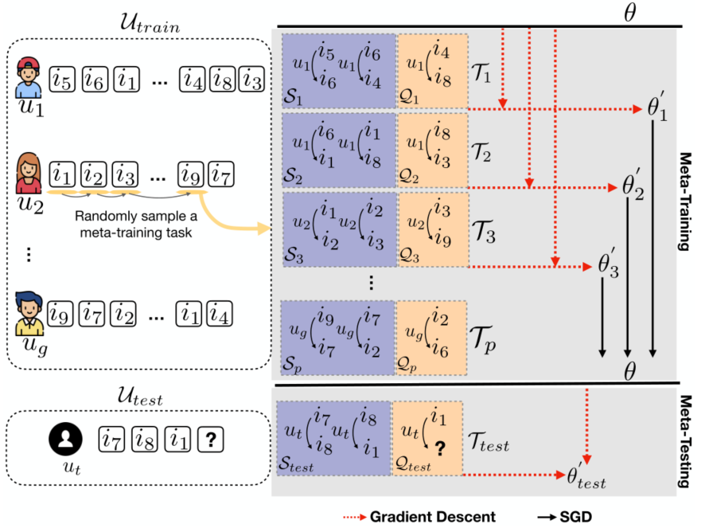

> 论文标题：Sequential Recommendation for Cold-start Users with Meta Transitional Learning
>
> 发表于：2021 SIGIR
>
> 作者：Jianling Wang,Kaize Ding， James Caverlee
>
> 代码：https://github.com/wangjlgz/MetaTL
>
> 论文地址：https://arxiv.org/pdf/2107.06427v1.pdf

## 摘要

- 在许多实际场景中，有大量的冷启动用户只记录了最少的交互。
- 现有的顺序推荐模型难以在仅具有有限交互的用户上学习顺序模式将失去其预测能力。
- 提出MetaTL 来改进冷启动用户的顺序推荐，该框架通过元学习来学习对用户的转换模式进行建模。
  - (i) 将冷启动用户的顺序推荐公式化为小样本学习问题；
  -  (ii) 使用基于翻译的架构提取用户之间的动态转换模式；
  -  (iii)  采用元过渡学习，使只有有限交互的冷启动用户能够快速学习，从而准确推断顺序交互。

## 结论

- 提出了 MetaTL 来改进冷启动用户的顺序推荐
  - 为了能够快速适应冷启动用户，我们将我们的任务重新定义为小样本学习问题，并采用元学习来解决问题
  - 该模型由基于翻译的架构提供支持，能够从转换对中捕获转换模式
  - 给定一个模拟目标冷启动场景的少数用户偏好转换任务池，MetaTL 学习了一个模型，该模型可以以元学习方式通过少量交互来适应新用户

## 未来工作

## 介绍

- 由于难以用有限的数据来表征用户偏好，大多数现有的顺序推荐器并不是为处理这种冷启动用户而设计的
- 存在挑战：
  - 很多冷启动推荐方法，但大多数在训练期间需要辅助信息[14,15,37]。
  - 或来自其他领域的知识 [1,11,17]，并且通常将用户-项目交互处理为静态方式
  - 冷启动顺序推荐针对的是由于隐私问题而无法访问额外辅助知识的设置，更重要的是，用户-项目交互是顺序依赖的。
  - 用户的偏好和品味可能会随着时间而改变，这种动态对于顺序推荐具有重要意义
- 提出了一种称为 MetaTL 的新元学习框架，用于解决冷启动顺序推荐的问题
  - 为了仅通过少量用户-项目交互来提高模型泛化能力，我们将冷启动顺序推荐的任务重新表述为小样本学习问题
    - 构建了一个模仿目标冷启动场景的少量用户偏好转换任务池，并以元学习的方式逐步学习用户偏好
  - 开发了一种新颖的元学习范式——MetaTL  来对用户的转换模式进行建模，它可以快速适应冷启动用户推断他们的顺序交互。 
    - 推荐模型能够有效地捕捉短程过渡动态

## 模型架构

- MetaTL
  

## 实验

- ### 研究问题

  - RQ1：如何让模型将知识从数据丰富的用户转移到冷启动用户？ 
  - RQ2：我们如何捕捉用户-项目交互序列中的短程转换动态？
  - RQ3：如何优化元学习器以便为冷启动用户做出准确的推荐？

- ### 数据集

  - Amazon Electronics
  - Amazon Movie
  - Goodreads Book

- ### baseline

  - 顺序推荐
    - TransRec [7] 将项目嵌入到“过渡空间”中，并为每个用户学习一个翻译向量。 
    - GRU4Rec [10]：靠门控循环单元来学习顺序用户行为
    - TCN [36]：靠简单的卷积生成网络来学习顺序用户行为
    - SASRec [12]  靠自注意力层来学习顺序用户行为。 
    - BERT4Rec：采用双向转换器提取序列模式
  - 冷启动
    - MeLU [14] 学习了一个基于模型无关元学习 (MAML) 的用户偏好估计模型，该模型可以快速适应冷启动用户
    - MetaCF [33] 学习了一个可以快速适应新用户的协同过滤（CF）模型

- ### 超参数设置

- ### 评估指标

  - MRR@K
  - Hit R@K