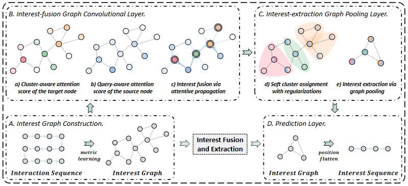
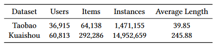

> 文章标题：Sequential Recommendation with Graph Neural Networks
>
> 发表于：2021  SIGIR
>
> 作者：Jianxin Chang, Chen Gao, Yu Zheng
>
> 论文地址：https://arxiv.org/pdf/2106.14226.pdf
>
> 论文代码：https://github.com/tsinghua-fib-lab/SIGIR21-SURGE
>
> 数据集源地址： taobao： https://tianchi.aliyun.com/dataset/dataDetail?dataId=649 

## 摘要

- 目前尚未解决的顺序推荐中的两个主要挑战

  - 用户在其丰富的历史序列中的行为往往是隐含的、嘈杂的偏好信号，它们不能充分反映用户的实际偏好

  - 用户的动态偏好往往会随着时间的推移而迅速变化，因此很难在他们的历史序列中捕捉用户模式

- 解决思路：
  - 基于 度量学习 将松散的项目序列重构为紧密的 项目-项目 兴趣图，将长期用户行为中不同类型的偏好整合到图中的集群中
    - 通过在兴趣图中形成密集的集群，明确区分用户的核心兴趣
  - 在构建的图上执行 集群感知 和 查询感知 图卷积传播和图池化
  - 从嘈杂的用户行为序列中动态融合并提取用户当前激活的核心兴趣

## 结论

- 提出了一种基于图形的顺序推荐系统的任务的解决方案，将松散的物品序列重新构建为紧密的项目兴趣图。
- 该模型利用图形神经网络强大的能力，从嘈杂的用户行为序列中动态保险和提取用户激活的核心兴趣

## 未来工作

- 我们计划在在线系统上进行A / B测试，以进一步评估我们提出的解决方案的推荐表现。
- 我们还计划考虑使用多种类型的行为，例如点击和收藏夹，以探讨来自嘈杂的历史序列的细粒度多个交互

## 介绍

- 顺序推荐试图通过利用用户的历史行为序列来预测用户的下一个行为，顺序推荐能够捕捉用户的进化和动态偏好
- 目前工作通常更关注近期的用户行为，无法充分挖掘旧的行为序列来准确估计他们当前的兴趣。
- 因此，顺序推荐中存在以下两个尚未得到很好解决的主要挑战。
  - 长序列中的用户行为反映了隐含和嘈杂的偏好信号
    - 从隐含和嘈杂的行为中提取了用户偏好，对它们在历史中的变化进行建模并估计当前时间激活的偏好仍然具有挑战性
  - 用户偏好总是随着时间而变化
    - 用户大部分时间可能会点击他们不感兴趣的项目，之后不会选择相似的项目进行交互
- 因此，提出了一种基于图的方法，使用图卷积网络来提取隐式偏好信号。然后使用动态图池来捕获动态偏好
  - 先将松散的项目序列转换为紧密的项目-项目图，并设计一个注意力图卷积网络，将弱信号收集到能准确反映用户偏好的强信号。
  - 然后，提出了一种动态图池化技术，该技术自适应地保留激活的核心偏好以预测用户的下一个行为

## 模型架构

- ### 兴趣图构建：Interest Graph

  - 通过将松散的项目序列重新构建为基于度量学习的紧密项目 - 项目兴趣图，我们明确地集成并区分了在长期用户行为中的不同类型的偏好。
  - 原始图构建：
    - 为每个交互构造一个无向图 G = {V, E, 𝐴} 序列，其中 E 是要学习的图边集，𝐴 ∈ R 𝑛×𝑛 表示对应的邻接矩阵。每个顶点 𝑣 ∈ V 与 |V | = 𝑛 对应于一个交互项（并且 相关嵌入向量表示为 ℎ ）。
    - 我们的目标是学习 邻接矩阵𝐴，其中每条边 (𝑖, 𝑗, 𝐴𝑖,𝑗) ∈ E 表示 项目𝑖是否与项目𝑗相关
    - 通过将每个用户的交互历史表示为图表，更容易区分他/她的核心兴趣和外围兴趣。核心兴趣节点由于连接了更多的相似兴趣，其度数高于外围兴趣节点，并且相似兴趣的频率越高，子图的密度越大，子图越大。
  - 节点相似度度量学习
    - 需要一个相邻节点相似的先验图，因此可以将图学习问题转化为节点相似度度量学习，与下游推荐任务联合训练。这种图构建方法通用，易于实现，能够完美应对归纳学习
    - 为了平衡表现力和复杂性，我们采用加权余弦相似度 [5, 42] 作为我们的度量函数
    - 为了增加表达能力和稳定学习过程，相似度度量函数可以扩展到多头度量[5, 25]
  - 通过$\varepsilon$-稀疏化进行图稀疏化
    - 通常，邻接矩阵元素应该是非负的，但余弦值 Mij 从 [−1, 1] 之间的度量范围计算。简单地对其进行归一化不会对图稀疏性施加任何约束，并且可以产生一个完全连接的邻接矩阵。这在计算上是昂贵的，并且可能会引入噪声（即不重要的边缘），并且它不够稀疏，以至于后续的图卷积不能专注于图的最相关方面。

- ### 兴趣融合图卷积层：Interest-fusion Graph Convolutional Layer

  - 图形卷积在构造的兴趣图上的卷积传播动态地融合了用户的兴趣，加强了重要行为和弱化噪声行为。

- ### 兴趣提取图池化层：Interest-extraction Graph Pooling Layer.

  - 考虑用户在不同时刻的不同偏好，进行动态图形池操作，以便自适应地保留动态递除的核心偏好。

- ### 预测层：Prediction Layer

  - 在池化的图形趋于较小的序列之后，模拟增强兴趣信号的演变并预测用户具有与之交互的高概率的下一个项目

## 实验

- ### 数据集：Taobao、Kuaishou

  - ### 

  - taobao：从2017年11月25日到12月3日的点击数据，并过滤掉不到10个交互的用户。我们使用前7天作为培训集，第8天作为验证集，最后一天作为测试集。

  - kuaishou：从2020年10月22日到10月28日的日志，诸如单击之类的用户行为如下，按照（订阅）和转发，在数据集中记录，采用了10核设置以过滤非活动用户和视频。前6天的行为用于培训推荐模型。在最后一天下午12点之前的行为用作验证集，我们将在最后一天下午12点之后保留该实例来评估最终推荐绩效

- ### 评估指标

  - AUC:正值项目样本分数高于负项目样本分数的概率，反映了分类模型对样本的能力
  - GAUC:执行每个用户AUC的加权平均值，其中权重是他的点击次数，消除了用户之间的偏差，并以更精细的粒度评估模型性能
  - MRR：平均倒数排名，是正确推荐项目的倒数排名的平均值
  - NDCG@K：分配更高的分数以在Top-K排名列表中的更高位置处击中，K设置为2

- ### baseline

  - 非顺序模型：
    - NCF[9]:此方法结合了矩阵分解和多层的感知，以预测用户交互，并且是最新的推荐
    - DIN[46]：此方法使用带有目标项的注意机制作为查询矢量。通过将历史交互与注意重量聚合来获得用户的表示。
    - LightGCN [8]：这是使用图形神经网络的最先进的模型，以提取推荐的高阶连接。

  - 顺序模型
    - CASER [24]：该方法将一组最近的时间序列嵌入到图像功能中，并使用卷积过滤器来学习序列模式。
    - GRU4REC [10]：该方法使用GRU来模拟用户会话序列并将用户兴趣进行编码为最终状态。
    - DIEN [45]：该方法使用由感兴趣提取层和兴趣进化层组成的双层GU来模拟用户的行为序列。
    - SLI-REC [39]：这是基于注意框架和改进的时间感知LSTM共同模拟长期和短期利益的最先进的方法。

- ### 超参数设置

  - 使用Microsoft推荐框架、基于TensorFlow来实现所有模型。
  - 我们使用ADAM [14]以优化初始学习率为0.001。批量尺寸设定为500，嵌入大小固定为40。Xavier初始化[7]此处用于初始化参数。
  - 所有方法都使用双层前馈神经网络，隐藏层大小为[100,64]进行交互估计。
  - 用户交互序列的最大长度为淘宝数据集50，Kuaishou数据集：250。
  - 我们应用仔细网格搜索，以查找最佳的超参数。所有正则化系数均搜索[1𝑒-7,1e-5,1e-3]。
  - 用于淘宝数据集的汇集长度：[10,20,30,40,50]，快手数据集的[50,100,150,20,250]。
