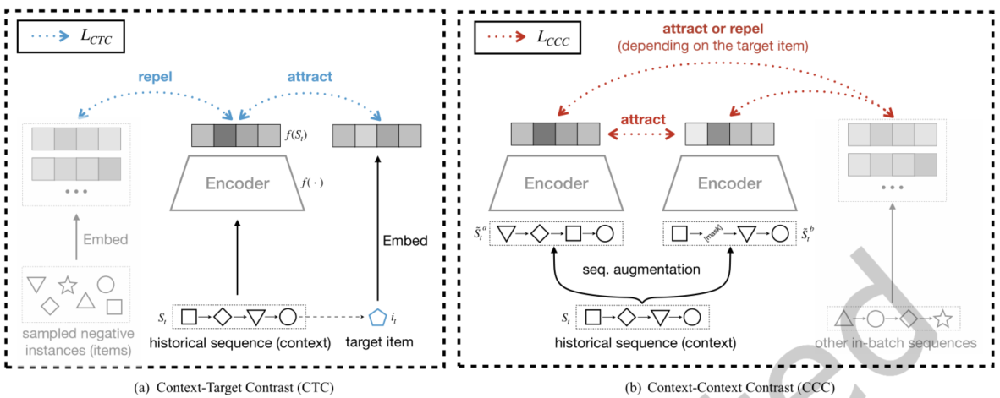
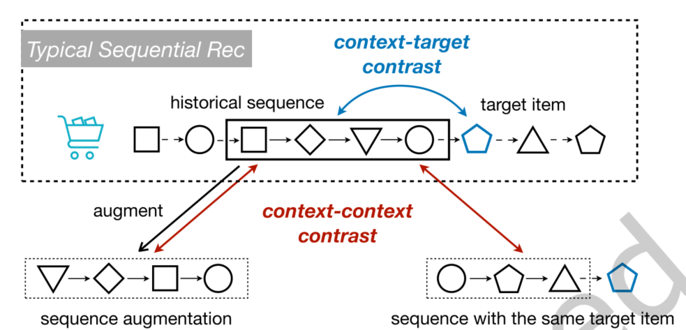
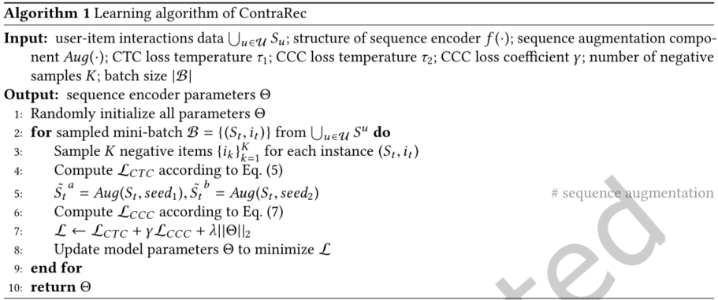
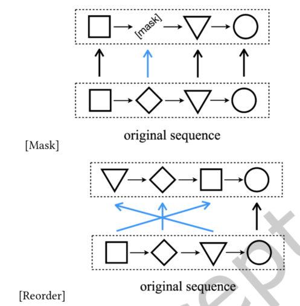

> 论文标题：Sequential Recommendation with Multiple Contrast Signals
>
> 发表于：2022  Transactions on Information Systems
>
> 作者：Chenyang Wang, Weizhi Ma, C. Chen
>
> 代码：
>
> 论文地址：https://dl.acm.org/doi/pdf/10.1145/3522673

## 摘要

- 为了训练一个顺序推荐模型，一种常见的做法是使用成对排名损失来优化下一项推荐任务
- 本文从对比学习的角度重新审视了这种典型的训练方法，发现它可以在概念上和数学上被视为一种专门的对比学习任务，命名为上下文-目标对比。
- 为了利用用户交互序列中的其他自我监督信号，我们设计了一种广义的对比损失，以鼓励增强后的序列以及具有相同目标项目的序列具有相似的表示，称为上下文-上下文对比。
- 提出一个通用框架ContraRec，统一两种对比信号，形成一个整体联合学习框架，用于具有不同对比学习任务的顺序推荐。
  - 各种顺序推荐方法（例如，GRU4Rec、Caser  和 BERT4Rec）可以很容易地集成为我们的 ContraRec 框架中的基本序列编码器

## 结论

- 首先从对比学习角度重新审视了顺序推荐的典型训练方法（具有成对排序损失的下一项排序），将其视为专门的对比学习任务（称为上下文-目标对比）。
  - 将常见的 BPR 成对排序损失扩展到一般的对比损失$\mathcal L_{CTC}$
- 提出了另一个对比学习任务来探索隐藏在用户交互序列中的其他自我监督信号。
  - 设计了一种专门的对比损失$\mathcal L_{CCC}$  来模拟相似交互序列之间的表示不变性，
  - 其中鼓励增强后的序列以及具有相同目标项目的序列具有相似的表示（称为上下文-上下文对比）。
- 提出了一个通用框架ContraRec，将两种对比信号与联合学习统一起来，形成了一个用于顺序推荐的整体对比学习框架。
- 为了生成输入序列的不同视图，我们采用了两种序列增强方法，即掩码和重新排序。  ContraRec 可以灵活地集成各种现有的序列推荐模型作为基本序列编码器。

## 未来工作

- 不同的推荐场景可能适合不同的序列增强方法。我们主要给出两个示例增强方法，它们可能无法满足其他数据集的特征（尤其是重新排序方法）。
  - 设计特定领域的增强或探索基于元学习的自适应增强方法
- 当前的框架需要大批量来提供足够的负样本，这可能会导致潜在的训练问题以及计算资源的限制。
  - 可以研究其他对比学习结构来缓解这个问题

## 介绍

- 为了训练深度顺序推荐模型，该领域的许多研究都遵循监督学习范式，其中每个训练实例都包含一个交互项目作为目标，相应的历史交互作为输入。
- 与其他领域的标准监督任务不同，推荐标签信息来自外部知识（例如，图像的类别）[4,12,13]，
  - 这里的输入和标签本质上都存在于原始交互序列中。这使其与自监督学习的设置更加一致，
- 监督学习是一种从数据中自动生成监督信号的无监督学习形式。从这个角度来看，文章重新审视了序列推荐的典型训练方法，并提出它是一种专门的对比学习任务
- 在顺序推荐中，目标项目和历史交互都是整个交互序列的一部分。
  - 给定历史序列，典型的成对排名目标[41]旨在驱动目标项目获得比其他项目更高的排名分数。
  - 从概念上讲，这可以看作是区分历史序列和目标项目（称为上下文-目标对比）
- 目前的研究主要依赖于这种上下文目标对比信号，旨在设计强大的序列编码器。存在的问题：
  - 越来越复杂的序列编码器（例如，GRU [5]、Transformer [47]）需要大量数据，容易受到数据稀疏和过度处理问题的影响。
  - 多数现有方法只关注于对历史序列和目标项目之间的相关性进行建模，而忽略了隐藏在用户交互序列中的其他对比信号
- 文章建议对相似历史序列之间的表示不变性进行额外建模，以探索其他对比信号（称为上下文-上下文对比）
  - 反映相似用户意图的序列应该具有相似的表示
- 这项工作从交互数据中研究了两种相似的序列。
  - 一方面，考虑到用户的意图不会受到交互序列上的小扰动的影响，设计了几种增强方法来将给定序列的不同视图构建为相似实例。
  - 另一方面，受协同过滤思想的启发[21]，相同目标项目（甚至由不同用户生成）之后的序列可能会反映相似的用户意图。
    - 因此，我们建议鼓励增强后的序列以及具有相同目标项目的序列具有紧密的表示。
- 为了统一两种对比信号，即上下文-目标对比和上下文-上下文对比提出了一个新的框架ContraRec，
  - 它联合学习不同的对比学习任务以进行顺序推荐。
  - 对于上下文-目标对比学习任务，通过从对比学习的角度重新审视典型的训练方法，将常见的  BPR 损失扩展到一般的对比损失。
  - 对于上下文-上下文对比学习任务，设计了一个特定的对比损失来区分相似和不同的交互序列，与常见的对比损失相比，它支持多个正对。

## 模型架构

- ContraRec
  
  - 上下文-目标对比（CTC）：CTC)是常见 BPR  成对排序目标的概括
  - 上下文-上下文对比（CCC）：CCC，我们旨在提高相似序列的表示相似性。这里的相似序列不仅包括从相同历史序列生成的不同视图，还包括具有相同下一项的序列。
  - 最后，ContraRec  将两种对比信号与一个联合学习框架统一起来，形成了一个用于顺序推荐的整体对比学习范式。
- 不同对比度信号的概念图
  
  - 带有成对排序损失的下一个项目推荐可以看作是区分历史序列和目标项目（上下文-目标对比）。
  - 建议利用历史序列之间的对比信号（上下文-上下文对比）。相似的序列（增强序列，具有相同目标项目的序列）预计具有相似的表示。
- ContraRec算法流程
  
- 序列增强方法的说明
  
  - 掩码和重新排序

## 实验

- ### 研究问题

- ### 数据集

  - Amazon Beauty
  - Yelp-2018
  - Gowalla

- ### baseline

  - FPMC [42]：该方法将矩阵分解和马尔可夫链与用户特定的转移矩阵相结合。
  - GRU4Rec [19]：该方法利用 GRU（门控循环单元，RNN  的一种变体）[5] 对顺序交互进行建模。 
  - Caser [45]：这是一种基于 CNN 的方法，通过对交互序列应用水平和垂直卷积运算来捕获高阶马尔可夫链。
  - SASRec [24]：该方法利用自我注意[47] 来利用历史交互之间的相互影响。
  - BERT4Rec  [44]：顺序推荐模型使用双向自注意 [47] 来推导序列表示。
  - S3Rec  [65]：它为上下文感知推荐设计了四个借口任务，然后调整下一个项目推荐任务，由于我们的设置中没有特征信息，为了公平起见，我们只使用了  S3Rec 中的掩码项目预测和片段预测任务。
  - CLRec [64]：该方法使用对比损失来优化基于注意力的顺序推荐模型，以提高有效性和公平性。
  - CL4SRec [58]：基于对比学习调查了增强历史序列之间的对比信号。但它只需要从相同输入中增强的序列作为类似实例，并使用简单的  softmax 损失。

- ### 超参数设置

- ### 评估指标

  - HR@K
  - NDCG@K