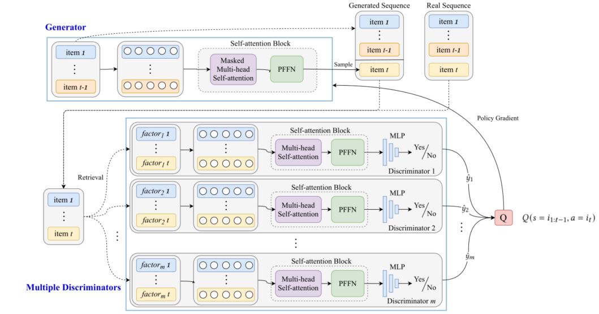

> 论文标题：Sequential Recommendation with Self-Attentive Multi-Adversarial Network
>
> 发表于：2020 SIGIR
>
> 作者：Ruiyang Ren, Zhaoyang Liu, Yaliang Li
>
> 代码：https://github.com/ReyonRen/MFGAN
>
> 论文地址：https://arxiv.org/pdf/2005.10602v1.pdf

## 摘要

- 现有的神经顺序推荐器通常采用通过最大似然估计 (MLE) 训练的生成方式。
  - 当涉及到上下文信息（称为因素）时，很难分析每个因素何时以及如何影响最终的推荐性能。
- 提出了一个多因素生成对抗网络（MFGAN），用于显式建模上下文信息对顺序推荐的影响,有两种模块：
  - 基于 Transformer  的生成器，以用户行为序列为输入来推荐可能的下一个项目，
  - 多个特定于因子的鉴别器，从不同因素的角度评估生成的子序列。
    - 用基于Transformer的双向架构，可以参考后续位置的信息进行序列评估。通过这种方式，判别器有望通过考虑整体序列不同的因素的特征做出更可靠的判断
- 为了学习参数，由于项目生成的离散性，采用经典的策略梯度方法，并利用判别器的奖励信号来指导生成器的学习。

## 结论

- 提出了一种用于顺序推荐的多因素生成对抗网络（MFGAN）。
  - 以用户行为序列为输入的生成器用于生成可能的下一个项目，
  - 并使用多个特定于因素的判别器从不同因素的角度评估生成的子序列。

## 未来工作

- 研究如何设计一种更有原则的方式来在不同的鉴别器之间共享鉴别信息。
- 考虑在鉴别器中加入明确的用户偏好

## 介绍

- 现有的神经序列推荐方法 [10, 14] 采用生成方式来预测未来项目并使用最大似然估计 (MLE) 来学习参数。
  - 然而基于 MLE  的训练在序列预测中容易出现数据稀疏或暴露偏差 [23, 32] 等问题
  - 当结合上下文信息（本文称为因子）时，它必须与原始顺序预测组件集成
    - 因此，我们无法准确地计算出每个单独的因素何时以及如何影响最终的推荐性能
- 文章通过对抗训练将因子利用与序列预测组件分离，遵循GAN框架 [7]，我们设置了生成器和判别器
  - 生成器仅依靠用户与项目的交互数据预测未来的推荐项目，判别器根据各种因素的可用信息来判断生成的推荐序列的合理性。
  - 这种方法允许在顺序推荐中更灵活地利用外部上下文信息，从而能够提高推荐的可解释性。
  - 框架下各种因素与生成器解耦，判别器利用它们来导出监督信号以改进生成器

## 模型架构

- MFGAN
  
  - 上框和下框分别对应生成器和多判别器组件
  - 生成器根据当前历史序列依次生成下一个项目。不会使用来自项目端的任何上下文信息。它以历史序列数据为条件预测。
  - 一组 m 个鉴别器 {D1, D2, . . . , Dm }  用于通过多角度的信息来判断生成序列的合理性。每个判别器根据某个对应因素的信息，从某个角度进行判断。
    - 例如，在音乐推荐系统中，我们可能有多个专门设计的判别器，分别针对音乐的类别信息、流行度统计、艺术家和专辑。

## 实验

- ### 研究问题

- ### 数据集

  - Movielens-1m 
  - Yahoo
  - Steam

- ### baseline

  - PopRec：根据项目的受欢迎程度对项目进行排序以分配每个项目的排名的方法，倾向于向用户推荐非常受欢迎的项目。
  - BPR  [25]：个性化排序算法，它优化了隐式反馈的潜在因子模型的成对排序损失函数。 
  - FM  [24]：考虑不同特征之间的相互作用，它使用通用矩阵分解来学习组合特征的系数。 
  - IRGAN  [28]：该方法通过对抗训练结合生成和判别信息检索，其中对判别器使用简单的矩阵分解。 
  - FPMC  [26]：它结合了矩阵分解和马尔可夫链，可以同时捕获序列信息和长期用户偏好。 
  - GRU [10]：它是基于 GRU  的顺序推荐器，具有会话并行小批量训练，采用基于排名的损失函数。我们通过用预训练的 BPR 向量替换 one-hot 向量来实现增强版本。 
  - GRUF  [11]：它建议将额外的特征向量作为 GRU 网络的输入，其中包含辅助特征以改进顺序推荐。 
  - SASRec [14]：它是一种基于 Transformer  架构的下一个项目顺序推荐方法，它自适应地考虑交互项目进行预测。

- ### 超参数设置

- ### 评估指标

  - MRR@K
  - NDCG@K
  - HR@K