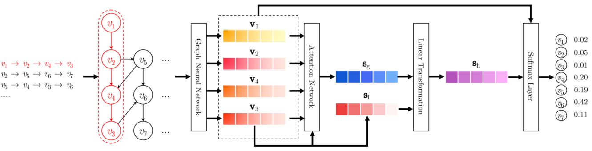
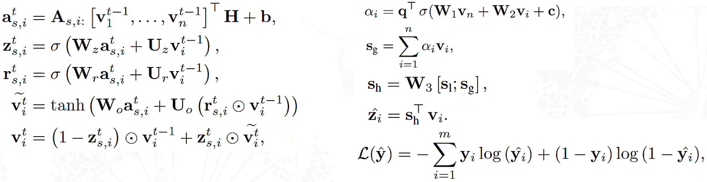
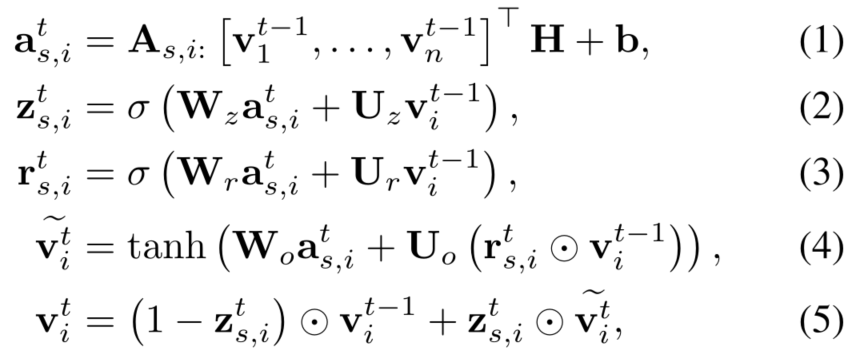
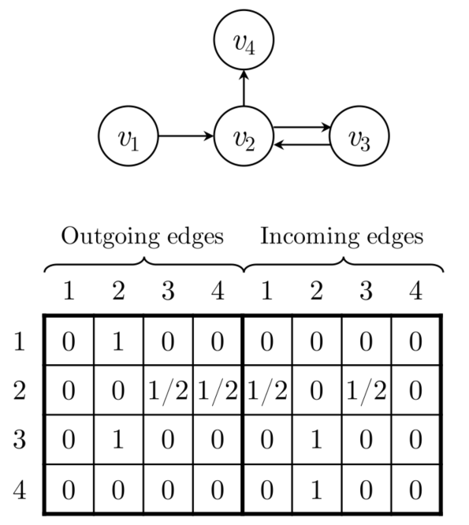
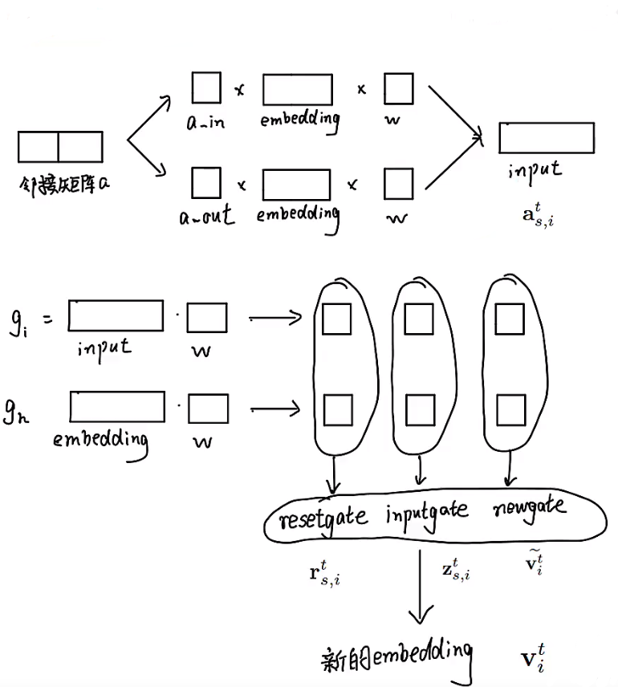
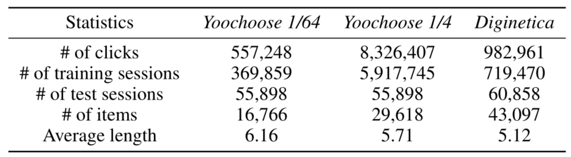
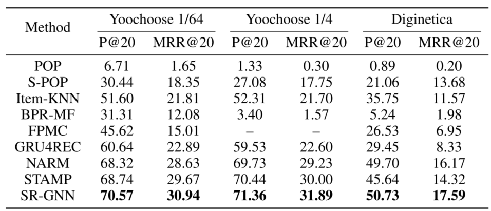
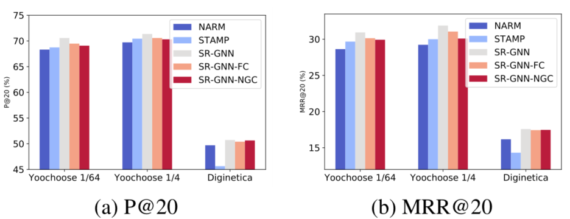
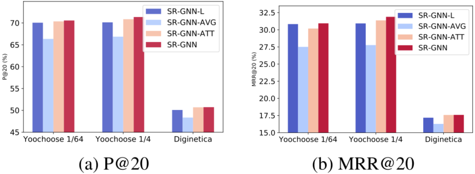
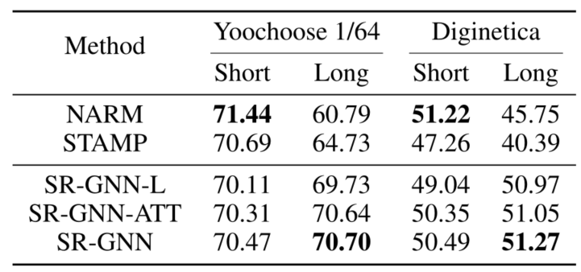

> 论文标题：Session-based Recommendation with Graph Neural Networks
>
> 作者：Shu Wu, Yuyuan Tang, Yanqiao Zhu
>
> 发表：2019 AAAI
>
> 论文地址：https://arxiv.org/abs/1811.00855
>
> 源码地址：https://github.com/CRIPAC-DIG/SR-GNN

## 摘要

基于会话的推荐问题旨在基于匿名会话预测用户行为，以前的方法将会话建模为序列，并估计除项目表示之外的用户表示以提出建议

- 存在的不足：不能够获得准确的用户向量并忽略项目的复杂转换

因此，提出使用图神经网络的基于会话的推荐SR-GNN，将会话序列被建模为图形结构化数据，GNN 可以捕获项目的复杂转换，然后使用注意力网络将每个会话表示为全局偏好和该会话当前兴趣的组合

## 基本介绍

- 大多数现有的推荐系统都假设用户资料和过去的活动被不断记录。

- 然而，在许多服务中，用户标识可能是未知的，并且只有正在进行的会话期间的用户行为历史可用

- 因此在一个会话中对有限的行为进行建模并相应地生成推荐是非常重要的，但在这种情况下，依赖于充分的用户-项目交互的传统推荐方法在产生准确结果方面存在问题

- ### 相关的论文
  
  - 基于马尔可夫链：在强独立假设下，过去分量的独立组合限制了预测精度
  - 基于RNN：提出了一种循环神经网络方法，然后通过数据增强和考虑用户行为的时间变化来增强模型
  - NARM：设计了一个全局和局部 RNN 推荐器来同时捕捉用户的顺序行为和主要目的
  - STAMP：也通过使用简单的 MLP 网络和注意力网络来捕捉用户的一般兴趣和当前兴趣
  
- ### 以上研究存在的局限性：
  
  - 在一个会话中没有足够的用户行为，这些方法难以估计用户表示，
    - 会话大多是匿名的且数量众多，并且会话点击中涉及的用户行为通常是有限的。
    - 因此很难从每个会话中准确估计每个用户的表示
  - 项目转换的模式很重要，可以用作基于会话的推荐中的局部因素
    - 但这些方法总是对连续项目之间的单向转换和忽略上下文之间的转换，即会话中的其他项目。
    - 因此，这些方法经常忽略远距离项目之间的复杂转换。
  
- 为了克服以上局限性，提出SR-GNN，以探索项目之间的丰富转换并生成准确的项目潜在向量。

- GNN被广泛应用于为自然语言处理和计算机视觉应用建模图结构依赖关系，如脚本事件预测、情景识别和图像分类

- ### SR-GNN的工作流程
  
  - 
    - 首先，所有会话序列都被建模为有向会话图，其中每个会话序列都可以视为一个子图
    - 然后，每个会话图依次进行,通过门控图神经网络获得每个图中涉及的所有节点的潜在向量表示embedding(v1,v2,v4,v3)
    - 之后，我们将每个会话表示为全局偏好和该会话中用户当前兴趣的组合，其中这些全局和局部会话嵌入向量都由节点的潜在向量组成。
      - 根据embedding经过一个attention，得到session的embedding（分成全局sessionEmbedding和local session embedding，将最后一个item直接作为local embedding） 
      - 再将两个session embedding 聚合成session的总的 embedding
    - 最后，对于每个会话，我们预测每个项目成为下一次点击的概率
      - 将session总的embedding与节点的embedding相乘得到最终的结果，再进行筛选得分最高的几个输出
  
- ### 整篇论文涉及到的公式
  
  - 
  
- ### 模型的贡献

  - 将分离的会话序列建模为图结构化数据，并使用图神经网络来捕获复杂的项目转换
  - 不依赖用户表示，而是使用会话embedding，它可以仅基于每个单独会话中涉及的项目的潜在向量来获得基于会话的推荐

## 领域相关工作

- **常规推荐方法**
  - 矩阵分解：基本目标是将用户-项目评分矩阵分解为两个低秩矩阵，每个矩阵代表用户或项目的潜在因素
    - 缺点：用户偏好仅由一些积极的点击提供，不太适合基于会话的推荐
  - 基于项目的邻域方法：项目相似性是根据同一会话中的共现来计算的
    - 缺点：难以考虑项目的顺序，并且仅基于最后一次点击生成预测
  - 基于马尔科夫链的顺序方法：将推荐生成视为一个顺序优化问题，采用马尔可夫决策过程 (MDP) 来解决问题
    - 通过对用户的个性化概率转移矩阵进行分解
    - 缺点：独立地组合了过去的组件。这种独立性假设太强，从而限制了预测的准确性。
  - FPMC ： 对每两次相邻点击之间的序列行为进行建模，并为每个序列提供更准确的预测
- **基于深度学习的方法**
  - RNN：扩展到具有并行 RNN 的架构 ，该架构可以基于点击次数和特征对会话进行建模点击的项目
    - RNN的一些相关变种应用于会话推荐
      - 通过使用适当的数据增强技术并考虑用户行为的时间变化来提高循环模型的性能
      - 将循环方法和基于邻域的方法结合在一起，以混合顺序模式和共现信号
      - 将会话点击与项目描述和项目类别等内容特征相结合，通过使用 3 维卷积神经网络生成推荐
      - A list-wise deep neural network: 对每个会话中有限的用户行为进行建模，并使用  list-wise 排名模型为每个会话生成推荐
      - 具有编码器-解码器架构的神经注意力推荐机NARM：采用 RNN上的注意力机制来捕获用户的顺序行为特征和主要目的。
      - 一种使用简单 MLP 网络和注意力网络的短期注意力优先模型 (STAMP) ：以有效地捕捉用户的一般兴趣和当前兴趣。
- **图神经网络相关发展**
  - 扩展 word2vec，一种无监督算法 DeepWalk旨在基于随机游走来学习图节点的表示
  - 继 DeepWalk 之后，无监督网络embedding算法 LINE 和 node2vec 
  - 另外，CNN 和 RNN 也部署在图结构数据上，
    - 如GCN：通过谱图卷积的局部近似来选择卷积架构，但只在无向图上实现
    - 门控 GNN (Li et al. 2015) 使用门控循环单元并采用反向传播 (BPTT) 来计算梯度

## 方法论

- ### **公式中的符号意义**

  - V = { $v_1, v_2, . . . , v_m$ } 表示由所有会话中涉及的所有唯一项组成的集合
  - 匿名会话序列 s 可以表示为列表 s = [ $v_{s,1}, v_{s,2}, ... , v_{s,n}$ ] 
    - 按时间戳排序，其中 $ v_{s,i} ∈ V$  表示用户在会话 s 中点击的项目
  - 基于会话的推荐的目标是预测下一次点击，即会话 s 的序列标签 $v_{s,n+1}$
  - 对于会话 s，我们输出所有可能项目的概率  $\hat y$ ，其中向量 $ \hat y$ 的元素值是相应项目的推荐分数
  -  $ \hat y$  具有top-K值的项目将成为推荐的候选项目。

- ### **构建会话图**

  - 每个会话序列 s 可以建模为有向图$ G_s = (V_s, E_s)$
    - 每个节点代表一个项目 $v_{s,i} ∈ V $。
    - 每条边$ (v_{s,i−1}, v_{s,i}) ∈ E_s$ 意味着用户在会话 s 中的 $v_{s,i−1}$ 之后点击了项目 $v_{s,i}$
  - 由于多个项目可能重复出现在序列中，为每条边分配一个归一化的加权，计算为:边的出现除以该边的起始节点的出度
  - 将每个项目 v ∈ V 嵌入到一个统一的embedding空间中，节点向量 **v** ∈ $R^d$ 表示通过图神经网络学习到的项目 v 的潜在向量,d表示向量维度
  - 基于节点向量，每个会话 s 可以由一个embedding向量 **s** 表示，该向量由该图中使用的节点向量组成

- ### **学习在图上的会话embedding**

  - 在会话图中节点向量的学习过程，对于图 Gs 的节点 $v_{s,i}$，更新函数如下:
    - 
      - 其中 H ∈$R^{d ×2d}$ 为控制权重，**z**$_{s,i}$ 为重置门，**r**$_{s,i}$ 为更新门 （门控循环单元gate）
      - [ $v^{t-1}_1, ... , v^{t-1}_n $ ] 是会话 s 中的节点向量列表，**v**$_i ∈ R^d$  表示节点 $v_{s,i}$ 的潜在向量,
      - σ(·) 是 sigmoid 函数,  $\odot $ 对应元素乘法运算符
      - 连接矩阵 $A_s ∈ R^{n×2n}$ 决定了图中的节点如何相互通信，$A_{s,i}$ 是 As 中与节点 $v_{s,i} $对应的两列块
      - $A_s$  定义为两个邻接矩阵 $A^{(out)}_s$ 和 $ A^{(in)}_s$  的串联，分别表示会话图中传出和传入边的加权连接
        - 例：考虑一个会话 s = [v1, v2, v3, v2, v4]，对应的图 Gs 和矩阵如图 所示
          - 
          - SR-GNN 可以支持不同类型的连接矩阵 A构建的会话图。使用不同的会话图构建策略，连接矩阵 As 会改变
      
    - **门控图神经网络运行流程**
      
      

  - **具体流程**

    - 首先，它提取邻域的潜在向量并将它们作为输入输入到图神经网络中。
    - 然后，通过更新门和重置门分别决定保留和丢弃哪些信息。
    - 之后，通过前一个状态、当前状态和重置门来构造候选状态。
    - 在更新门的控制下，最终状态是先前隐藏状态和候选状态的组合。
    - 在更新会话图中的所有节点直到收敛后，可以获得最终的节点向量表示。

- ### **生成会话embedding**

  - 以前的基于会话的推荐方法总是假设每个会话都存在不同的用户潜在表示。SR-GNN 的会话直接由该会话中涉及的节点表示

    - SR-GNN制定一种策略来结合会话的长期偏好和当前兴趣，并将这种组合嵌入用作会话embedding

  - 将所有会话图输入门控图神经网络后，我们获得了所有节点的向量

  - 为了将每个会话表示为一个embedding向量 s ∈ $R^d$，我们首先考虑会话 s 的局部embedding $s_l$

    - 对于会话 s = [ $\large v_{s,1}, v_{s,2}, . . . , v_{s,n}$ ]，局部embedding可以简单地定义为最后点击项 $\large v_{s,n} $的 $\large v_n$，即 $\large s_l = v_n$

  - 然后,通过聚合所有节点向量来考虑会话图 $G_s$ 的全局embedding向量 $ s_g$

    - 考虑到这些嵌入中的信息可能具有不同级别的优先级，我们进一步采用软注意机制来更好地表示全局会话偏好：

      - $\large \alpha_i = q^T σ(W_1 v_n + W_2 vi + c) $,		    其中q∈$R^ d$,W1,W2∈$R^{d×d}$ 为控制embedding向量的权重

        $\large s_g = \sum ^n _{i=1} \alpha_i v_i$

  - 最后，我们通过对局部和全局嵌入向量的串联进行线性变换来计算混合嵌入 $s_h$

    - $\large s_h = W_3 [s_l; s_g] $，  其中矩阵 $W_3 ∈ R^{d×2d} $ 将两个组合嵌入向量压缩到潜在空间 $R^d$ 中

- ### **进行推荐和模型训练**

  - 在获得每个会话的嵌入后，我们通过每个候选项目 $v_i ∈V $ 乘以 会话表示 $\large s_h$ 的分数   $\large \hat {z_i}$
    -  $\large \hat {z_i} = s_h^T v_i$
  - 然后应用一个 softmax 函数来得到模型的输出向量 $\large \hat y$
    -  $\large \hat y = softmax (\hat z) $
      - 其中 $\large \hat z ∈ R^m $表示所有候选项目的推荐分数， $\large \hat y ∈ R^m$ 表示节点出现在会话 s 中的下一次点击的概率。
  - 对于每个会话图，损失函数定义为预测和基本事实的交叉熵
    - $\large \iota(\hat y) = -\sum^m_{i-1} y_i log(\hat y_i) + (1-y_i) log(1-\hat y_i)$
      - y表示实际项目的one-hot编码向量
  - 最后，我们使用时间反向传播 (BPTT) 算法来训练提出的 SR-GNN 模型。
    - **请注意，在基于会话的推荐场景中，大多数会话的长度相对较短。因此，建议选择相对较少的训练步数，以防止过拟合**

## 实验和分析

- ### 数据集设置

  - 数据集
    - Yoochoose：数据集来自 RecSys Challenge 2015，其中包含 6 个月内用户对电子商务网站的点击流
    - Diginetica：数据集来自 CIKM Cup 2016，仅使用其交易数据。
  - 预处理
    - 过滤掉所有长度为 1 的会话和在两个数据集中出现少于 5 次的项目
    - 通过拆分输入序列来生成序列和相应的标签
      - 将随后几天的会话设置为 Yoochoose 的测试集，并将随后几周的会话设置为 Diginetiva 的测试集
      - 例如，对于输入会话 s = [ $\large v_{s,1}, v_{s,2}, . . . , v_{s,n}$ ]，
        - 我们生成一系列序列和标签 ($[v_{s,1}], v_{s,2}), ([v_{s,1},  v_{s,2}], v_{s,3}), . . . , ([v_{s,1}, v_{s,2}, ..., v_{s,n−1}], v_{s,n}$),
          -  其中 [ $\large v_{s,1}, v_{s,2}, . . . ,  v_{s,n−1}$ ] 是生成的序列，$\large v_{s,n} $表示下一次点击的项目，即序列的标签
    - 数据集的统计数据总结
      - 

- ### Baseline选取

  - **POP** 和 **S-POP** 分别推荐训练集和当前会话中的 top-N 频繁项。
  - **Item-KNN**  推荐与会话中先前单击的项目相似的项目，其中相似性定义为会话向量之间的余弦相似度。
  - **BPR-MF**通过随机梯度下降优化成对排序目标函数。
  - **FPMC** 是一种基于马尔可夫链的顺序预测方法。
  - **GRU4REC** 使用 RNN 为基于会话的推荐的用户序列建模
  - **NARM** 使用带有注意力机制的 RNN 来捕捉用户的主要目的和顺序行为。
  - **STAMP** 捕捉用户对当前会话的一般兴趣和最后一次点击的当前兴趣

- ### 评估指标

  - **P@20**（Precision）：被广泛用作预测准确性的度量。它代表了前 20 个项目中正确推荐项目的比例。
  - **MRR@20**（平均倒数排名）是正确推荐项目的倒数排名的平均值。
    - 当排名超过 20 时，倒数排名设置为 0。 MRR 度量考虑推荐排名的顺序，其中 MRR  值大表示正确的推荐在排名列表的顶部。

- ### 参数设置

  - 将两个数据集的潜在向量维数设置为 d = 100
  - 我们在验证集上选择其他超参数，验证集是训练集的随机 10% 子集。
  - 所有参数均使用均值为 0、标准差为 0.1 的高斯分布进行初始化
  - 批量 Adam 优化器用于优化这些参数，
    - 其中初始学习率设置为 0.001，每 3 个 epoch 后将衰减 0.1。
  - 此外，批量大小设置为  100 , L2 惩罚设置为 $10^{-5}$。

- ### 与各种Baseline的比较结果分析

  - 
    - 由于初始化 FPMC 的内存不足，没有报告 Yoochoose 1/4 上的性能
    - 对于POP、SPOP等传统算法，其性能相对较差。这种简单的模型仅基于重复的共现项目或连续项目进行推荐，这在基于会话的推荐场景中是有问题的。即便如此，S-POP  的表现仍然优于 POP、BPR-MF 和 FPMC 等对手，证明了会话上下文信息的重要性
    - Item-KNN 比基于马尔可夫链的 FPMC 取得了更好的结果
      - ItemKNN 仅利用项目之间的相似性，而不考虑顺序信息。这表明传统的基于 MC 的方法主要依赖于连续项目独立性的假设是不现实的。
    - NARM 和 STAMP，展示了在该领域采用深度学习的能力
    - GRU4REC 和 NARM，使用循环单元来捕捉用户的普遍兴趣，而 STAMP 通过利用最后点击的项目来改善短期记忆
      - 这些方法显式地对用户的全局行为偏好进行建模，并考虑用户之前的操作和下一次点击之间的转换，从而获得优于这些传统方法的性能
    - 与 NARM 和 STAMP 相比，**SR-GNN  进一步考虑了会话中项目之间的转换，从而将每个会话建模为一个图，可以捕获用户点击之间更复杂和隐含的联系**，而在 NARM 和 GRU4REC 中，它们显式地对每个用户进行建模，并通过分离的会话序列获得用户表示，忽略了项目之间可能的交互关系
      - SR-GNN对会话行为的建模更强大。
    - **SR-GNN 采用 soft-attention 机制生成会话表示，该表示可以自动选择最重要的项目转换，并忽略当前会话中嘈杂和无效的用户动作**
      - 相反，STAMP 只使用了 lastclicked item 和之前的 action 之间的过渡。其他 RNN 模型，如 GRU4REC 和  NARM，在传播过程中也无法选择有影响的信息。他们使用所有先前的项目来获得代表用户普遍兴趣的向量。当用户的行为是漫无目的的，或者他的兴趣在当前会话中快速漂移时，传统模型无法有效应对嘈杂的会话

- #### SR-GNN与各种连接方案比较

  - 首先，我们将所有会话序列聚合在一起，并将它们建模为一个有向的整体项目图，称为全局图
    - 在全局图中，每个节点表示一个唯一的项目，每条边表示从一个项目到另一个项目的有向转换
  - 其次，我们将一个会话中项目之间的所有高阶关系明确建模为直接连接

  - **因此有两种其他连接方案**
    - 具有归一化全局连接的SR-GNN（SR-GNNNGC）在SR-GNN的基础上用从全局图中提取的边权重替换连接矩阵
    - 具有全连接的 SR-GNN (SR-GNN-FC) 使用布尔权重表示所有高阶关系，并将其对应的连接矩阵附加到 SR-GNN 的连接矩阵
  - 所有三种连接方案与最先进的 STAMP 和 NARM的性能
  - 与SR-GNN相比，对于每个会话，SR-GNN-NGC除了考虑当前会话中的项目外，还考虑了其他会话的影响，从而减少了连接到当前会话图中高度节点的边的影响.
    - 这种融合方法会显着影响当前会话的完整性，尤其是当图中边的权重发生变化时，会导致性能下降。
  - 对于 SR-GNN 和 SR-GNN-FC，前者只对连续项目之间的确切关系进行建模，后者进一步明确地将所有高阶关系视为直接连接。
    - SR-GNN-FC  的性能比 SR-GNN  差 表明，在大多数推荐场景中，并非每个高阶转换都可以直接转换为直接连接，高阶项之间的中间阶段仍然是必需的。
      - 例如，考虑到用户在浏览一个网站时浏览了以下页面：A→B→C，不适合直接在A之后推荐页面C而没有中间页面B，因为A和C之间没有直接联系。

- #### 与不同会话embedding的比较

  - 仅局部嵌入（SR-GNNL）
  - 具有平均池化的全局嵌入（SR-GNNA VG）
  - 具有注意力机制的全局嵌入（ SR-GNN-ATT）
  - 比较结果分析
    - 
    - SR-GNN 在所有三个数据集上都取得了最佳结果
      - 将当前会话兴趣与长期偏好明确结合的重要性
    - SR-GNN-ATT 在三个数据集上的平均池化性能优于 SR-GNN-AVG
      - 会话可能包含一些嘈杂的行为，不能独立处理
      - 注意力机制有助于从会话数据中提取重要行为以构建长期偏好
    - SR-GNN-L 仍然优于 SR-GNN-A VG 并达到与 SR-GNN-A TT 几乎相同的性能
      - 提供 当前兴趣 和 长期偏好 对于基于会话的推荐很重要

- #### 会话序列长度分析

  - 将 Yoochoose 1/64 和 Diginetica 的 session 分为两组，
    - 其中“Short”表示 session 的长度小于或等于 5，而每个  session 的“Long”项超过 5 个
    - 选择枢轴值 5 是因为它是最接近所有数据集中总会话平均长度的整数
    - Yoochoose 数据上会话属于短组和长组的百分比分别为 0.701 和 0.299，Diginetica 数据上分别为 0.764 和 0.236
  - 下面是各方法在P@20评估的结果
    - 
    - STAMP 的性能在短组和长组中变化很大。它采用注意力机制，因此在获取用户表示时可以忽略重复的项目
    - 在 Yoochoose 上，NARM 在短组上取得了良好的性能，但随着会话长度的增加，性能迅速下降
      - 部分原因是 RNN  模型难以应对长序列
    - SR-GNN-L、SRGNN-ATT 和 SR-GNN 基于图神经网络的学习框架，可以获得更准确的节点向量，这种节点嵌入不仅可以捕获节点的潜在特征，还可以对节点连接进行全局建模
      - SRGNN 变体的性能是稳定的，而STAMP 和NARM  在短数据集和长数据集上的性能波动很大
      - SR-GNN-L 也可以取得良好的效果，尽管该变体仅使用本地会话嵌入向量。这可能是因为 SR-GNN-L  还隐含地考虑了会话图中一阶和高阶节点的属性

## 结论

- 在难以获取用户偏好和历史记录的情况下，基于会话的推荐是必不可少的，
- SR-GNN架构将图形模型结合到表示会话序列中。
- 不仅考虑了会话序列项之间的复杂结构和转换，而且还开发了一种策略，将会话的长期偏好和当前兴趣相结合，以更好地预测用户的下一步动作
- 算法可以始终优于其他最先进的方法

